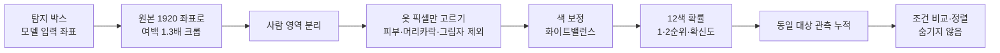

> [!summary] 탐지한 사람 후보의 **상의 색상**을 추정해, 운영자가 지정한 색과 비교하고 **찾는 사람일 가능성이 높은 후보를 먼저 보여 준다**
> 새 사람을 찾는 기능이 아니라 **이미 찾은 후보를 정렬**하는 기능이다. 색이 달라도 후보를 숨기지 않는다.

## 요구명세서 근거 (v1.6 병합본)

| 위치 | 내용 |
|---|---|
| **UC-0707 인상착의 비교** | 상의 색상 12종(빨강·주황·노랑·초록·파랑·남색·보라·분홍·흰색·회색·검정·갈색) · **1·2순위 색상과 확신도** · 여러 관측을 모아 판정 · 일치 후보 강조·정렬 · **불일치·판정 불가 후보도 숨기지 않음** |
| UC-0703 동일 대상 연결 | ID가 끊긴 관측을 **상의 색상**으로 같은 사람인지 판단하는 단서 |
| UC-0708 개별 대상 추적 | 유실 후 재탐색 때 **상의 색상으로 같은 대상 확인** |
| UC-1101 알림 · UI-05 | 인상착의 일치 후보 알림 · 후보 상세에 일치 결과 표시 |
| AT-F13 | 사람 검출 신뢰도와 분리, 불일치 후보 유지 확인 |

> [!info] 수치 목표는 두지 않는다 (09-13 팀 결정)
> 정확도는 **내부 확인용**으로만 잰다.

## 1. 왜 가능한가 — 상의가 가장 잘 보인다

1920 원본 프레임 · 수평 54° · 하향 90° 기준

| 경우 | 사람 박스 | 상의 픽셀 (대략) |
|---|---|---|
| 30 m · 서 있음 | 약 31 × 20 px (어깨·등) | 수백 개 |
| 30 m · 누움 | 약 107 × 31 px | 약 1,000 개 |
| 16 m | 위의 약 2배 크기 | 약 4배 |

- 대표 색 하나를 뽑기엔 충분하다. **무늬·로고는 어렵다**
- 모델 입력(1280)이 아니라 **1920 원본에서 잘라** 본다 — 픽셀이 2.25배 많다

## 2. 처리 순서

| 단계 | 기본 방법 | 비교할 방법 | 주의 |
|---|---|---|---|
| ① 크롭 | 박스를 원본 좌표로 되돌려 1.3배 여백 | — | 가장자리 박스는 잘림 표시 |
| ② 사람 영역 | 박스 안 픽셀 중 **박스 바깥 띠(배경)와 색 분포가 다른 픽셀** (배경 차분 · GrabCut) — 빠르다 | **MobileSAM** 박스 프롬프트 (저장소 `mobile_sam.pt`) — 정확, 느리다 | 풀·흙과 비슷한 옷(흙색·위장색)은 분리가 어렵다 |
| ③ 옷 픽셀 | 피부색(YCrCb 범위) 제외 · 작고 매우 어두운 덩어리(머리카락) 제외 · 밝기만 급히 떨어진 영역(그림자) 제외 | — | **검정 옷 ↔ 머리카락·그림자** 구분이 가장 어렵다 |
| ③-2 상의만 | 서 있는 사람(하향)은 보이는 부분 대부분이 상의 · **누운 사람은 긴 축으로 반을 나눠 머리 쪽 반** | 머리 위치를 못 찾으면 "상의·하의 구분 불가" + 대표색 2개 | |
| ④ 색 보정 | 프레임 전체 **회색 가정**(gray-world) 또는 밝은 무채색 영역 기준 | 촬영 때 회색 카드로 검증 | 늦가을 낮은 해의 누런 빛 |
| ⑤ 색 판정 | **CIE Lab** 변환 → 옷 픽셀 k-means(k=2~3) → 가장 큰 무리 대표색 → 12색 기준점 거리 → 확률 | 학습 기반 분류기 (4절) | 무채색은 채도로 먼저 가른다 |
| ⑥ 누적 | 같은 대상(UC-0703)의 관측을 **품질 가중 평균** — 옷 픽셀 수 · 흐림 · GSD | — | 한 장의 오판을 여러 장이 덮는다 |
| ⑦ 판정 불가 | 옷 픽셀 **150개 미만**(초안) · 흐림 · 가림 · 노출 과다/부족 | — | 판정 불가도 목록에 남긴다 |
| ⑧ 조건 비교 | 지정 색이 **1순위**, 또는 **2순위이면서 확률 0.3 이상**(초안) → 일치 | — | 불일치 후보도 **정렬만** 뒤로 |

## 3. 12색 판정 기준 (초안 — 촬영 데이터로 보정)

HSV 기준 (색상 H°, 채도 S, 밝기 V · 0~1)

| 색 | 규칙 | 헷갈리는 이웃 |
|---|---|---|
| 흰색 | S < 0.15 · V > 0.80 | 회색 (그늘진 흰 옷) |
| 회색 | S < 0.15 · 0.30 < V ≤ 0.80 | 흰색 · 검정 |
| 검정 | V ≤ 0.30 | 남색 · 머리카락 · 그림자 |
| 빨강 | H 345~15 | 주황 · 분홍 |
| 주황 | H 15~40 · V ≥ 0.5 | 빨강 · 갈색 |
| 갈색 | H 10~40 · V < 0.5 | 주황 · 흙 배경 |
| 노랑 | H 40~70 | 주황 · 연두 |
| 초록 | H 70~170 | 풀·나무 배경 |
| 파랑 | H 170~250 · V ≥ 0.45 | 남색 · 청록 |
| 남색 | H 200~250 · V < 0.45 | 검정 · 파랑 |
| 보라 | H 250~300 | 파랑 · 분홍 |
| 분홍 | H 300~345, 또는 빨강 계열 · S < 0.5 · V > 0.7 | 빨강 · 보라 |

> [!warning] 목록에 없는 색
> NOMAD 에는 `cyan`(청록)이 있다 → **파랑**으로 보고 "파랑·초록 경계" 표시.

## 4. 규칙 기반 vs 학습 기반

| | 규칙 기반 (먼저) | 학습 기반 (필요하면) |
|---|---|---|
| 방법 | 2절 ①~⑧ | 작은 분류기(MobileNet·ResNet18 급)가 옷 크롭 → 12색 확률 |
| 데이터 | 필요 없음 (평가용만) | 색 라벨이 붙은 **하향 시점 크롭** 수천 장 |
| 장점 | 바로 만들 수 있다 · 왜 틀렸는지 보인다 | 그림자·조명·배경을 스스로 흡수 |
| 단점 | 조명·그림자에 약하다 | 우리 시점 데이터가 부족 |
| 후보 데이터 | — | 자체 촬영 크롭 · NOMAD 42명(비스듬 시점) · 지상 시점 속성 데이터(예: Market-1501 속성의 상의 색)는 **시점이 달라 참고만** |

→ **규칙 기반으로 시작**하고, 혼동 행렬에서 특정 쌍(남색↔검정 등)이 계속 틀리면 그 부분만 학습 기반을 검토한다.

## 5. 평가

### 데이터
| 데이터 | 정답 | 쓸 수 있는 시점 | 한계 |
|---|---|---|---|
| **NOMAD 42명** | `metrics/nomad_actor_selection.csv` 의 `upper_color` | **지금 바로** | 비스듬한 시점 · 미국 여름 농장 · 색 분포 치우침 |
| **자체 촬영** | 촬영 때 **배우별 상의 색 기록** | 첫 비행 후 | 사람 수 적음 |

NOMAD 42명 상의 색 분포와 12색 대응

| NOMAD | 명 | 12색 |
|---|---:|---|
| blue | 8 | 파랑 |
| black | 6 | 검정 |
| gray · light gray · dark gray | 4 · 2 · 4 | 회색 (dark gray 는 검정 경계) |
| white | 4 | 흰색 |
| green | 4 | 초록 |
| purple | 4 | 보라 |
| cyan | 3 | 파랑 (경계) |
| pink · yellow · red | 1 · 1 · 1 | 분홍 · 노랑 · 빨강 |
| (없음) | 0 | **주황 · 남색 · 갈색** → 자체 촬영으로 채워야 한다 |

### 지표
| 지표 | 뜻 |
|---|---|
| 1순위 정확도 · 1·2순위 정확도 | 색별로 따로 |
| 혼동 행렬 | 어떤 색끼리 헷갈리나 |
| 판정 불가율 | 옷 픽셀 부족·흐림 등 |
| 고도(16·23·30 m)·자세(서기·누움)별 | 어디서 무너지나 |
| 누적 전후 비교 | 한 장 판정 vs 여러 관측 누적 |
| **찾는 사람 순위** | 조건을 지정했을 때 실제 대상이 후보 목록 **몇 번째**인가 — 운용에서 가장 중요한 값 |

## 6. 속도
- **프레임 전체가 아니라 탐지 후보에만** 실행한다
- 규칙 기반은 후보 하나에 수 ms 수준으로 예상
- MobileSAM 을 쓰면 **새 관측마다 한 번, 비동기로** — 탐지 루프(NFR-V01 30 ms)와 분리한다

## 7. 구현

| 파일 | 역할 |
|---|---|
| `color_attr.py` | 크롭 · 사람 영역 · 옷 픽셀 · 색 판정 · 1·2순위 |
| `configs/color_palette.json` | 12색 기준 · 경계값 · 판정 불가 기준 |
| `eval_color.py` | NOMAD · 자체 촬영 평가 → `metrics/eval_color.csv` · 혼동 행렬 그림 |
| 관제 연동 | 후보 JSON 에 `upper_color: [{color, p}, …]`, `color_status: 일치/불일치/판정 불가` 추가 → 이시원과 형식 합의 |

## 8. 일정 (제안)

| 기간 | 할 일 |
|---|---|
| 09-17 ~ 09-24 | 규칙 기반 시제품 · NOMAD 42명 1차 평가 · 혼동 쌍 확인 (서버 S1 과 병행) |
| 10월 중순 ~ | 자체 촬영(배우별 상의 색 기록 · 헷갈리는 쌍 포함) → 기준 보정 → 고도·자세별 재평가 |
| 11월 초 | 필요하면 학습 기반 보강 · 관제 연동 · 개별 추적 재식별에 적용 |

## 9. 알려진 어려움

| 상황 | 문제 | 대응 |
|---|---|---|
| 검정·남색 옷 | 머리카락·그림자와 섞임 | 머리카락 덩어리 크기·위치로 제외 · 누적으로 보완 |
| 흰 옷 | 햇빛에 노출 과다 → 회색·판정 불가 | 포화 픽셀 제외 |
| 늦가을 낮은 해 | 전체가 누렇게 → 흰색이 노랑·주황으로 | 프레임 화이트밸런스 |
| 가방·조끼·우비 | 상의가 가려짐 | 판정 불가 또는 2색 제시 |
| 모자 (하향 서 있는 사람) | 가운데가 모자 색 | 중앙 원형 영역 가중치 낮춤 |
| 흙색·위장색 옷 | 배경과 분리 안 됨 | MobileSAM 비교 · 판정 불가 허용 |

## 연결
[[결정 - 자세 판별 제외]] · [[8 실기체 적용]] · [[7 평가 프로토콜]] · [[0 서버 학습 계획 한눈에]] · [[요구명세서]]
