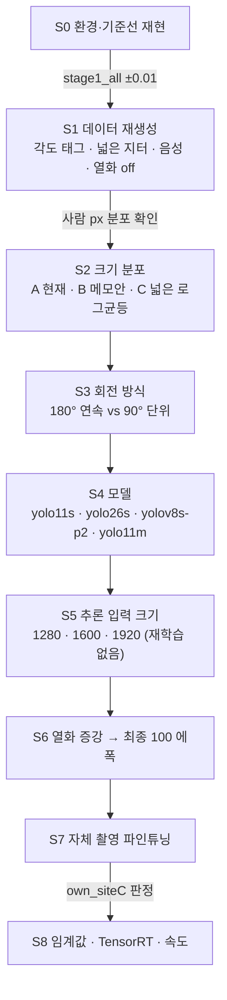
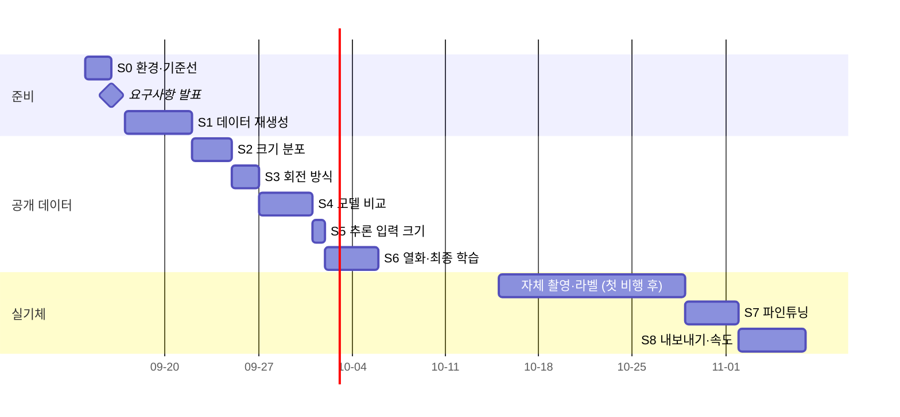

> [!summary] **한 번에 하나만 바꾼다.** 각 단계의 승자가 다음 단계의 기준이 된다.
> 판정은 [[7 평가 프로토콜]] 4절 규칙으로만 한다 (하향 시험셋 16~64 px 발견율 → 오탐 ≤ 1 → AP50).

## 흐름



## 일정 (제안)



실험 1개(40 에폭)는 약 3시간 추정. GPU 가 하나라 **순서대로** 돌린다 (밤에 대기열 스크립트 `run_queue.sh`).

---

## S0 — 환경과 기준선 → [[2 환경과 기준선]]

| | |
|---|---|
| 목적 | 서버에서 기존 수치가 재현되는지 |
| 판정 | stage1_all 여름 0.641 · 겨울 0.922 (±0.01) |
| 실패하면 | ultralytics 버전 · 데이터 파일 목록부터 확인. **실험으로 넘어가지 않는다** |

## S1 — 데이터 재생성 → [[3 데이터 구성]] · [[4 전처리 - 크기 정규화와 지터]]

| | |
|---|---|
| 만드는 것 | WiSARD 비행 태그 · `det_v2` (크기 분포 C) · 음성 10~15% · 누운 사람 40% · 시험셋 `test_v2` |
| 비교용으로 함께 | 크기 분포 **A**(현재) · **B**(메모안) 버전도 같은 원본·같은 분할로 생성 |
| 판정 | 사람 px 분포가 설계와 맞는가 · 16~24 px 조각이 사람으로 보이는가 |

## S2 — 크기 분포

| | |
|---|---|
| 가설 | 작은 사람(16~40 px)을 충분히 넣으면 운용 고도의 서 있는 사람을 더 찾는다 |
| 고정 | yolo11s · `hyp_v2` · 40 에폭 · 같은 원본·분할 |
| 바꾸는 것 | 전처리 크기 분포 + 짝이 되는 `scale` |

| 실험 | 전처리 | scale | 명령 이름 |
|---|---|---:|---|
| s2_jit_a | 94 × U(0.75, 1.35) | 0.5 | 현재 방식 |
| s2_jit_b | 94 × U(0.65, 1.45) | 0.5 | 09-12 메모안 |
| **s2_jit_c** | 로그 균등 22~120 | 0.3 | 제안 |

```bash
for v in a b c; do
  yolo detect train cfg=configs/hyp_v2.yaml model=yolo11s.pt \
    data=configs/data_v2_jit_$v.yaml $( [ $v = c ] && echo scale=0.3 || echo scale=0.5 ) \
    project=runs_person name=s2_jit_$v
done
```

| 볼 지표 | 예상 |
|---|---|
| 16~24 · 24~40 px 발견율 | C 가 크게 높다 |
| 64~140 px 발견율 | A·B 가 조금 높을 수 있다 — **0.02 이내 하락이면 C 채택** |
| 오탐/프레임 | 작은 물체를 많이 배우면 늘 수 있다 → 1.0 넘으면 음성 비율을 올려 재실험 |

| 결과 | 16~24 | 24~40 | 40~64 | 64~140 | 오탐/장 | AP50 (holdout10) | 판정 |
|---|---|---|---|---|---|---|---|
| s2_jit_a | | | | | | | |
| s2_jit_b | | | | | | | |
| s2_jit_c | | | | | | | |

## S3 — 회전 방식

| | |
|---|---|
| 가설 | 연속 180° 회전은 박스를 부풀려 위치 정확도(AP50-95)와 작은 사람 발견율을 깎는다 → [[5 학습 하이퍼파라미터]] 기하 증강 |
| 고정 | S2 승자 |
| 비교 | `s3_rot_cont` = S2 승자 (degrees 180) · **`s3_rot_d4`** = 전처리에서 90° 단위 회전 복사본 + `degrees 15` |
| 판정 | AP50-95 가 0.02 이상 오르고 발견율이 떨어지지 않으면 D4 채택 |

## S4 — 모델

| | |
|---|---|
| 고정 | S3 승자 설정 |

| 실험 | 모델 | 왜 후보인가 | 확인할 것 |
|---|---|---|---|
| (기준) | yolo11s | 서버 E 트랙 출발점 | |
| `s4_y26s` | **yolo26s** | 설치본에 포함 · NMS 없는 출력 · Ultralytics 설명상 작은 물체 개선 | 내보내기·추론 시간 · 우리 데이터에서 실제 이득 |
| `s4_v8s_p2` | **yolov8s-p2** (`yolov8-p2.yaml` + yolov8s.pt 가중치 이식) | 해상도 1/4 층(P2)을 추가해 **아주 작은 물체**에 강하다 | 추론 시간 증가 · P2 층은 새로 배운다 |
| `s4_y11m` | yolo11m | 용량이 도움 되는지 | 4080 SUPER 에서 11s 보다 오히려 빨랐다(60.8 대 56.5 fps) |

```bash
yolo detect train cfg=configs/hyp_v2.yaml model=yolo26s.pt data=configs/data_v2.yaml project=runs_person name=s4_y26s
yolo detect train cfg=configs/hyp_v2.yaml model=yolov8-p2.yaml pretrained=yolov8s.pt data=configs/data_v2.yaml project=runs_person name=s4_v8s_p2
yolo detect train cfg=configs/hyp_v2.yaml model=yolo11m.pt data=configs/data_v2.yaml project=runs_person name=s4_y11m
```

| 판정 | |
|---|---|
| 1순위 | 하향 시험셋 16~64 px 발견율 |
| 속도 조건 | 4080 SUPER · 1920×1080 한 장 **≤ 30 ms** (못 넘으면 탈락) |
| yolo11l | **yolo11m 이 11s 보다 0.02 이상 좋을 때만** 추가 |

## S5 — 추론 입력 크기 (재학습 없음)

| | |
|---|---|
| 목적 | 1280 으로 학습한 모델을 **추론만** 크게 넣으면 작은 사람을 더 찾나 |
| 방법 | S4 승자를 `eval_v2.py --imgsz 1280 / 1600 / 1920` |
| 판정 | 16~24 px 구간 이득 vs 추론 시간 — 30 ms 안에서 가장 큰 입력 |

## S6 — 열화 증강 · 최종 학습

| 실험 | 내용 |
|---|---|
| `s6_degrade` | 전처리 열화(JPEG·흐림·노이즈·축소) 30% 켠 데이터 · 가능하면 `perspective 0.0003` |
| 판정 | 공개 시험셋에서 0.01 이내 유지 + (있으면) 첫 실영상 표본에서 이득 |
| **`s6_final`** | 승자 조합 · **100 에폭 · patience 25** · seed 42 (시간 되면 seed 0 한 번 더) → `weights/det_v2_base.pt` |

> [!note] 실제 영상이 없을 때 S6 판정
> 공개 시험셋은 선명한 영상이라 열화 증강의 이득이 안 보인다. 첫 비행 영상 표본 200장이라도 라벨해서 본다.

## S7 · S8 — 실기체 → [[8 실기체 적용]]

| 단계 | 핵심 |
|---|---|
| S7 파인튜닝 | 자체 A·B 1 : 기존 2 · lr0 0.001 · freeze 10 · 30 에폭 → `own_siteC` 판정 · 공개 시험셋 하락 ≤ 0.02 |
| S8 배포 | conf 재산정 (자체 검증셋) · TensorRT FP16 `736×1280` · 4080 SUPER 속도 · 관제 전달 |

## 기록 규칙

- 실험마다 `SERVER_PROGRESS.md` 에 한 줄: 이름 · 바꾼 것 · 시간 · 결과 · 판정
- `metrics/eval_v2.csv` 에 누적 · 이 노트의 결과 표에도 옮긴다
- 실패한 실험도 **지우지 않는다** — 다시 하지 않기 위해

## 연결
[[0 서버 학습 계획 한눈에]] · [[5 학습 하이퍼파라미터]] · [[9 체크리스트]] · [[서버 E1~E8]]
