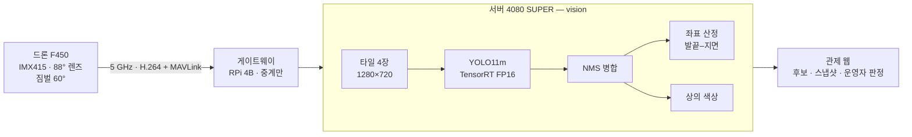
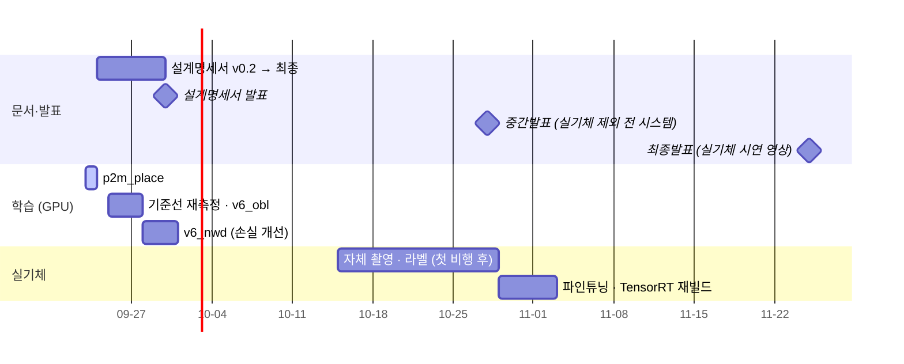

> [!summary] 자율 정찰 드론 관제 시스템 · 비전 파트 (정서인)
> 드론이 농촌·산지를 자율 정찰하며 **사람(쓰러진 사람 포함)을 찾아** 관제 지도에 신고한다.
> 비전 = **사람 탐지 · 좌표 산정 · 상의 색상 비교** · 자세 자동 판별은 제외 → [[결정 - 자세 판별 제외]]

> [!important] 이번 주 — **9/30 (수) 설계명세서 제출 · 발표**
> 학습은 체인으로 걸어 두고 문서는 병행한다 → [[03 9.30 설계명세서 병행 일정]]

# 지금 상태 (09-24)

| 영역 | 상태 | 핵심 수치 | 문서 |
|---|---|---|---|
| 기준 조건 | ✅ 확정 | 주 렌즈 **88°** (수평 80.2°) · 3축 짐벌 GM3 V2 · 예산 1,867,810원 | [[01 기준 요건 확정안]] |
| 마운트각 | 🟡 잠정 | **기본 60°** · 대응 45~75° · 30 m 서 있는 사람 **51 px** | [[결정 - 기본 마운트각 60° (잠정)]] |
| 탐지 정확도 V03 | ❌ 개선 중 | 장소 분리 AP50 **0.2233** / 목표 0.80 | [[NFR-V03 탐지 정확도]] |
| 추론 시간 V01 | ✅ | **18.5 ms** (타일 4장 · TensorRT FP16 · 3090) | [[NFR-V01 추론 시간]] |
| 좌표 V04 | ✅ 계산 | 60° · 25 m **4.7 m** (기준 10~15 m) | [[NFR-V04 좌표 정확도]] |
| 오탐 V06 | ✅ | 0.21~0.59 건/장 (기준 ≤1) | [[NFR-V06 프레임 오탐]] |
| 서버 학습 | 🔄 | `p2m_place` 진행 → 다음 **`v6_obl`** (60° 데이터) | [[_학습 큐]] |
| 설계명세서 | 🔄 v0.2 | 양식 목차 · 88°·60° 반영 | [[03 9.30 설계명세서 병행 일정]] |
| 상의 색상 비교 | 📝 계획 | Lab 12색 · 1·2순위 | [[04 상의 색상 비교]] |

![[fig_NFR-V03_장소일반화.svg]]

> [!warning] 가장 큰 미결 네 가지
> 1. **장소 일반화** — 같은 장소면 0.86, 처음 보는 장소면 0.22. 목표까지 3.6배 → [[장소 일반화 - NFR-V03 0.22]]
> 2. **짐벌 실물 확인** — GM3 V2 피치 범위에 60° 가 들어가는지 · RunCam 장착 호환 · 보조 렌즈 62°·78° 호환
> 3. **NFR-V03 판정셋** — 지금 test_v2 는 수직 시점. 60° 운용에 맞춰 test_obl 을 쓸지 팀 협의
> 4. **자체 촬영** — 한국 산지 · 60° 데이터는 이것뿐이다 → [[05 실기체 적용 - 자체 촬영]]

# 흐름 한 장

# 일정

# 어떻게 찾아볼까

| 찾는 방식 | 들어가는 곳 |
|---|---|
| **학습 계획 전체** | [[00 학습 계획 한눈에]] |
| **시간순** — 언제 무엇을 했나 | [[타임라인]] · 일자별 → `09 기록/일자별/` |
| **할 일** | [[다음 할 일]] |
| **실험 결과** | [[_실험 색인]] |
| **왜 그렇게 정했나** | [[_결정 색인]] |
| **데이터** | [[_데이터셋 한눈에]] |
| **합격 기준** | [[성능 요구사항 한눈에]] |
| **용어·개념** | [[_개념 색인]] · [[용어 및 약어]] |
| **실수·함정** | [[함정 모음]] · [[막다른 길]] |
| **파일이 어디 있나** | [[문서와 코드 위치]] |
| **한 장 지도** | [[프로젝트 지도.canvas\|프로젝트 지도]] · [[가중치 계보.canvas\|가중치 계보]] |

# 주제별 지도

## 1. 무엇을 만드는가
[[프로젝트 개요]] · [[운용 조건]] · [[요구명세서]] · [[팀과 역할]] · [[발표 피드백]] · [[관제 뷰어 프로토타입]]
하드웨어 → [[결정 - 최종 예산안 (2026-09-23 계획서)]] · 지난 안 → `01 프로젝트/지난 하드웨어안/`

## 2. 합격 기준
[[성능 요구사항 한눈에]] · [[측정 조건]] · [[수치 표기 규칙]]
비전: [[NFR-V01 추론 시간]] · [[NFR-V02 분석 처리율]] · [[NFR-V03 탐지 정확도]] · [[NFR-V04 좌표 정확도]] · [[NFR-V05 신뢰도 기준]] · [[NFR-V06 프레임 오탐]]
시스템: [[NFR-P01 연결 판정]] · [[NFR-P02 영상 수신 성능]] · [[NFR-P03 장애 감지]] · [[NFR-P04 동시 처리]] · [[NFR-I01 관측 완료도]]

## 3. 데이터
[[_데이터셋 한눈에]] — [[AI-Hub 182 조난자 수색]] · [[WiSARD]] · [[NOMAD]] · [[Unicamp-UAV]] · [[VisDrone]] · [[Okutama-Action]] · [[SARD]]
받는 법 → [[데이터 다운로드]] · 후보 → [[후보 - 비스듬 시점 데이터셋]] · 제외 → [[검토 후 제외한 데이터셋]]

## 4. 모델과 학습
[[00 학습 계획 한눈에]] → [[01 기준 요건 확정안]] · [[02 학습 계획 v6 (60° 기준)]] · [[_학습 큐]]
[[가중치 계보]] · [[stage1_all]] · [[VisDrone 기성 모델]]
서버 → [[학과 서버]] · [[서버 인계]]

## 5. 실험
최근: [[서버 v3_place - 장소 분리 학습]] · [[서버 D - VisDrone 항공 사전학습]] · [[서버 v3a - 하드 네거티브 음성 보강]] · [[마운트각 태그 검증 - Okutama]] · [[타일 추론]]
전체 → [[_실험 색인]] · 종료된 자세 판별 트랙 → `04 실험/자세 판별 (종료)/`

## 6. 막힌 곳
[[장소 일반화 - NFR-V03 0.22]] · [[성능 개선 후보 - AP50 벽]] · [[학습 데이터 촬영 각도 불일치]] · [[GPU 장애 Xid 79]] · [[NOMAD 검증 배우 불일치]] · [[겨울 0.922의 한계]]

# 규칙

- 데이터 원본과 파생물(크롭 · 추론 결과 이미지)은 **git 에 올리지 않는다**
- API 키 · 토큰은 문서 · 커밋에 남기지 않는다
- 이 저장소는 공개다 — 팀 내부 주소 · 개인 연락처 · 학번을 넣지 않는다
- 기준 문서 우선순위: **캡스톤 디자인 계획서(예산) · 요구명세서 v1.7** → 이 볼트
- 지난 판 문서는 지우지 않고 `지난 …` 폴더로 옮긴다 — 맨 위에 대체 문서 링크가 있다
