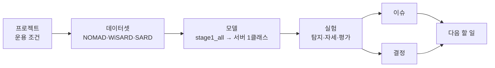

> [!summary] 자율 정찰 드론 관제 시스템 · 비전 파트
> 고령 인구가 많은 농촌을 드론이 자율 정찰하며 **쓰러진 사람을 찾아** 관제 지도에 신고한다.
> 비전 담당 **정서인** — 탐지 모델 · 상의 색상 비교 · 좌표 변환. (자세 판별은 제외 — 쓰러짐은 운영자 판단)

## 지금 상태

| 영역 | 상태 | 핵심 수치 |
|---|---|---|
| 사람 탐지 | ✅ 확보 | [[stage1_all]] 겨울 AP50 0.922 · 여름 0.641 |
| 자세 판별 | ⛔ 중단 — 쓰러짐은 운영자 판단 | [[결정 - 자세 판별 제외]] |
| 상의 색상 비교 | 📝 계획 · NOMAD 42명으로 1차 평가 예정 | [[10 상의 색상 비교]] |
| 좌표 변환 | ⚠️ 시뮬레이터 기준 | 평균 0.50 m · 실기체용 교체 필요 |
| 서버 학습 | 🔄 계획 S0 대기 · GPU 장애는 완화 설정·자동 복구로 운용 · M1 참고 학습 완료 | [[0 서버 학습 계획 한눈에]] · [[GPU 장애 Xid 79]] |
| 요구명세서 | ✅ v1.7 최종판 · 성능 요구 정리 | [[요구명세서]] · [[성능 요구사항 한눈에]] |

## 지도

그림으로 보려면 → [[프로젝트 지도.canvas|프로젝트 지도]] · [[가중치 계보.canvas|가중치 계보]]

## 폴더

| | 폴더 | 들어 있는 것 |
|---|---|---|
| 🎯 | **01 프로젝트** | [[프로젝트 개요]] · [[팀과 역할]] · [[하드웨어와 예산]] · [[하드웨어 트레이드오프 - 카메라·통신·짐벌]] · [[운용 조건]] · [[요구명세서]] · [[관제 뷰어 프로토타입]] · [[발표 피드백]] |
| 🗂️ | **02 데이터셋** | [[NOMAD]] · [[WiSARD]] · [[SARD]] · [[Okutama-Action]] · [[AI-Hub 182 조난자 수색]] · [[검토 후 제외한 데이터셋]] |
| 🧠 | **03 모델** | [[VisDrone 기성 모델]] · [[stage1_all]] · [[pose3_sn_freeze]] · [[가중치 계보]] |
| 🧪 | **04 실험** | 아래 표 참고 |
| ✅ | **05 결정** | [[결정 - 자세 판별 제외]] · [[결정 - 저장소 통합]] · [[결정 - GPU 완화 설정과 자동 복구]] · [[결정 - 3클래스 체계]] · [[결정 - 전환 구간 15프레임]] · [[결정 - WiSARD 자세 학습 제외]] · [[결정 - 백본 동결]] · [[결정 - 신뢰도 0.15]] · [[결정 - Okutama 평가 전용]] · [[결정 - Copy-Paste 보류]] · [[결정 - 서버에서 데이터 새로 받기]] |
| ⚠️ | **06 이슈** | [[GPU 장애 Xid 79]] · [[쓰러짐 판별 도메인 이전 실패]] · [[ambiguous 물체 오탐]] · [[겨울 0.922의 한계]] · [[학습 데이터 촬영 각도 불일치]] · [[NOMAD 검증 배우 불일치]] · [[막다른 길]] · [[함정 모음]] |
| 📘 | **07 개념** | [[전이학습과 백본 동결]] · [[파국적 망각]] · [[fitness와 조기 종료]] · [[GSD와 화각]] · [[Copy-Paste 증강]] · [[도메인별 평가]] · [[상황지도와 기본 지도]] · [[관측 완료도 계산 방법]] · [[관측 상태 판정 알고리즘]] · [[동일 대상 연결과 재식별]] · 서버: [[GPU 장애 코드 Xid]] · [[PCIe 세대와 ASPM·AER]] · [[sysrq 강제 재시작]] · [[전력 제한과 클럭 상한]] · [[이어 학습과 AutoBatch]] |
| 🖥️ | **08 서버** | [[학과 서버]] · [[데이터 다운로드]] · [[서버 인계]] |
| 🗓️ | **09 기록** | [[타임라인]] · [[문서와 코드 위치]] · [[다음 할 일]] |
| 📏 | **10 성능 요구사항** | [[성능 요구사항 한눈에]] · 항목별 11개 · [[측정 조건]] · [[성능 요구 검토 - 중앙 서버]] |
| 📖 | **용어** | [[용어 및 약어]] · [[IoU]] · [[AP와 mAP]] · [[정밀도와 재현율]] · [[신뢰도 임계값과 F2]] · [[시간 지표 - ms·FPS·P95]] |
| 🚀 | **11 서버 학습 계획** | [[0 서버 학습 계획 한눈에]] · [[1 기준 조건 - 카메라·화각·마운트]] · [[4 전처리 - 크기 정규화와 지터]] · [[5 학습 하이퍼파라미터]] · [[6 실험 순서와 판정]] · [[9 체크리스트]] · [[10 상의 색상 비교]] |

## 실험 한눈에

![[실험 비교.base]]

> [!tip] 보는 법
> - 왼쪽 아래 **그래프 뷰**: 폴더별로 색이 다르다. 결정·이슈 노트가 어떤 실험과 이어지는지 보인다.
> - 노트 위에 마우스를 올리고 `Ctrl` 을 누르면 미리보기가 뜬다.
> - 수치의 원본은 Capstone 저장소 `drone_yolo/` 문서다 → [[문서와 코드 위치]]
