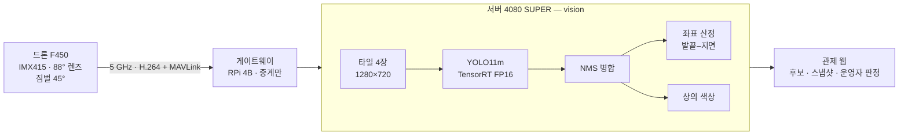
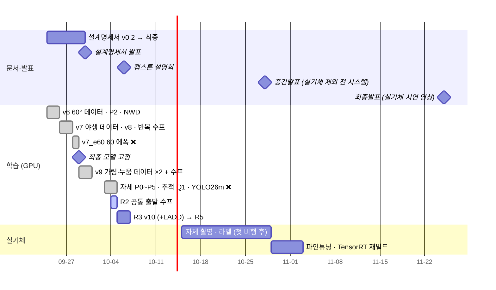

> [!summary] 자율 정찰 드론 관제 시스템 · 비전 파트 (정서인)
> 드론이 농촌·산지를 자율 정찰하며 **사람(쓰러진 사람 포함)을 찾아** 관제 지도에 신고한다.
> 비전 = **사람 탐지 · 좌표 산정 · 상의 색상 비교** · 자세 자동 판별은 제외 → [[결정 - 자세 판별 제외]]

> [!important] 다음 마일스톤 — **10/28 (수) 중간발표** (실기체 제외 전 시스템) · 10/06 캡스톤 설명회
> 핵심 경로는 학습이 아니라 **구현** (영상 → 탐지 → 좌표 → 후보 기억 → 상태 · 색 → 관제) → [[10 작업·학습 계획 - 중간발표까지 (10-04)]]

# 지금 상태 (10-04)

| 영역 | 상태 | 핵심 수치 | 문서 |
|---|---|---|---|
| 기준 조건 | ✅ 확정 | 주 렌즈 **88°** (수평 80.2°) · 3축 짐벌 GM3 V2 · **예산 1,867,810원 · 15품목** | [[결정 - 최종 예산안 (2026-09-23 계획서)]] · `보고서/최종_예산안.md` |
| 설계명세서 | ✅ 제출 v2.3 (10-02) | 관리 단위 12 · 클래스 271 · 비전 = 4.2.7 (128쪽~) · ⚠ C-0705 · C-0711 명세 빠짐 | [[설계명세서]] |
| 마운트각 | ✅ 09-29 | **기본 45°** (60° 비교) · 16~20 m 권장 | [[결정 - 기본 마운트각 45°]] |
| 탐지 정확도 V03 | ❌ 개선 중 | 장소 분리 AP50 **0.5927** (soup_v7r2 · test_v2) · test_obl 0.6331 · test_kr 0.968 / 목표 0.80 · YOLO26m ❌ (10-04) | [[NFR-V03 탐지 정확도]] · [[YOLO26m 탐지기 Q2 - 기각]] |
| 추론 시간 V01 | ✅ | **18.9 ms** (타일 4장 · TensorRT FP16 · 3090) | [[NFR-V01 추론 시간]] |
| 좌표 V04 | ✅ 계산 · 구현 | 45° · 25 m 가운데 6.8 m · GeoResolver 합성 중앙 2.0 m · **시뮬 비행 중앙 0.68 · P95 1.16 m (10-05)** · 실비행 대기 | [[NFR-V04 좌표 정확도]] |
| 오탐 V06 | ✅ (조건부) | 음성셋 **0.46** 건/장 · ⚠ 도로 시설물 장면 (AU-AIR) **3.24** | [[NFR-V06 프레임 오탐]] · [[외부 평가셋 - LADD·AU-AIR·키프로스·UE level01]] |
| **최종 모델** | ✅ | **`soup_v7r2`** (공식 수치) · 상태 인지용 `soup_v9x2` (누움 재현율 0.50) | [[결정 - 최종 탐지 모델 soup_v7r2]] |
| 상태 인지 | 🔄 | 추적 고치기 ✅ 점수 누움 AUROC 0.78 → **0.95** · 자세는 박스 모양 (앉음 약함) · UE 자세 데이터 도착 | [[06 요구조자 상태 인지 계획]] |
| 학습 (GPU) | 🔄 `chain_r` | R2 공통 출발 수프 (10-04 22:11 ~ 10-05 08시쯤) → R3 v10 (+LADD) → R5 중간발표 후보 | [[_학습 큐]] |
| 실시간 서비스 | 🔄 | **비전 worker 인계 꾸러미 v0** — 동료 서버 샌드박스의 Vision worker 자리 · test_v2 AP50 재현 | `drone_yolo/deploy/vision_worker/` |
| 상의 색상 비교 | 📝 계획 | Lab 12색 · 1·2순위 (W1-5) | [[04 상의 색상 비교]] |

![[fig_NFR-V03_경과.svg]]

> [!warning] 가장 큰 미결 다섯 가지
> 1. **장소 일반화** — 처음 보는 장소 0.22 (09-23) → **0.59** (09-27 · test_v2). 목표 0.80 까지 0.21 · 숲 가림 · 누운/앉은 사람 → [[장소 일반화 - NFR-V03 0.22]]
> 2. **짐벌 실물 확인** — GM3 V2 로 45° 피치 유지 · 고정 장착이면 45° 브래킷 · RunCam 장착 호환 · 보조 렌즈 62°·78° 호환
> 3. **NFR-V03 판정셋** — 지금은 셋 병행 (test_obl 비스듬 · test_v2 숲 · test_kr 한국). 어느 것을 공식 판정으로 할지 팀 협의
> 4. **자체 촬영** — 한국 산지 · 45° 데이터는 이것뿐이다 → [[05 실기체 적용 - 자체 촬영]]
> 5. **실시간 서비스 연결** — 동료 샌드박스와 촬영 시각 · 자세 sidecar 형식 · DB 쓰는 쪽 · GPU 공유 합의 (없으면 좌표를 못 낸다) → `drone_yolo/deploy/vision_worker/동료_요청_메모.md`

# 흐름 한 장

```mermaid
flowchart LR
    A["드론 F450<br/>IMX415 · 88° 렌즈<br/>짐벌 45°"] -->|"5 GHz · H.264 + MAVLink"| B["게이트웨이<br/>RPi 4B · 중계만"]
    B --> S
    subgraph S["서버 4080 SUPER — vision"]
        direction LR
        C1["타일 4장<br/>1280×720"] --> C2["YOLO11m<br/>TensorRT FP16"] --> C3["NMS 병합"]
        C3 --> C4["좌표 산정<br/>발끝–지면"]
        C3 --> C5["상의 색상"]
    end
    S --> D["관제 웹<br/>후보 · 스냅샷 · 운영자 판정"]
```

# 일정

```mermaid
gantt
    dateFormat YYYY-MM-DD
    axisFormat %m-%d
    section 문서·발표
    설계명세서 v0.2 → 최종        :doc, 2026-09-24, 6d
    설계명세서 발표               :milestone, 2026-09-30, 0d
    캡스톤 설명회                 :milestone, 2026-10-06, 0d
    중간발표 (실기체 제외 전 시스템) :milestone, 2026-10-28, 0d
    최종발표 (실기체 시연 영상)    :milestone, 2026-11-25, 0d
    section 학습 (GPU)
    v6 60° 데이터 · P2 · NWD      :done, v6, 2026-09-24, 2d
    v7 야생 데이터 · v8 · 반복 수프 :done, v7, 2026-09-26, 2d
    v7_e60 60 에폭 ❌              :done, e60, 2026-09-28, 1d
    최종 모델 고정                 :milestone, 2026-09-29, 0d
    v9 가림·누움 데이터 ×2 + 수프   :done, v9, 2026-09-29, 2d
    자세 P0~P5 · 추적 Q1 · YOLO26m ❌ :done, q, 2026-10-03, 2d
    R2 공통 출발 수프               :active, r2, 2026-10-04, 1d
    R3 v10 (+LADD) → R5            :r3, after r2, 2d
    section 실기체
    자체 촬영 · 라벨 (첫 비행 후)   :own, 2026-10-15, 14d
    파인튜닝 · TensorRT 재빌드     :after own, 5d
```

# 어떻게 찾아볼까

| 찾는 방식 | 들어가는 곳 |
|---|---|
| **학습 계획 전체** | [[00 학습 계획 한눈에]] |
| **시간순** — 언제 무엇을 했나 | [[타임라인]] · 일자별 → `09 기록/일자별/` |
| **할 일** | [[다음 할 일]] |
| **실험 결과** | [[_실험 색인]] |
| **왜 그렇게 정했나** | [[_결정 색인]] |
| **데이터** | [[_데이터셋 한눈에]] |
| **합격 기준** | [[성능 요구사항 한눈에]] |
| **용어·개념** | [[_개념 색인]] · [[용어 및 약어]] |
| **실수·함정** | [[함정 모음]] · [[막다른 길]] |
| **파일이 어디 있나** | [[문서와 코드 위치]] |
| **한 장 지도** | [[프로젝트 지도.canvas\|프로젝트 지도]] · [[가중치 계보.canvas\|가중치 계보]] |

# 주제별 지도

## 1. 무엇을 만드는가
[[프로젝트 개요]] · [[운용 조건]] · [[요구명세서]] · [[설계명세서]] · [[팀과 역할]] · [[발표 피드백]] · [[관제 뷰어 프로토타입]]
하드웨어 → [[결정 - 최종 예산안 (2026-09-23 계획서)]] · 지난 안 → `01 프로젝트/지난 하드웨어안/`

## 2. 합격 기준
[[성능 요구사항 한눈에]] · [[측정 조건]] · [[수치 표기 규칙]] · [[관측 시간과 영상 수신 기준]]
비전: [[NFR-V01 추론 시간]] · [[NFR-V02 분석 처리율]] · [[NFR-V03 탐지 정확도]] · [[NFR-V04 좌표 정확도]] · [[NFR-V05 신뢰도 기준]] · [[NFR-V06 프레임 오탐]]
시스템: [[NFR-P01 연결 판정]] · [[NFR-P02 영상 수신 성능]] · [[NFR-P03 장애 감지]] · [[NFR-P04 동시 처리]] · [[NFR-I01 관측 완료도]]

## 3. 데이터
[[_데이터셋 한눈에]] — [[AI-Hub 182 조난자 수색]] · [[WiSARD]] · [[NOMAD]] · [[Unicamp-UAV]] · [[VisDrone]] · [[Okutama-Action]] · [[SARD]] · [[NII-CU]]
받는 법 → [[데이터 다운로드]] · 후보 → [[후보 - 비스듬 시점 데이터셋]] · 제외 → [[검토 후 제외한 데이터셋]]

## 4. 모델과 학습
[[00 학습 계획 한눈에]] → [[01 기준 요건 확정안]] · [[02 학습 계획 v6 (60° 기준)]] · [[_학습 큐]] · **[[결정 - 최종 탐지 모델 soup_v7r2]]**
[[가중치 계보]] · [[stage1_all]] · [[VisDrone 기성 모델]]
서버 → [[학과 서버]] · [[서버 인계]]

## 5. 실험
최근: [[좌표 산정 GeoResolver - 평지 교차 검증]] · [[NWD·P2 효과 없음 - 원인 분석]] · [[서버 v6_obl - 60° 데이터]] · [[서버 v3_place - 장소 분리 학습]] · [[타일 추론]] · 일자별 [[9.27 v8 판정과 반복 수프]] · [[9.28 최종 모델 확정]] · [[9.29 60 에폭 기각과 v9]]
전체 → [[_실험 색인]] · 종료된 자세 판별 트랙 → `04 실험/자세 판별 (종료)/`

## 6. 막힌 곳
[[장소 일반화 - NFR-V03 0.22]] · [[성능 개선 후보 - AP50 벽]] · [[학습 데이터 촬영 각도 불일치]] · [[GPU 장애 Xid 79]] · [[NOMAD 검증 배우 불일치]] · [[겨울 0.922의 한계]]

# 규칙

- 데이터 원본과 파생물(크롭 · 추론 결과 이미지)은 **git 에 올리지 않는다**
- API 키 · 토큰은 문서 · 커밋에 남기지 않는다
- 이 저장소는 공개다 — 팀 내부 주소 · 개인 연락처 · 학번을 넣지 않는다
- 기준 문서 우선순위: **캡스톤 디자인 계획서(예산) · 요구명세서 v1.7** → 이 볼트
- 지난 판 문서는 지우지 않고 `지난 …` 폴더로 옮긴다 — 맨 위에 대체 문서 링크가 있다
