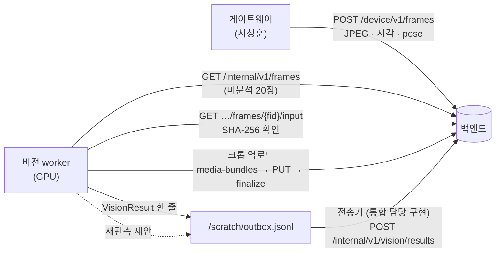

> [!summary] 결정판 **vision-ingest/1.0** (10-06 · 통합 담당) 에 맞춰 worker 를 고친다
> - 원문: `drone_yolo/deploy/vision_worker/schema/vision_backend_handoff_v1.0.md` · `openapi-vision.json` · 백엔드 코드 `drone_backend/real.py` 로 실제 동작 확인
> - 바뀌는 핵심: 영상(RTSP) 직접 받기 → **프레임 API 로 한 장씩 받기** · 후보 사건 → **프레임마다 결과 하나** · 파일 경로 → **미디어 API 업로드 ID**
> - ⚠ 막힌 것: **① 프레임 API 가 자세(pose)를 안 준다** → 좌표 산정 불가 (전부 `PENDING / NO_POSE`) · **② 모델 설정 등록** (`model_config_id`) 이 있어야 결과가 받아진다

## 흐름 (v1.0)

## worker 가 할 일 (구현 목록)

| # | 할 일 | 규칙 (백엔드 코드에서 확인) |
|---|---|---|
| 1 | **프레임 받기** — `GET /internal/v1/frames` (미분석 · 최대 20 · 오래된 순) → 입력 받기 · `X-Content-SHA256` 확인 · JPEG/PNG 디코드 | 결과가 반영되기 전까진 같은 프레임이 다시 나온다 → **outbox 에 쓴 frame_id 는 로컬에 기록해 다시 안 돌림** |
| 2 | **프레임마다 결과 하나** — 탐지 0개여도 `DONE` + `observations: []` · 못 읽으면 `DROPPED` + `reason` · 건너뛰면 `SKIPPED` + `reason` | 한 프레임 한 번만 반영 (`FRAME_ALREADY_ANALYZED`) |
| 3 | 관측 → 후보 — 기존 `CandidateRegistry` (세계 좌표 · 화면 IoU) · `candidate_id` uuid | 후보마다 `worker_revision` **엄격히 증가** (같거나 작으면 `OLD_WORKER_REVISION` 409) · 한 프레임에 같은 후보 두 번 금지 |
| 4 | 박스 `{x1,y1,x2,y2}` 원본 화소 · 폭·높이 안으로 자르기 | 넘으면 `INVALID_BBOX` 422 |
| 5 | 좌표 `geo` — `status` · 위경도 · `error_ellipse {major_m ≥ minor_m, azimuth_deg, k=1}` · 사유 코드 | `VALID` 이면 위경도 + 타원 필수 · `PENDING/INVALID` 는 위경도 null · 백엔드는 주장으로만 보존 |
| 6 | 색 `appearance.upper` · 상태 `state` (W2-2 전 `null`) | 그대로 `tracking` 에 보존 |
| 7 | 크롭 업로드 — `POST /internal/v1/vision/media-bundles` (asset_id · role `FRAME` · 크기 · SHA-256) → `PUT …/content` → `finalize` → `snapshot_asset_id` | 결과보다 **먼저** 저장 완료 (`INPUT_ASSET_NOT_READY`) · 후보마다 처음 · 확신도 최고 갱신 때만 |
| 8 | outbox 한 줄 `{"type":"result","body":{…}}` · UTF-8 · ≤ 64 KiB · `\n` · fsync | `message_id` uuid · `producer_session_id` (worker 실행마다 uuid) · `sequence` 문자열 증가 · 재전송은 같은 ID·본문 |
| 9 | 재관측 제안 `{"type":"reobservation","body":{request_id, candidate_id, reason, hypothesis, desired_view}}` | 같은 request_id 다른 본문 = `ID_CONFLICT` |
| 10 | 재시작 — 후보 기억 · 후보별 revision · sequence · 처리한 frame_id 를 `/scratch/state.json` 에 | 재시작 뒤 revision 이 되돌아가면 409 |

## 막힌 것 · 통합 담당에게 물을 것

| # | 문제 | 근거 | 제안 |
|---|---|---|---|
| ① | **worker 가 자세를 못 받는다** | `GET /internal/v1/frames` 가 `frame_id, mission_id, capture_at, width, height, format, time_evidence` 만 돌려줌 (`pose` 칸은 DB 에 있는데 안 나옴) · 텔레메트리 이력 API 는 운영자 세션 전용 | 프레임 응답에 `pose` (+ `time_source`) 추가 — 쿼리 한 줄 |
| ② | 모델 설정 등록 | 결과의 `model_config_id` 가 `kind=MODEL` · `environment=REAL` · `pipeline_version` 이 있어야 함 (`MODEL_PROVENANCE_REQUIRED`) · 등록은 설정 관리자 | soup_v7r2 가중치 SHA-256 · 파이프라인 판 (`vision_worker 1.0`) 으로 등록 요청 |
| ③ | GPU | "워커 연결기에는 GPU 를 연결하지 않음" | vision 컨테이너에 GPU 연결 · 학습 체인과 나눠 씀 |
| ④ | 후속 합의 (handoff 8절) | 자동 확정 기준 (2장/3초 vs 유효 관측 3회) · LOST · 재등장 · 마지막 유효 좌표 · 상태 · 색 규격 · 시계 동기 증거 · 좌표 검증 책임 · 운영자 판단 피드백 | 회의 안건 |
| ⑤ | 파일 이름 | handoff 는 `openapi-real.json` 을 가리키는데 우리 폴더엔 `openapi-vision.json` (내용 같음) | 이름만 맞추기 |

## 시험 방법 (구현 뒤)

- 서버 밖 단독 시험: 가짜 백엔드 (FastAPI · 같은 OpenAPI 검증) + Okutama · UE 영상 프레임 → outbox 줄을 `VisionResult` 스키마로 검증 · revision · 재시작
- 샌드박스 왕복: 통합 담당과 — 게이트웨이 대신 프레임 몇 장 등록 → worker → 결과 수신 영수증 → 관제 화면 후보

## 연결
[[비전 출력 규격 - 후보 JSON (초안 v0.1)]] · [[10 작업·학습 계획 - 중간발표까지 (10-04)]] (W1-1 · W1-2 · W1-3 · W1-4) · [[좌표 산정 GeoResolver - 평지 교차 검증]]
