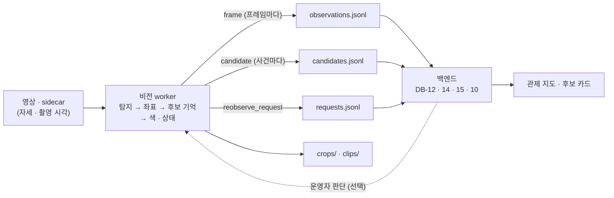

> [!summary] 비전 worker → 백엔드로 보내는 **후보 · 프레임 · 재관측 요청** 메시지 규격 (W1-2)
> - 기준: SDD ERD 의 `person_candidate` (DB-14) · `detection_observation` (DB-15) · `reobservation_request` (DB-10) 에 **그대로 넣을 수 있게** 칸을 맞췄다
> - 지금 worker v0 출력 (`candidates.jsonl`) 은 이 규격 전 형식 → 합의되면 worker 를 고친다
> - 예시 전체 → `drone_yolo/deploy/vision_worker/schema/examples_v0.1.jsonl`

## 흐름



## 1. 전달 방식 (제안)

| 항목 | 제안 | 비고 |
|---|---|---|
| 통로 | 임무 폴더에 **JSONL 덧붙이기** (`/data/missions/<임무>/results/`) · 백엔드가 꼬리 읽기 | 지금 worker 방식 · 끊겨도 다시 읽으면 됨 · WebSocket/REST 는 조율 항목 |
| 한 줄 = 한 메시지 | UTF-8 · 줄바꿈 `\n` · 덜 쓴 마지막 줄은 다음에 읽기 | |
| 순서 · 중복 | 파일마다 `seq` 1씩 증가 · 후보마다 `rev` 증가 → **`rev` 가 더 큰 것만 반영 (upsert)** | DB `row_version` |
| 시각 | **ISO 8601 UTC · 밀리초 · `Z`** (`2026-10-07T05:12:33.120Z`) · 화면은 KST | |
| 좌표 | WGS84 위경도 소수 7자리 (~1 cm) | DB `geometry(Point,4326)` |
| 단위 | 거리 m · 각도 ° · 확률 0~1 · 박스 = 원본 화소 `[x1, y1, x2, y2]` | |
| 이미지 | 경로만 보냄 (임무 폴더 기준 상대 경로) | |

## 2. 공통 머리

| 칸 | 형 | 뜻 |
|---|---|---|
| `schema` | str | `"vision/0.1"` — 규격 판 |
| `type` | str | `candidate` · `frame` · `reobserve_request` |
| `mission_id` | str | 임무 |
| `seq` | int | 파일 안 순번 |
| `emitted_at` | str | 보낸 시각 |

## 3. `candidate` — 후보 (사건이 생길 때마다 **전체 상태**를 보냄)

| 사건 `event` | 언제 | 빈도 |
|---|---|---|
| `CREATED` | 처음 잡힘 | 즉시 |
| `CONFIRMED` | 확정 조건을 넘음 (지금: 3초 안 서로 다른 프레임 2장) | 즉시 |
| `GEO_CHANGED` | 좌표 상태가 바뀜 · 또는 위치가 1σ 넘게 이동 | 즉시 |
| `STATE_CHANGED` | 상태 등급이 바뀜 | 즉시 |
| `UPDATED` | 그 밖 (관측 수 · 확신도 · 색) | 후보마다 **최대 초당 1번** |
| `LOST` | 10초 동안 안 잡힘 — **후보는 지우지 않는다** (운영자 판단 전까지 남음) | 즉시 |

| 칸 | 형 | 뜻 | DB-14 칸 |
|---|---|---|---|
| `candidate_id` | uuid | worker 가 만듦 | `candidate_id` |
| `label` | str | 사람이 부르는 이름 `C0007` | — |
| `rev` | int | 후보별 판 | `row_version` |
| `first_seen` · `last_seen` | str | 처음 · 마지막 탐지 시각 | 같은 이름 |
| `time_source` | str | `SIDECAR` (촬영 시각) · `RECEIVE` (받은 시각 · 덜 정확) | → `capture_time_verified` |
| `confirmed` | bool | 확정 여부 — **화면 기본은 확정만** (도로 장면 오탐 3.24 건/장) | — |
| `association_state` | str | `ACTIVE` · `LOST` | 같은 이름 |
| `evidence.evidence_count` | int | 탐지 관측 수 | `evidence_count` |
| `evidence.valid_group_count` | int | 서로 다른 1초 묶음 수 | `valid_group_count` |
| `evidence.best_conf` · `last_conf` | float | 최고 · 최근 확신도 | |
| `evidence.track_id` | str | 영상 추적 ID (W2-2 뒤) | DB-15 `track_id` |
| `geo` | obj | 아래 4절 | `latest_position` · `geo_status` · `geo_reason` · `ellipse` |
| `appearance` | obj | 아래 5절 | `appearance` |
| `state` | obj \| null | 아래 6절 · 상태 모듈 전엔 `null` | (새 칸 · `tracking` 옆) |
| `priority_score` | float | 목록 정렬용 0~1 — `state.score` (없으면 `best_conf`) · **거르지 않고 순위만** | — |
| `media.snapshot` | str | `crops/<candidate_id>.jpg` (확신도 최고 장) | `first_asset_id` → DB-11 |
| `media.clip` | str \| null | 근거 클립 전후 3초 (W1-6 뒤) | |
| `latest` | obj | 최근 근거 — 프레임 · 박스 · 확신도 | `latest_observation_id` |
| `model` | obj | `detector` (`soup_v7r2`) · `conf_threshold` (0.15) · `pipeline` | `coordinate_config_id` 등 |

## 4. `geo` — 좌표

| 칸 | 뜻 |
|---|---|
| `status` | `VALID` · `PENDING` (보류 · 사유 있음 · 후보는 유지) · `INVALID` |
| `lat` · `lon` | 후보 위치 (관측을 분산 역가중 평균) · PENDING 이면 마지막 VALID 값 또는 `null` |
| `ellipse` | `{"along_m", "cross_m", "bearing_deg", "k": 1}` — 1σ 타원 (거리 방향 · 옆 방향 · 거리 방향 방위) |
| `sigma_m` | 합친 위치의 1σ (큰 축) |
| `reasons` | 보류 사유 코드 (아래) |
| `method` | `FOOT_RAY_FLAT` (평지) · `FOOT_RAY_DEM` (지형) |
| `n_fused` | 위치에 합친 관측 수 |

보류 사유 코드: `TILT_GT_6` (기울기 > 6°) · `RATE_GT_1_5` (자세 변화 > 1.5°/프레임) · `FOOT_AT_EDGE` (발끝이 화면 아래 끝) · `RAY_ABOVE_HORIZON` · `RANGE_GT_200` · `NO_POSE` (자세 없음 · sidecar 끊김) · `NO_TERRAIN_HIT`
→ worker 지금은 한글 문장 → **코드로 바꾼다** (화면 문구는 백엔드가)

## 5. `appearance` — 상의 색

| 칸 | 뜻 |
|---|---|
| `upper.status` | `OK` · `UNDETERMINED` (화소 부족 · 노출) |
| `upper.top` | 1 · 2순위 `[{"color": "red", "p": 0.62}, {"color": "orange", "p": 0.21}]` |
| `upper.n_obs` | 색 판정에 쓴 관측 수 |
| `query_color` | 운영자가 지정한 찾는 색 (없으면 `null`) |
| `match` | `MATCH` · `NO_MATCH` · `UNKNOWN` — 1순위 일치 또는 2순위 일치 · p ≥ 0.3 |
| `match_score` | 지정 색 확률 (정렬용) |

12색: `red` `orange` `yellow` `green` `blue` `navy` `purple` `pink` `white` `gray` `black` `brown`

## 6. `state` — 요구조자 상태 (W2-2 뒤 · 그 전엔 `null`)

| 칸 | 뜻 |
|---|---|
| `grade` | `CRITICAL` 🔴 (누움 ≥ 0.7 · 무동작 ≥ 10초) · `WARNING` 🟠 (누움+앉음 ≥ 0.7 · 무동작 ≥ 10초) · `UNCERTAIN` ❔ (관측 < 3초 · 누움 0.3~0.7) · `NORMAL` ⚪ |
| `score` | 0.5·누움 + 0.2·앉음 + 0.3·min(무동작초, 20)/20 |
| `posture` | `{"lying", "sitting", "standing"}` 확률 |
| `view` | `OBLIQUE` (박스 모양 판정) · `NADIR` (외형 판정) |
| `still_s` · `observed_s` · `moving` | 무동작 시간 · 관측 시간 · 이동 중 |
| `reasons` | 등급 근거 문구 코드 (`LYING` · `STILL_10S` · `SHORT_OBS` …) |

> [!warning] 상태는 **순위 보조**다 — 후보를 숨기거나 지우는 데 쓰지 않는다 · 최종 판단은 운영자 (UC-0705 개정안)

## 7. `frame` — 분석한 프레임마다 (DB-12 분석 칸 · DB-15)

| 칸 | 뜻 |
|---|---|
| `frame` | `{"stream_id", "stream_epoch", "frame_seq", "pts_ms", "capture_at", "received_at", "time_source"}` |
| `pose_status` · `pose_reason` | `VALID` · `ESTIMATED` · `PENDING` · `INVALID` |
| `analysis_state` | `DONE` · `DROPPED` (깨짐 · 오래됨) · `SKIPPED` · `skip_reason` |
| `timing` | `{"infer_ms", "total_ms"}` (NFR-V01) |
| `detections[]` | `{"index", "bbox", "conf", "candidate_id", "track_id", "kind": "DETECT"\|"TRACK_ONLY", "geo": {...4절과 같은 모양}}` |

- 양이 많다 (초당 10장 · 장당 0~수십) → 백엔드가 **실시간엔 후보만**, 프레임은 이력 · 검증용으로 받는 안도 가능 (조율)

## 8. `reobserve_request` — 재관측 요청 (DB-10 · `requester_kind = SYSTEM`)

| 칸 | 뜻 |
|---|---|
| `request_id` · `candidate_id` | |
| `reason` | `GEO_PENDING` · `LOW_EVIDENCE` (확정 못 함) · `STATE_UNCERTAIN` · `COLOR_UNDETERMINED` |
| `hypothesis` | `{"lat", "lon", "ellipse"}` |
| `desired_view` | `{"bearing_deg"` (지난 관측과 다른 방위) · `"alt_m"` · `"mount_deg"` · `"dwell_s": 3}` |
| `limits` | `{"max_time_s": 30, "max_attempts": 2}` |

- 비전은 **요청만** 한다 — 받을지 · 언제 갈지는 계획 (이시원 IPP `planConfirmation`) · 같은 후보 진행 중 요청은 1건

## 예시 — `candidate` 한 줄 (보기 좋게 펼침)

```json
{"schema": "vision/0.1", "type": "candidate", "mission_id": "m001", "seq": 412,
 "emitted_at": "2026-10-07T05:12:33.120Z", "event": "CONFIRMED",
 "candidate_id": "6f1c2a1e-8a5b-4d6e-9a43-2f0c7d3b9e10", "label": "C0007", "rev": 3,
 "first_seen": "2026-10-07T05:12:31.900Z", "last_seen": "2026-10-07T05:12:33.000Z", "time_source": "SIDECAR",
 "confirmed": true, "association_state": "ACTIVE",
 "evidence": {"evidence_count": 3, "valid_group_count": 2, "best_conf": 0.61, "last_conf": 0.48, "track_id": null},
 "geo": {"status": "VALID", "lat": 36.1452311, "lon": 128.3931207,
         "ellipse": {"along_m": 2.1, "cross_m": 1.7, "bearing_deg": 87.0, "k": 1}, "sigma_m": 1.4,
         "reasons": [], "method": "FOOT_RAY_DEM", "n_fused": 3},
 "appearance": {"upper": {"status": "OK", "top": [{"color": "red", "p": 0.62}, {"color": "orange", "p": 0.21}], "n_obs": 2},
                "query_color": "red", "match": "MATCH", "match_score": 0.62},
 "state": null, "priority_score": 0.61,
 "media": {"snapshot": "crops/6f1c2a1e-8a5b-4d6e-9a43-2f0c7d3b9e10.jpg", "clip": null},
 "latest": {"frame": {"stream_id": "cam0", "stream_epoch": 1, "frame_seq": 18233, "capture_at": "2026-10-07T05:12:33.000Z"},
            "bbox": [1012.4, 633.0, 1040.8, 701.2], "conf": 0.48, "image_size": [1920, 1080]},
 "model": {"detector": "soup_v7r2", "conf_threshold": 0.15, "pipeline": "vision_worker 0.2"}}
```

## 조율할 것 (결정 → 이 노트 갱신 · 판 올림)

| # | 질문 | 비전 제안 | 누구 |
|---|---|---|---|
| 1 | **확정 규칙** — worker 는 3초 안 2장 · DB-14 주석은 "서로 다른 시각 유효 관측 3회↑" | 2장 / 3초 (9.28 관측 시간: 2회 이상 잡힐 확률 0.59~0.82) · 숫자는 설정값으로 | 이시원 |
| 2 | `candidate_id` — worker 가 uuid 를 만들지 · 백엔드가 받아서 줄지 | worker uuid (끊김 없이 바로 씀) | 이시원 |
| 3 | 통로 — JSONL 파일 꼬리 읽기 · WebSocket · REST | JSONL (지금 그대로) · 실시간 지연이 문제면 WebSocket 추가 | 이시원 · 통합 |
| 4 | 프레임 메시지 실시간 필요? | 후보만 실시간 · 프레임은 이력 | 이시원 |
| 5 | 미확정 후보도 보낼지 | 보냄 (`confirmed=false`) · 화면 기본은 숨김 | 이시원 |
| 6 | 운영자 판단 (오탐 · 대응 필요 · 쓰러짐 의심) 을 worker 에 돌려줄지 | 돌려주면 같은 자리 오탐을 눌러 둠 (선택) · 형식: `control/judgements.jsonl` | 이시원 |
| 7 | sidecar (촬영 시각 · 자세) 형식 · 시계 기준 (NTP/PTP) | `telemetry.py` 의 제안 형식 · UTC 마이크로초 | 서성훈 · 통합 |
| 8 | `priority_score` 를 비전이 줄지 · 백엔드가 계산할지 | 비전이 줌 (상태 점수) · 색 일치 가중은 백엔드 | 이시원 |
| 9 | `LOST` 시간 (10초) · `UPDATED` 빈도 (초당 1) | 설정값 | 이시원 |

## worker 에서 바꿀 것 (합의 뒤)

- `candidate_id` → uuid + `label` · `rev` · `event` 이름 대문자 · 시각 ISO · 공통 머리
- 좌표 상태 `OK` → `VALID` · 보류 사유 한글 → 코드 · 타원을 이름 있는 칸으로
- `LOST` · `GEO_CHANGED` 사건 · `UPDATED` 초당 1번 제한 · `requests.jsonl`
- 상태 (`state`) 는 W2-2 · 클립 (`media.clip`) 은 W1-6

## 연결
[[10 작업·학습 계획 - 중간발표까지 (10-04)]] (W1-2) · [[설계명세서]] · [[07 객체지향 설계 v2 - 상태 인지 반영]] · [[06 요구조자 상태 인지 계획]] · [[관측 시간과 영상 수신 기준]] · [[좌표 산정 GeoResolver - 평지 교차 검증]] · [[04 상의 색상 비교]]
