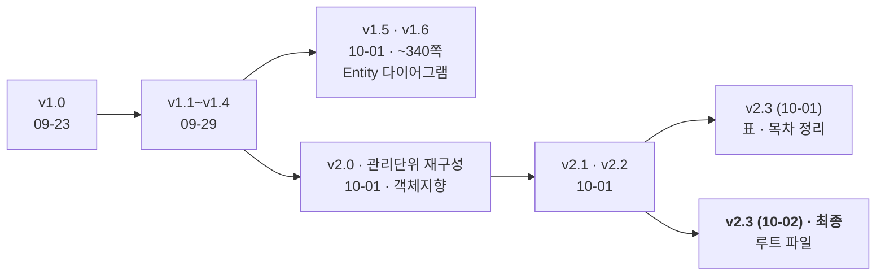

> [!summary] **설계명세서 최종본 = v2.3 (10-02 판)** — 저장소 루트 `3.설계명세서(서성훈,이시원,정서인)_v2.3.hwpx` (팀드라이브 `전체산출물/3. 설계명세서/` 같은 이름 파일과 같다 · 학번이 있어 git 밖)
> 9/30 발표 피드백 (객체지향: Controller · Service interface · DAO · DTO) 을 반영한 판 · 관리 단위 12개 · 클래스 ID 271 · 표 384 · 그림 120
> 이 노트는 내용 요약과 비전 장 · 다음 판에 고칠 것만 적는다 — 본문은 hwpx

## 구성

| 장 | 내용 | 쪽 |
|---|---|---:|
| 1 | 개요 — 1.1 시스템 목표 · 1.2 주요 기능 (관리 단위 UCD-01~12) · 1.3 설계상 제약 | 5 |
| 2 | 파일 구조 · 전체 ERD · ERD 상세 (2.3.1 웹/API · 2.3.2 백엔드 · 2.3.3 게이트웨이 · **2.3.4 비전**) | 9 |
| 4.1 | Deployment Diagram (시스템 운용도) | 23 |
| 4.2 | 설계 모델 — 관리 단위마다 클래스 다이어그램 · 클래스 명세 · 시퀀스 다이어그램 | 24 |
| 6 | 참고 자료 · 식별자 및 용어 | |

| 관리 단위 (4.2) | 쪽 | 관리 단위 | 쪽 |
|---|---:|---|---:|
| 4.2.1 사용자 및 제어권 | 28 | 4.2.7 **탐지 및 추적 대상 (비전)** | **128** |
| 4.2.2 기체 및 게이트웨이 상태 | 43 | 4.2.8 상황지도 및 관측정보 | 155 |
| 4.2.3 지도 및 공간정보 | 52 | 4.2.9 비행 명령 | 169 |
| 4.2.4 임무 | 61 | 4.2.10 안전 및 장애 | 187 |
| 4.2.5 탐색 계획 및 비행 경로 | 80 | 4.2.11 알림 | 198 |
| 4.2.6 영상 (GRACE 크롭 포함) | 99 | 4.2.12 임무 이력 및 결과 | 206 |

- 시스템 목표 (1.1): 운영자가 웹 지도에서 수색구역 · 조건 지정 → 드론 자동 정찰 → 사람 후보 위치 · 영상 보고 · 서버 = 탐지 · 좌표 · 지도 · 경로 계획 / Pi = 중계 · 기록 · 명령 검증 / FC = 비행 제어
- 반복 관측으로 같은 후보를 연결하고, **최종 판단은 운영자**

## 비전 장 — 4.2.7 탐지 및 추적 대상 관리 (128쪽~)

| 묶음 | 클래스 |
|---|---|
| 서비스 | C-0701 PersonDetectionService · C-0702 TargetAssociationService · C-0703 TargetGeoLocator · C-0704 TargetService · C-0706 TargetTrackingService |
| 추론 구성 | C-0707 TileSplitter · C-0708 PersonDetector · C-0709 DetectionMerger · C-0710 GeoResolver · C-0712 SnapshotWriter · C-0713 CandidateRegistry |
| 모델 관리 · 학습 | C-0714 ModelRegistry · C-0715 EngineBuilder · C-0716 DatasetBuilder · C-0717 Trainer · C-0718 Evaluator · C-0719 PairedComparator · C-0720 WeightSouper |
| 인터페이스 | C-0721 IPersonDetectionService · C-0722 ITargetService · C-0723 ITargetGeoLocator · C-0724 ITargetTrackingService · C-0725 IModelRegistry |
| 입구 · 저장 | C-0726 CandidateController · C-0742 PersonCandidateDAO · C-0743 DetectionObservationDAO |
| 시퀀스 | SD-0701 사람 후보 탐지 · 0702 후보 조회 · 0703 동일 대상 연결 · 0704 대상 위치 산출 · 0705 후보 판단 기록 · 0706 재관측 요청 · 0707 인상착의 비교 · 0708 개별 대상 추적 |

- 비전 수치: 탐지 모델 `soup_v7r2` · 한 장 18.9 ms · 운용 임계 0.15 · 마운트 45° (60° 비교) · 예산 1,867,810원
- 구현 대응: 탐지 · 좌표 · 후보 기억 → `drone_yolo/deploy/vision_worker/` (C-0701 · 0707~0710 · 0713 · 0712 일부) · 학습 쪽 (C-0714~0720) → `train_person.py` · `eval_test_v2.py` · `compare_ci.py` · `soup.py`

## 판 이력

- v1.6 과 v2.3 은 목차가 같고 클래스 이름도 거의 같다 — 차이는 계층 (v1.6 Control · ApplicationService · Entity ↔ v2.3 Controller · interface · DAO · DTO) · 매개변수 DTO 화 · 일부 동작 (GRACE 디코딩을 단말로 등)
- **v2.3 파일이 두 개** — 10-01 판 (26.7 MB · 비전 담당 정리) 과 10-02 판 (30.7 MB · 최종): 다른 장은 글자 99 % 이상 같고 **4.2.7 만 다르다** (표 칸 줄바꿈 정리 · 아래 결함)

## 다음 판에 고칠 것

| # | 무엇 | 왜 |
|---|---|---|
| 1 | **C-0705 AppearanceComparator · C-0711 ColorProfiler 클래스 명세 복원** | 최종판 4.2.7 에 명세 표가 없다 — SD-0707 인상착의 비교 · 다이어그램은 두 클래스를 쓴다 (10-01 판에는 있음) |
| 2 | 상태 인지 클래스 추가 (C-0751~0759) | 9/30 피드백 → [[07 객체지향 설계 v2 - 상태 인지 반영]] |
| 3 | `TargetService.recordJudgement` 에 "쓰러짐 의심" 되살리기 · UC-0705 개정 | v2.0 에서 "대응 필요 · 오탐" 만 남았다 — 상태 인지와 반대 |
| 4 | 촬영 시각 · 자세 sidecar · 비전 worker 상태 · 후보 JSON | 동료 서버 샌드박스 연결 형식이 정해지면 4.2.6 · 4.2.7 에 반영 → `drone_yolo/deploy/vision_worker/README.md` |

## 연결

[[요구명세서]] · [[발표 피드백]] · [[07 객체지향 설계 v2 - 상태 인지 반영]] · [[03 9.30 설계명세서 병행 일정]] · [[10 작업·학습 계획 - 중간발표까지 (10-04)]] · 예산 [[결정 - 최종 예산안 (2026-09-23 계획서)]]
