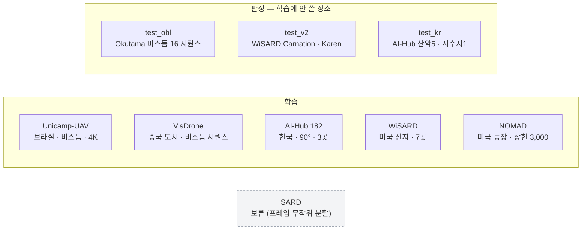
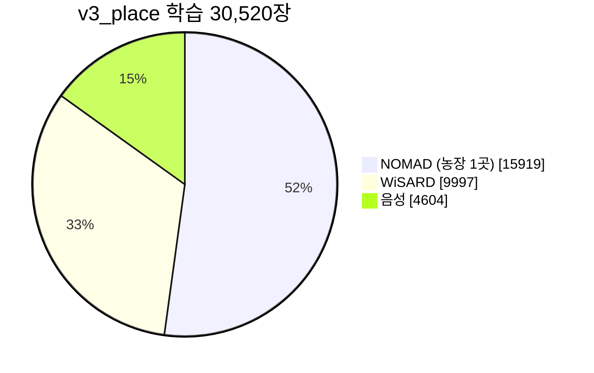

> [!summary] 7종 확보 · **학습(비스듬 / 수직)** 과 **판정(장소 분리)** 역할을 v6 기준으로 나눴다
> 원칙: 판정용 장소는 학습에 한 장도 넣지 않는다 · 원본·파생물은 git 에 올리지 않는다

## 역할 지도 (v6 · 60° 운용)

## 한 표

| 데이터 | 나라 · 지형 | 시점 | 고도 | 해상도 | 규모 | v6 역할 |
|---|---|---|---|---|---|---|
| [[Unicamp-UAV]] | 브라질 · 캠퍼스 | **정면 비스듬** | ≈30 m | 3840×2160 | 6,500장 · 58,555명 | 🟢 학습 (비스듬) |
| [[VisDrone]] | 중국 · 도시 | 비스듬 63 % | 다양 | 최대 2000×1500 | 비스듬 179 시퀀스 · 4,974장 | 🟢 학습 (비스듬 · 사람만) |
| [[AI-Hub 182 조난자 수색]] | **한국** · 저수지·평지·산악 · 겨울 | **90° 확정** | 10~40 m | 3840×2160 | 5곳 확보 | 🟢 학습 3곳 · 판정 2곳 |
| [[WiSARD]] | 미국 워싱턴주 · 산지 · 가을·겨울 | 섞임 (수직 67 %) | — | 1920×1080 ~ 4096×2160 | 9곳 · 39 비행 | 🟢 학습 7곳 · 판정 2곳 |
| [[NOMAD]] | 미국 · 농장 1곳 · 여름 | 수직~약간 | 거리 10~90 m | 5472×3078 | 배우 100명 | 🟡 학습 (상한 3,000) |
| [[Okutama-Action]] | 일본 · 공원 | 비스듬 66 % | 10~45 m | 3840×2160 → 1280×720 | 비스듬 16 시퀀스 27,612 프레임 | 🔵 **판정 전용** |
| [[SARD]] | 채석장·풀밭·숲·도로 | 수직 위주 | 약 20 m | 1920×1080 | 1,980장 (프레임 무작위 분할) | ⚪ 보류 |

## 지금 학습셋 (`v3_place`) 은 한쪽으로 쏠려 있다

- 양성의 **61 %** 가 NOMAD 한 장소 → 장소 일반화 실패의 1번 원인 → [[장소 일반화 - NFR-V03 0.22]]
- v6 목표: **비스듬 ≥50 %** · 장소당 상한 3,000 · 음성 5 %

## 원천별 시점 (박스 크기–y 상관으로 추정)

| 원천 | 사람 박스 | 비스듬 | 수직 | 태그 신뢰 |
|---|---:|---:|---:|---|
| Okutama | 1,049,298 | **65.7 %** | 34.3 % | ✅ |
| VisDrone | 144,607 | **63.2 %** | 36.8 % | 🟡 순위만 |
| AI-Hub 182 | 325,057 프레임 | 0 % | **100 %** | ✅ 파일명 확정 |
| WiSARD | 46,660 | 33.1 % | 66.9 % | 🟡 지형 경사 교란 |
| NOMAD | 43,487 | 44.9 % | 55.1 % | ❌ 잡음 |

→ 근거 [[마운트각 태그 검증 - Okutama]] · [[9.23 마운트각 태그 육안 검토]]

## 더 찾을 곳

- [[후보 - 비스듬 시점 데이터셋]] — Manipal-UAV (신청 대기 · 최대 6개월) · Archangel · HERIDAL
- **AI-Hub 190 (008.자율주행드론)** — 한국 · 카메라 25~90° (45° 2,116 · **60° 706** 파일) · 고도 20~100 m · 관광지·도심지·**산림지(울산 60 m 45°)** · 전체 **4.8 TB** (라벨 138 GB)
  - 09-25 목록 확인 · **다운로드는 홈페이지 신청·승인 필요** → 승인되면 `aihub190_dl.sh` 가 라벨(산림지 45° → 60° 387개 ≈ 32 GB)부터 자동으로 받는다
- [[검토 후 제외한 데이터셋]]
- 받는 법 → [[데이터 다운로드]]
