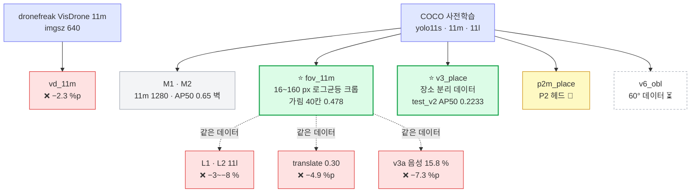
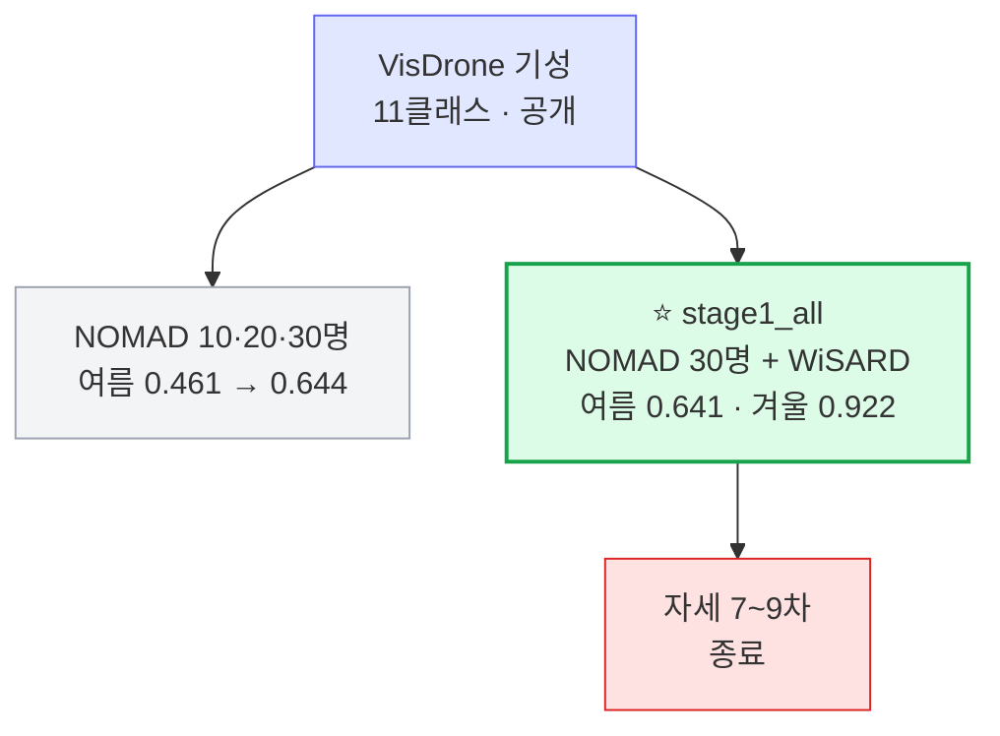

> [!summary] 어떤 가중치가 어디서 나왔나 — **서버 계보(현행)** 와 **노트북 계보(08월 · 보관)** 는 이어지지 않는다
> 캔버스 → [[가중치 계보.canvas|가중치 계보 캔버스]]

## 서버 계보 (COCO 에서 새로 출발 · 09-11~)

| 이름 | 날짜 | 모델 · 입력 | 바꾼 것 | val mAP50 | 판정 지표 | 판정 |
|---|---|---|---|---:|---|---|
| E1 | 09-11 | 11s · 960 | 첫 서버 학습 | 0.632 | — | 참고 |
| M1 · M2 | 09-12~15 | 11m · 1280 | + SARD (M2) | 0.651 · 0.645 | — | 0.65 벽 |
| fov_11s | 09-16 | 11s · 1280 | 크롭 16~160 px 로그균등 | 0.422 | — | 11m 에 밀림 |
| **fov_11m** | 09-16 | 11m · 1280 | 〃 | 0.478 | 가림 40칸 재현율 **0.478** | ⭐ 옛 기준선 |
| L1 · L2 | 09-18~20 | **11l** · 1280 | 모델 확대 · + AI-Hub | 0.473 · 0.479 | 상대 −3~−8 % · ±0 | ❌ |
| e1_translate30 | 09-21 | 11m | translate 0.30 | 0.460 | −4.9 %p | ❌ |
| v3a_11m_neg | 09-22 | 11m | 음성 15.8 % | 0.444 | −7.3 %p | ❌ |
| vd_11m | 09-22 | 11m | VisDrone 사전학습 출발 | 0.463 | −2.3 %p | ❌ |
| **v3_place** | 09-23 | 11m · 1280 | **장소 분리 데이터** | 0.440 | **test_v2 AP50 0.2233** | ⭐ 현 기준선 |
| p2m_place | 09-23~ | 11m-P2 · 1280 | P2 헤드 (stride 4) | 진행 중 | test_v2 | 🔄 |

- val mAP50 은 **장소가 섞인 크롭 val** — 실전 순위와 반대로 나온 적이 있다 ([[서버 L1 - yolo11l 1280]]). 판정은 오른쪽 열로 한다
- 결과 · 가중치 원본: `drone_yolo/runs_person/<이름>/` (git 밖 · 학습 끝나면 백업)

## 노트북 계보 (08월 · VisDrone 출발 · 보관)

- NOMAD 단계별 모델과 stage1_all 은 **서로 이어 학습한 것이 아니다** — 넷 모두 VisDrone 에서 따로 출발
- 겨울 0.922 는 같은 비행을 시간순으로 자른 평가 → [[겨울 0.922의 한계]]
- 자세 트랙 가중치 → `04 실험/자세 판별 (종료)/` · [[pose3_sn_freeze]]

## 연결

[[stage1_all]] · [[VisDrone 기성 모델]] · [[_실험 색인]] · [[서버 인계]]
