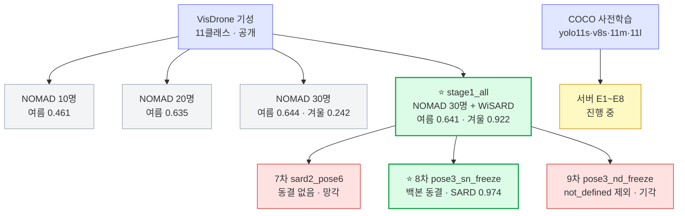

> [!summary] 어떤 가중치가 어디서 나왔나
> 그림 버전 → [[가중치 계보.canvas|가중치 계보 캔버스]]

> [!important] NOMAD 단계별 모델과 stage1_all 은 **서로 이어 학습한 것이 아니다**
> 넷 모두 VisDrone 에서 **각각 따로** 출발했다.

## 서버 학습본 (COCO 에서 새로 출발 · 2026-09-11~16)

노트북 계보와 **이어지지 않는다.** 모두 COCO 사전학습에서 따로 시작했고, 검증셋도 노트북과 다르다.

| 이름 | 모델 · 입력 | 데이터 (train/val) | 주요 설정 | 결과 (그 실행의 val) | 파일 |
|---|---|---|---|---|---|
| [[서버 E1~E8\|E1]] | yolo11s · 960 | `data_all` 18,937 / 4,968 | AutoBatch 13 · optimizer auto → MuSGD · 42에폭 조기종료 | AP50 0.632 (27에폭) | `weights/e1_11s_960.pt` |
| [[서버 M1 - yolo11m 1280\|M1]] | yolo11m · 1280 | 같음 | **batch 3** · 34에폭 · 시간 예산 8.5시간 | **AP50 0.651** (22에폭) · 도메인 전체 0.644 | `weights/m1_11m_1280.pt` |
| [[서버 M2 - yolo11m 1280 SARD\|M2]] | yolo11m · 1280 | + SARD train 1,386 | **batch 8** · 시간 제한 7.5시간 → 27에폭 | AP50 0.645 (22에폭) — M1 과 동률 | `weights/m2_11m_1280_sard.pt` |
| **fov_11s** | yolo11s · 1280 | `det_fov` 30,056 / 7,692 (**16~160 px 로그 균등**) | batch 16 · **SGD lr0 0.01** · scale 0.3 · 30에폭 | AP50 0.422 (25에폭) ※ val 이 달라 위와 비교 불가 | `weights/fov_11s_1280_all.pt` |
| **fov_11m** | yolo11m · 1280 | 같음 | batch 8 · 시간 제한 8시간 → 19에폭 | AP50 0.478 (10에폭) | `weights/fov_11m_1280_all.pt` |

- fov_* 는 **화각 × 고도 시험셋**으로 따로 평가한다 → [[화각·고도 비교 실험]] (작은 사람에서 M1 을 크게 앞선다)
- 학습 시간 실측 (완화 설정 250 W): 11s @1280 30k장 **13.3분/에폭** · 11m 26분/에폭 · 11m 20.3k장 16.7분/에폭

## 서버에 넘긴 파일

| 파일 | 크기 | 역할 |
|---|---:|---|
| `yolov8s_stage1_all.pt` | 64 MB | 탐지 최고 · 시작 가중치 |
| `yolov8s_pose3_sn_freeze.pt` | 21.5 MB | 보관 (자세 트랙 중단) |
| `yolov8s_pose3_nd_freeze.pt` | 21.5 MB | 9차 비교용 |
| `yolov8s_sard2_pose6.pt` | 21.5 MB | 7차 망각 대조군 |

서버는 이 파일들을 **참고용으로만** 두고 COCO 에서 새로 시작했다 → [[서버 E1~E8]]

## 연결

[[VisDrone 기성 모델]] · [[stage1_all]] · [[pose3_sn_freeze]] · [[서버 인계]]
