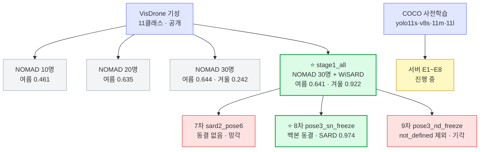

> [!summary] 어떤 가중치가 어디서 나왔나
> 그림 버전 → [[가중치 계보.canvas|가중치 계보 캔버스]]

> [!important] NOMAD 단계별 모델과 stage1_all 은 **서로 이어 학습한 것이 아니다**
> 넷 모두 VisDrone 에서 **각각 따로** 출발했다.

## 서버에 넘긴 파일

| 파일 | 크기 | 역할 |
|---|---:|---|
| `yolov8s_stage1_all.pt` | 64 MB | 탐지 최고 · 시작 가중치 |
| `yolov8s_pose3_sn_freeze.pt` | 21.5 MB | 보관 (자세 트랙 중단) |
| `yolov8s_pose3_nd_freeze.pt` | 21.5 MB | 9차 비교용 |
| `yolov8s_sard2_pose6.pt` | 21.5 MB | 7차 망각 대조군 |

서버는 이 파일들을 **참고용으로만** 두고 COCO 에서 새로 시작했다 → [[서버 E1~E8]]

## 연결

[[VisDrone 기성 모델]] · [[stage1_all]] · [[pose3_sn_freeze]] · [[서버 인계]]
