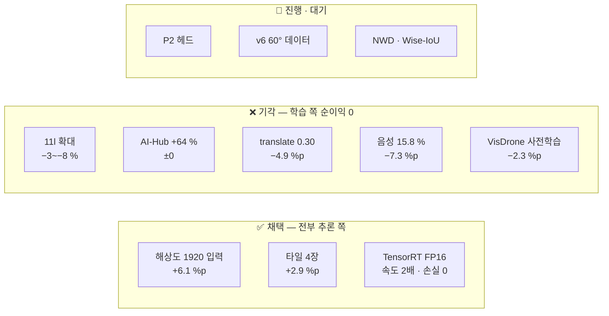

> [!summary] 실험 **28건** — 주제별 · 시간순
> 숫자 표기(%, %p, 지표 이름)는 [[수치 표기 규칙]] · 표로 비교 → [[실험 비교.base]]
> ⚠ **09-23 이전 탐지 수치는 장소가 섞인 평가**다 — 정직한 기준선은 [[서버 v3_place - 장소 분리 학습]] 부터

## 무엇이 먹혔나 (한 장)

# 주제별

## 장소 분리 이후 (09-22~) — 지금의 기준

| 실험 | 날짜 | 핵심 결과 |
|---|---|---|
| **[[서버 v6_obl - 60° 데이터]]** | 09-25 | ✅ **test_v2 0.2233 → 0.5287 · test_obl 0.1029 → 0.3311** — 데이터(장소·시점) 교체 |
| P2 헤드 `p2m_place` | 09-24 | ✅ test_v2 +4.6 %p (0.2697) · test_obl +2.8 %p |
| [[서버 v3_place - 장소 분리 학습]] | 09-23 | **test_v2 AP50 0.2233** — NFR-V03 첫 정직한 측정 (누수 모델은 0.856) |
| [[서버 D - VisDrone 항공 사전학습]] | 09-22 | ❌ −2.3 %p · 항공 사전학습 기각 |
| [[서버 v3a - 하드 네거티브 음성 보강]] | 09-22 | ❌ 오탐 −64 % · 재현율 −7.3 %p |
| [[마운트각 태그 검증 - Okutama]] | 09-23 | 비스듬 −4.2 %p (경계) · 태그는 Okutama 만 신뢰 → test_obl |

## 추론 방식

| 실험 | 날짜 | 핵심 결과 |
|---|---|---|
| [[타일 추론]] | 09-20 | 서 있는 38 px 재현율@0.15 **+2.9 %p** · 추론 방식이 아키텍처보다 큰 레버 |
| [[타일 가장자리 효과]] | 09-20~21 | 가장자리 −7.7 %p · translate 0.30 대응 **실패** → 타일 겹침에 맡김 |
| [[F2 임계값 탐색]] | 09-20 | F2 최대 conf 0.075~0.125 · 0.15 유지 (F2 차 ≤0.008) |
| [[GSD 정규화 - 추론 입력 크기 스윕]] | 09-19 | 업스케일 기각 · 1600 이 실용 최적 |

## 조건 비교 (하드웨어 선정용)

| 실험 | 날짜 | 핵심 결과 |
|---|---|---|
| [[화각·고도 비교 실험]] | 09-15 | 광각 손해는 서 있는 사람에게 크다 |
| [[예산안 화각 비교 - 1안 vs 2안]] | 09-17 | 재현율@0.15 75° > 90° ≈ 93° > 160° (지난 예산안 기준) |
| [[기체 흔들림 내성 - 모션 블러]] | 09-17 | 블러가 사람 긴 변의 6 % 넘으면 붕괴 → 셔터 1/1000 s |

## 서버 탐지 (장소 섞인 평가 · 참고)

| 실험 | 날짜 | 핵심 결과 |
|---|---|---|
| [[서버 E1~E8]] | 09-11 | E1 만 완주 |
| [[서버 M1 - yolo11m 1280]] | 09-12 | AP50 0.65 벽 |
| [[서버 M2 - yolo11m 1280 SARD]] | 09-15 | SARD 추가해도 0.65 |
| [[서버 L1 - yolo11l 1280]] | 09-18 | 모델 확대 → 운용 구간 재현율 상대 −3~−8 % |
| [[성능 개선 후보 - AP50 벽]] | 09-15 | 원인 분해와 후보 목록 |

## 노트북 탐지 (08월)

[[탐지 1 - NOMAD 배우 확장]] · [[탐지 2 - WiSARD 통합]] · [[탐지 3 - 임계값 조정]] · [[탐지 4 - 고도·해상도 평가]]

## 실영상 · 좌표

[[실영상 테스트]] · [[okutama_90 첫 판정]] · [[좌표 변환 정확도]] (시뮬레이터 0.50 m)

## 종료 · 보류

- **자세 판별 트랙 (종료)** — `자세 판별 (종료)/` : [[자세 1~6차 실패 기록]] · [[자세 7차 - SARD 6클래스]] · [[자세 8차 - 3클래스 동결]] · [[자세 9차 - not_defined 제외]] → [[결정 - 자세 판별 제외]]
- **보류** — [[Copy-Paste 준비]] → [[결정 - Copy-Paste 보류]]

# 시간순

| 날짜 | 실험 |
|---|---|
| 08-02~03 | 탐지 1~4 |
| 09-04~05 | 자세 6~9차 · Copy-Paste 준비 |
| 09-08 | 좌표 변환 정확도 |
| 09-11~12 | 서버 E1~E8 · M1 |
| 09-15 | M2 · 화각·고도 비교 · 성능 개선 후보 |
| 09-17 | 예산안 화각 비교 · 모션 블러 |
| 09-18~20 | L1 · L2 · okutama_90 · GSD 스윕 · 타일 추론 · F2 · TensorRT · 가장자리 |
| 09-21~22 | translate 0.30 · v3a 음성 · D 항공 사전학습 |
| **09-23** | **v3_place — NFR-V03 첫 측정** · 마운트각 태그 검증 · P2 시작 |
