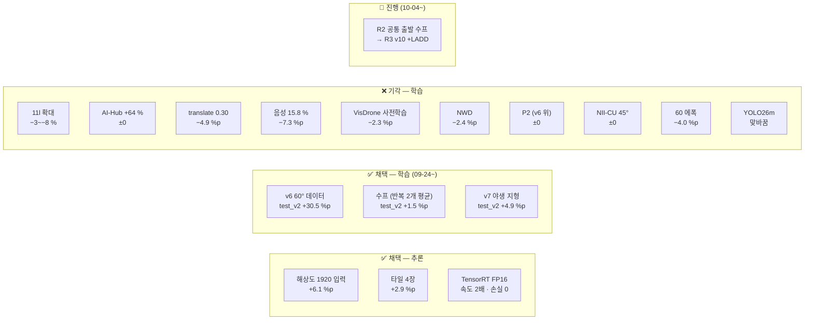

> [!summary] 실험 노트 **33건** — 주제별 · 시간순
> 숫자 표기(%, %p, 지표 이름)는 [[수치 표기 규칙]] · 표로 비교 → [[실험 비교.base]]
> ⚠ **09-23 이전 탐지 수치는 장소가 섞인 평가**다 — 정직한 기준선은 [[서버 v3_place - 장소 분리 학습]] 부터

## 무엇이 먹혔나 (한 장)

```mermaid
flowchart LR
    subgraph OK["✅ 채택 — 추론"]
        T1["해상도 1920 입력<br/>+6.1 %p"]
        T2["타일 4장<br/>+2.9 %p"]
        T3["TensorRT FP16<br/>속도 2배 · 손실 0"]
    end
    subgraph OK2["✅ 채택 — 학습 (09-24~)"]
        W1["v6 60° 데이터<br/>test_v2 +30.5 %p"]
        W2["수프 (반복 2개 평균)<br/>test_v2 +1.5 %p"]
        W3["v7 야생 지형<br/>test_v2 +4.9 %p"]
    end
    subgraph NG["❌ 기각 — 학습"]
        N1["11l 확대<br/>−3~−8 %"]
        N2["AI-Hub +64 %<br/>±0"]
        N3["translate 0.30<br/>−4.9 %p"]
        N4["음성 15.8 %<br/>−7.3 %p"]
        N5["VisDrone 사전학습<br/>−2.3 %p"]
        N6["NWD<br/>−2.4 %p"]
        N7["P2 (v6 위)<br/>±0"]
        N8["NII-CU 45°<br/>±0"]
        N9["60 에폭<br/>−4.0 %p"]
        N10["YOLO26m<br/>맞바꿈"]
    end
    subgraph RUN["🔄 진행 (10-04~)"]
        R1["R2 공통 출발 수프<br/>→ R3 v10 +LADD"]
    end
```

# 주제별

## 장소 분리 이후 (09-22~) — 지금의 기준

| 실험 | 날짜 | 핵심 결과 |
|---|---|---|
| **[[상태 판단 모델 비교 - Qwen3-VL · Clef · GPT-6 Luna]]** | 10-06 | 크롭 판단 누움 AUROC 우리 기하 0.968/1.000 > Clef-Flash 0.922/0.879 > Qwen3-VL 0.892/0.692 · 상태 JSON 판정 Clef-Flash 0.964 ≥ 규칙 0.946 > GPT-6 Luna 0.932 · Decisions API 403 |
| **R2 · R3 · R5 · R6** ([[_학습 큐]]) | 10-04~06 | ❌ 공통 출발 수프 obl −5.2 %p · v10 (+LADD) 수프 붕괴 (kr −6.2) · 중간발표 후보 없음 → soup_v7r2 유지 · ⚠ **목록 순서 섞기 = 같은 학습** (ultralytics 가 파일 이름순 정렬) · R6 중단 |
| **[[YOLO26m 탐지기 Q2 - 기각]]** | 10-04 | ❌ 수프 숲 +2.8 · 비스듬 −1.8 · 한국 −1.9 %p (셋 다 유의 · 맞바꿈) · 1회차 숲 +3.9 는 재현 안 됨 · 20.1 ms |
| **[[외부 평가셋 - LADD·AU-AIR·키프로스·UE level01]]** | 10-04 | LADD 재현율 0.71 (GPL-3.0 · 학습 가능) · AU-AIR 정답 박스 문제 · 도로 시설물 오탐 3.24 건/장 · 키프로스 15 px · UE 0.90 (박스 어긋남) |
| **[[추적 고치기 Q1 - 추적 문턱·ID 바뀜 끊기]]** | 10-03 | ✅ 추적 문턱 0.15 + ID 바뀜 끊기 + 자세 한 장 → 점수 누움 AUROC 0.78 → **0.95** (판정 영상 · 짝 +0.17 유의) · 잡힌 비율 +0.06 |
| **[[자세 판별 P0~P5 - C2A·상대 키·미세조정·파이프라인]]** | 10-03 | 추적 누적 ✅ · C2A 앉음 F1 −0.47 ❌ · 미세조정 AI-Hub 만 ↑ ❌ · 파이프라인 5초 중앙값 누움 0.98 → **0.80** (추적 ID 바뀜 66/70) |
| **[[움직임 보정 속도 - Okutama]]** | 09-30 | 드론 움직임 보정 전 이동/정지 AUROC 0.56 → **3초 창 0.93** · 비스듬 박스 모양 누움 0.98 · 낙상 0건 → [[06 요구조자 상태 인지 계획]] |
| **v9 — NOMAD 가림·누움·숨음** ([[9.29 60 에폭 기각과 v9]]) | 09-29 | soup_v9x2 test_obl **+2.7 %p** (유의) · test_v2 −2.0 · test_kr +0.7 (구분 안 됨) · 누움 재현율 0.33 → **0.50** · 가림 0.24 → 0.26 |
| **v7_e60 — 60 에폭** ([[9.29 60 에폭 기각과 v9]]) | 09-29 | ❌ val ↑ (0.441) 인데 **test_obl −4.0 %p** (유의) · test_v2 +1.6 (구분 안 됨) → 학습 길이 늘리기 기각 |
| **[[좌표 산정 GeoResolver - 평지 교차 검증]]** | 09-28 · 10-05 | ✅ 발끝 광선 × 지면 · 합성 60° 중앙 2.0 m · **팀 시뮬 SITL 비행 · 탐지 박스 안정 프레임 중앙 0.68 · P95 1.16 m** · 지형 교차 이분법 · 실비행 대기 |
| **v8 · v7 반복 · 수프** ([[_학습 큐]]) | 09-27 | ➖ NII-CU 추가(v8) 효과 없음 · ✅ **soup_v7r2 test_v2 0.5927 · test_obl 0.6331** (현재 최고) · v7↔v7_r2 test_obl 2.8 %p 흔들림 |
| **v7 — SARD · HERIDAL 추가** ([[_학습 큐]]) | 09-26 | ✅ **test_v2 0.5287 → 0.5777** (+4.9 %p · 반복 폭보다 큼) · test_obl 0.6311 · 다른 데이터 모델끼리 수프 ❌ (test_kr −44 %p) |
| **[[NWD·P2 효과 없음 - 원인 분석]]** | 09-26 | ❌ NWD −2.4 %p (확신도 부풀림) · P2 ±0 · **같은 설정 반복 흔들림 3.4 %p** · ✅ 수프 +1.6~2.2 %p |
| **[[서버 v6_obl - 60° 데이터]]** | 09-25 | ✅ **test_v2 0.2233 → 0.5287 · test_obl 0.1932 → 0.6187** — 데이터(장소·시점) 교체 |
| P2 헤드 `p2m_place` | 09-24 | ✅ 옛 데이터에선 test_v2 +4.6 %p · test_obl +5.3 %p — v6 데이터 위에선 ±0 (09-25) |
| [[서버 v3_place - 장소 분리 학습]] | 09-23 | **test_v2 AP50 0.2233** — NFR-V03 첫 정직한 측정 (누수 모델은 0.856) |
| [[서버 D - VisDrone 항공 사전학습]] | 09-22 | ❌ −2.3 %p · 항공 사전학습 기각 |
| [[서버 v3a - 하드 네거티브 음성 보강]] | 09-22 | ❌ 오탐 −64 % · 재현율 −7.3 %p |
| [[마운트각 태그 검증 - Okutama]] | 09-23 | 비스듬 −4.2 %p (경계) · 태그는 Okutama 만 신뢰 → test_obl |

## 추론 방식

| 실험 | 날짜 | 핵심 결과 |
|---|---|---|
| [[타일 추론]] | 09-20 | 서 있는 38 px 재현율@0.15 **+2.9 %p** · 추론 방식이 아키텍처보다 큰 레버 |
| [[타일 가장자리 효과]] | 09-20~21 | 가장자리 −7.7 %p · translate 0.30 대응 **실패** → 타일 겹침에 맡김 |
| [[F2 임계값 탐색]] | 09-20 | F2 최대 conf 0.075~0.125 · 0.15 유지 (F2 차 ≤0.008) |
| [[GSD 정규화 - 추론 입력 크기 스윕]] | 09-19 | 업스케일 기각 · 1600 이 실용 최적 |

## 조건 비교 (하드웨어 선정용)

| 실험 | 날짜 | 핵심 결과 |
|---|---|---|
| [[화각·고도 비교 실험]] | 09-15 | 광각 손해는 서 있는 사람에게 크다 |
| [[예산안 화각 비교 - 1안 vs 2안]] | 09-17 | 재현율@0.15 75° > 90° ≈ 93° > 160° (지난 예산안 기준) |
| [[기체 흔들림 내성 - 모션 블러]] | 09-17 | 블러가 사람 긴 변의 6 % 넘으면 붕괴 → 셔터 1/1000 s |

## 서버 탐지 (장소 섞인 평가 · 참고)

| 실험 | 날짜 | 핵심 결과 |
|---|---|---|
| [[서버 E1~E8]] | 09-11 | E1 만 완주 |
| [[서버 M1 - yolo11m 1280]] | 09-12 | AP50 0.65 벽 |
| [[서버 M2 - yolo11m 1280 SARD]] | 09-15 | SARD 추가해도 0.65 |
| [[서버 L1 - yolo11l 1280]] | 09-18 | 모델 확대 → 운용 구간 재현율 상대 −3~−8 % |
| [[성능 개선 후보 - AP50 벽]] | 09-15 | 원인 분해와 후보 목록 |

## 노트북 탐지 (08월)

[[탐지 1 - NOMAD 배우 확장]] · [[탐지 2 - WiSARD 통합]] · [[탐지 3 - 임계값 조정]] · [[탐지 4 - 고도·해상도 평가]]

## 실영상 · 좌표

[[실영상 테스트]] · [[okutama_90 첫 판정]] · [[좌표 변환 정확도]] (시뮬레이터 0.50 m)

## 종료 · 보류

- **자세 판별 트랙 (종료)** — `자세 판별 (종료)/` : [[자세 1~6차 실패 기록]] · [[자세 7차 - SARD 6클래스]] · [[자세 8차 - 3클래스 동결]] · [[자세 9차 - not_defined 제외]] → [[결정 - 자세 판별 제외]]
- **보류** — [[Copy-Paste 준비]] → [[결정 - Copy-Paste 보류]]

# 시간순

| 날짜 | 실험 |
|---|---|
| 08-02~03 | 탐지 1~4 |
| 09-04~05 | 자세 6~9차 · Copy-Paste 준비 |
| 09-08 | 좌표 변환 정확도 |
| 09-11~12 | 서버 E1~E8 · M1 |
| 09-15 | M2 · 화각·고도 비교 · 성능 개선 후보 |
| 09-17 | 예산안 화각 비교 · 모션 블러 |
| 09-18~20 | L1 · L2 · okutama_90 · GSD 스윕 · 타일 추론 · F2 · TensorRT · 가장자리 |
| 09-21~22 | translate 0.30 · v3a 음성 · D 항공 사전학습 |
| **09-23** | **v3_place — NFR-V03 첫 측정** · 마운트각 태그 검증 · P2 시작 |
| 09-24~25 | v6_obl (60° 데이터) · v6_p2m · test_obl 정답 중복 수정 |
| **09-26** | **NWD·P2 원인 분석 · 수프** |
| 09-27~28 | v8 · v7 반복 · 수프 확정 · GeoResolver · 관측 시간 |
| **09-29** | v7_e60 ❌ · v9 🔄 |
| **09-30** | 움직임 보정 속도 (Okutama) → 상태 인지 계획 |
| **10-03** | 자세 판별 P0~P5 · 파이프라인 ID 바뀜 진단 |
| **10-04** | YOLO26m ❌ · 외부 평가셋 (LADD · AU-AIR · 키프로스 · UE) |
