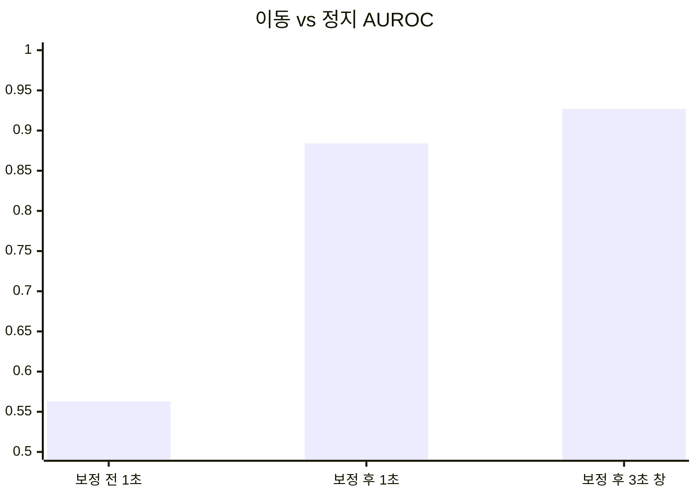

> [!summary] 드론 움직임을 빼면 "사람이 움직이는지" 를 잴 수 있다 — 빼지 않으면 못 잰다
> 9.30 발표 피드백 ① (속도 변화량으로 요구조자 판단) 의 전제 확인 → [[06 요구조자 상태 인지 계획]]
> `drone_yolo/okutama_motion.py` → `metrics/okutama_motion.json`

## 방법

- Okutama **정답 박스** 40편 · 1280×720 추출 프레임 · 1초 간격 쌍 1,688개 (정합 실패 27)
- 사람 박스를 가린 배경에서 ORB 특징 → RANSAC **호모그래피** = 드론 움직임
- 발끝점을 호모그래피로 옮긴 위치 ↔ 1초 뒤 실제 위치 = 사람 자신의 움직임 · **몸 높이(박스 높이)로 나눔**
- 3초 창 = 같은 자세로 이어진 1초 쌍 3개 평균

## 결과

| 자세 | 보정 전 p50 | 보정 후 p50 | 3초 창 p50 · p90 | n |
|---|---:|---:|---:|---:|
| 누움 | 1.43 | 0.16 | 0.19 · 0.38 | 274 |
| 앉음 | 1.00 | 0.13 | 0.14 · 0.35 | 1,364 |
| 서기 | 0.79 | 0.14 | 0.15 · 0.39 | 3,660 |
| 걷기 | 1.04 | 0.56 | 0.56 · 1.11 | 3,617 |
| 달리기 | 1.54 | 1.38 | 1.34 · 2.37 | 369 |

단위: 몸 높이/초

- 드론 움직임: 배경이 1초에 p50 **34 px** · p90 **178 px** (1280 기준)
- 3초 창 정지 임계: 0.20 → 정지 66 % · 이동 오인 4 % / **0.25 → 77 % · 7 %** / 0.30 → 84 % · 12 %

### 박스 모양 — 시점마다 쓸 단서가 다르다

| 시점 | 세로/가로 p50 (누움 · 앉음 · 서기) | 누움 vs 서기·걷기 AUROC | 길쭉함 (긴/짧은) AUROC |
|---|---|---:|---:|
| 비스듬 (25편 · 누움 264) | 0.56 · 1.32 · 1.91 | **0.98** (앉음 대비 0.93) | 0.47 |
| 수직 90° (15편 · 누움 90) | 2.11 · 0.97 · 0.93 | 0.23 (방향 따라 뒤집힘) | **0.81** |

- 비스듬: 누우면 **납작**해진다 · 수직: 누우면 **길쭉**해진다 (방향은 제각각)

### 낙상은 없다

- 누움 전환 23회 중 **21회가 "앉았다 눕기"** · 서기 → 누움 2회 · 전환 순간 박스 높이 변화 ×0.7~×1.8 (라벨 전환이 모양 변화와 안 맞음)
- → 낙상 판별은 공개 항공 데이터로 검증 불가 → UE 합성 · 자체 촬영 연출

## 해석

- 속도 판단은 **드론 움직임 보정이 전제** — 보정 없이는 누운 사람이 가장 "빠르다"
- 정지 사람도 0.14~0.19 몸높이/초 로 잡힌다 = 박스 흔들림 + 정합 오차 → **3초 이상 창**으로 본다
- 45° 마운트가 자세 판별에도 유리 — 수직 90° 에서는 모양 단서가 약해진다

## 한계

- **정답 박스** 기준 — 탐지 박스는 더 흔들린다 (다음: soup_v7r2 탐지 + 추적으로 다시)
- 일본 공원 한 곳 · 배우 소수 · 누운 방향 치우침 가능 · 행동은 대본 연기
- 몸 높이 정규화는 시점마다 뜻이 다르다 (비스듬은 키 · 수직은 몸 길이)

## 연결

[[06 요구조자 상태 인지 계획]] · [[Okutama-Action]] · [[쓰러짐 판별 도메인 이전 실패]] · [[관측 시간과 영상 수신 기준]]
