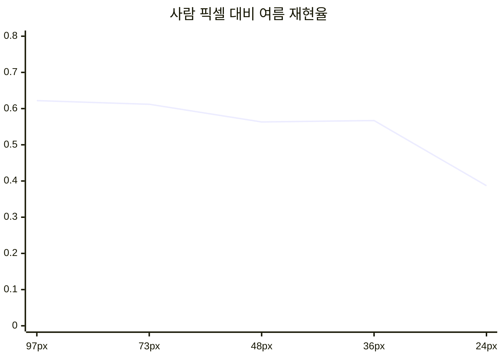

> [!summary] 성능은 서서히 떨어지지 않는다 — **절벽이 있다**
> [[stage1_all]] 입력 크기를 줄여 사람 픽셀을 인위로 줄였다 (`metrics/eval_scale.csv`)

| imgsz | 사람 px | 등가 고도* | 여름 AP50 (IoU 0.5) | 여름 재현율@0.15 | 겨울 AP50 |
|---:|---:|---:|---:|---:|---:|
| 1280 | 97 | 33 m | 0.575 | 0.622 | 0.836 |
| 960 | 73 | 44 m | 0.568 | 0.612 | 0.882 |
| 640 | 48 | 66 m | 0.520 | 0.563 | 0.862 |
| 480 | 36 | 88 m | 0.520 | 0.567 | 0.819 |
| **320** | **24** | **132 m** | **0.325** | **0.387** | 0.750 |

\* 사람 길이 1.7 m · HFOV 54° · 1920 px 기준

> [!warning] "등가 고도" 는 누운/비스듬한 사람 기준이다
> 하향 90° 에서 **서 있는 사람은 0.5 m** 라 같은 고도에서 훨씬 작다.
> 30 m 서 있는 사람 31 px → 이 표의 **절벽 근처**다 → [[운용 조건]]

NOMAD 거리별 **AP50**: 10 m 0.559 · 30 m 0.579 — 거리 자체는 큰 차이 없음.

## 연결

[[GSD와 화각]] · [[발표 피드백]] · [[요구명세서]]
