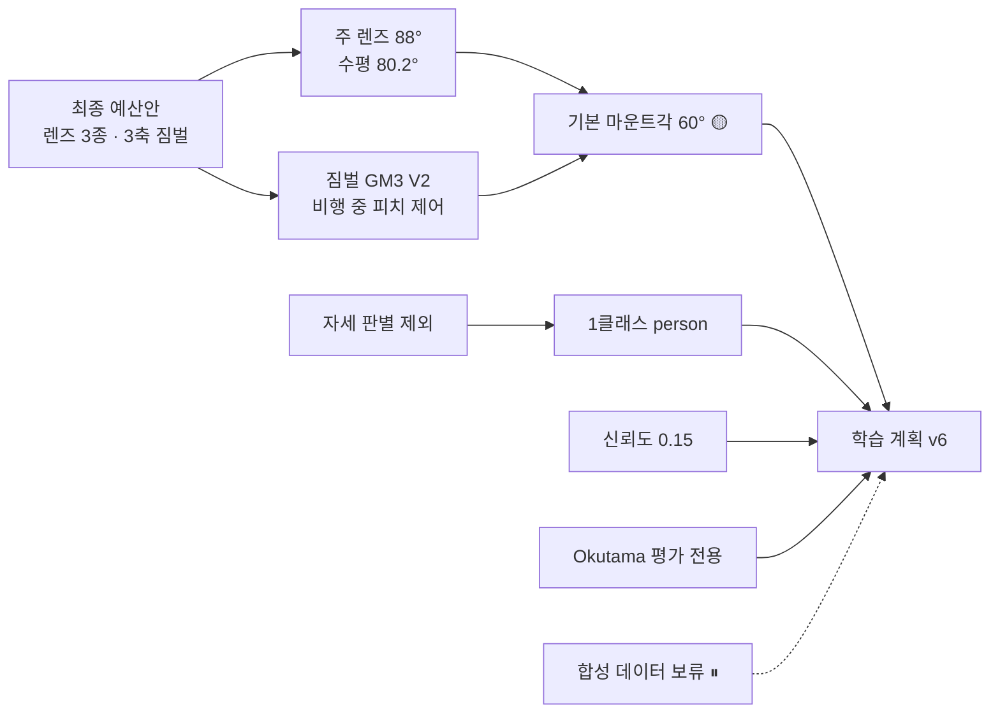

> [!summary] "왜 그렇게 정했나" — **지금 유효한 결정**과 **대체·종료된 결정**을 나눠 둔다

## 결정이 이어지는 모양

## 유효

| 결정 | 날짜 | 상태 | 한 줄 |
|---|---|---|---|
| [[결정 - 최종 예산안 (2026-09-23 계획서)]] | 09-23 | ✅ | 15품목 1,867,810원 · 렌즈 대각 62·78·88° · GM3 V2 |
| [[결정 - 기본 마운트각 60° (잠정)]] | 09-24 | 🟡 잠정 | 서 있는 사람 1.65배 · 좌표 4.7 m · 합성 데이터 보류 |
| [[결정 - 자세 판별 제외]] | 09-13 | ✅ | 도메인 이전 실패 (SARD 0.974 → Okutama 0.091) → 1클래스 |
| [[결정 - 신뢰도 0.15]] | 08-02 | ✅ | 놓친 조난자 > 헛탐지 |
| [[결정 - Okutama 평가 전용]] | 09-05 | ✅ | 정직한 잣대 — test_obl 의 근거 |
| [[결정 - Copy-Paste 보류]] | 09-05 | ⏸ | 인스턴스 은행 인물 다양성 부족 |
| [[결정 - GPU 완화 설정과 자동 복구]] | 09-14 | ✅ | Xid 79 대응 |
| [[결정 - 서버에서 데이터 새로 받기]] | 09-10 | ✅ | |
| [[결정 - 저장소 통합]] | 09-14 | ✅ | Capstone 단일 저장소 |

### 실험 노트 안에서 내린 결정

| 결정 | 근거 노트 |
|---|---|
| 타일 추론 채택 (4×1280×720 · 겹침 50 %) | [[타일 추론]] |
| TensorRT FP16 `imgsz=[736,1280]` | [[NFR-V01 추론 시간]] |
| fitness = mAP50-95 만 | [[fitness와 조기 종료]] |
| 셔터 1/1000 s 우선 | [[기체 흔들림 내성 - 모션 블러]] |
| 음성 5 % 로 제한 | [[서버 v3a - 하드 네거티브 음성 보강]] |

## 대체 · 종료 (`지난 결정/`)

| 결정 | 왜 끝났나 | 대신 |
|---|---|---|
| [[결정 - 하드웨어 예산안 합의 v4]] | 최종 예산안으로 대체 (렌즈 1개 → 3종) | [[결정 - 최종 예산안 (2026-09-23 계획서)]] |
| [[결정 - 3클래스 체계]] | 자세 판별 제외 | 1클래스 person |
| [[결정 - 백본 동결]] | 자세 판별 제외 | — |
| [[결정 - WiSARD 자세 학습 제외]] | 자세 판별 제외 | — |
| [[결정 - 전환 구간 15프레임]] | 자세 판별 제외 | — |

## 연결
[[00 홈]] · [[_실험 색인]] · [[타임라인]]
