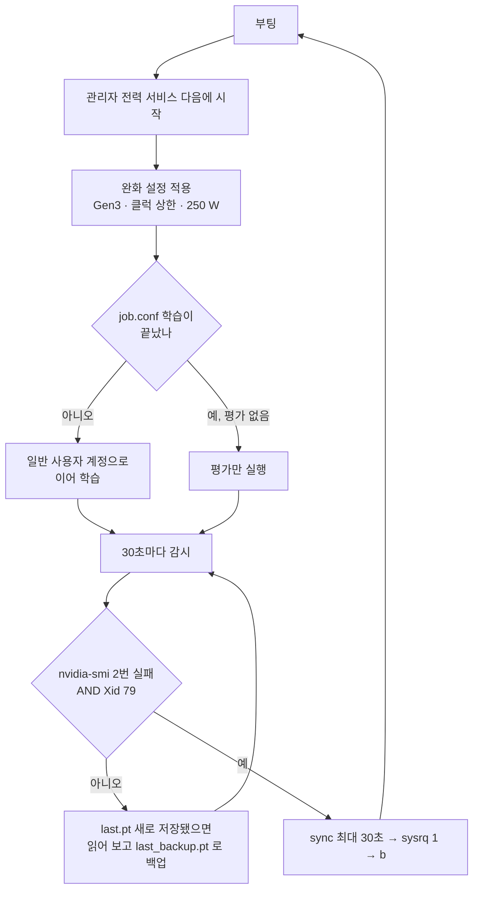

> [!check] 결정
> GPU 장애를 **막으려 하기보다, 죽어도 사람 없이 복구하고 이어 학습**한다.
> 완화 설정 3가지를 걸고, 자동 복구 서비스 **`gpu-autoheal`** 을 설치한다 (09-14 15:04).

## 왜

| 이유 | 근거 |
|---|---|
| 장애가 **무작위**다 | 부하 1분 ~ 3.6시간 · 250 W 에서도 났다 → [[GPU 장애 Xid 79]] |
| 하드웨어로는 못 고친다 | 관리자 답변 — 재부팅을 자동화할 것 |
| 사람이 매번 재시작하면 멈춰 있는 시간이 길다 | 밤중 장애 · 09-12 `shutdown` 으로 **이틀간 꺼짐** |
| 앞으로 긴 학습이 필요하다 | 최종 100 에폭 약 11~12시간 → 중간에 한 번 이상 죽는다고 봐야 한다 |

## 완화 설정

| 설정 | 명령 | 겨냥 |
|---|---|---|
| PCIe Gen3 고정 | `setpci` 로 상위 포트 목표 속도 변경 → 링크 재협상 | Gen4 신호 → [[PCIe 세대와 ASPM·AER]] |
| 코어 클럭 상한 | `nvidia-smi -lgc 300,1600` | 순간 피크 → [[전력 제한과 클럭 상한]] |
| 전력 제한 | `nvidia-smi -pl 250` | 평균 전력 |

## 자동 복구 서비스가 하는 일

## 안전장치

| 장치 | 막는 것 |
|---|---|
| `autoheal/ENABLED` 파일이 없으면 아무것도 안 한다 | 원할 때 끄기 |
| 2시간에 자동 재부팅 3번이면 멈추고 `HALTED` 를 남긴다 | 무한 재부팅 |
| Xid 79 없이 `nvidia-smi` 만 실패하면 재부팅 안 함 | 오판 |
| 재개 전 `last.pt` 검사 · 깨졌으면 `last_backup.pt` 로 복구 | 강제 재시작으로 깨진 체크포인트 → [[sysrq 강제 재시작]] |
| 학습 중에는 PCIe 링크 재협상 안 함 | 재협상 순간 GPU 소실 |
| `KillMode=process` | 서비스가 재시작돼도 학습은 살아 있다 |
| 학습 · 평가는 root 가 아닌 일반 계정으로 | 권한 사고 |

## 대안

| 대안 | 왜 아닌가 |
|---|---|
| 전력만 낮추기 | 250 W 에서 부하 1분 만에 장애 |
| 사람이 매번 재시작 | 밤중에 멈춘다 · 잘못 끄면 서버가 안 켜진다 |
| 짧은 실험만 돌리기 | 최종 100 에폭 학습을 못 한다 |

## 결과 (09-14)

- 완화 설정 뒤 M1 남은 20에폭과 평가를 **5시간 59분 동안 장애 없이** 마쳤다 (14:22 ~ 20:21)
- 그 전 4회는 부하 1분 ~ 3.6시간 안에 났다 → 완화 설정이 듣는다는 **강한 근거** → [[GPU 장애 Xid 79]]

## 아직 모르는 것

- 실제 장애로 자동 재부팅 → 이어 학습까지 도는지 **한 번도 확인 못 했다** (모의 실행 `--selftest` 는 통과)
- 완화 설정 셋 중 무엇이 효과인지

## 계획에 주는 영향

- 계획의 "학습은 tmux 에서" · `run_queue.sh` 는 재부팅되면 사라진다 → **재개 가능한 대기열 + 자동 복구**로 바꿔야 한다 (계획 수정은 결정 대기) → [[0 서버 학습 계획 한눈에]]
- 완화 설정으로 학습 속도가 350 W 대비 **약 17 %** 줄고 (7.7 → 6.4 it/s), 검증을 포함한 에폭 시간은 **약 14 %** 늘었다 (15.5 → 17.6분, M1 실측)
- 실험 1개(40 에폭) 추정 4.5~5시간은 속도 감소를 약 10 % 로 잡은 값이다 → 실측을 반영하면 **약 5시간 이상**으로 본다

> [!info] 원본
> `drone_yolo/autoheal/` (`gpu_autoheal.sh` · `gpu-autoheal.service` · `job.conf` · `install.sh`) · `drone_yolo/SERVER_PROGRESS.md` 7절

## 연결

[[GPU 장애 Xid 79]] · [[학과 서버]] · [[이어 학습과 AutoBatch]]
