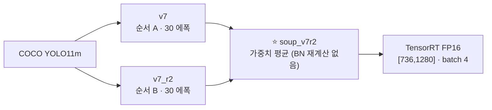

> [!summary] 설계명세서(9/30)에 넣는 비전 모델 = **`soup_v7r2`** — v7 설정으로 두 번 학습한 모델의 가중치 평균
> test_v2 **0.593** · test_obl **0.633** · test_kr **0.968** · **18.9 ms** · 임계값 **0.15**

## 무엇인가

| 항목 | 값 |
|---|---|
| 데이터 (v7) | 20,517장 — Unicamp-UAV · VisDrone 비스듬 + AI-Hub 182 · WiSARD · **SARD · HERIDAL** + 음성 · NOMAD 제외 |
| 설정 | `configs/hyp/v6_oblique.yaml` · imgsz 1280 · 30 에폭 · SGD 0.01 · val `val_v6b` |
| 파일 | `drone_yolo/runs_person/soup_v7r2/weights/best.pt` · 엔진 `best.engine` (3090 · GPU 마다 재빌드) |

## 수치 (장소 분리 · 95 % 블록 부트스트랩)

| 평가셋 | AP50 | 95 % 구간 | 재현율@0.15 | 정밀도@0.15 |
|---|---:|---|---:|---:|
| test_v2 (WiSARD 숲 · 미국) | **0.5927** | 0.525~0.664 | 0.682 | 0.683 |
| test_obl (Okutama 비스듬 · 일본) | **0.6331** | 0.582~0.690 | 0.689 | 0.707 |
| test_kr (AI-Hub 산악 · 한국) | **0.968** | 0.956~0.984 | 0.994 | 0.914 |

| NFR | 값 | 판정 |
|---|---|---|
| V01 추론 | 18.9 ms · P95 19.5 ms (`bench_trt.py`) | ✅ |
| V03 정확도 | 위 표 | ❌ (test_kr 만 ✅) |
| V05 임계값 | val F2 최대 0.779 @0.15 (= @0.2 · 재현율 우선) (`f2_tune.py`) | ✅ 0.15 유지 |
| V06 오탐 | 0.46 건/장 (test_v2 음성) | ✅ |

## 왜 이것인가 — 고른 과정

| 후보 | test_obl | test_v2 | test_kr | 왜 아닌가 |
|---|---:|---:|---:|---|
| v7 (단일) | 0.6311 | 0.5777 | 0.9663 | 수프가 test_v2 +1.5 %p (유의) |
| v8 (+ NII-CU) | 0.6245 | 0.5590 | 0.9711 | v7 대비 모두 구분 안 됨 |
| soup v7 + v7_r4 | 0.6394 | 0.5929 | 0.9694 | soup_v7r2 와 반복 폭 안 — 미리 정한 대로 먼저 확인된 쪽 |
| soup 3개 (v7 · r2 · r3) | 0.7162 | 0.5826 | **0.665** | BN 통계 어긋나 무너짐 |
| 〃 + BN 재계산 | 0.7008 | 0.5977 | 0.9445 | 박스가 넓어짐 (너비비 0.905 → 1.0) — Okutama 라벨 습관 이득 |
| soup 3개 (v7 · r2 · r4) | 0.6260 | 0.5856 | 0.9684 | 2개보다 낫지 않음 |

- 근거 노트 → [[NWD·P2 효과 없음 - 원인 분석]] · [[9.27 v8 판정과 반복 수프]] · [[9.28 최종 모델 확정]]

## 한계 — 설명할 때 같이 말한다

- NFR-V03 0.80 은 test_v2 · test_obl 에서 **미달** — 처음 보는 장소 · 숲 가림 · 누운/앉은 사람이 남은 격차
- test_obl 은 22 %p 가 **박스 모양 차이** (라벨 습관 · IoU 0.3 기준 0.845)
- test_kr 은 가림이 적어 쉬운 편 — 한국 지형 확인용
- 남은 레버 = **자체 촬영** (한국 산림 · 60° · 16~30 m) → [[05 실기체 적용 - 자체 촬영]]

## 연결
[[_결정 색인]] · [[NFR-V03 탐지 정확도]] · [[_학습 큐]] · [[가중치 계보]]
