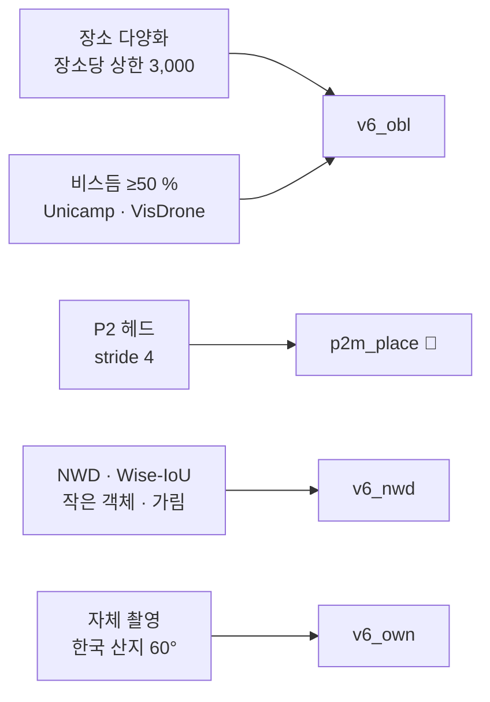

> [!danger] 같은 장소면 **0.86**, 처음 보는 장소면 **0.22** — 목표 0.80 까지 3.6배
> 모델이 "사람" 보다 **"그 장소의 사람"** 을 배웠다. 학습 데이터 장소가 적고 한쪽에 쏠려 있다.

![[fig_NFR-V03_장소일반화.svg]]

## 원인 분해

| 원인 | 근거 |
|---|---|
| 장소 수가 적다 | 학습 양성 = NOMAD **1곳** 61 % + WiSARD 몇 곳 — 미국 북서부 1~2 생태권 |
| 가림 | 같은 30 px 에서 열린 지형 0.855 vs 가림 지형 0.326 (**2.6배**) |
| 작은 사람 | 16~25 px 양성 앵커 5.86개 — 구조적으로 불리 → P2 헤드 |
| 시점 | 운용은 60° 비스듬인데 학습은 수직 위주 |

## 대응 — 기대값 순

| 레버 | 상태 |
|---|---|
| 장소 다양화 + 비스듬 데이터 | 계획 → [[02 학습 계획 v6 (60° 기준)]] |
| P2 헤드 | 학습 중 → [[_학습 큐]] |
| NWD · Wise-IoU | 코드 작성 대기 |
| 자체 촬영 | 첫 비행 후 → [[05 실기체 적용 - 자체 촬영]] |
| ~~모델 확대 · 항공 사전학습 · 음성 보강 · translate~~ | 실측 실패 → [[_실험 색인]] |

## 한계일 수 있는 것

- 심한 가림(수관 아래)은 **어떤 모델로도 안 보인다** — 층화 평가로 "개선 가능 / 한계" 를 가른다
- 0.80 은 가림 지형 문헌에서도 드문 수치 (HERIDAL 0.834 는 가림 없는 관목지대) → **운용 조건과 함께 재협의** 후보

## 연결
[[서버 v3_place - 장소 분리 학습]] · [[NFR-V03 탐지 정확도]] · [[9.23 전반 재검토]] · [[성능 개선 후보 - AP50 벽]]
