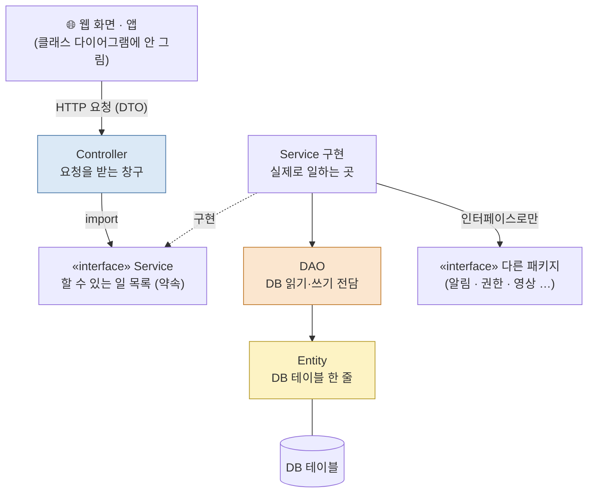
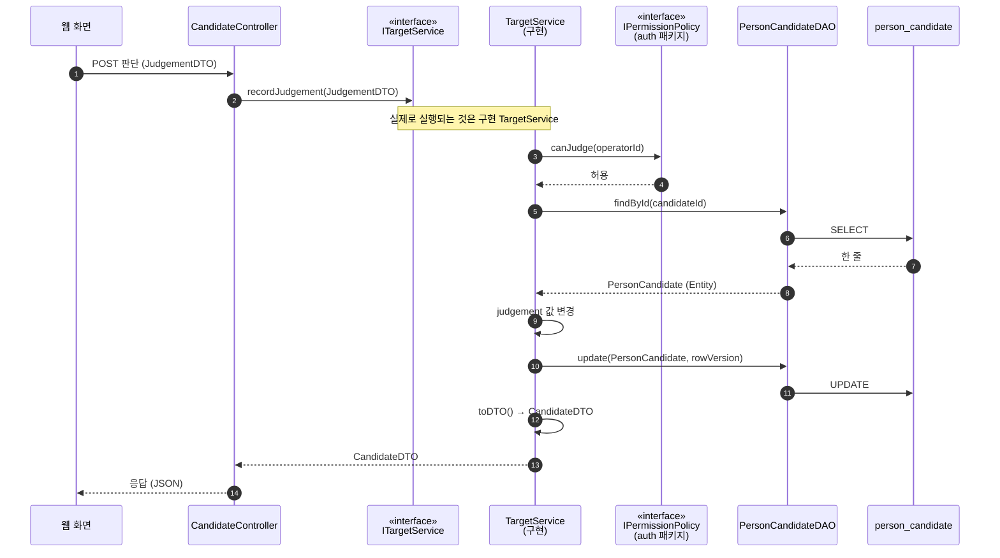
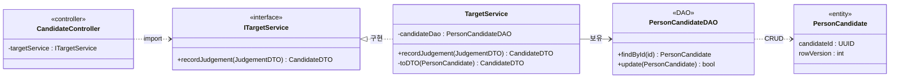

> [!abstract] 한 줄
> **요청은 Controller 가 받고 → 기능은 인터페이스로 약속하고 → 처리는 Service 가 하고 → DB 는 DAO 만 만지고 → 층 사이는 DTO 로 주고받는다.**
> 다른 담당 패키지와는 **인터페이스로만** 연결한다.
> 우리 SDD 그림 → `보고서/SDD_v1.5_클래스다이어그램/CD-07_1.png` (9.30 발표 피드백 2번 반영)

# 0. 한 장으로



| 층 | 식당 비유 | 하는 일 | **하면 안 되는 일** |
|---|---|---|---|
| **Controller** | 홀 직원 | 요청 받기 · 입력 형식 확인 · 결과 돌려주기 | 계산 · 판단 · DB 접근 |
| **Service 인터페이스** | 메뉴판 | "이런 기능이 있다" — 이름 · 입력 · 출력만 | 구현 코드 |
| **Service 구현** | 주방장 | 업무 규칙 · 여러 DAO 조합 · 다른 패키지 호출 | 웹 요청 형식(HTTP) 알기 |
| **DAO** | 창고 관리인 | 넣기 · 찾기 · 고치기 · 지우기 (CRUD) | 업무 판단 |
| **Entity** | 창고 선반 칸 | DB 테이블 한 줄을 그대로 담음 | 화면까지 나가기 |
| **DTO** | 주문서 · 완성 접시 | 층과 층 사이를 오가는 **데이터 묶음** | 기능 (메소드 거의 없음) |

# 1. 왜 나누나 — 한 함수에 다 넣으면

```python
# ❌ 나누지 않은 코드 — 웹 · 판단 · SQL 이 한 곳에
@app.post("/candidates/{cid}/judgement")
def judge(cid, body: dict):
    row = db.execute("SELECT * FROM person_candidate WHERE candidate_id=%s", cid).one()
    if body["user"] not in ADMINS: return {"error": "권한 없음"}
    db.execute("UPDATE person_candidate SET judgement=%s WHERE candidate_id=%s", body["decision"], cid)
    send_alert(...)
    return dict(row)          # DB 내부 칸까지 그대로 화면으로 나간다
```

| 문제 | 나누면 |
|---|---|
| 테이블 이름이 바뀌면 SQL 이 있는 **모든 함수**를 찾아 고친다 | DAO 하나만 고친다 |
| 웹 없이 판단 규칙만 시험할 수 없다 | Service 만 따로 시험 (DAO 는 가짜로 바꿔 끼움) |
| DB 관리용 칸(`row_version`)까지 화면에 샌다 | DTO 에 필요한 것만 담는다 |
| 알림 담당이 함수 이름을 바꾸면 여기가 깨진다 | 인터페이스(약속)만 지키면 안 깨진다 |
| 누가 어디를 고쳐야 하는지 불분명 | 층 = 폴더 = 담당이 분명 |

# 2. 용어 하나씩

### 클래스 · 객체
- **클래스** = 설계도 (붕어빵 틀) · **객체** = 설계도로 만든 실물 (붕어빵)
- `PersonCandidateDAO` 는 클래스, 서버가 실행 중에 만든 `dao = PersonCandidateDAO(conn)` 은 객체

### 패키지
- **관련 클래스를 묶은 폴더** — 클래스 다이어그램의 "틀(tab 달린 사각형)"
- 교수님: "클래스 다이어그램은 소스·클래스 **파일의 구성**을 나타내는 것" → 패키지 = 폴더 · 클래스 = 파일

```
services/vision/
├── controller/  candidate_controller.py
├── service/     target_service.py          ← 인터페이스 ITargetService
├── service/impl/target_service_impl.py     ← 구현 TargetService
├── dao/         person_candidate_dao.py
├── entity/      person_candidate.py
└── dto/         candidate_dto.py · judgement_dto.py
```

### 인터페이스 (interface)
- **"이 기능들을 제공한다"는 약속** — 이름 · 입력 · 출력만 있고 내용은 없다
- 구현 클래스가 그 약속을 지킨다 (UML: 점선 + 빈 삼각형 `◁┄`)
- 쓰는 쪽은 **인터페이스만 안다** → 구현을 바꿔 끼워도 쓰는 쪽은 그대로

| 바꿔 끼우기 예 (우리 프로젝트) | 인터페이스 | 구현 A | 구현 B |
|---|---|---|---|
| 탐지 엔진 | `IPersonDetectionService` | TensorRT (운용 서버) | PyTorch (노트북 · 시험) |
| 판정 정책 | `JudgePolicy` | 규칙 판정 | Jev · 로컬 모델 |
| 저장소 | `PersonCandidateDAO` 를 쓰는 Service | PostgreSQL | 메모리 가짜 (단위 시험) |

### Controller
- **바깥(웹)에서 들어오는 요청의 입구** — FastAPI 라우터 함수가 여기
- 하는 일: URL · 입력 형식 확인 → Service 인터페이스 호출 → 결과 DTO 를 응답으로
- ⚠ 교수님 지적: **"HTTP 를 관계(화살표)로 그리지 마라"** — 웹 통신은 클래스끼리의 관계가 아니다. 입구는 Controller 클래스 하나로 표현

### Service
- **업무 규칙이 사는 곳** — "판단을 기록하려면 권한 확인 → 후보 꺼내기 → 값 바꾸기 → 저장 → 알림"
- 인터페이스(`ITargetService`) + 구현(`TargetService`) 두 개로 나눈다 — 교수님: "Service 는 **확장 가능성**이 있으니 interface"
- 여러 DAO 를 조합하고, 다른 패키지는 **그 패키지의 인터페이스**로 부른다

### DAO (Data Access Object)
- **DB 와 대화하는 유일한 클래스** — SQL 은 여기에만 있다
- 테이블 하나당 DAO 하나가 기본 (`person_candidate` ↔ `PersonCandidateDAO`)
- 연산은 거의 정해져 있다: `insert` · `findById` · `findBy…` · `update` · `delete`
- 교수님: "**entity 관련된 건 DAO 가 있어야 함** · Entity → DB"
- 비슷한 이름: **Repository** (팀 문서의 `MissionRepository` 등) — 역할은 같다. 우리 문서는 교수님 표현대로 **DAO** 로 통일

### Entity
- **DB 테이블 한 줄을 그대로 옮긴 객체** — 칸 이름 · 타입이 테이블과 1:1
- `PersonCandidate` ↔ `person_candidate` (DB-14) · PK · FK 표시
- Service 안에서만 쓰고 **바깥으로 내보내지 않는다** (→ DTO 로 바꿔서)

### DTO (Data Transfer Object)
- **층 사이를 오가는 데이터 묶음** — 기능 없이 값만
- 요청용(`JudgementDTO` — 운영자가 보낸 판단) · 응답용(`CandidateDTO` — 화면에 보여줄 것)
- 교수님: "**DTO 에 관한 패키지를 만들고**"

# 3. DTO 와 Entity — 제일 헷갈리는 둘

| | Entity | DTO |
|---|---|---|
| 모양의 기준 | **DB 테이블** | **화면 · 요청이 필요한 것** |
| 예 | `PersonCandidate` (19칸 · `row_version` · `geo_reason` …) | `CandidateDTO` (화면에 필요한 8칸) |
| 어디서 쓰나 | DAO ↔ Service | Controller ↔ Service · 패키지 ↔ 패키지 |
| 바뀌는 이유 | 테이블 구조가 바뀔 때 | 화면 · API 가 바뀔 때 |
| 변환 | Service 의 `toDTO()` · `toEntity()` | |

> 한 줄: **Entity 는 창고 기준, DTO 는 손님 기준.** 둘을 나눠 두면 창고 선반을 바꿔도 접시는 그대로다.

# 4. 요청 하나 따라가기 — "이 후보는 사람 맞음" 버튼



- 화살표가 **위 → 아래 한 방향**으로만 흐른다 (Controller 가 DAO 를 건너뛰지 않는다)
- Entity 는 ⑧~⑫ 동안 Service 안에만 있다 · 밖으로 나간 것은 DTO 뿐

# 5. 코드로 보면 (Python · FastAPI)

```python
# dto/judgement_dto.py · dto/candidate_dto.py  ── 값만 있는 묶음
@dataclass
class JudgementDTO:
    candidate_id: UUID
    decision: str            # PERSON | NOT_PERSON | UNSURE
    note: str
    operator_id: UUID

@dataclass
class CandidateDTO:
    candidate_id: UUID
    geo_status: str          # VALID | PENDING | INVALID
    position: tuple | None
    judgement: str
    color_top2: list[str]

# entity/person_candidate.py  ── DB 테이블 한 줄 그대로
@dataclass
class PersonCandidate:
    candidate_id: UUID       # PK
    mission_id: UUID         # FK → mission
    latest_position: tuple | None
    geo_status: str
    geo_reason: str | None
    judgement: dict          # JSON
    row_version: int         # 동시 수정 방지용 — 화면엔 안 나감

# dao/person_candidate_dao.py  ── SQL 은 여기에만
class PersonCandidateDAO:
    def __init__(self, conn): self.conn = conn
    def find_by_id(self, cid) -> PersonCandidate | None:
        row = self.conn.execute("SELECT * FROM person_candidate WHERE candidate_id=%s", (cid,)).fetchone()
        return PersonCandidate(**row) if row else None
    def update(self, c: PersonCandidate) -> bool:
        n = self.conn.execute("UPDATE person_candidate SET judgement=%s, row_version=row_version+1 "
                              "WHERE candidate_id=%s AND row_version=%s",
                              (json.dumps(c.judgement), c.candidate_id, c.row_version)).rowcount
        return n == 1

# service/target_service.py  ── 인터페이스 (약속)
class ITargetService(ABC):
    @abstractmethod
    def record_judgement(self, dto: JudgementDTO) -> CandidateDTO: ...

# service/impl/target_service_impl.py  ── 구현 (업무 규칙)
class TargetService(ITargetService):
    def __init__(self, dao: PersonCandidateDAO, permission: IPermissionPolicy):   # 인터페이스를 받는다
        self.dao, self.permission = dao, permission
    def record_judgement(self, dto):
        if not self.permission.can_judge(dto.operator_id):
            raise PermissionError("판단 권한 없음")
        c = self.dao.find_by_id(dto.candidate_id)
        c.judgement = {"decision": dto.decision, "note": dto.note, "by": str(dto.operator_id)}
        if not self.dao.update(c):
            raise ConflictError("다른 사람이 먼저 수정")
        return self._to_dto(c)
    def _to_dto(self, c) -> CandidateDTO:                 # Entity → DTO
        return CandidateDTO(c.candidate_id, c.geo_status, c.latest_position,
                            c.judgement.get("decision", ""), c.judgement.get("color_top2", []))

# controller/candidate_controller.py  ── 입구
router = APIRouter()
@router.post("/candidates/{cid}/judgement")
def post_judgement(cid: UUID, body: JudgementDTO, svc: ITargetService = Depends(get_target_service)):
    return svc.record_judgement(body)          # Controller 는 인터페이스만 안다
```

- `TargetService` 는 `PermissionPolicy` **구현 클래스**를 모른다 — `IPermissionPolicy` 만 받는다 → 권한 담당이 내부를 바꿔도 이 파일은 그대로
- 시험할 때는 `FakeDAO` · `AllowAllPermission` 을 넣어 **DB 없이** Service 만 돌릴 수 있다 (← 인터페이스의 실제 이득)

# 6. 클래스 다이어그램 읽는 법



| 표기 | 뜻 |
|---|---|
| `-` 속성 · 연산 | 클래스 안에서만 씀 (private) |
| `+` 연산 | 밖에서 부를 수 있음 (public) |
| `«interface»` · `«DAO»` · `«entity»` · `«DTO»` · `«controller»` | 스테레오타입 — 이 클래스의 **역할** 표시 |
| `◁┄` 점선 + 빈 삼각형 | **구현(실현)** — 인터페이스의 약속을 지킨다 |
| `┄>` 점선 + 열린 화살표 | **의존 · import** — 잠깐 가져다 쓴다 |
| `→` 실선 화살표 | **연관 · 보유** — 속성으로 들고 있다 |
| `◆—` 검은 마름모 | **구성** — 주인이 없어지면 같이 없어진다 (`PersonDetectionService ◆— TileSplitter`) |
| 점선 박스 (우리 그림) | 다른 그림 · 다른 담당 패키지에 정의된 클래스 |

# 7. 우리 SDD 그림과 대응

| 그림 (v1.5) | 무엇을 보면 되나 |
|---|---|
| **CD-07 (1/2) 후보 관리** | 이 노트 전체가 그대로 들어 있는 **대표 그림** — Controller → 인터페이스 ← 구현 → DAO 3개 → Entity 3개 (DB-14 · 15 · 10) · DTO 4개 |
| CD-06 영상·저장 | 같은 구조를 media 패키지에 — `IFrameSource` 는 **비전이 쓰라고 media 가 내놓은 인터페이스** |
| CD-07 (2/2) | 인터페이스 3개 ↔ 구현 3개 · 다른 패키지(`IViewpointPlanner` · `ICommandService`)는 인터페이스로만 |
| CD-15 (1/3~3/3) | Service 안에서 일을 나눠 맡는 부품 클래스 (타일 · 탐지 · 병합 · 좌표 · 색상) |
| CD-17 | 오프라인 학습 도구 → `IModelRegistry` → `ModelConfigDAO` → `config_version` |

# 8. 흔한 실수 — 그리기 전에 확인

- [ ] 웹 ↔ 서버 **HTTP 를 화살표로** 그렸다 → Controller 클래스로 대체
- [ ] Controller 가 **DAO 를 직접** 부른다 → 반드시 Service 를 거친다
- [ ] Controller 가 **구현 클래스**(`TargetService`)를 import → 인터페이스(`ITargetService`)를 import
- [ ] Service 가 **SQL 을 직접** 쓴다 → DAO 로 옮긴다
- [ ] **Entity 를 그대로 응답** → `toDTO()` 로 바꿔서
- [ ] 다른 담당 패키지의 **구현 클래스**를 직접 부른다 → 그 패키지의 인터페이스로
- [ ] DB 테이블은 있는데 **Entity · DAO 가 없다** (교수님: "entity 관련된 건 DAO 가 있어야 함")
- [ ] DTO 가 여기저기 흩어져 있다 → `dto` 패키지 하나로

# 9. 원칙 이름 (발표 · 질문 대비)

| 원칙 | 한 줄 | 우리 설계에서 |
|---|---|---|
| **관심사 분리** (계층 구조) | 층마다 한 가지 관심사만 | 웹 · 업무 · DB 를 Controller · Service · DAO 로 |
| **단일 책임** (SRP) | 클래스가 바뀌는 이유는 하나 | DAO 는 테이블이 바뀔 때만, DTO 는 화면이 바뀔 때만 |
| **의존성 역전** (DIP) | 구체 클래스가 아니라 **추상(인터페이스)에 의존** | `TargetService` 가 `IPermissionPolicy` 에 의존 |
| **개방-폐쇄** (OCP) | 확장엔 열려 있고 수정엔 닫혀 있다 | 판정 정책 추가 = `JudgePolicy` 구현 하나 추가 · 기존 코드 수정 없음 |

# 10. 1분 점검

> [!question]- Q1. 운영자 화면에 `row_version` 이 보이면 어디가 잘못됐나?
> Entity 를 그대로 응답했다 → Service 에서 `toDTO()` 로 화면용 DTO 를 만들어야 한다

> [!question]- Q2. 테이블 이름이 `person_candidate` → `candidate` 로 바뀌면 어디를 고치나?
> `PersonCandidateDAO` (SQL) 와 `PersonCandidate` (Entity) 만. Controller · Service · DTO 는 그대로

> [!question]- Q3. 알림 담당이 `AlertService` 를 `AlertManager` 로 바꿨다. 비전 코드는?
> 비전은 `IAlertService` 인터페이스만 쓰므로 그대로 — 알림 담당이 새 클래스가 `IAlertService` 를 구현하게 하면 끝

> [!question]- Q4. DB 없이 판단 기록 규칙만 시험하고 싶다
> `TargetService(FakeDAO(), AllowAllPermission())` — 인터페이스 자리에 가짜 구현을 넣는다

> [!question]- Q5. DTO 와 Entity 를 그냥 하나로 쓰면 안 되나?
> 작은 프로그램은 되지만, 화면이 바뀌면 DB 가 흔들리고 DB 가 바뀌면 화면이 깨진다. 담당이 셋으로 나뉜 우리 팀은 나눠 두는 쪽이 안전하다

## 연결
[[07 객체지향 설계 v2 - 상태 인지 반영]] (상태 인지 클래스 · Strategy) · `보고서/SDD_v1.5_클래스다이어그램/README.md` (그림 규칙 · 새 클래스 번호)
