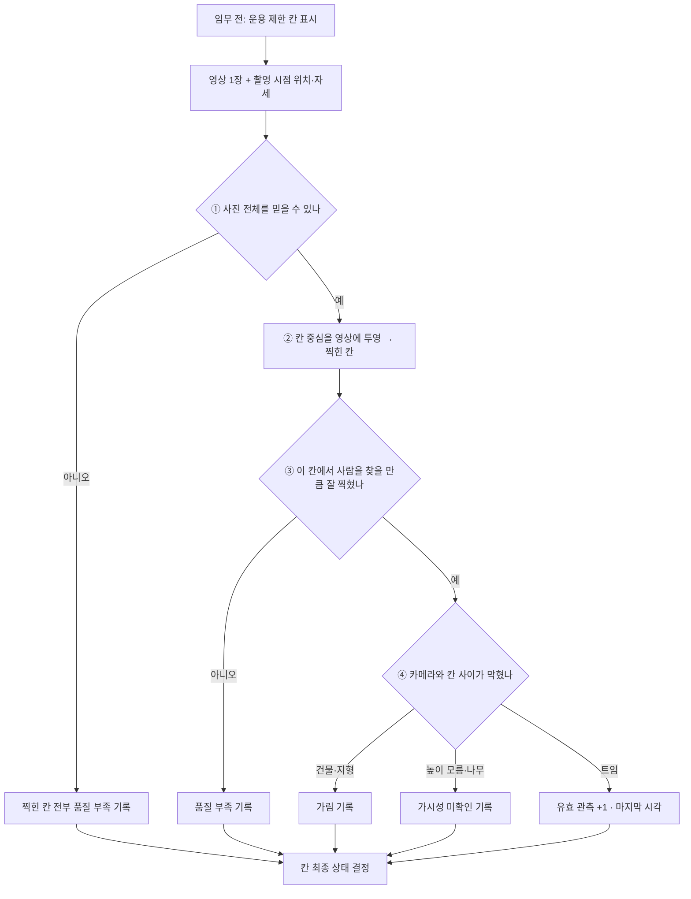

> [!abstract] 한 줄
> 지도를 **5 m 칸**으로 나누고, 영상 한 장이 들어올 때마다 칸마다 **① 사진 신뢰 → ② 찍힌 칸 → ③ 칸 품질 → ④ 가림** 을 검사해 기록을 쌓는다.
> 쌓인 기록으로 칸을 **미관측 · 유효 관측 · 품질 부족 · 가림·가시성 미확인 · 운용 제한** 중 하나로 표시한다.

> [!info] 이 이름 그대로의 표준 알고리즘은 없다
> 부분마다 오래 쓰인 기법(점유 격자 · 카메라 투영 · 가시권 분석 · 수색 이론)이 있고, 이 노트는 그것들을 요구명세서 3.3 나. 의 상태 5종에 맞게 이어 붙인 **우리 설계**다 → 6절

## 전체 흐름



## 0. 준비 — 칸과 칸별 기록

| 항목 | 값 |
|---|---|
| 칸 크기 | **5 m × 5 m** — GPS 오차가 수 m 라 더 잘게 나눠도 의미 없음 |
| 칸마다 저장 | `유효 관측 횟수` · `마지막 유효 시각` · `품질 부족 횟수` · `가림 횟수` · `미확인 횟수` · `운용 제한 여부` · `지형 높이` |
| 규모 | 500 × 500 m 구역 = 1만 칸 — numpy 배열로 충분 |

## 1. 운용 제한 — 임무 전에 정한다

| 근거 | 방법 |
|---|---|
| 비행 금지·임무 제외 구역 | 폴리곤 안의 칸 표시 |
| 비행 고도보다 높은 건물·지형 | VWorld 건물 높이 · DEM 과 비교 |
| 비행 중 갈 수 없는 곳 | 탐색 계획의 "경로 없음", 구역·고도 제한(EX-09) 발생 시 추가 |

**영상과 무관하게 정해지는 유일한 상태**다.

## 2. 영상 한 장마다

### ① 사진 전체 검사 — 이 사진을 믿을 수 있나
실패하면 찍힌 칸 전부를 **품질 부족**으로 기록한다.

| 검사 | 기준 (초안) | 근거 |
|---|---|---|
| 촬영 시각 ↔ 자세·위치 시각 대응 | 차이 약 100 ms 이하 | UC-0602 · EX-10 |
| 기체 기울기 | ≤ 6° | NFR-V04 |
| 자세 변화 | ≤ 1.5° | NFR-V04 |
| GPS·고도 유효 | 비행제어기 유효 플래그 | EX-13 |
| 흐림 | 라플라시안 분산 기준 이상 | 흔들림·초점 |

> [!warning] 위치·자세 자체가 무효이면 **어느 칸이 찍혔는지 알 수 없다** → 아무 칸에도 기록하지 않는다.

### ② 찍힌 칸 찾기 — 칸 → 영상 방향 투영
기체 주변 칸의 **중심점(위도·경도·지형 높이)을 카메라 모델로 영상에 투영**한다.

- 투영점이 영상 안이면 이번 사진에 찍힌 칸 (가장자리 3~5% 는 왜곡이 커서 제외)
- 쓰는 값: 촬영 시점 위치·고도·roll·pitch·yaw, **마운트각**, **수평 화각 54°**, 렌즈 왜곡 계수
- 사진 네 모서리를 땅에 찍는 방식보다 **경사지(DEM)·기울어진 마운트**를 다루기 쉽다
- 좌표 변환(UC-0704)과 **같은 카메라 식**을 반대 방향으로 쓴다

> 고도 30 m 하향 → 사진 한 장이 땅 약 **30.6 × 17.2 m** = 5 m 칸으로 약 6 × 3 칸 → [[GSD와 화각]]

### ③ 칸별 품질 검사 — 사람을 찾을 만큼 잘 찍혔나
실패하면 **품질 부족**.

| 검사 | 계산 | 기준 (초안) |
|---|---|---|
| 해상도 | 칸까지 거리 R, 내려다보는 각 φ → 가로 GSD ≈ R / f, 진행 방향 GSD ≈ R / (f · sin φ) | 모델 입력 1280 기준 **서 있는 사람 약 20 px 이상** |
| 시선 각도 | φ | 너무 비스듬하면(예: 30° 미만) 제외 |
| 칸 부분 영상 | 투영 위치 주변 조각의 흐림 · 노출 과다(포화 픽셀 비율) | 흐림·포화 기준 |

- 하향 90° 는 해상도가 **고도**로 거의 정해진다
- 마운트 45~60° 는 **화면 먼 쪽 칸**이 여기서 걸린다 → [[마운트각과 화면 기하]]

### ④ 칸별 가림 검사 — 카메라와 칸 사이가 막혔나
**카메라 → 칸 중심 광선**을 따라 높이를 비교한다.

| 원인 | 자료 | 판정 |
|---|---|---|
| 건물 | VWorld 건물 윤곽 + **높이** | 광선 높이 < 건물 높이인 지점이 있으면 **가림** |
| 지형 (능선·언덕) | DEM | 광선이 지형보다 낮아지면 **가림** |
| 높이 모르는 건물 | 높이 속성 없음 | **가시성 미확인** |
| 나무 수관 | 산림 지도(임상도) 또는 영상 초록 비율(식생 지수) | 수관 아래는 볼 수 없음 → **가시성 미확인** |

모두 통과하면 **유효 관측**: 횟수 +1, 마지막 유효 시각 갱신.

> [!note] 2.5차원 상황지도가 필요한 이유
> 이 광선 계산에 **건물·지형 높이**가 들어간다 → [[상황지도와 기본 지도]]

## 3. 칸 최종 상태

```python
for frame in frames:
    if not pose_valid(frame):                    # 어느 칸인지 모름 → 기록 안 함
        continue
    cells = cells_in_view(frame)                 # ② 칸 중심 → 영상 투영
    if not frame_ok(frame):                      # ① 시각·기울기·자세 변화·흐림
        for c in cells: c.quality_fail += 1
        continue
    for c in cells:
        if not cell_quality_ok(c, frame):        # ③ GSD·시선각·흐림·노출
            c.quality_fail += 1
        elif occluded_by_building_or_terrain(c, frame):   # ④ 광선
            c.occluded += 1
        elif visibility_unknown(c):              # 높이 모름 · 수관
            c.unknown += 1
        else:                                    # 유효
            if c.valid == 0 or frame.t - c.last_valid >= 1.0:
                c.valid += 1                     # 1초 이상 간격일 때만 1회로 센다
            c.last_valid = frame.t

def state(c):
    if c.valid > 0:                 return "유효 관측"        # 한 번이라도 제대로 봤으면 유지
    if c.restricted:                return "운용 제한"
    if c.occluded or c.unknown:     return "가림·가시성 미확인"
    if c.quality_fail:              return "관측 품질 부족"
    return "미관측"
```

| 규칙 | 이유 |
|---|---|
| **유효가 최우선** | 한 위치에선 가렸어도 다른 위치에서 보였으면 관측된 것 |
| **가림 > 품질 부족** | 가림은 **다른 방향**에서, 품질 부족은 **더 낮게·천천히** 다시 찍어야 한다 — 다음 탐색 계획(UC-0806)에 주는 신호가 다르다 |
| **1초 간격으로 센다** | 초당 5장 · 5 m/s 면 한 칸이 약 17장 연속 찍힌다. 장수로 세면 한 번 지나간 곳이 17번 본 곳이 된다 |

## 4. 완료도로 연결

```
관측 가능 완료도 = 유효 칸 ÷ (전체 칸 − 운용 제한 칸) × 100     ← NFR-I01 90%
전체 구역 완료도 = 유효 칸 ÷ 전체 칸 × 100
면적 = 칸 수 × 25 m²  (미관측·가림·제한 면적 표시)
```
→ [[관측 완료도 계산 방법]] · [[NFR-I01 관측 완료도]]

## 5. 검증

| 환경 | 방법 |
|---|---|
| 시뮬레이터 | 깊이·분할 영상으로 칸별 "실제로 보였나" 정답을 만들어 판정과 비교 |
| 실제 비행 | 트인 곳·나무 아래·건물 뒤에 표식 → **유효로 판정된 칸의 표식이 실제로 탐지되는지** 확인 |

## 6. 부분별로 이미 있는 기법

| 우리 단계 | 기존 기법 | 비고 |
|---|---|---|
| 칸으로 나눠 상태 쌓기 | **점유 격자 지도** (Occupancy Grid, Elfes 1989) · 3D판 **OctoMap** | 칸마다 "비어 있음·막힘·**모름**"을 누적하는 로봇 지도 작성 표준 |
| ② 찍힌 칸 찾기 | **사진측량 공선 조건식** | 카메라 투영 기본식 |
| ④ 가림 판정 | **가시권 분석** (Viewshed · Line-of-sight) | GDAL `gdal_viewshed` · GRASS `r.viewshed` · QGIS 가시권 분석 |
| ③ 해상도 기준 | **GSD 기반 촬영 계획** | 항공측량 고도 결정 방식 |
| 다음 관측 위치 선택 | **Next-Best-View** · **커버리지 경로 계획** | 로봇·드론 탐색 분야 |
| "봤다"의 정도 | **수색 이론 탐지 확률** (POD, Koopman) | 실제 수색구조 계획의 기반 |

### 우리가 정한 부분
- 상태 **5종 구분** — 요구명세서 3.3 나. 에서 팀이 정의
- **판정 기준 수치** (20 px · 6° · 1.5° · 100 ms · 30°) — 우리 카메라·모델 기준으로 확정 필요
- **상태 우선순위** (유효 > 제한 > 가림 > 품질 부족 > 미관측)

## 7. 확률로 쌓는 방식 (수색 이론)
"봤다/안 봤다" 대신 **"이 칸에 사람이 있었다면 찾았을 확률(POD)"** 을 누적한다.

```
한 번 관측 POD = 0.7 이면
두 번 관측    = 1 − (1 − 0.7)² = 0.91
```

| 이득 | 대가 |
|---|---|
| 애매한 품질의 관측도 **낮은 확률로 반영** | 요구명세서 "완료도 90%" 를 확률 기준으로 재정의해야 함 |
| 탐색 우선순위(UC-0502)가 **"찾을 확률이 가장 낮은 곳"** 이라는 분명한 기준 | 관측 조건별 POD 값을 실측으로 정해야 함 |

> [!tip] 무난한 절충
> **표시·완료도는 상태 5종**으로 하고, **다음 탐색 우선순위 계산에만 POD** 를 쓴다.
> POD 값은 서버 학습 계획의 **크기 구간별 발견율**을 그대로 쓸 수 있다 → [[7 평가 프로토콜]]

## 8. 구현할 때 쓸 것

| 부분 | 도구 |
|---|---|
| 높이 격자(DSM) | VWorld 건물 높이 + DEM 을 한 격자로 합침 |
| 광선 가림 | 칸 1만 개 규모라 numpy 로 직접 구현 가능 · GDAL 가시권 결과로 검증 |
| 격자 관리 | numpy 배열 (ROS 를 쓰면 `grid_map`) |
| 카메라 투영 | 좌표 변환 코드(`coord_transform.py`)의 역방향 |

## 확인 필요
- [ ] VWorld 건물 데이터의 **높이 속성 충족률** — 없으면 주변이 전부 "미확인"
- [ ] **DEM 해상도** — 5 m 급 확보 가능 여부
- [ ] 품질 기준 수치 확정 — 크기 구간별 발견율 결과 반영
- [ ] 드론 수색 + 가림 반영 관측 지도를 **통째로 구현한 공개 코드·논문** 조사 (미확인)

## 연결
[[관측 완료도 계산 방법]] · [[상황지도와 기본 지도]] · [[NFR-I01 관측 완료도]] · [[GSD와 화각]] · [[좌표 변환 정확도]]
