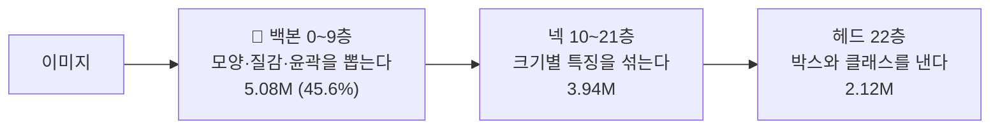

> [!abstract] 한 줄
> 이미 배운 모델의 **눈(백본)** 은 그대로 두고, **판단하는 부분(넥·헤드)** 만 새로 가르친다.

## YOLOv8s 의 세 부분

| 부분 | 비유 | `--freeze 10` 이면 |
|---|---|---|
| 백본 | 눈 — 선·질감·형태를 알아본다 | **고정** |
| 넥 | 크고 작은 것을 함께 본다 | 학습 |
| 헤드 | "사람, 누워 있음" 이라고 말한다 | 학습 |

## 전이학습의 두 방식

| 방식 | 하는 일 | 우리 |
|---|---|---|
| **특징 추출** (feature extraction) | 백본 고정 · 뒷부분만 학습 | **8·9차** |
| **미세 조정** (fine-tuning) | 전체를 조금씩 학습 | stage1_all · 7차 |

> [!question] "이전 동결은 전이학습이었나?" (09-06)
> **그렇다.** `--freeze 10` 은 특징 추출 방식의 전이학습이다.
> 목적은 [[파국적 망각]] 방지 — 겨울·가림에 강한 [[stage1_all]] 의 눈을 지키기 위해서.

## 같이 쓰는 설정

- 학습률을 낮춘다 (0.01 → **0.001**) — 이미 좋은 가중치를 크게 흔들지 않게
- 증강은 운용 조건에 맞춘다 — 하향 시점이면 회전 180° · 상하반전

## 연결

[[결정 - 백본 동결]] · [[자세 8차 - 3클래스 동결]]
