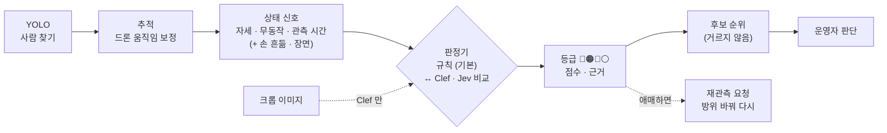

> [!summary] 질문: **"사람" 은 YOLO 가 찾는다 → 그 사람이 "도움이 필요한가" 를 판단할 수 있나**
> - **된다 — 단, 모델 하나가 아니라 신호를 합친 점수로.** 공개된 "요구조자 판정 모델"은 없고, 연구들도 자세 · 움직임 · (열화상) 을 합친다
> - 우리 실측: 탐지 확신도로는 누운 사람을 못 가린다 (AUROC **0.15~0.20**) → 자세 + 무동작 점수로 **0.95** (Okutama · 판정 영상)
> - **Jev 는 단독으로는 불가** — 텍스트만 받는 "판단기" 라 영상을 못 본다 · 지금 가입 중단 · 클라우드 전용
> - 대안: **Cloudflare Clef** (10-01 공개) — Jev 와 같은 방식인데 **이미지 · 영상 입력 · 가중치 공개 (Apache-2.0) · 로컬 실행** → 비교 실험 1순위
> - 원칙 유지: 상태 판단은 **후보를 거르지 않고 순위만** · 최종 판단은 운영자

## 1. "도움 필요" 를 무엇으로 보나 — 신호 정의

| 상황 | 화면에 보이는 신호 | 우리 측정 | 상태 |
|---|---|---|---|
| 의식 없음 의심 | **누움 + 오래 안 움직임** | 누움 AUROC 0.95~0.97 (비스듬) · 무동작 (드론 움직임 보정 후) 0.93 | ✅ 동작 |
| 부상 · 고립 | 앉음 · 웅크림 + 무동작 | 앉음 F1 ~0.5 | ⚠ 약함 (데이터 부족) |
| 구조 요청 | 손 흔듦 (0.5~3 Hz 반복) | 없음 | ❌ 데이터 필요 |
| 낙상 | 추정 키 급락 + 이후 무동작 | 공개 항공 데이터에 낙상 0건 | ❌ 연출 촬영 필요 |
| 위험 장면 근처 | 전복 차량 · 물가 · 연기 (장면) | 없음 | 🔬 제로샷 가능성만 |

## 2. 이미 측정한 것 (근거)

| 무엇 | 결과 |
|---|---|
| 탐지 확신도 순 vs 상태 점수 순 — 누운 사람 가려내기 | **0.15~0.20 → 0.95** (누운 사람은 확신도가 낮아 확신도 순이면 맨 뒤) |
| 드론 움직임 보정 — 이동 vs 정지 | 보정 전 0.56 (우연) → 보정 후 **0.93** |
| 자세 — 비스듬 45~60° | 박스 모양만으로 누움 AUROC **0.97** · 앉음 재현율 0.09 |
| 자세 — 수직 90° | DINOv2 특징 + 로지스틱 누움 AUROC **0.93~0.99** |
| 추적 고치기 (문턱 0.15 · ID 바뀜 끊기) | 점수 AUROC 0.78 → **0.95** |
| 한계 | 탐지기가 누운 사람을 **절반 정도만** 잡음 (0.47~0.53) · 🔴 등급이 한 번도 안 뜸 (규칙이 너무 엄격) · 일본 공원 연출 영상 한 곳 |

→ 지금 구조: 탐지 → 추적 → 자세 + 무동작 → **규칙 판정** → 등급 · 점수 → 후보 순위 · 데모 `state_pipeline.py`

## 3. Jev 로 판별 가능한가

| 항목 | 내용 |
|---|---|
| 정체 | TypeSafe AI · 09-15 공개 · "System One 모델" — 글을 생성하지 않고 **정해진 답 + 확률**을 한 번에 (예/아니오 · 선택지 · 점수) |
| 입력 | **텍스트 · JSON 만** — "No images, audio or video yet" |
| 속도 · 값 | 70~500 ms · 입력 백만 토큰 $0.042 (회사 측정) |
| 접근 | **얼리 액세스 · 가입 중단** (10-01 기준) · 가중치 비공개 → **현장 통신이 끊기면 못 씀** |
| 외부 평가 | 영상 → 캡션 → Jev : XD-Violence AP 76 % 지만 **UCF-Crime AUROC 52 % (우연 수준)** |

- **결론**: Jev 가 영상을 보고 요구조자를 찾는 건 **불가**. 우리 비전이 만든 **상태 JSON** (자세 확률 · 무동작 초 · 관측 시간 · 주변) 을 받아 **규칙 대신 판정**하는 자리는 가능
- 그 자리에서도 규칙보다 나은지는 **검증해야** 함 — 같은 상태 기록으로 규칙 · 로지스틱 · Jev 비교

```json
{"자세": {"누움": 0.86, "앉음": 0.10, "서기": 0.04}, "무동작_초": 14, "관측_초": 18,
 "지면속도_mps": 0.05, "손_흔듦": false, "주변": [{"물체": "전복 차량", "거리_m": 12, "확률": 0.71}]}
→ Jev: "구조 필요?" (예/아니오 확률) · "상황 종류" (의식 없음 · 부상 · 구조 요청 · 해당 없음)
```

## 4. YOLO 와 별개로 상태를 판단하는 모델 · 방법

| 후보 | 무엇 | 입력 | 우리에게 | 판정 |
|---|---|---|---|---|
| **Cloudflare Clef · Clef-flash** | 10-01 공개 · Jev 와 같은 "정해진 답 + 확률" 방식 · 27B (Qwen 기반 + 시각 인코더) · **Apache-2.0 · 가중치 공개** · vLLM 로 실행 | **JSON + 이미지 (최대 4장) + 영상** | 상태 JSON **과 크롭 이미지를 같이** 넣고 "구조 필요?" · 서버 안에서 돌아 영상이 밖으로 안 나감 · 중앙값 209 ms (회사 측정) · ⚠ 27B 는 3090 24 GB 에 4비트로 줄여야 할 것 (확인 전) · flash 는 더 작음 | ⭐ **비교 1순위** |
| OpenAI Decisions API | 같은 계열 · 이미지 입력 | 텍스트 · 이미지 | 클라우드 · 확률 출력 공개 안 됨 | 참고 |
| 로컬 VLM (Qwen-VL 등) | 크롭을 보고 서술 · 예/아니오 | 이미지 | 1~3 초/장 (추정) · **애매한 후보만** · GPT-4V 는 드론 행동 분류가 약했고 오탐 거르기 · 장면 설명은 쓸 만 (arXiv 2404.01571) | 보조 |
| 행동 인식 (3D CNN) | 짧은 영상 → 행동 · 상태 | 영상 클립 | 재난 드론 영상 상태 분류: 특징적 행동 재현율 80 %+ · 비슷한 행동 ~50 % (arXiv 2308.04535) · **학습 데이터가 필요** | 데이터 생기면 |
| 자세 분류 (우리 것) | 박스 모양 · DINOv2 | 박스 · 크롭 | 누움 ✅ · 앉음 ⚠ | ✅ 사용 중 |
| 열화상 · 이마 온도 | 의식 · 저체온 추정 (KSU · 2026) | 열화상 | 우리 카메라는 RGB (IMX415) → 범위 밖 | ❌ |
| V-JEPA 2 장면 이상 | 영상 예측이 크게 틀리면 "이상" | 영상 | 드론 움직임도 이상으로 잡힘 · 연구 트랙 | 🔬 |

## 5. 자세 · 상황 · 상태 데이터 — 조사 가능한가

| 신호 | 공개 데이터 | 우리 확보 | 빈 곳 |
|---|---|---|---|
| 누움 · 앉음 · 서기 | AI-Hub 182 (수직) · Okutama-Action (비스듬 · 12행동) · SARD | ✅ + UE level01 합성 3만 장 | 진짜 **비스듬 앉음** |
| 손 흔듦 · 신호 | Aeriform In-Action (13행동 · 손 흔듦 포함) · UAV-Human (신청 필요) | ❌ | 신청 · 연출 촬영 |
| 무동작 | Okutama 추적 라벨 | ✅ 측정함 | 긴 무동작 (10초+) 장면 |
| 낙상 | **없음** (Okutama 누움 전환 23회 중 낙상 0) | ❌ | **연출 촬영만** |
| 실제 조난자 (의식 없음) | 없음 (윤리상 연출뿐) | ❌ | 연출 · UE |

→ **연출 촬영이 필수**: 건물 옥상 (16~30 m · 45°) · 자체 비행에서 누움 + 10초 무동작 · 앉음 · 손 흔듦 · 쓰러짐

## 6. 제안 — 회의에서 정할 것



| # | 정할 것 | 비전 제안 |
|---|---|---|
| 1 | **"요구조자" 정의** — 등급 기준 | 🔴 누움 ≥ 0.7 & 무동작 ≥ 10초 · 🟠 앉음/누움 + 무동작 · ❔ 관측 부족 → 재관측 · ⚪ 이동 중 (수치는 연출 촬영으로 다시 맞춤) |
| 2 | 판정기 | 기본 = **규칙** (오프라인 · 설명 가능) · **Clef 로컬 비교 실험** (Jev 는 가입 열리면 같이) |
| 3 | UC-0705 문구 | "상태 추정은 우선순위 보조 · 최종 판단은 운영자" |
| 4 | **연출 촬영** 일정 · 인원 | 누움 무동작 · 앉음 · 손 흔듦 · 쓰러짐 — 건물 A (학습) · B (평가) |
| 5 | 중간발표 범위 | 규칙 판정 데모 (등급 · 점수 · 근거 클립) + Clef 비교는 되면 |

- 비교 실험 계획 (승인 시): 같은 상태 기록으로 **규칙 · 로지스틱 · Clef (JSON 만) · Clef (JSON + 크롭)** → 누움 AUROC · 보정 오차 · 지연 · 3~4일

## 출처

- Jev — [flaviocopes 정리 (입력 · 접근 · 한계)](https://flaviocopes.com/jev/) · [MarkTechPost 출시 기사](https://www.marktechpost.com/2026/09/19/typesafe-ai-releases-jev/)
- Clef — [Hugging Face 모델 카드](https://huggingface.co/Cloudflare/clef) · [Cloudflare Workers AI 문서](https://developers.cloudflare.com/workers-ai/models/clef/) · [MarkTechPost](https://www.marktechpost.com/2026/10/01/cloudflare-releases-clef-and-clef-flash/)
- OpenAI Decisions API — [비교 글](https://www.firecrawl.dev/blog/openai-decisions-api-vs-jev)
- 드론 상태 추정 — [Estimation of Human Condition at Disaster Site (arXiv 2308.04535)](https://arxiv.org/abs/2308.04535) · [YOLO-World + GPT-4V 드론 (arXiv 2404.01571)](https://arxiv.org/abs/2404.01571) · [KSU 열화상 · 자세 (TechXplore 2026-03)](https://techxplore.com/news/2026-03-drones-paired-ai-searchandrescue-teams.html)
- 데이터 — [Okutama-Action](https://arxiv.org/abs/1706.03038) · [Aeriform In-Action](https://www.sciencedirect.com/science/article/abs/pii/S0031320323002054) · [NOMAD](https://arxiv.org/abs/2309.09518)

## 연결
[[06 요구조자 상태 인지 계획]] · [[07 객체지향 설계 v2 - 상태 인지 반영]] · [[추적 고치기 Q1 - 추적 문턱·ID 바뀜 끊기]] · [[비전 출력 규격 - 후보 JSON (초안 v0.1)]] · [[10 작업·학습 계획 - 중간발표까지 (10-04)]]
