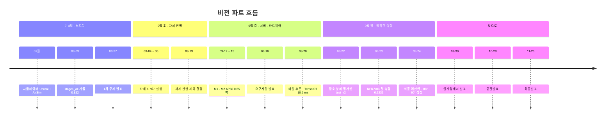

> [!summary] 날짜별로 무엇을 했고 무엇을 알게 됐나 (한국 시간 기준)
> 하루 단위 자세한 기록 → `09 기록/일자별/`

## 7월 — 시뮬레이터

- 07-07 · 07-13 · 07-25 회의 — Unreal 5.5.4 + Cosys-AirSim · SITL 환경 구축

## 8월 — 탐지 모델

| 날짜        | 한 일                                              | 알게 된 것                                |
| --------- | ------------------------------------------------ | ------------------------------------- |
| **08-02** | 진행 보고서 · 시뮬레이터 자동화 · 좌표 변환                       | 좌표 평균 **0.50 m** → [[좌표 변환 정확도]]      |
| 08-02     | 임계값 조정                                           | 0.25 → **0.15** → [[탐지 3 - 임계값 조정]]   |
| **08-03** | NOMAD + WiSARD 통합 학습 완료                          | 겨울 **0.922** → [[stage1_all]]         |
| 08-12     | 주제명 확정 · KML 출력 · 폴더 정리                          | **자율 정찰 드론 관제 시스템**                   |
| 08-18     | 기능 확장 검토 · 선행 연구 조사 · 자세 2클래스 학습                 |                                       |
| 08-23     | 주제 범위 — 쓰러짐 + 상·하의 색 검토                          |                                       |
| **08-27** | 1차 주제 발표                                         | → [[발표 피드백]]                          |
| 08-28     | 발표 자료 기준 계획 재정립 · ByteTrack/BoT-SORT · 합성 데이터 시도 | 자세 판별이 안 된다                           |
| 08-30     | 예산안 기준 환경 재정립                                    | 화각 **54°** · **1080p** → [[하드웨어와 예산]] |
| **08-31** | 주제제안서 · `drone_yolo` 저장소 · 4080 SUPER 벤치마크       | yolo11m 60.8 fps                      |

## 9월 — 자세 판별과 서버

| 날짜 | 한 일 | 알게 된 것 |
|---|---|---|
| **09-02** | 주제 발표 · 고도별 평가 · 학습 개념 정리 · NOMAD 42명 선정 | 성능에 **절벽**이 있다 → [[탐지 4 - 고도·해상도 평가]] |
| 09-03 | 서버 실험 계획 · Okutama 다운로드 | Okutama 는 Drone 1·2 뿐 (손상 아님) |
| **09-04** | 6차 Okutama 200 px · SARD 확보 · 7차 SARD 6클래스 · 3클래스 설계 | **해상도 가설 기각** → [[자세 1~6차 실패 기록]] |
| **09-05** | 8·9차 · 실영상 테스트 · live_view · Okutama 검수 · Copy-Paste 준비 · 문서 07 · SRS 05절 | 동결이 망각을 1/3 로 → [[자세 8차 - 3클래스 동결]] |
| 09-05 | Copy-Paste 보류 · 한국 데이터 조사 | 은행 인물이 ~8명 → [[결정 - Copy-Paste 보류]] |
| 09-06 | 백본 동결 = 전이학습 확인 | → [[전이학습과 백본 동결]] |
| 09-07 | 우리 카메라 기준 개선 방안 조사 | |
| 09-08 ~ 09 | 학과 서버 세팅 · 데이터 다운로드 · 요구명세서 비전 초안 · 뷰어 검토 | → [[데이터 다운로드]] · [[관제 뷰어 프로토타입]] |
| 09-10 | 서버는 git clone + 데이터 새로 받기 | → [[결정 - 서버에서 데이터 새로 받기]] |
| **09-11** | 재부팅 계획 · SRS v1.1 검토 · 발표 PPT 초안 · 가중치 계보 | → [[요구명세서]] · [[가중치 계보]] |
| 09-11 (서버) | GPU 복구 · NOMAD 60명으로 데이터 확장 · 회전 증강 · 1차 스윕 중 **GPU 장애 1회** (E3) · E1~E8 체인 재시작 | → [[서버 E1~E8]] · [[GPU 장애 Xid 79]] |
| **09-12** | `CLAUDE.md` 인계 · 검증 배우 정정 · WiSARD 각도 확인 · 이 볼트 | → [[NOMAD 검증 배우 불일치]] · [[학습 데이터 촬영 각도 불일치]] |
| 09-12 (서버) | E1 42에폭 완료 · E2~E8 중단 · 크기 지터 넓혀 데이터 재생성 · M1 밤샘 학습 · 07:16 **GPU 장애 2회** · 09:49 서버 꺼짐 | `shutdown` 으로 끄면 다시 안 켜진다 → [[서버 M1 - yolo11m 1280]] · [[학과 서버]] |
| **09-13** | SRS v1.6 병합 · UCD-07 8개 · 목차·발표자료 v1.6 · 서버 학습 계획 · 관측 상태 판정 알고리즘 | **자세 판별 제외** · 상의 색상 비교·개별 추적 확정 → [[결정 - 자세 판별 제외]] · [[04 상의 색상 비교]] |
| **09-14** | 요구명세서 **v1.7 최종판** · 서버에 계획 인계(git) · **Capstone 단일 저장소 통합** | → [[요구명세서]] · [[결정 - 저장소 통합]] |
| 09-14 (서버) | 09:20 서버 복구 · 이어 학습 중 **GPU 장애 3·4회** (300 W · 250 W) · 전력 단계 테스트 · Xid 79 확인 · 완화 설정 · 자동 복구 서비스 설치 · 계획 검토 | 전력 제한은 해결책이 아니다 · 관리자: 하드웨어 해결 불가 → [[GPU 장애 Xid 79]] · [[결정 - GPU 완화 설정과 자동 복구]] |
| 09-14 밤 (서버) | M1 34에폭 완주 · NOMAD 50·70 m (71 GB) · SARD 받기 · **M2**(11m · batch 8 · +SARD) 밤샘 학습 · 비행별 평가 · 파이프라인 검토 | 설정을 바꿔도 **AP50 0.65 벽** · 못 찾음이 원인 · SARD test 누수 → [[서버 M2 - yolo11m 1280 SARD]] |
| **09-15** (서버) | 하드웨어 예산안 설정 합의(서버 두 세션 v1 → v4) · **화각·고도 비교 실험** 시작 · 시험셋 검토 네 번 · AP50 벽 원인 정리 | 렌즈는 **초점거리 하한**으로 고른다 · fitness 는 **mAP50-95 만** → [[결정 - 하드웨어 예산안 합의 v4]] · [[화각·고도 비교 실험]] · [[성능 개선 후보 - AP50 벽]] |
| 09-14 밤 ~ 09-15 (노트북) | 발표 준비 — PPT 글자 검정·크기 확대 · 대본·예상 질문 58개 · 명세서 반복 관측·AT-P02 문구를 대본 기준으로 정리 · 하드웨어 트레이드오프 · 옛 볼트 병합 · 볼트 폴더 한 단계 올림 | 같은 대상은 위치·시각·상의 색상으로 판단 · 누운 사람·부분 가림은 데이터셋에 포함해 탐지(따로 분류·기록 안 함) → [[요구명세서]] · [[동일 대상 연결과 재식별]] |
| 09-16 새벽 (서버) | 화각·고도 비교 **1차 결과** (yolo11s · M1) · yolo11m 학습 | 25 m 서 있는 사람 54° 대비 65° −18 % · 90° −43 % · 16~160 px 학습이 40 px 아래에서 M1 을 크게 앞섬 → [[화각·고도 비교 실험]] |
| 09-16 | 📌 **요구사항 명세서 발표** — 게이트웨이 RP 4B 검토 · 좌표 오차 요소 분해 · **2K 93° 검토** 지적 · 일정 확정(10-28 중간 · 11-25 최종) | → [[발표 피드백]] |
| 09-16 (서버) | 전체 프레임 오탐 검증 · 선명도 곡선 · 가시도 구간 · **AI-Hub 182 승인 → 라벨 45개(357,467장) 전수 분석** · 원천 다운로드 · **Okutama 26 GB 서버 확보** · 국내 전파 출력 고시 확인 | 크롭 학습이 오탐을 늘리지 않는다(0.33~0.40/장) · 5 GHz 200 mW 한계 → 5 km 불가 · 현실 2 km → [[AI-Hub 182 조난자 수색]] · [[결정 - 하드웨어 예산안 합의 v4]] |
| **09-17 새벽** (서버) | AI-Hub 원천 3종 87 GB 확보(안산01 제외) · 라벨 박스로 **화각 68.0° 역산** · 기준자 정정 | **서 있는 사람은 0.5 m 가 아니라 0.81 m** · 같은 사람 px 에서 지상 폭은 화각과 무관 → 30 px 운용 고도 75° 34 m vs 93° 25 m → [[AI-Hub 182 조난자 수색]] |
| **09-17** (서버) | AI-Hub 원천 3종 확보 · 화각 68.0° 역산 · **예산안 화각 비교 실험**(시험셋 2벌 56,197장) · **모션 블러 내성 측정** | 기준자 0.81 m 정정 · 75° > 90° ≈ 93° > 160° · 블러는 사람 크기의 6 % 안 · AI-Hub 는 쉽다(0.86 vs 0.33) → [[예산안 화각 비교 - 1안 vs 2안]] · [[기체 흔들림 내성 - 모션 블러]] |
| **09-18** (서버) | 추론 속도 실측(11s·11m·11l × 1280·1600·1920 × fp32·fp16) · **1안 확정** · **L1 yolo11l 학습 시작** | 11l fp16 27.0 ms 로 NFR-V01 통과 · fp32 는 11m 도 초과 → [[결정 - 하드웨어 예산안 합의 v4]] · [[서버 L1 - yolo11l 1280]] |
| **09-19** | 📌 **예산안 1안 확정** (팀 회의) · 렌즈 75°/90° 미확정 · 볼트 정리(루트 비움 · 색인 추가) | 160° 어안 제외 → [[결정 - 하드웨어 예산안 합의 v4]] |
| 09-19 (서버) | L1 가림 지형 평가 · FP32/FP16 비교 · **GSD 정규화 스윕** · L2 30에폭으로 연장 | **val mAP50 이 실전과 반대로 나왔다**(11l val +4.9 % · 가림 지형 18칸 전부 열세) · FP16 정확도 차이 ±0.25 %p → [[서버 L1 - yolo11l 1280]] |
| **09-20** (서버) | L2 완주(30에폭) · **타일 추론** · F2 임계값 탐색 · 시험셋 조건 표기 정정 | **추론 방식이 아키텍처보다 큰 레버**(38 px +8.3 %) · AI-Hub +64 % 는 11m 을 못 넘음 · close_mosaic 해롭다(3번째) → [[타일 추론]] · [[서버 L1 - yolo11l 1280]] |
| **09-20** (서버) | **TensorRT FP16 변환**(19.8 ms · 정확도 손실 0) · 타일 가장자리 효과 측정 · translate 0.30 학습 시작 | 타일 추론 **채택 가능**해짐(단일 1920 대비 +8.2 % · 시간 −40 %) · 가장자리 −24.6 % → [[타일 추론]] · [[타일 가장자리 효과]] |
| **09-21** (서버) | translate 0.30 완주 · 하드 네거티브 마이닝 4,700장 · **v3a 음성 15.8 % 학습** · VisDrone 2 GB 확보 · 볼트 수치 표기 규칙 | translate 0.30 **실패**(−4.9 %p) · 공개 VisDrone 가중치 25종은 **전부 imgsz 640** · 서버는 UTC 인데 KST 로 적어 9시간 오보 → [[타일 가장자리 효과]] · [[1 새 방향 - 항공 사전학습과 손실 재배분]] |
| **09-22** (서버) | **v3a 판정 실패** · **장소 분리 평가셋 test_v2** · **마운트각 전수조사** · D(항공 사전학습) 학습 · Unicamp-UAV 18 GB 확보 · 자동화 체인 | v3a 오탐 −64 % 였으나 재현율 −7.3 %p → 실패 · **AI-Hub 182 는 파일명에 각도·고도가 박혀 있다(전부 90°)** · Okutama·VisDrone 은 **비스듬이 65 %** → [[9.22 하루 기록]] |
| **09-23** (서버) | 크롭 42,448장 **마운트각 태깅** · **육안 검증**(대조 시트) · 학습 큐 문서화 · P2 헤드 설정 작성 | **태그는 원천마다 신뢰도가 다르다** — Okutama 신뢰 · VisDrone 순위만 · **NOMAD 은 잡음** · r 은 각도가 아니라 **화면 내 거리 변화량**을 잰다 → [[9.23 마운트각 태그 육안 검토]] |
| **09-23 저녁** (서버) | **NFR-V03 첫 측정 AP50 0.2233** · nano P2 사고 발견·중단 · 재검토 큐(P2 11m · rect) | 목표까지 3.6배 · 학습 쪽 8번 순이익 0 → [[9.23 전반 재검토]] |
| **09-24** | 📌 **최종 예산안 확정**(렌즈 3종 대각 62·78·88° · 3축 짐벌) · **주 렌즈 88°** · **기본 마운트각 60° 잠정** · 합성 데이터 보류 | 대각→수평 환산(88°→80.2°) · 90° 고정안 철회(데이터에 목적을 맞춘 판단) → [[02 학습 계획 v6 (60° 기준)]] |
| **09-24 저녁** (서버) | **P2 헤드 첫 개선**(test_v2 0.2233 → 0.2697) · test_obl 기준선 · v6_obl 학습 · **전체 파이프라인 검토** | 60° 오탐의 60 % 는 **여럿을 한 박스로 묶기** · 판정셋 장소가 1~2곳뿐 · val 누수 → [[9.24 전체 파이프라인 검토]] |
| **09-25 새벽** (서버) | **v6_obl 판정** — test_v2 **0.2233 → 0.5287** · test_obl 0.1029 → 0.3311 (⚠ 정답 중복 · 다시 재면 **0.1932 → 0.6187**) · v6_p2m 학습 | **데이터(장소·시점 다양화)가 가장 큰 레버** — 학습 쪽 첫 대폭 개선 → [[_학습 큐]] |
| 09-25~26 (서버) | test_obl 정답 중복 수정 (사람 12,876 → 6,438) · v6_obl_r2 · v6_nwd · test_kr 구축 | 반복 흔들림 ±1~3 %p 확인 |
| **09-26** (서버) | **NWD·P2 원인 분석** — NWD 확신도 부풀림 · test_obl AP 22 %p 는 박스 모양 차이 · **같은 설정 반복 3.4 %p** · 수프 2개 ✅ (test_obl 0.6347) · NWD 섞은 수프 ❌ | 방법 바꾸기 중단 → **데이터 + 반복 + 수프** → [[NWD·P2 효과 없음 - 원인 분석]] · [[_학습 큐]] |

## 앞으로

| 날짜 | 무엇 | 비고 |
|---|---|---|
| **09-30 (수)** | 📌 **설계명세서 제출 · 발표** | → [[03 9.30 설계명세서 병행 일정]] |
| **10-28** | 📌 **중간발표** — 실기체 제외 전 시스템 완료 | |
| 10월 중순~ | 첫 비행 · 자체 촬영 (60° 중심 + 45·75° 스윕) | → [[05 실기체 적용 - 자체 촬영]] |
| **11-25** | 📌 **최종발표** — 조립 실기체 시연 영상 | |
| 12-09 | 개발 기간 종료 | |

## 연결

주제별로 찾으려면 [[00 홈]] · 실험만 보려면 [[_실험 색인]] · 개념은 [[_개념 색인]]

[[00 홈]] · [[다음 할 일]]
