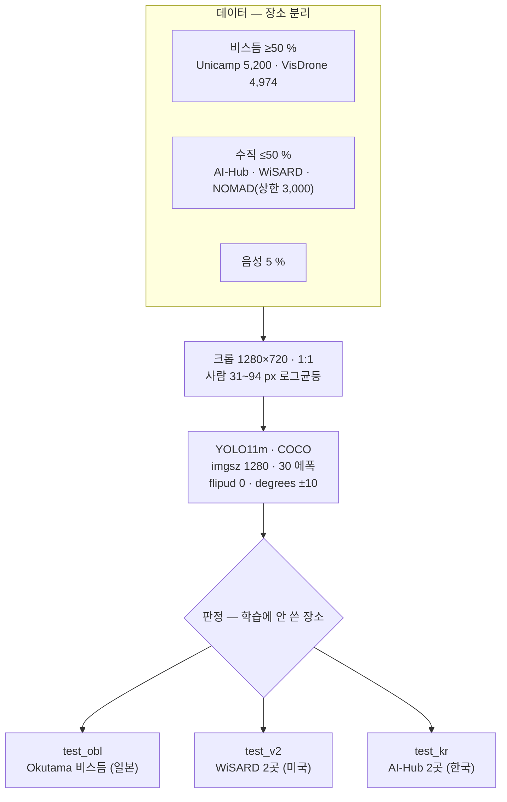
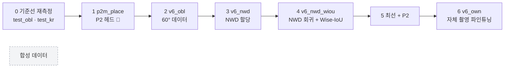

> [!summary] 60° 비스듬 운용에 맞춘 사람 탐지 모델을 RTX 3090 에서 학습한다
> **목적에 데이터를 맞춘다** — 데이터가 수직이라서 90° 로 운용하는 게 아니라, 운용(60°)에 맞는 데이터를 모은다.
> 현재 위치: 장소 분리 AP50 **0.2233** → 목표 0.80

## 이 폴더

| 문서 | 내용 | 상태 |
|---|---|---|
| [[01 기준 요건 확정안]] | 카메라 · 렌즈 3종 · 짐벌 · 마운트 · 고도 · px | ✅ |
| [[02 학습 계획 v6 (60° 기준)]] | 데이터 · 증강 · 손실 · 하이퍼파라미터 · 실험 순서 | 🟢 현행 |
| [[03 9.30 설계명세서 병행 일정]] | 9/24~9/30 GPU × 문서 날짜표 | 🔄 |
| [[_학습 큐]] | 지금 GPU 에 걸린 것 · 다음 것 · 판정 기준 | 🔄 |
| [[04 상의 색상 비교]] | Lab 12색 · 1·2순위 | 📝 |
| [[05 실기체 적용 - 자체 촬영]] | 첫 비행 후 자체 촬영 · 파인튜닝 · 시연 장비 | 📝 |
| `9.21 아이디어/` | [[1 새 방향 - 항공 사전학습과 손실 재배분]] · [[2 문헌 대조 - 공개 실험 5건]] | 일부 실행 |
| `지난 계획/` | S0~S8 (09-13) · v4 · v5 — **보지 않아도 된다** | 대체됨 |

## 60° 에서 화면이 보는 것

![[fig_60도_화면기하.svg]]

- 화면 **위 = 먼 쪽 · 아래 = 가까운 쪽** → 상하 반전 증강을 끈다
- 서 있는 사람이 90° 의 1.65배로 커지고, 누운 사람과 크기가 비슷해진다

![[fig_마운트각별_사람px.svg]]

## 계획 한 장

## 실험 순서 — 한 번에 하나만 바꾼다

- 판정 기준은 **돌리기 전에** [[_학습 큐]] 에 적는다
- 체인을 걸기 전 **연기 실행** (1에폭 + 평가 20장) — [[9.23 전반 재검토]] 의 교훈

## 지금까지 — 무엇이 먹혔나

| 쪽 | 시도 | 결과 |
|---|---|---|
| 추론 | 해상도 1280→1920 · 타일 4장 · TensorRT FP16 | **전부 양수** (+6.1 %p · +2.9 %p · 속도 2배) |
| 학습 | 11l 확대 · AI-Hub +64 % · translate 0.30 · 음성 15.8 % · VisDrone 사전학습 | **순이익 0** (±0 ~ −7.3 %p) |
| 평가 | 장소 분리 test_v2 | **정직한 첫 값 0.2233** |

→ 같은 데이터 위에서 설정만 돌려서는 안 닫힌다. **데이터(비스듬·장소 다양성) · 구조(P2) · 손실(NWD) · 자체 촬영** 이 남은 레버다 → [[장소 일반화 - NFR-V03 0.22]]

## 연결
[[00 홈]] · [[결정 - 기본 마운트각 60° (잠정)]] · [[결정 - 최종 예산안 (2026-09-23 계획서)]] · [[_실험 색인]]
