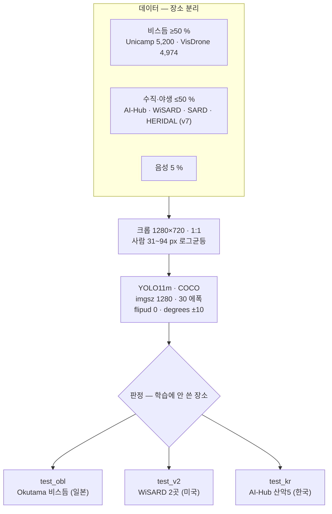
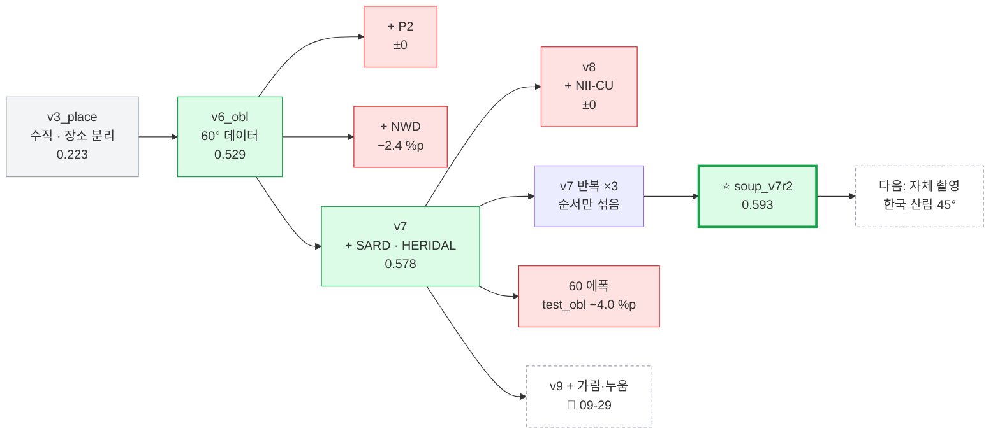

> [!summary] 비스듬(45~60°) 운용에 맞춘 사람 탐지 모델을 RTX 3090 에서 학습한다
> 09-29 기본 45° 로 변경 — **재학습 불필요** (학습 범위 45~75° · test_obl 이 Okutama 45°) → [[결정 - 기본 마운트각 45°]]
> **목적에 데이터를 맞춘다** — 데이터가 수직이라서 90° 로 운용하는 게 아니라, 운용(60°)에 맞는 데이터를 모은다.
> 현재 위치: 장소 분리 AP50 0.2233 (09-23) → **0.5927** (최종 `soup_v7r2` · test_v2) · test_obl 0.6331 · test_kr 0.968 → 목표 0.80
> 최종 모델 → [[결정 - 최종 탐지 모델 soup_v7r2]] · 방법 바꾸기를 멈춘 이유 → [[NWD·P2 효과 없음 - 원인 분석]]

## 이 폴더

| 문서 | 내용 | 상태 |
|---|---|---|
| [[01 기준 요건 확정안]] | 카메라 · 렌즈 3종 · 짐벌 · 마운트 · 고도 · px | ✅ |
| [[02 학습 계획 v6 (60° 기준)]] | 데이터 · 증강 · 하이퍼파라미터 (v6 → v7 이 이어받음) | ✅ 실행 완료 |
| [[03 9.30 설계명세서 병행 일정]] | 9/24~9/30 GPU × 문서 날짜표 | 🔄 마감 주 |
| [[_학습 큐]] | 판정 기준 · 실행 결과 전부 | 🔄 |
| [[결정 - 최종 탐지 모델 soup_v7r2]] | 설계명세서에 넣는 모델 · 수치 · 고른 과정 | ✅ |
| [[04 상의 색상 비교]] | Lab 12색 · 1·2순위 | 📝 |
| [[05 실기체 적용 - 자체 촬영]] | 첫 비행 후 자체 촬영 · 파인튜닝 · 시연 장비 | 📝 |
| `9.21 아이디어/` | [[1 새 방향 - 항공 사전학습과 손실 재배분]] · [[2 문헌 대조 - 공개 실험 5건]] | 일부 실행 |
| `지난 계획/` | S0~S8 (09-13) · v4 · v5 — **보지 않아도 된다** | 대체됨 |

## 45° 에서 화면이 보는 것 (60° 비교)

![[fig_45도_화면기하.svg]]

- 화면 **위 = 먼 쪽 · 아래 = 가까운 쪽** → 상하 반전 증강을 끈다
- 서 있는 사람이 90° 의 1.65배로 커지고, 누운 사람과 크기가 비슷해진다

![[fig_마운트각별_사람px.svg]]

## 계획 한 장 (v7 기준)

```mermaid
flowchart TD
    subgraph D["데이터 — 장소 분리"]
        O["비스듬 ≥50 %<br/>Unicamp 5,200 · VisDrone 4,974"]
        N["수직·야생 ≤50 %<br/>AI-Hub · WiSARD · SARD · HERIDAL (v7)"]
        G["음성 5 %"]
    end
    D --> K["크롭 1280×720 · 1:1<br/>사람 31~94 px 로그균등"]
    K --> T["YOLO11m · COCO<br/>imgsz 1280 · 30 에폭<br/>flipud 0 · degrees ±10"]
    T --> E{"판정 — 학습에 안 쓴 장소"}
    E --> E1["test_obl<br/>Okutama 비스듬 (일본)"]
    E --> E2["test_v2<br/>WiSARD 2곳 (미국)"]
    E --> E3["test_kr<br/>AI-Hub 산악5 (한국)"]
```

## 실제로 간 길 (09-24 ~ 09-28)

```mermaid
flowchart LR
    V3["v3_place<br/>수직 · 장소 분리<br/>0.223"]:::old --> V6["v6_obl<br/>60° 데이터<br/>0.529"]:::ok
    V6 --> P2["+ P2<br/>±0"]:::no
    V6 --> NWD["+ NWD<br/>−2.4 %p"]:::no
    V6 --> V7["v7<br/>+ SARD · HERIDAL<br/>0.578"]:::ok
    V7 --> V8["v8<br/>+ NII-CU<br/>±0"]:::no
    V7 --> R["v7 반복 ×3<br/>순서만 섞음"]
    V7 --> E60["60 에폭<br/>test_obl −4.0 %p"]:::no
    V7 --> V9["v9 + 가림·누움<br/>🔄 09-29"]:::plan
    R --> S["⭐ soup_v7r2<br/>0.593"]:::star
    S --> OWN["다음: 자체 촬영<br/>한국 산림 45°"]:::plan
    classDef ok fill:#dcfce7,stroke:#16a34a
    classDef star fill:#dcfce7,stroke:#16a34a,stroke-width:3px
    classDef no fill:#fee2e2,stroke:#dc2626
    classDef old fill:#f3f4f6,stroke:#9ca3af
    classDef plan fill:#fff,stroke:#9ca3af,stroke-dasharray:4 3
```

숫자는 test_v2 AP50 · 판정 기준 (같은 설정 반복 흔들림보다 커야 개선) → [[_학습 큐]]

## 무엇이 먹혔나

| 쪽 | 시도 | 결과 |
|---|---|---|
| 추론 | 해상도 1920 · 타일 4장 · TensorRT FP16 | **전부 양수** (+6.1 %p · +3.0 %p · 18.9 ms) |
| **데이터** | 60° 데이터 (v6) · 야생 지형 SARD·HERIDAL (v7) | **+30.5 %p · +4.9 %p** — 유일하게 크게 먹힌 레버 |
| 반복 평균 | 같은 설정 2회 가중치 평균 | +1.5 %p (test_v2 · 유의) · 조합마다 확인 필요 (BN) |
| 학습 설정 · 구조 · 손실 | 11l · translate · 음성 15.8 % · 항공 사전학습 · P2 · NWD · **60 에폭** | **순이익 0 또는 −** |
| 데이터 추가 (조건 불일치) | NII-CU 45° 야구장 · AI-Hub 190 (사람 18 px) | ±0 · 안 씀 |

→ 다음 계획 (09-29~) → [[_학습 큐]] 「다음 계획」 · 공개 데이터로 채울 수 있는 곳은 거의 채웠다. 남은 격차(한국 산림 · 가림 · 누운 사람)는 **자체 촬영**으로 → [[05 실기체 적용 - 자체 촬영]]

## 연결
[[00 홈]] · [[결정 - 기본 마운트각 45°]] · [[결정 - 기본 마운트각 60° (잠정)]] · [[결정 - 최종 예산안 (2026-09-23 계획서)]] · [[_실험 색인]]
