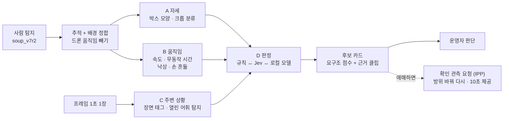
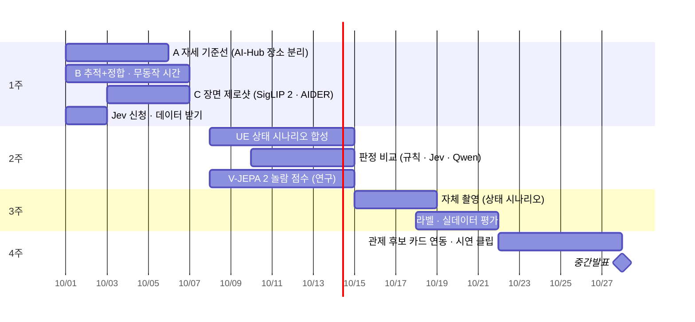

> [!summary] 9.30 설계 발표 피드백 → **"사람 탐지" 에서 "도움이 필요한 사람 · 상황 인지" 로**
> - 자세(한 장) + **움직임(여러 장 · 드론 움직임 보정)** + 주변 상황(장면) → **요구조 점수 + 근거** → 후보 목록 정렬
> - 원칙: 상태 판단은 **후보를 거르지 않고 순위만 바꾼다** — 틀려도 후보는 남고 최종 판단은 운영자 (09-13 제외 이유였던 "오분류 위험"을 이렇게 푼다)
> - 오늘 실측 (Okutama 정답 박스): 드론 움직임을 빼면 이동/정지 AUROC **0.56 → 0.93** · 비스듬 시점은 박스 모양만으로 누움 AUROC **0.98** → [[움직임 보정 속도 - Okutama]]
> - Jev = TypeSafe AI 가 **09-15 공개한 판정 모델** — **텍스트만 입력** (영상 X) → "눈"이 아니라 **"판단기"** 자리

## 피드백 (09-30 설계명세서 발표) → [[발표 피드백]]

- 김병만 교수님: "어려운 것을 다 빼 버리면 차별점이 없다" → **자세 분류 다시 시도**
- 그 시도 방법은 **우리 아이디어** (교수님 지적 아님)
  - ① 자세 라벨 데이터 + **주시 중인 사람의 속도 변화량**으로 요구조자 판단 — 낙상은 수직 속도가 빠르게 변한다
  - ② **Jev** 로 비정상 상황(차량 전복 · 교통사고)을 판단할 수 있는지 검토 — 목적은 구조가 필요한 상황 인지

## 한 장 구조



## 지난 9번 실패와 무엇이 다른가

| | 지난번 (08-18 ~ 09-13) → [[쓰러짐 판별 도메인 이전 실패]] | 이번 |
|---|---|---|
| 단서 | 한 장의 외형만 (탐지기 3클래스) | 외형 + **시간(움직임)** + **기하(마운트각 · 카메라 모델)** |
| 라벨 | SARD 8명 (분할 누수) · NOMAD·Okutama 활동 구간 유도 | **AI-Hub 182 프레임별 자세 라벨** (`person_pose` · 누움·앉음·서기 고른 분포) — 09-16 확보, 자세 트랙 중단 뒤라 **자세에는 한 번도 안 씀** · 합성(C2A · UE) · 자체 촬영 연출 |
| 평가 | 섞인 분할 | **장소 분리** — test_kr 산악5 (누움 350 · 앉음 344 · 서기 300) · test_obl Okutama 비스듬 |
| 모델 | YOLO 백본 동결 · 미세조정 | 기반 모델 특징(DINOv3 · SigLIP 2) + 작은 분류기 — 장소가 바뀌어도 버티는지 먼저 잰다 |
| 쓰임 | 필터 (틀리면 놓침) | **순위** (틀려도 후보는 남음) |

## 10-01 실측 — 상태 인지 v1 파이프라인 (`state_pipeline.py` · Okutama 비스듬 23편 · 탐지 soup_v7r2)

탐지 → BoT-SORT 추적 (초당 10장) → 1초마다 드론 움직임 보정 속도 → 박스 모양 자세 (SARD + NOMAD) → 무동작 시간 → 규칙 v1 등급 · 점수

| 가려내기 (1초 표본 6,881) | 요구조 점수 | 탐지 확신도 (기준선) |
|---|---|---|
| 누움 AUROC | **0.729** | **0.152** — 누운 사람은 확신도가 낮아 **확신도 순이면 맨 뒤로 밀린다** |
| 누움·앉음 AUROC | 0.699 | 0.137 |
| 추적 단위 "누운 적 있음" (220 추적 · 누움 33) | 0.679 | 0.515 |

- 등급 규칙 v1 은 너무 엄격 — 누움 1초 표본 75 개 중 🔴 0 · 🟠 5 · ⚪ 50 (누움 ≥ 0.7 & 무동작 ≥ 10초 를 거의 못 채움: 추적 ID 끊김 · 탐지 박스 흔들림)
- 누운 사람 자체를 탐지가 많이 놓친다 — 데모 장면에서 화면 위쪽(먼 쪽) 누운 사람 · 무리 미탐 → `chain_v18` 에서 누움 잡힌 비율 · v9 (누움 재현율 0.50) 로 비교
- 임계 조정은 Okutama 를 보고 하지 않는다 (평가셋) — 자체 촬영 연출 데이터로 맞춘다
- 탐지기별 (`chain_v18`): soup_v7r2 누움 잡힌 비율 **0.28** · 점수 AUROC 0.729 → **soup_v9x2 0.47 · 0.771** (추적 단위 0.68 → 0.78) · 확신도 기준선 0.15~0.20
- 데모 영상 `drone_yolo/runs_state/1.1.1.mp4` (Okutama 파생물 · git 밖)

## 10-01 실측 — A2 자세: 크롭 분류기 2차 · 시점별 경로 판정 (`chain_s2.sh` · `posture_fusion.py`)

| 판정 | 한국 수직 (AI-Hub 산악5) 누움 AUROC · F1 | Okutama 비스듬 누움 AUROC · F1 | Okutama 수직 누움 AUROC · F1 |
|---|---|---|---|
| YOLO cls s1 (AI-Hub + SARD) | 0.979 · 0.781 | 0.907 · 0.451 | 0.692 · 0.430 |
| YOLO cls s2 (+ NOMAD) | 0.990 · 0.854 | 0.865 · 0.381 · **앉음 0.03** | 0.449 · 0.324 |
| DINOv2 + 로지스틱 | **0.992 · 0.868** | 0.734 · 0.338 | **0.926 · 0.471** |
| SigLIP 2 제로샷 | 0.854 · 0.248 | 0.899 · 0.472 | 0.859 · 0.160 |
| 박스 모양 판정 (SARD + NOMAD 로 맞춤) | — | **0.970** · 0.388 | — |
| 박스 + SigLIP 2 | — | 0.958 · **0.562** (앉음 0.53) | — |
| **경로 판정** 수직 → DINOv2 · 비스듬 → 박스 | **0.992** | **0.95~0.97** | **0.926** |

- **누움 vs 나머지는 시점별로 나눠 쓰면 된다** — 수직 0.93~0.99 · 비스듬 0.95~0.97 (마운트각을 아는 우리 구조의 이점)
- **앉음이 약점** — 비스듬 최고 F1 0.56 (박스 + SigLIP 2) · 수직 Okutama F1 0.47
- NOMAD 추가(s2) 는 한국 수직만 올리고 비스듬·Okutama 수직은 떨어뜨림 (앉음 라벨 없음 → 앉음 붕괴) → **안 씀**
- ⚠ 비스듬 조합을 학습 데이터 교차검증으로 미리 고르려 했으나 **누수**: YOLO cls 가 SARD 로 학습돼 SARD 크롭에서 부풀어 (CV F1 0.809) 잘못 뽑힘 · 누수 없는 조합끼리도 CV 순위(박스+DINOv2)가 Okutama 순위와 달랐다 → **"박스 + SigLIP 2" 가 가장 좋은 건 Okutama 를 보고 안 것**이라 확정이 아니라 관찰 — 다른 비스듬 평가셋(자체 촬영)으로 다시 확인
- 다음: 비스듬 앉음 라벨 데이터 (자체 촬영 연출 · C2A) · 판정은 순위용이라 누움 AUROC 를 1차 지표로

## 오늘 실측 — 아이디어 ① 이 되나 (`okutama_motion.py`)

| 무엇 | 결과 |
|---|---|
| 드론 움직임 | 배경이 1초에 p50 **34 px** · p90 **178 px** 흐른다 (1280 기준) |
| 이동 vs 정지 — 보정 전 | AUROC **0.56** (우연 수준) — 누운 사람(1.43 몸높이/초)이 걷는 사람(1.04)보다 "빨라" 보인다 |
| 보정 후 — 1초 · 3초 창 | AUROC **0.88 · 0.93** — 정지 0.14~0.19 vs 걷기 0.56 · 달리기 1.34 몸높이/초 |
| 3초 창 임계 0.25 | 정지 77 % 맞힘 · 이동 7 % 를 정지로 오인 |
| 박스 모양 — 비스듬 | 세로/가로 누움 **0.56** vs 서기 **1.91** → 누움 AUROC **0.98** (앉음 대비 0.93) |
| 박스 모양 — 수직 90° | 세로/가로는 무의미 (0.23) · **길쭉함**(긴 변/짧은 변) 누움 2.11 vs 서기 1.20 → **0.81** |
| 낙상 | 누움 전환 23회 중 21회가 "앉았다 눕기" · **낙상 0** → 공개 항공 데이터로는 검증 불가 |

- 결론: ① 은 **드론 움직임 보정이 전제**. 비스듬 마운트(45°)가 자세에도 유리. 시점마다 쓸 모양 단서가 달라서 **마운트각을 아는 우리 구조**가 이점
- 한계: 정답 박스 기준 (탐지 박스는 더 흔들린다) · 일본 공원 한 곳 · 배우 소수

### "낙상 = 수직 속도" 를 기하로 보면

- 화면에 보이는 수직 움직임 = 실제 수직 움직임 × **cos(내려다보는 각)** → 45° 71 % · 60° 50 % · **수직 90° 0 %** (크기 변화만 남음)
- 그래서 수직 속도 대신 **"서 있다고 가정한 키" h(t)** 를 쓴다 — GeoResolver 발끝 거리 D + 박스 위 끝 각도 θ
  - h = 고도 − D × tan θ → 서기 1.5~1.9 m · 앉기 ≈ 1 m · 가로로 누움 ≈ 0.3 m
  - **낙상 = h 가 1초 안에 1.7 → 0.5 m 아래 + 이후 무동작**
- ⚠ 45° 에서는 **시선 방향으로 누운 사람**이 선 사람과 박스가 거의 같다 (누운 길이 × tan 45° ≈ 키) → **방위를 바꿔 한 번 더 보면** 풀린다 — 누운 사람은 방위에 따라 모양이 바뀌고 선 사람은 그대로

## 기술 후보

### A. 자세 (한 장)

| 기술 | 원리 | 우리 쓰임 | 비용 | 판정 |
|---|---|---|---|---|
| A1 박스 기하 | 세로/가로 · 길쭉함 · 추정 키 h | 기본 특징 — 마운트각에 따라 골라 씀 | 0 | ✅ 바로 |
| A2 크롭 자세 분류 | 사람 크롭 → 서기/앉기/눕기. **DINOv3 · SigLIP 2 특징 + 선형 분류** vs YOLO11n-cls 미세조정 | AI-Hub 182 장소 분리 학습 → test_kr · test_obl | 크롭 묶음 ~1 ms (추정) | ✅ 1주차 |
| A3 키포인트 | 17관절 좌표 (YOLO11-pose · RTMPose) | 가까이 다시 볼 때만 — 4차에 97 px 재현율 0.2 | 수 ms | 보조 |
| A4 VLM 확인 | 스냅샷을 보고 "누워 있나 · 다쳤나" 서술 (Qwen3-VL 8B 4비트 등) | 애매한 후보만 | 1~3 초/장 (추정) | 보조 |

### B. 움직임 (여러 장) — 아이디어 ①

| 기술 | 원리 | 우리 쓰임 |
|---|---|---|
| B1 추적 + 배경 정합 | BoT-SORT 카메라 움직임 보정(GMC) · 배경 호모그래피 | 모든 속도의 전제 — 실측 0.56 → 0.93 |
| B2 지면 속도 m/s | GeoResolver 좌표 차분 | 걷기 1~1.5 m/s vs 정지 · GNSS·짐벌 흔들림 확인 필요 |
| B3 **무동작 시간** | 누움 + 정지 N초 | **수색 현장에서 가장 중요한 신호** (의식 없음 의심) |
| B4 낙상 이벤트 | 추정 키 h(t) 급락 + 이후 무동작 | 관측 중 넘어질 때만 — 드물다 |
| B5 손 흔듦 | 팔의 주기 운동 0.5~3 Hz (손목 궤적) · 크롭 영상 분류 | 의식 있는 요구조자의 신호 — UAV-Human `wave hands` · `call for help` |

### C. 주변 상황 (장면) — 아이디어 ② 의 "눈"

| 기술 | 원리 | 우리 쓰임 |
|---|---|---|
| C1 제로샷 장면 태그 | **SigLIP 2** — 이미지와 문장("전복된 차" · "교통사고" · "연기")의 유사도 | 1초 1장 · AIDER 로 임계 보정 |
| C2 열린 어휘 탐지 | **YOLOE** · YOLO-World · Grounding DINO — 글로 준 물체의 박스 | "overturned car" 위치 → 지도 (GeoResolver 그대로) · YOLOE 는 설치된 ultralytics 에 있다 |
| C3 **V-JEPA 2** (Meta 영상 세계모델) | 가린 장면을 표현 공간에서 예측 → 크게 틀리면 **"놀람" = 이상**. V-JEPA 놀람 점수로 물리 위반 탐지 IntPhys 98 % · V-JEPA 2 를 인코더로 쓴 이상 예측 AUROC 0.90 (UCF-Crime · 지상 CCTV) | 드론 움직임도 놀람을 만든다 → 정합한 사람·차 중심 영상에서만 · **연구 트랙** |
| C4 VL-JEPA (Meta · 2025-12) | 영상 의미 임베딩이 크게 바뀔 때만 해석 — 해석 횟수 **2.85배** 절약 | 스트리밍 감시 구조 참고 |

### D. 판정 — 아이디어 ② 의 Jev

| 항목 | Jev |
|---|---|
| 만든 곳 · 시기 | TypeSafe AI · **2026-09-15 얼리 액세스** ("System One 모델" 첫 번째) |
| 입력 | **텍스트 · JSON 만** — 이미지 · 영상 · 음성 안 됨 (공식 문서) |
| 출력 | 미리 정한 타입의 결정 + 보정된 확률 — Noul(예/아니오 확률) · Choice(선택지 ≤255개 분포) · Score(0~2) |
| 방식 | 글자를 하나씩 생성하지 않고 한 번에 결정 · 학습 RLCD (보정된 결정용 강화학습) · 구조·가중치 비공개 · API 만 |
| 속도 · 비용 | 70~500 ms · 입력 백만 토큰 $0.042 · 출력 무료 — **회사 자체 측정** |
| 영상 이상탐지 첫 외부 평가 | arXiv 2609.34180 (40편): 영상 → 캡션 → Jev · XD-Violence AP 76 % (Qwen 48 %) 이지만 **UCF-Crime AUROC 52 %** (우연 수준) → 검증 부족 |

- **Jev 는 "눈"이 아니라 "판단기"** — 차량 전복을 보려면 C1~C3 가 먼저 장면을 글/JSON 으로 바꿔야 한다
- 우리 자리: 비전이 만든 **상태 JSON → Jev → 구조 필요 확률 · 상황 종류**
  ```json
  {"자세": {"누움": 0.86, "앉음": 0.10}, "무동작_초": 14, "지면속도_mps": 0.05,
   "손_흔듦": false, "주변": [{"전복된 차": 0.71, "거리_m": 12}], "관측_횟수": 5}
  ```
- 장점: 빠름 · 확률이 보정됨 ("구조 필요 82 %" 표시에 맞다) · 정해진 답만 냄 · **영상이 서버 밖으로 안 나감** (텍스트만)
- 위험: 얼리 액세스 승인 필요 · 클라우드 API (현장 통신 끊기면 불가) · 성능 수치는 회사 자체 측정
- → 기본은 **규칙 판정**, Jev 는 **같은 상태 로그로 비교 실험**: 규칙 · 로지스틱 · Jev · 로컬 Qwen → AP · 보정 오차(ECE) · 지연
- 영상 쪽 대안은 V-JEPA(영상 세계모델) → C3 로 같이 검토

### 규칙 판정 v1 (기준선)

| 등급 | 조건 (제안) |
|---|---|
| 🔴 최우선 | 누움 ≥ 0.7 **그리고** 무동작 ≥ 10초 · 낙상 후 무동작 ≥ 5초 · 손 흔듦 ≥ 3초 |
| 🟠 우선 | 누움·앉음 + 무동작 ≥ 10초 · 장면 이상(전복·사고·연기) 반경 20 m 안의 사람 |
| ⚪ 보통 | 이동 중 (≥ 0.5 m/s) · 서 있음 |
| ❔ 확인 필요 | 관측 < 3초 · 자세 0.3~0.7 → **확인 관측 요청** |

## 데이터

| 용도 | 데이터 | 상태 |
|---|---|---|
| 자세 학습 (수직) | **AI-Hub 182** — 서버 이미지 3.6만 장 · 프레임별 자세 라벨 · 화성 · 시흥 · 의왕 | ✅ 있음 · 산악5 는 평가로 뺀다 |
| 자세 학습 (비스듬) | **C2A** — 재난 배경 합성 1만 장 · 5자세 (굽힘 · 무릎 · 누움 · 앉음 · 서기) · 라이선스 명시 없음 → 연구용 | 받기 |
| | **UE 합성** — 45° · 16~30 m · 자세 × 방위 스윕 · 라벨 자동 | 팀 노트북 협업 |
| 자세 평가 | test_kr 산악5 (수직 · 자세 균등 994) · test_obl Okutama (비스듬) | ✅ |
| 움직임 | Okutama 추적 라벨 (실측 완료) · UE · 자체 촬영 | 일부 ✅ |
| 낙상 | **공개 항공 데이터 없음** → UE 래그돌 · 자체 촬영 (매트 위 연출) | 만들기 |
| 손 흔듦 | UAV-Human (155행동 · `wave hands` · `call for help`) · 자체 촬영 | 받기 |
| 장면 이상 | **AIDER** (항공 6,433장 · 교통사고 · 화재 · 홍수 · 붕괴 · 정상) · Drone-Anomaly (59편) · UIT-ADrone (교통 51편) · UE 전복 차량 | 받기 |

### 자체 촬영에 넣을 상태 시나리오 → [[05 실기체 적용 - 자체 촬영]]

| | 연출 | 시간 | 보는 것 |
|---|---|---|---|
| S1 | 누워서 움직이지 않기 | 30초 | 무동작 누움 (최우선) |
| S2 | 앉아서 움직이지 않기 | 30초 | 무동작 앉음 |
| S3 | 걷다가 **매트 위로** 넘어진 뒤 누워 있기 | 20초 | 낙상 (보조자 · 무리한 동작 금지) |
| S4 | 양팔 흔들기 | 10초 | 구조 신호 |
| S5 | 걷기 · 달리기 · 서서 휴대폰 보기 | 각 20초 | 대조 (정상) |

- 각 시나리오 × 방위 2개 (0° · 90°) × 고도 16 · 20 · 30 m · 마운트 45°

## 일정 (→ 10-28 중간발표 · 11-25 최종)



| 범위 | 무엇 |
|---|---|
| **최소 (중간발표)** | A1+A2 자세 · B1~B3 무동작 누움 · 규칙 판정 · 후보 카드 표시 (UE 시연) |
| 확장 | 낙상 · 손 흔듦 · 장면 이상 C1/C2 · Jev 비교 |
| 연구 | V-JEPA 2 놀람 점수 |

## 목표 (제안 · 확인 전)

| 항목 | 지금 | 목표 | 판정셋 |
|---|---|---|---|
| 누움 판별 (한 장) | 박스 모양만 AUROC 0.98 (비스듬 · 정답 박스) | 누움 재현율 ≥ 0.9 · 서기 오인 ≤ 10 % | test_kr · test_obl · 자체 촬영 |
| 이동 vs 정지 (3초) | 0.93 (정답 박스) | ≥ 0.9 (**탐지 박스**) | Okutama · 자체 촬영 |
| 무동작 누움 알림 | — | 10초 관측 안에 재현율 ≥ 0.9 · 오경보 ≤ 1회 / 비행 10분 | UE · 자체 촬영 |
| 낙상 (관측 중 발생) | — | 재현율 ≥ 0.8 · 2초 안 | UE · 연출 |
| 장면 이상 | — | 교통사고 vs 정상 AUROC ≥ 0.9 | AIDER · UE |

## 연산 예산 (운용 4080 SUPER 16 GB · 추정)

| 모듈 | 빈도 | 부하 |
|---|---|---|
| 탐지 (지금) | 초당 5~10장 | GPU ~10 % |
| 자세 크롭 분류 | 후보마다 | ~1 ms |
| 장면 태그 SigLIP 2 | 1초 1장 | ~5 ms |
| VLM 확인 (8B · 4비트) | 애매한 후보만 | 1~3 초 · VRAM ~6 GB |
| Jev | 후보 상태가 바뀔 때 | 서버 밖 API · 70~500 ms |

→ 탐지 속도(NFR-V01 · V02)에 영향 없이 들어간다 — 1주차에 실측

## 준비 (승인 필요)

- [ ] **새 conda 환경 `state`** 에 transformers · timm · scikit-learn 설치 — 기반 모델(DINOv3 · SigLIP 2)용. 버전 고정한 `drone` 환경은 건드리지 않는다
- [ ] **Jev 얼리 액세스 신청** (사용자 계정) — 키는 파일로만 (`~/.config/typesafe/api_key`)
- [ ] C2A · AIDER · UAV-Human(신청서) 받기 — 연구용 · git 에 올리지 않는다

## 설계 · 요구명세 영향 (팀 합의)

- UC-0705 "시스템은 자세를 자동 분류하지 않으며" → **"상태 추정은 우선순위 보조 · 최종 판단은 운영자"** 로 개정
- 클래스 추가: `PostureEstimator` · `MotionAnalyzer` · `SceneAnomalyDetector` · `DistressAssessor` (`TargetTrackingService` 확장)
- 이시원: IPP **확인 관측** (방위 바꿔 재관측 · 10초 체공 · 비행 시간 비용) · 관제 후보 카드 (상태 · 점수 · 근거 클립 · 정렬)
- 서성훈: 체공 · 선회 명령 · Jev 를 쓰면 서버 외부 통신

## 위험

| 위험 | 대응 |
|---|---|
| 관측 중 낙상을 볼 확률이 낮다 (칸 체류 ~8초) | 낙상보다 **무동작 누움**을 핵심으로 · 후보 확인 체공 |
| 자세가 장소를 옮기면 무너진다 (지난 9번) | 장소 분리 평가 먼저 · 기반 모델 특징 · 합성 · 거르지 않고 순위만 |
| 드론 움직임 | 배경 정합 필수 (실측 근거) · 지면 속도로 교차 확인 |
| VLM 환각 | 확인 보조로만 — 후보를 지울 권한 없음 |
| Jev 미승인 · 통신 단절 | 규칙 판정이 기본 · Jev 는 비교 후 선택 |
| 4주 일정 | 1~2주차 결과로 범위 조정 — 최소 목표 = 자세 + 무동작 누움 |

## 참고

- Jev — [TypeSafe 공개 글](https://typesafe.ai/blog/introducing-system-one-models-and-jev) · [System One 문서](https://docs.typesafe.ai/concepts/system-one) · [영상 이상탐지 평가 2609.34180](https://arxiv.org/abs/2609.34180)
- V-JEPA — [직관 물리 · 놀람 (2602.07050)](https://arxiv.org/pdf/2602.07050) · [이상 예측 Latent Clarity (2607.03558)](https://arxiv.org/abs/2607.03558) · [VL-JEPA (2512.10942)](https://arxiv.org/abs/2512.10942)
- 데이터 — [C2A](https://github.com/Ragib-Amin-Nihal/C2A) · [AIDER](https://github.com/ckyrkou/AIDER) · [UAV-Human](https://github.com/sutdcv/UAV-Human) · [Drone-Anomaly](https://github.com/Jin-Pu/Drone-Anomaly) · [UIT-ADrone](https://ieeexplore.ieee.org/document/10158513/) · [Archangel (자세 · 고도 메타)](https://arxiv.org/abs/2209.00128)
- 선행 — [재난 현장 사람 상태 추정 (2308.04535)](https://arxiv.org/abs/2308.04535) · [UAV 구조 제스처 (Sensors 2021)](https://www.mdpi.com/1424-8220/21/6/2180)

## 연결

[[결정 - 자세 판별 제외]] · [[쓰러짐 판별 도메인 이전 실패]] · [[움직임 보정 속도 - Okutama]] · [[AI-Hub 182 조난자 수색]] · [[좌표 산정 GeoResolver - 평지 교차 검증]] · [[관측 시간과 영상 수신 기준]] · [[05 실기체 적용 - 자체 촬영]] · [[발표 피드백]]
