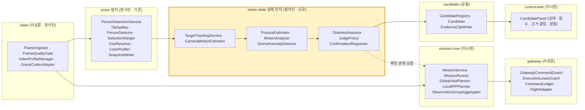
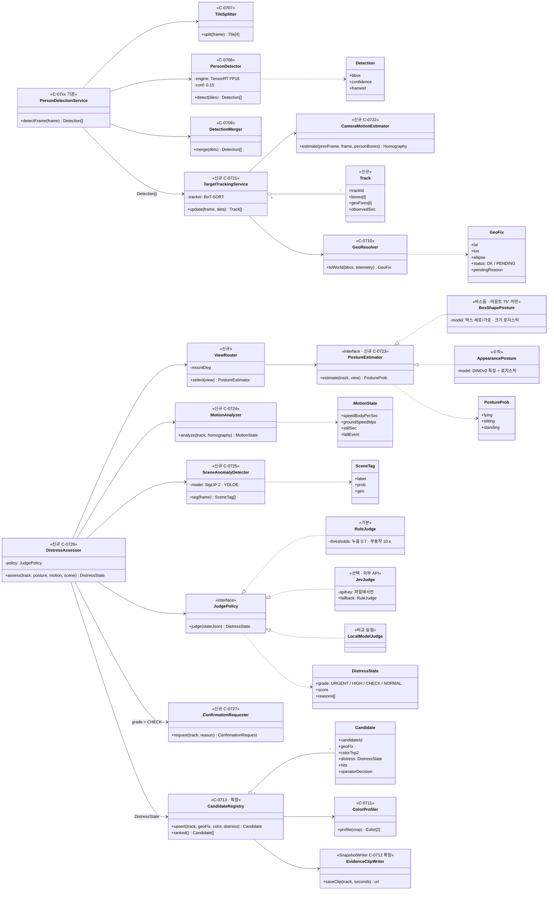
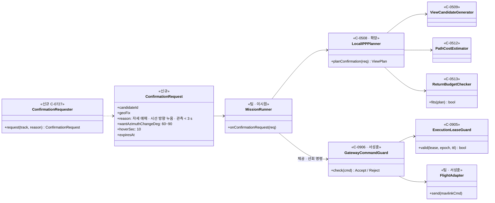
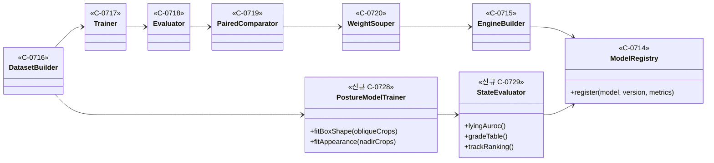

> [!summary] 바뀐 한 가지 — **"사람 탐지" 위에 "상태 인지 층"을 얹는다**
> - 피드백: "어려운 것을 다 빼면 차별점이 없다" → 자세 + 움직임 + 주변 상황으로 **도움이 필요한 사람을 먼저** 보여준다
> - 기존 클래스(C-0505 ~ C-0720)는 **그대로** — 탐지기 · 좌표 · 관측 · 명령 검증 흐름은 바뀌지 않는다
> - 새 클래스는 **후보를 지우지 못하고 순위만 바꾼다** (틀려도 사람 후보는 남는다 · 최종 판단은 운영자)
> - 애매하면 **IPP 에 확인 관측을 요청**한다 (방위를 바꿔 다시 보기 · 짧은 체공)
> 근거 실측 → [[06 요구조자 상태 인지 계획]] (누움 AUROC 점수 0.73 vs 탐지 확신도 0.15)

# 1. 패키지 한 장 — 무엇이 새로 들어가나

| 피드백 | 설계 반영 | 클래스 |
|---|---|---|
| 자세 라벨 데이터로 요구조자 판단 | 시점별 자세 판정 (비스듬 = 박스 모양 · 수직 = 외형) | `PostureEstimator` · `ViewRouter` |
| 주시 중인 사람의 속도 변화 (낙상) | 드론 움직임을 뺀 속도 · 무동작 시간 · 추정 키 급락 | `CameraMotionEstimator` · `MotionAnalyzer` |
| Jev 로 비정상 상황 판단 | 판정을 **교체 가능한 정책**으로 — 규칙(기본) · Jev · 로컬 모델 | `JudgePolicy` 인터페이스 |
| 구조가 필요한 상황 인지 | 장면 태그 (전복 · 사고 · 연기) | `SceneAnomalyDetector` |

# 2. 클래스 다이어그램 — 탐지 → 상태 인지 → 후보 (비전)

**설계 원칙**
- **순위만 바꾼다** — `DistressAssessor` 는 `CandidateRegistry.upsert()` 에 상태를 **붙일** 뿐, 후보를 만들거나 지우지 못한다. 후보 생성은 기존처럼 탐지 + 병합이 한다
- **전략(Strategy) 두 곳** — 자세는 `ViewRouter` 가 마운트각으로 `BoxShapePosture` / `AppearancePosture` 를 고르고, 판정은 `JudgePolicy` 구현을 갈아 끼운다 (Jev 는 승인·통신이 없으면 `RuleJudge` 로 돌아간다)
- **입력은 JSON 하나** — `JudgePolicy.judge(stateJson)` 은 영상을 받지 않는다 → 영상이 서버 밖으로 나가지 않고, Jev(텍스트 전용)도 같은 자리에 들어간다
- **추적이 상태의 전제** — 속도·무동작 시간은 같은 사람을 이어 봐야 나온다 → `TargetTrackingService` 가 드론 움직임 보정(`CameraMotionEstimator`)과 함께 먼저 돈다 (실측: 보정 전 이동/정지 AUROC 0.56 → 보정 후 0.93)
- **탐지 속도 영향 없음** — 상태 인지는 추적된 사람 크롭·박스·1초 1장 장면만 본다 (NFR-V01 · V02 그대로)

# 3. 클래스 다이어그램 — 확인 관측이 비행까지 가는 길 (팀 클래스와 연결)

- 확인 관측도 **보통 명령과 같은 검증**을 거친다 (실행 권한 · 유효기간 · 제어 세대) — 상태 인지 층이 비행을 직접 움직이지 않는다
- `ReturnBudgetChecker` 가 복귀 여유를 먼저 본다 → 배터리가 모자라면 확인 관측은 버리고 후보에 "확인 못 함" 만 남긴다
- 왜 방위를 바꾸나: 45° 시점에서 **시선 방향으로 누운 사람**은 박스가 선 사람과 비슷하다 → 다른 방향에서 보면 누운 사람만 모양이 바뀐다

# 4. 오프라인 (학습 서버) — 상태 모델도 같은 줄에

- 상태 모델(박스 로지스틱 · DINOv2 선형)도 **장소 분리 평가** 후 `ModelRegistry` 에 버전으로 올린다 — 운용 서버는 버전을 보고 불러온다

# 5. 새 클래스 표 (설계명세서 4.4 에 넣을 형식)

| ID | 클래스 | 책임 | 주요 속성 | 주요 연산 |
|---|---|---|---|---|
| C-0721 | `TargetTrackingService` | 프레임 간 같은 사람 잇기 · 추적별 박스·좌표 이력 | BoT-SORT 설정 · 최대 끊김 | `update(frame, dets) → Track[]` |
| C-0722 | `CameraMotionEstimator` | 사람을 가린 배경으로 프레임 간 호모그래피 → 드론 움직임 | 특징점 수 · RANSAC 임계 | `estimate(prev, cur, boxes) → H` |
| C-0723 | `PostureEstimator` (+ `ViewRouter`) | 시점별 자세 확률 | 마운트각 · 모델 버전 | `estimate(track, view) → {누움, 앉음, 서기}` |
| C-0724 | `MotionAnalyzer` | 보정 속도 · 무동작 시간 · 낙상(추정 키 급락) | 정지 임계 0.25 몸높이/s · 창 3 s | `analyze(track, H) → MotionState` |
| C-0725 | `SceneAnomalyDetector` | 장면 태그 (전복 · 사고 · 연기) · 위치 | 문장 목록 · 임계 | `tag(frame) → SceneTag[]` |
| C-0726 | `DistressAssessor` (+ `JudgePolicy`) | 상태 JSON → 등급 · 점수 · 근거 | 판정 정책 (규칙 · Jev · 로컬) | `assess(...) → DistressState` |
| C-0727 | `ConfirmationRequester` | 애매한 후보 → 확인 관측 요청 | 요청 유효기간 · 최대 횟수 | `request(track, reason)` |
| C-0728 | `PostureModelTrainer` | 자세 모델 학습 (오프라인) | 학습 묶음 · 장소 분할 | `fitBoxShape()` · `fitAppearance()` |
| C-0729 | `StateEvaluator` | 상태 인지 평가 (오프라인) | 평가셋 | `lyingAuroc()` · `trackRanking()` |
| 확장 C-0713 | `CandidateRegistry` | 상태를 붙이고 **점수 순 정렬** | — | `ranked()` |
| 확장 C-0712 | `EvidenceClipWriter` | 근거 클립 (전후 몇 초) 저장 | 클립 길이 | `saveClip(track, s)` |
| 확장 C-0508 | `LocalIPPPlanner` | 확인 관측 계획 (방위 변경 · 체공) | — | `planConfirmation(req)` |

**DB 영향 (이시원 ERD)** — `candidate` 에 `distress_grade` · `distress_score` · `distress_reasons(json)` · `judge_policy` · `evidence_clip_uri` · `track` 테이블 (track_id · candidate_id · 시작/끝 · 관측 초) · `confirmation_request` (요청 · 결과)

**요구명세 영향** — UC-0705 "시스템은 자세를 자동 분류하지 않으며" → **"상태 추정은 우선순위 보조이며 후보를 제외하지 않는다 · 최종 판단은 운영자"**

## 연결
[[06 요구조자 상태 인지 계획]] · [[결정 - 자세 판별 제외]] (09-30 재검토 중) · 설계명세서 `보고서/3.설계명세서_v0.4.md` 4.2 · 4.4
