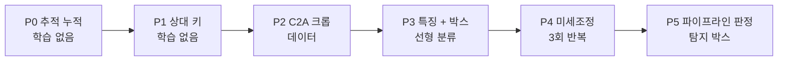

> [!done] 결과 (10-03) → [[자세 판별 P0~P5 - C2A·상대 키·미세조정·파이프라인]]
> - P0 추적 누적 ✅ (정답 박스) · P1 상대 키 ❌ · P2 C2A ❌ (앉음 F1 −0.47) · P3 ❌ (앉음 붕괴) · P4 ❌ (AI-Hub 만 오름)
> - 파이프라인: 탐지 박스 한 장 누움 0.983 ↔ 5초 중앙값 0.800 — **추적 ID 바뀜**이 이력을 오염 → 다음은 ID 바뀜 대책

> [!summary] 자세 판별 학습 계획 (P0~P5) — **누움은 거의 됐고, 앉음 · 실전 박스 · 시간 누적이 남았다**
> - 지금: 시점별 경로 판정 누움 AUROC **수직 0.93~0.99 · 비스듬 0.95~0.97** (정답 박스) → [[06 요구조자 상태 인지 계획]]
> - 남은 약점: ① **앉음** (비스듬 F1 ≤ 0.56) ② **탐지 박스**에서는 아직 안 재봄 ③ 한 장씩 판정 (추적 누적 X) ④ 비스듬 **고르기용 평가셋이 Okutama 뿐** (10-01 누수)
> - 순서: **학습 없이 되는 것 먼저** (P0 누적 · P1 상대 키) → 데이터 (P2 C2A) → 학습 (P3 특징 분류기 · P4 미세조정 3회 반복) → P5 파이프라인 판정
> - GPU 합계 약 **2~3 시간 (연기 실행 기준 추정)** — `chain_p.sh` 하나 (처음 10~14 시간 추정은 과대)

## 지금 위치 (10-01 실측)

| 평가셋 | 시점 | 누움 AUROC | 매크로 F1 | 약점 |
|---|---|---:|---:|---|
| AI-Hub 산악5 (3,615) | 수직 | 0.992 (DINOv2 선형) | 0.868 | — |
| Okutama 비스듬 (10,508 · 누움 268) | 비스듬 | 0.970 (박스 모양) | 0.39~0.56 | **앉음** |
| Okutama 수직 (2,116 · 누움 94) | 수직 | 0.926 (DINOv2 선형) | 0.471 | 앉음 · 표본 적음 |
| 파이프라인 (탐지 soup_v9x2) | 비스듬 | 점수 0.771 · 추적 0.78 | — | 누운 사람 탐지 0.47 |

## 원칙 (10-01 누수 · 09-26 반복 흔들림에서 배운 것)

- **Okutama 는 판정만** — 조합 · 임계 · 에폭을 Okutama 로 고르지 않는다
- 고르기 = **출처 하나 빼고 교차검증** (SARD · NOMAD · C2A 중 하나씩 빼고 학습 → 뺀 출처에서 평가). 같은 출처끼리 5겹 교차검증 금지 (분할 누수)
- 1차 지표 = **누움 AUROC** (순위용) · 2차 = 앉음 F1 · 매크로 F1 — 95 % 구간은 영상 · 고도 블록 부트스트랩 (`eval_posture.metrics`)
- 학습하는 모델은 **3회 반복** → 반복 차이보다 커야 개선
- 개선 = 한 평가셋 구간 > 0 **그리고** 나머지 두 평가셋에서 유의하게 나빠지지 않음

## 단계

| 단계 | 무엇 | 왜 | 판정 (돌리기 전에 정함) | GPU (추정) |
|---|---|---|---|---|
| **P0** 추적 누적 | 같은 추적의 자세 확률을 3 · 5초 창으로 평균 (로그 확률 평균) | 한 장 판정은 박스 흔들림에 약하다 — 누적은 공짜 | 추적 단위 누움 AUROC · 앉음 F1 이 한 장보다 구간 > 0 | ~1 h (`state_pipeline` 재사용) |
| **P0b** 탐지 박스 | 정답 박스 대신 탐지 박스(soup_v9x2)로 자세 평가 | 실전 하락 폭을 먼저 안다 | 기록만 (하락 > 0.05 면 P3 에 탐지 박스로 학습 추가) | 같이 |
| **P1** 상대 키 | 박스 높이 ÷ 같은 영상 · 같은 화면 높이(y)의 사람 박스 높이 중앙값 — **라벨 안 씀** | 앉음 ≈ 선 키의 절반대 — 박스 모양(가로세로)으로 못 가르는 앉음 · 서기를 키로 가른다. 운용에선 GeoResolver **추정 키 h** 로 바꾼다 | 비스듬 앉음 F1 이 박스 모양 대비 구간 > 0 · 임계는 SARD 로만 맞춤 | CPU |
| **P2** C2A 크롭 | 합성 재난 배경 36만 명 · 5자세 균등 → **긴 변 ≥ 24 px 만** (약 27 % ≈ 9.6만) · 누움 · 앉음(+무릎 꿇음) · 서기 · 굽힘은 뺌 | 비스듬 · 앉음 외형 데이터가 부족 (SARD 앉음 621 · NOMAD 앉음 0) | 출처 빼기 교차검증에서 C2A 를 넣으면 SARD · NOMAD 성능이 오르는가 | 크롭 ~30 min |
| **P3** 특징 + 박스 | DINOv2 · SigLIP 2 특징 + 박스 모양 + 상대 키 → 로지스틱 · 시점별 2개 | 10-01 최고 조합들 + P1 · P2 를 같은 틀에서 | 조합은 출처 빼기 교차검증으로 고름 → Okutama 에서 한 번만 판정 | ~2 h (특징 뽑기) |
| **P4** 미세조정 | DINOv2 **ViT-B** 마지막 블록 4개 + 시점별 머리 2개 · 224 px · 수직 AI-Hub · 비스듬은 P3 가 고른 출처 · 자세 균형 표집 · **3회 반복** | 선형으로 못 넘는 외형 차이 (앉음) — 10-01 YOLO cls 미세조정은 앉음 붕괴 → 백본 일부만 풀고 머리를 시점별로 | 3회 반복 범위 밖으로 P3 보다 좋은가 · 앉음 붕괴(재현율 < 0.2) 없음 | 3 × 2~3 h |
| **P5** 파이프라인 | 가장 좋은 판정기를 `state_pipeline` 에 넣고 soup_v9x2 탐지로 다시 | 최종 쓰임은 순위 | 점수 누움 AUROC 0.771 → 구간 > 0 · 🔴/🟠 등급 분포 기록 | ~1 h |

## 실행 (10-03 · 결과 보기 전에 확정)

| 단계 | 스크립트 | 확정한 설정 |
|---|---|---|
| P1 · P2 데이터 | `posture_v2_data.py` | C2A 3.6만 (자세별 1.2만) · 상대 키 표 `relh.csv` (자세 라벨 안 씀) |
| P0 · P1 · P3 | `posture_v2.py p3` | 비스듬 7 조합 × {SN · SNC} → **출처 빼기 점수** 최고 · 수직 {dino · box+dino} × {A · AC} → 산악8 매크로 F1 최고 · 로지스틱 C 고정 |
| P4 | `posture_ft.py --seed=0·1·2` | 8 에폭 × 3만 장 고정 · (머리 × 자세) 균형 · 출처는 P3 가 고른 것 |
| P4 판정 | `posture_v2.py judge4` | 채택 = 3회 모두 짝 구간 > 0 (한 평가셋 이상) **그리고** 평균 차 > 반복 폭 **그리고** 어느 평가셋도 유의하게 나쁘지 않음 **그리고** 앉음 재현율 ≥ 0.2 → P5 는 ft_s0 (미리 정함 · 고르지 않음) |
| P5 | `state_pipeline.py --posture=box·p3·ft_s0` | 탐지 soup_v9x2 · 점수 누움 AUROC + **탐지 박스 기준 자세 지표** (한 장 · 5초 중앙값) |
| 보고 | `posture_v2.py report` | `metrics/AUTO_RESULT_posture.md` |

- 고친 것: Okutama 크롭의 박스 크기가 720p 그대로 적혀 있었다 → ×1.5 (10-01 박스 크기 특징만 영향) · `eval_posture.auc` 는 동점을 처리하지 않아 확률이 전부 같으면 0 → 고르기·판정은 동점 평균 순위 AUROC
- C2A 상대 키는 결측 처리 — 크기 필터 탓에 전 자세 1.52 (의미 없음) · SARD · NOMAD 에서도 누움 0.89 vs 서기 1.08~1.10 으로 약하다 (같은 장면에 누운 사람이 섞여 기준이 "서 있는 키" 가 아님)

## C2A — 받아 두고 안 쓴 데이터 (10-03 확인)

| 항목 | 값 |
|---|---|
| 규모 | 10,215장 (train 6,129 · val 2,043 · test 2,043) · 사람 36만 명 |
| 자세 | 굽힘 6.8만 · 무릎 6.9만 · **누움 6.9만 · 앉음 6.8만** · 서기 8.7만 — 균등 |
| 크기 | 사람 긴 변 중앙값 **15 px** · 상위 10 % 30 px (영상 ~430 px) → 우리 사람(수십~100 px)보다 훨씬 작다 |
| 박스 모양 | 세로/가로 중앙값 자세마다 1.11~1.26 — **박스 모양으로는 자세 정보 없음** (위에서 본 합성 · 누움을 돌려 붙임) |
| 라이선스 | 명시 없음 → 연구용 · **git 에 올리지 않는다** |

- → C2A 는 **외형 분류기 보조 데이터**로만 (박스 모양 판정에는 안 씀) · 작은 크롭을 키우면 흐려진다 — P2 판정에서 안 되면 버린다

## 하지 않는 것

- 3클래스 탐지기 (자세를 탐지기 안에서) — 9번 실패 · [[쓰러짐 판별 도메인 이전 실패]]
- NOMAD 를 앉음 학습에 넣기 — 앉음 라벨이 없어 앉음이 무너진다 (s2 · 10-01)
- Okutama 로 임계 · 조합 고르기
- 키포인트(17관절) — 사람이 작아 4차 재현율 0.2 · 가까이 다시 볼 때만

## 그 다음 (데이터가 있어야 하는 것) → [[09 자세 데이터 확보 - UE · 높은 곳 촬영 · UAV-Human]]

- **10-03 결정**: Okutama 는 계속 평가 전용 · 앉음 데이터는 새로 만든다 (UE 합성 · 높은 곳 촬영 · UAV-Human)

- **비스듬 앉음 평가셋** — 자체 촬영 S2 (앉아서 30초) · UE 자세 × 방위 스윕 → [[05 실기체 적용 - 자체 촬영]]
- 45° **시선 방향 누움** (선 사람과 박스가 같다) → 방위 바꿔 재관측 (IPP 확인 관측) — 학습으로 못 푼다
- UAV-Human (`sitting` · `lying down` · `falling`) 신청 — 고도가 낮아 사람이 크다 · 확인 필요

## 결정 필요

- [x] P0~P5 체인 — 10-03 사용자 요청으로 실행 (P4 포함)

## 연결

[[06 요구조자 상태 인지 계획]] · [[자세 크롭 분류 기준선 - 장소 분리]] · [[07 객체지향 설계 v2 - 상태 인지 반영]] · [[_학습 큐]] · [[결정 - 자세 판별 제외]]
