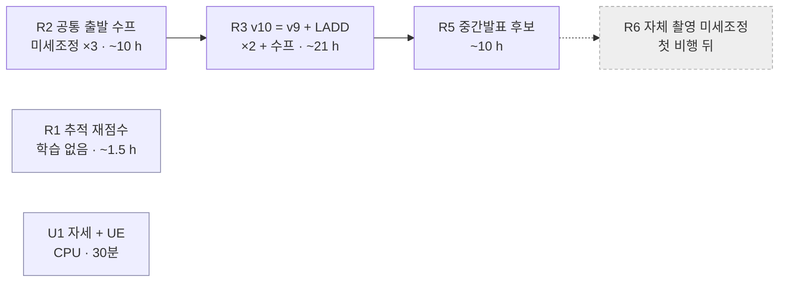
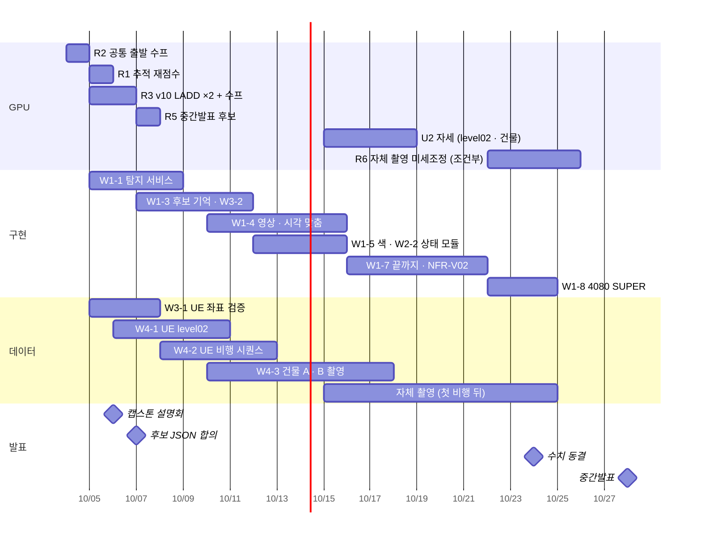

> [!summary] 10-04 → 10-28 중간발표 — **핵심 경로는 학습이 아니라 구현**이다
> - 중간발표 = "실기체 제외 전 시스템" → 영상 받기 → 탐지 → 좌표 → **후보 기억** → 상태 · 색 → 관제 JSON 이 **한 줄로 돌아야** 한다. 지금 모듈로 있는 건 좌표(`geo_resolver.py`) 뿐
> - GPU 는 뒤에서 돈다 — 먹힌 레버 두 개만: **데이터 (LADD)** · **반복 평균 (공통 출발 수프)** + **추적 기반 재점수** (학습 없음)
> - 자세 분류기는 새 데이터가 들어온 뒤 (UE level01 도착 · level02 · 건물 촬영)

## 10-04 상태

| 영역 | 지금 | 다음 |
|---|---|---|
| 탐지기 | 공식 **soup_v7r2** (obl 0.6331 · v2 0.5927 · kr 0.968 · 18.9 ms) · 상태 인지용 **soup_v9x2** (누움 재현율 0.50) | R2 · R3 · R5 |
| YOLO26m (Q2) | ❌ 기각 — 수프가 숲 +2.8 · 비스듬 −1.8 · 한국 −1.9 %p (셋 다 유의) · 1회차 숲 +3.9 %p 는 2회차에서 재현 안 됨 → [[YOLO26m 탐지기 Q2 - 기각]] | 막다른 길 |
| 추적 (Q1) | ✅ 문턱 0.15 + ID 바뀜 끊기 → 점수 누움 AUROC 0.78 → 0.95 | R1 재점수 |
| 자세 | 박스 모양 로지스틱 — 누움 AUROC 0.97 (순위는 됨) · 누움 정밀도 0.14 · **앉음 재현율 0.09** | U1 (UE) |
| 좌표 | GeoResolver 합성 중앙 2.0 m · UE 검증 안 함 | W3-1 |
| 구현 | GeoResolver 만 모듈 · 탐지 · 추적 · 상태는 평가 스크립트 안에 흩어짐 | W1 · W2 |

## 10-04 새로 안 것 — 외부 평가셋 · UE level01

soup_v7r2 · 임계 0.15 · 자세한 것 → [[외부 평가셋 - LADD·AU-AIR·키프로스·UE level01]]

| 셋 | 조건 | 재현율 IoU 0.5 / 0.3 | 사람 긴 변 중앙 | 해석 |
|---|---|---|---|---|
| **LADD** (러시아 숲 수색 · **GPL-3.0**) | 1,365장 · 4:3 → 16:9 1080p | **0.71 / 0.78** | 35 px | test_v2 (숲) 와 비슷 · **학습에 써도 되는 라이선스** · 장소 태그 없음 |
| AU-AIR (덴마크 도로 · 10~30 m · 45~90°) | 1,694장 | 0.26 / 0.49 | 81 px | ⚠ 정답 박스가 **헐렁하고 어긋남** (표본 육안) → 재현율 판정에 못 씀 · **사람 없는 장 오탐 3.24 건/장** (둥근 교통 표지 · 기둥) |
| 키프로스 SOP (CC BY 4.0) | 3,136장 · 수직 | 0.39 / 0.57 | 15 px | 운용 하한 24 px 아래 — 작은 사람 스트레스 전용 |
| UE level01 (합성 · 회색 바닥) | 2,813장 · 45/60/75° · 16~30 m | 0.90 | 46 px | 오탐 15,109 중 **배경은 3,046 (1.1 건/장)** · 나머지는 박스 크기 어긋남 9,386 · 중복 2,677 → UE 박스 규칙 확인 전 탐지 학습에 안 씀 |

> [!warning] 오탐 기준 (NFR-V06 ≤1 건/장) — 우리 음성셋은 0.46 이지만 **도로 시설물이 있는 장면은 3.24**
> 시연 구역에 도로 · 표지판이 있으면 위험 → 후보는 **확정 추적만** 올린다 (R1 · W1-3) · 도로 음성은 자체 촬영으로 보강

## 작업 (W) — 마감 · 완료 기준

### W1 실시간 비전 서비스 — 중간발표 핵심

| # | 작업 | 마감 | 완료 기준 |
|---|---|---|---|
| W1-1 | `PersonDetectionService` — 타일 4장 · TensorRT · 병합 · `detect(frame)` | 10-08 | test_obl AP50 이 `eval_test_v2.py` 와 ±0.003 · 한 장 ≤30 ms |
| W1-2 | **후보 JSON 규격** (이시원) | 10-07 | 합의 문서 — 후보 id · 좌표 · 오차 타원 · 좌표 상태 (VALID · PENDING) · 확신도 · 관측 횟수 · 색 1·2순위 · 상태 등급 · 스냅샷 |
| W1-3 | `CandidateRegistry` — 추적 확인 (R1 규칙) + **세계 좌표 후보 기억** (오차 타원 안이면 같은 후보 · 화면 밖에서도 유지 · 증거 모자라면 재관측 요청) | 10-11 | 시뮬레이션 (W3-2) → UE 비행 (W4-2): 같은 사람 중복 후보율 · 잘못 합침률 |
| W1-4 | `FrameIngestor` · `TimeSync` · `FrameQualityGate` — H.264 + MAVLink 기록 · 시각 맞춤 · 깨진 · 오래된 장 버림 | 10-15 | UE/SITL 영상 + 비행 기록으로 끝까지 |
| W1-5 | `ColorProfiler` — Lab 12색 · 1·2순위 | 10-15 | UE 배우 옷 색 정답 (W4-1) · 1·2순위 안에 맞힘 ≥0.8 (제안) |
| W1-6 | `SnapshotWriter` · 근거 클립 | 10-18 | 후보마다 크롭 + 전후 3초 |
| W1-7 | **끝까지 연결** — UE 비행 영상 → 후보 JSON → 백엔드 | 10-21 | NFR-V02 (수신부터 ≥5 FPS) 실측 · 후보가 관제 지도에 뜸 |
| W1-8 | 운용 장비 4080 SUPER — 엔진 재빌드 · NFR-V01 · V02 재측정 | 10-24 | |

### W2 상태 인지 — 차별점

| # | 작업 | 마감 | 완료 기준 |
|---|---|---|---|
| W2-1 | R1 추적 기반 재점수 → 채택되면 W1-3 에 넣음 | 10-06 | 아래 R1 판정 |
| W2-2 | 상태 모듈화 — `TargetTrackingService` · `PostureEstimator` (시점 경로) · `MotionAnalyzer` · `DistressAssessor` | 10-15 | `state_pipeline.py` 와 같은 점수 |
| W2-3 | 규칙 등급 다시 맞추기 — 🔴 가 한 번도 안 뜸 | 10-18 | UE 무동작 누움 시나리오 · 10초 관측 안 재현율 ≥0.9 ([[06 요구조자 상태 인지 계획]] 목표) |
| W2-4 | 후보 카드 표시 (등급 · 점수 · 근거) | 10-22 | 이시원 화면에 뜸 |
| W2-5 | 시연 클립 다시 만들기 (Q1 설정 · soup_v9x2) | 10-24 | |
| 선택 | 장면 이상 C1 · Jev 비교 | 중간발표 뒤 | |

### W3 좌표 · 검증

| # | 작업 | 마감 | 완료 기준 |
|---|---|---|---|
| W3-1 | **UE 좌표 검증** — `ue_geo_validate.py` (Drone-local) | 10-08 | 45° · 16~30 m 수평 오차 표 (NFR-V04 10~15 m) |
| W3-2 | 세계 좌표 묶음 문턱 시뮬레이션 — 오차 중앙 2.0 m · P95 4.7 m · 사람 간격 · 지나간 횟수 | 10-07 | 중복 · 잘못 합침이 가장 적은 문턱 |
| W3-3 | UE level01 탐지 — 자세 × 마운트 × 고도 재현율 표 · 박스 어긋남 원인 | 10-06 | CPU · 16~20 m 권장 근거 |

### W4 데이터 · 촬영

| # | 작업 | 누가 | 마감 |
|---|---|---|---|
| W4-1 | UE **level02** — 풀 · 나무 · 가림 (**평가 전용**) + 서기 (Idle) · 무릎 꿇기 · X Bot 비중 줄이기 · **배우별 옷 색 기록** | Drone-local | 10-10 |
| W4-2 | UE **비행 시퀀스** — 45° · 16 / 20 m 지그재그 · 1080p 초당 10장 + 장마다 기체 자세 · 위치 + 배우 위치 정답 | Drone-local | 10-12 |
| W4-3 | 높은 곳 촬영 — 건물 A (학습 · 검증) · 건물 B (평가 전용) · 동의서 · 옥상 허가 → [[09 자세 데이터 확보 - UE · 높은 곳 촬영 · UAV-Human]] | 사용자 · 팀 | 10-17 |
| W4-4 | 자체 촬영 규약 · CVAT 선라벨 파이프라인 → [[05 실기체 적용 - 자체 촬영]] | 정서인 | 첫 비행 전 |
| W4-5 | UAV-Human 신청 | 사용자 | 이번 주 |

### W5 문서 · 팀

| # | 작업 | 마감 |
|---|---|---|
| W5-1 | 캡스톤 설명회 — 실기체 · 예산 질문 | 10-06 |
| W5-2 | 서성훈 — 영상 규격 (1080p · 초당 10장 · 키프레임 1초) · 짐벌 피치 피드백 · SITL · **첫 비행 날짜** | 10-07 |
| W5-3 | UC-0705 개정 ("상태 추정은 우선순위 보조 · 최종 판단은 운영자") · SDD 상태 인지 클래스 · `recordJudgement` 에 "쓰러짐 의심" 되살리기 | 10-14 |
| W5-4 | 중간발표 비전 슬라이드 · **수치 동결 10-24 18:00** | 10-26 |
| W5-5 | 서버 컨테이너 `app.vision_worker` (10-04 15:30~ · "검증된 모델 · 영상 파이프라인 대기" 상태) — 누가 띄웠는지 · 우리 모듈을 어떻게 넣을지 | 10-07 |

## 학습 · 실험 (R) — 판정 기준은 돌리기 전에

| # | 실험 | 바꾸는 것 (하나) | GPU | 판정 (미리 정함) |
|---|---|---|---|---|
| **R1** | 추적 기반 재점수 | 확신도 0.05~0.15 탐지를 **확정 추적** (최근 1초 안에 ≥0.15 한 번)에 붙을 때만 살림 · 탐지기 soup_v7r2 · soup_v9x2 | ~1.5 h | Okutama 비스듬 23편 — A (짝수 12) 에서 낮은 문턱 {0.05 · 0.08 · 0.10} × 창 {0.5 · 1 · 2초} 고름 → **B (홀수 11)** 에서 현행 (프레임마다 ≥0.15) 과 영상 블록 짝 부트스트랩 2,000회 → 채택 = **같은 장당 오탐에서 프레임 재현율 차 구간 > 0** 그리고 분당 거짓 추적 · 3초 안 찾을 확률이 유의하게 나쁘지 않음 · 초당 10장 (운용과 같음) |
| **R2** | 공통 출발 미세조정 수프 | 출발점 soup_v9x2 → 10 에폭 · lr0 0.002 · warmup 1 에폭 · v9 목록 순서 3개 (s41 · s42 · s43) → 3개 평균 · 3개 + 원본 평균 | ~10 h | soup_ft vs soup_v9x2 — 한 평가셋 이상 구간 > 0 · 평균 차 > v9 반복 폭 (obl 3.1 · v2 1.8 · kr 0.9 %p) · 유의 손해 없음 · 너비비 ≤0.92 · **붕괴 없음** (kr 이 재료보다 3.4 %p 넘게 낮지 않음) · 같이 기록: 재료끼리 BN 통계 거리 (무너진 v7_r3 · v9x2b · v9x4 와 비교 → 붕괴 원인 정리) |
| **R3** | v10 = v9 + LADD | LADD 를 HERIDAL 과 같은 방식으로 (16:9 1080p → 크롭) · 이미지 번호 뒤 30 % (경계 50장 버림) 는 참고 평가로 남김 · 목록 순서는 v9 와 같은 s31 · s32 | ~21 h | 짝 (v9_s31 : v10_s31 · v9_s32 : v10_s32) — Q2 와 같은 규칙 · 수프 soup_v10x2 vs soup_v9x2 도 같은 규칙 · 참고: LADD 뒤 30 % · AU-AIR 사람 없는 장 오탐 · 누움 · 가림 재현율 |
| **U1** | 자세 + UE | 박스 모양 로지스틱에 UE 크롭 추가 → 앉음 출처 2개 (SARD · UE) — **출처 빼기가 처음 성립** | CPU | Okutama 비스듬 (잠정): 앉음 F1 구간 > 0 · 누움 AUROC 유의 손해 없음 · rel_az 별 누움 박스 모양 (시선 방향 누움) · **최종 판정은 건물 B** |
| **R5** | 중간발표 탐지기 후보 | R3 통과 → R2 방식을 soup_v10x2 위에 · 아니면 R2 결과 그대로 | ~10 h | soup_v7r2 대비 같은 규칙 → 통과하면 교체 · 아니면 공식 soup_v7r2 + 상태 인지 soup_v9x2 유지 (10-24 동결) |
| 예비 | v10 반복 3 · 4회 | R3 통과 시 | ~21 h | R2 방식 4개 수프 |
| **R6** | 자체 촬영 | 한국 산지 45° | 첫 비행 뒤 | test_own = NFR-V03 공식 판정 후보 · 이어 학습 vs 처음부터 ×2 |
| 보류 | 도로 시설물 음성 | AU-AIR 라이선스 미확인 → 자체 촬영 도로 장면으로 | | |

**하지 않는 것**: 구조 · 손실 바꾸기 (11l · P2 · NWD · **YOLO26m**) · 60 에폭 · BN 재계산 · 조건 안 맞는 데이터 · TTA (추론 2배 → 30 ms 넘음) · 단안 깊이 · SLAM 지도 · TrackFormer (10-04 테슬라식 설계안 검토 — 1번 추적 · 시계열만 범위를 줄여 채택 = R1 · W1-3)

## 일정

**중간발표 뒤 (→ 11-25 최종)**: R6 자체 촬영 미세조정 · test_own 으로 NFR-V03 공식 판정 · 상태 규칙을 자체 촬영으로 다시 맞춤 · 실기체 연결 · 시연 영상

## 위험

| 위험 | 대응 |
|---|---|
| 첫 비행 · 자체 촬영 지연 | 중간발표는 UE/SITL + 공개 데이터 수치 · R6 은 11월 |
| NFR-V03 0.80 — 공개 데이터로 미달 (0.59~0.66) | 경과 + test_own 계획으로 설명 · 공식 판정셋 팀 합의 |
| 도로 장면 오탐 3배 (AU-AIR) | 확정 추적만 후보 (R1) · 시연 구역 확인 · 자체 촬영 도로 음성 |
| UE 박스가 탐지 박스와 어긋남 | 탐지 학습에 안 씀 · 자세에 쓸 때 박스 규칙 확인 (W3-3 → U1) |
| 다른 세션과 같은 파일 동시 편집 | `_학습 큐` 에 먼저 적고 · 편집 전 `git pull` |
| 컨테이너가 GPU 를 같이 씀 | W5-5 확인 · 학습 중이면 느려짐 |

## Drone-local 다음 지시 (제안 — 사용자 확인 후 보냄)

1. `ue_geo_validate.py` 실행 → W3-1 (30분)
2. level02 — 풀 · 나무 · 가림 · 평가 전용 · 서기 (Idle) · 무릎 꿇기 · 배우별 옷 색 기록 → W4-1
3. 비행 시퀀스 — 45° · 16 / 20 m 지그재그 · 1080p 초당 10장 + 장마다 자세 · 위치 + 배우 위치 정답 → W4-2

## 결정 필요 (사용자)

- [ ] chain_r 시작 (R2 → R3 → R5) · R1 은 스크립트 준비되면 같이
- [ ] Drone-local 지시 3건
- [ ] 서버 컨테이너 `app.vision_worker` 주인 · 연결 방식
- [ ] 건물 A · B 촬영 날짜 · UAV-Human 신청 · AI-Hub API 키 교체 (밀림)
- [ ] 중간발표 탐지기 — R5 규칙대로 자동 교체해도 되는지

## 연결

[[_학습 큐]] · [[다음 할 일]] · [[06 요구조자 상태 인지 계획]] · [[07 객체지향 설계 v2 - 상태 인지 반영]] · [[09 자세 데이터 확보 - UE · 높은 곳 촬영 · UAV-Human]] · [[05 실기체 적용 - 자체 촬영]] · [[외부 평가셋 - LADD·AU-AIR·키프로스·UE level01]] · [[YOLO26m 탐지기 Q2 - 기각]]
