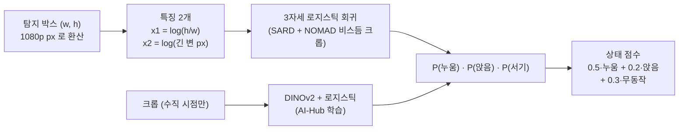

> [!summary] 자세 판별 한 장 정리 — **지금은 탐지 박스의 세로/가로 비와 크기만 본다** (카메라 각도 · 고도 · 화면 위치를 안 쓴다)
> - 누운 사람을 **위로 줄 세우는 건 잘한다** (비스듬 누움 AUROC 0.97) · **딱 잘라 판정하면 틀린다** (누움 정밀도 0.14 · 앉음 재현율 0.09)
> - 구조적 오차: ① **시선 방향으로 누우면 서 있는 사람과 박스가 같다** (45° 에서 세로/가로 3.06 으로 똑같음) ② 같은 화면 안에서도 내려다보는 각이 20~70° 로 바뀌는데 특징에 없다 ③ 수직 90° 에선 세로/가로가 무의미
> - 외형 모델 (DINOv2 미세조정 · SigLIP 2 · 합성 C2A · 범용 VLM · Clef) 은 비스듬에서 박스 모양을 못 넘었다 — 원인은 방법보다 **비스듬 자세 데이터 부족** → Archangel 로 DINOv2 재시도 (A6)
> - 다음: **Archangel** (실제 사람 · 고도 15~50 m · 방위 360°) 로 오차를 고도 × 방위별로 재고 → **추정 키 (m) · 방위에 따른 모양 변화 · 다시 보기** 를 넣는다

## 1. 지금 방식 (`posture_runtime.py` · `posture_fusion.box_feat`)

| 항목 | 지금 |
|---|---|
| 시점 나누기 | 비스듬 → **박스 모양** · 수직 90° → **DINOv2 외형** (마운트각으로 고름 · `ViewRouter`) |
| 쓰는 정보 | 박스 세로/가로 비 · 긴 변 px (거리 대용) |
| **안 쓰는 정보** | 카메라 각도 · 고도 · 화면 속 행 (내려다보는 각) · 실제 크기 (m) · 방위 · 여러 장 |
| 판정 빈도 | 추적마다 1초에 한 번 · **지금 한 장만** (여러 장 누적은 추적 ID 바뀜에 오염 → Q1) |
| 학습 데이터 | SARD (서기 · 걷기 · 앉음 285 · 누움 984) + NOMAD (걷기 · 누움) — **진짜 비스듬 앉음이 거의 없다** |

## 2. 기하 원리 — 왜 박스 비가 자세를 말해 주나 · 언제 거짓말하나

비스듬히 내려다보는 각 φ 에서 (몸 1.7 m × 폭 0.45 m × 두께 0.25 m 단순 모형):
- 서 있는 몸 → 화면 세로 ≈ 키 × **cos φ** (기울어 보여 짧아짐) · 가로 ≈ 몸 폭
- 땅에 누운 몸 → **시선 방향** 길이는 × **sin φ** 로 줄고 · 시선과 직각인 길이는 그대로

| φ (화면 속 위치) | 서기 세로/가로 | 누움 · **시선 방향** (머리가 카메라 쪽) | 누움 · 시선과 직각 |
|---|---:|---:|---:|
| 20° (화면 위쪽 · 먼 곳) | 3.74 | 1.81 | 0.23 |
| **45° (가운데)** | **3.06** | **3.06 ← 서기와 같음** | 0.29 |
| 70° (화면 아래쪽 · 가까운 곳) | 1.81 | **3.74 ← 서기보다 길쭉** | 0.30 |

![[fig_자세_박스비_방위.svg]]

- 빨간 선 = 누운 사람 (방위에 따라) · 파란 선 = 서기 · 초록 점선 = 앉음 — **빨간 선이 파란 선과 만나는 곳이 사진 한 장으로는 못 가리는 곳**
- 45° 장착 · 수직 화각 약 49° → 한 화면 안에서 내려다보는 각이 **약 20° ~ 70°** — 같은 자세도 화면 위치에 따라 비가 2배 넘게 바뀐다
- 수직 90° → 서 있으면 머리·어깨만 (≈ 1:1) · 누우면 방위와 상관없이 길쭉 (긴 변/짧은 변 ≈ 3.8) → 그래서 수직은 **길쭉함 · 외형** 으로 판정

## 3. 측정된 성능 · 오차

| 시험 | 결과 | 근거 |
|---|---|---|
| Okutama 비스듬 정답 박스 10,508 (누움 268 · 앉음 1,564 · 서기 8,676) | 누움 AUROC **0.97** · 서기 오인 10 % 에서 누움 재현율 0.96 | `posture_fusion.json` |
| 같은 데이터 · 가장 높은 확률로 판정 | **누움 정밀도 0.14** (누움 1,884 중 진짜 257) · **앉음 재현율 0.09** · 매크로 F1 0.39 | 누운 사람이 2.5 % 뿐 → 오인 10 % 도 진짜보다 많다 |
| 파이프라인 (탐지 박스 · soup_v9x2 · Q1 추적) | 점수 누움 AUROC **0.95** (판정 영상 B) · 탐지 박스 한 장 누움 AUROC 0.98 | [[추적 고치기 Q1 - 추적 문턱·ID 바뀜 끊기]] |
| 시험 1 크롭 (비스듬 120 · 수직 90) | 박스 0.968 · 수직 DINOv2 1.000 | [[상태 판단 모델 비교 - Qwen3-VL · Clef · GPT-6 Luna]] |
| 수직 Okutama | DINOv2 누움 AUROC 0.93 · 박스 길쭉함 0.81 | [[06 요구조자 상태 인지 계획]] |

**오차가 나는 곳 (원인별)**

| 원인 | 결과 | 한 장으로 고칠 수 있나 |
|---|---|---|
| 시선 방향 누움 | 누운 사람을 서기로 | ❌ — 방위를 바꿔 다시 봐야 |
| 내려다보는 각 변화 (화면 위 ↔ 아래) | 같은 자세가 다른 비 | ✅ — 화소별 각도를 넣으면 |
| 앉음 · 웅크림 | 서기 · 누움 사이 · 데이터 없음 | 일부 — 추정 키 (m) + 진짜 데이터 |
| 탐지 박스 흔들림 · 가림 | 비가 튐 | 일부 — 여러 장 중앙값 (ID 바뀜 끊기 전제) |
| 드문 누움 (2.5 %) | 판정 정밀도 낮음 | 판정 대신 **순위**로 쓴다 (지금 설계) |

## 4. 해 본 것 (막다른 길 포함)

| 시도 | 결과 |
|---|---|
| 한 장 외형 3클래스 탐지기 (08~09월) | ❌ 9번 실패 → 09-13 자세 제외 → 09-30 피드백으로 "순위용 상태 층" 으로 다시 |
| YOLO cls · DINOv2 선형 · SigLIP 2 제로샷 (10-01) | 수직은 외형이 강함 (0.93~0.99) · 비스듬은 **박스 모양이 최고** |
| P1 같은 장면 상대 키 | ❌ 전부 손해 |
| P2 합성 C2A 로 앉음 보강 | ❌ **앉음 F1 −0.47** |
| P3 특징 + 박스 · P4 DINOv2 부분 미세조정 | ❌ 한국 수직만 오르고 Okutama 앉음 0.07~0.13 |
| P0 추적 누적 (5초 중앙값) | 정답 박스에선 ✅ · 실전은 **ID 바뀜 오염** (0.98 → 0.80) → 한 장 |
| 범용 VLM · 결정 모델 크롭 판단 (10-06) | Qwen3-VL 0.89 · Clef-Flash 0.92 (비스듬) — 박스 0.97 을 못 넘음 |

### 비스듬에서 DINOv2 (외형) 는 왜 안 쓰나 — 쓸 수 있지만 지금까지 박스를 못 넘었다

| 방식 (Okutama 비스듬 정답 박스) | 누움 AUROC | 앉음 재현율 | 매크로 F1 |
|---|---|---|---|
| **박스 모양만 (지금)** | **0.970** | 0.09 | 0.39 |
| ① DINOv2 선형 — **AI-Hub 수직 사진으로 학습** | 0.734 | 0.57 | 0.34 |
| ② 박스 + DINOv2 확률 | 0.973 | 0.08 | 0.36 |
| ③ P3 고른 조합 (박스 + SigLIP 2) | 0.969 (짝 차이 0.0 · 구분 안 됨) | — | 0.48 |
| ④ P4 DINOv2 부분 미세조정 (비스듬 전용 머리 · SARD + NOMAD) | — | **0.07~0.13** | 기각 |

- 이유: ① 수직으로 배운 외형은 비스듬에 안 통한다 (누운 사람이 전혀 다르게 생김) · ② **비스듬 학습 데이터가 빈약** — SARD 한 장소 · 앉음 285 · NOMAD 앉음 없음 → 미세조정이 자세 대신 **장소 · 배경을 외움** · ③ 사람 20~90 px → 224 px 로 키우면 흐림 · ④ 누움은 박스가 이미 0.97
- 그래도 필요한 곳: 박스로는 원리상 못 푸는 **시선 방향 누움** — 머리·다리가 화면 위아래로 늘어선 모양 · 땅에 닿은 몸통 · 그림자는 외형으로만 보인다
- **재시도 (A6)**: DINOv2 선형을 **Archangel 비스듬 크롭** (실제 사람 · 여러 장소 · 방위 360° · 시선 방향 누움 포함) 으로 새로 학습 → **Okutama 비스듬** 으로 판정 (장소 완전 분리) · 박스 모양과 짝 비교 · 특히 **박스가 애매한 구간** (세로/가로 1~3) 에서 이기면 그 구간에만 외형을 붙인다 (G5)

## 5. 개선 계획 — 기하를 제대로 넣는다

| # | 무엇 | 어떻게 | 필요한 것 | 고치는 오차 |
|---|---|---|---|---|
| G1 | **화소별 내려다보는 각 φ** | 박스 아래 변 행 + 마운트각 (+ 기체 자세) → 광선 각 (GeoResolver 와 같은 식) · 특징에 φ 추가 · 또는 φ 로 비를 보정 | 마운트각 (고정이면 바로) | 화면 위 ↔ 아래 |
| G2 | **추정 키 (m)** | 발끝 광선 → 지면 거리 D · 박스 위 끝 광선 각 θ → **h = 고도 − D·tan θ** (서 있다고 가정한 머리 높이) · 서기 1.5~1.9 · 앉음 ~1.0 · 가로 누움 ~0.3 m · 몸 폭 (m) 도 | 고도 · 자세 (텔레메트리) | 거리 · 각도 · 앉음 |
| G3 | **방위 변화로 누움 가리기** | 드론이 움직이면 방위가 바뀐다 → 같은 추적에서 세로/가로 비의 **변화폭** · 누우면 크게 변하고 서면 거의 그대로 | 추적 (Q1 설정) · 몇 초 관측 | **시선 방향 누움** |
| G4 | 애매하면 다시 보기 | 비 1~3 · G3 변화 부족이면 **재관측 요청** (방위 90° 바꿔서) — 규격 v1.0 `reobservations` | IPP (이시원) | 시선 방향 누움 |
| G5 | 애매한 것만 외형 | 기하가 애매한 구간만 DINOv2 · Clef 크롭 판단 | GPU 여유 | 앉음 · 웅크림 |

- G1 · G2 는 학습이 거의 필요 없다 (특징 2~4개 + 로지스틱) · Okutama 는 텔레메트리가 없어 G2 는 **Archangel · UE · 자체 촬영** 으로만 검증
- 판정은 지금처럼 **순위** (거르지 않음) · 등급 문턱은 연출 촬영으로 다시 맞춤

## 6. 검증 계획 — Archangel (받는 중 · 10-07 07시쯤)

| 단계 | 내용 | 판정 |
|---|---|---|
| A1 | 실제 사람 라벨 프레임 → 자세 크롭 · 박스 (서기 9.2만 · 무릎 4.1만 · 누움 4.1만 · 기어감 0.6만 박스) | — |
| A2 | **지금 방식 그대로** 고도 (15~50 m) × 방위 (드론 원 궤도 위치) 별 누움 AUROC · 서기로 오판 비율 | 2절 표처럼 시선 방향에서 무너지는지 숫자로 확인 |
| A3 | G1 (φ) · G2 (추정 키) 추가 → 같은 표 | 장소 (영상) 블록 부트스트랩 짝 비교 · 구간 > 0 |
| A4 | G3 (추적 안 비 변화폭) — 원 궤도 영상이라 방위 변화가 자연히 들어 있다 | 시선 방향 누움 재현율 |
| A5 | Okutama 비스듬으로 다시 확인 (G1 · G3 만 — 텔레메트리 없음) | 손해 없음 |
| A6 | **DINOv2 선형을 Archangel 비스듬 크롭으로 학습** → Okutama 비스듬 판정 (위 표 ① ~ ④ 와 같은 지표) · 박스 애매 구간 (세로/가로 1~3) 따로 | 짝 비교 · 애매 구간 누움 재현율 · 앉음은 판정 제외 (Archangel 앉음 없음) |

- ⚠ Archangel 은 개활지 · 가림 거의 없음 · 앉음 라벨 없음 (무릎 · 기어감은 있음) → 앉음은 여전히 옥상 연출 촬영 · UE 로

### A1 · A2 결과 (10-07 · `make_archangel_crops.py` · `posture_archangel_a2.py`)

- A1: 실제 사람 영상 80편 → 크롭 **36,824** (서기 19,363 · 무릎 8,195 · **누움 8,143** · 기어감 1,123) · 0.5 초 간격 · 가장자리 잘림 1,204 뺌 · 영상 1304×978 · 10 fps
- A2: **지금 판정기 그대로** — 누움 AUROC **0.946** (0.935~0.957 · Okutama 0.97 보다 낮음) · **누운 사람의 18.1 % 를 서기로** · 서기를 누움으로 0.2 %

| 층 | 누움 → 서기 오판 | 누움 AUROC |
|---|---|---|
| **방위 — 시선 방향에서 0~15°** | **57 %** (세로/가로 중앙 1.60) | 0.81 |
| 방위 15~30° · 30~45° | 26 % · 10 % | 0.94 · 0.98 |
| 방위 45~90° (시선과 비스듬 ~ 직각) | **1~4 %** (비 0.40~0.57) | 0.99~1.00 |
| 내려다보는 각 10~20° → 60~70° | 5 % → **24 %** | 1.00 → **0.85** |
| 고도 15 m → 50 m | 9 % → 24 % | 1.00 → 0.90 |
| `x_code` 22.5 · 45 · 67.5 (카메라 각으로 보임) | 10 % · 20 % · 24 % | 1.00 · 0.93 · 0.87 |

![[fig_archangel_A2.svg]]

- **2절 기하 예측이 실제 사람으로 확인됨** — 시선 방향 누움은 절반 넘게 서기로 · 내려다보는 각이 가파를수록 나빠짐 (70° 에서 시선 방향 누움이 서기보다 길쭉)
- 무릎 꿇음은 서기 44 % · 누움 30 % · 앉음 26 % 로 흩어짐 · 기어감은 누움 67 %
- ⚠ 방위 = 영상 안 위치로 본 궤도 위상 (한 바퀴 가정 · 누움 추적의 비 오르내림 중앙 3회) · "시선 방향" = 추적마다 세로/가로가 가장 큰 위상 → **0~15° 묶음은 정의상 비가 큰 쪽이라 오판이 부풀 수 있음** · 45~90° 쪽 낮은 오판은 그대로 유효
- 다음: A3 (G1 내려다보는 각 · G2 추정 키) · A4 (G3 추적 안 비 변화폭) · A6 (DINOv2 외형) 로 0~30° 구간을 줄이는지

### A3 · A4 · A6 결과 (10-07 02:43 · `chain_a.sh` · 회차 5겹 OOF · 회차 블록 부트스트랩)

| 방법 | 누움 AUROC | 누움→서기 | 서기→누움 | 방위 0~15° | 15~30° | 45~90° |
|---|---|---|---|---|---|---|
| B0 지금 판정기 (SARD + NOMAD) | 0.946 | 0.181 | 0.002 | 0.57 | 0.26 | 0.02 |
| A3-0 같은 박스 2특징 · Archangel 로 맞춤 | 0.940 | 0.095 | 0.007 | 0.32 | 0.11 | 0.02 |
| A3 + 내려다보는 각 · 화면 위치 · 크기×거리 | 0.933 | 0.096 | 0.018 | 0.30 | 0.13 | 0.02 |
| **A4 = A3 + 지난 3 초 비 최소·최대·흔들림** | **0.962** | **0.078** | 0.046 | **0.24** | 0.11 | 0.01 |
| A6 DINOv2 외형 (Archangel 겹 밖) | 1.000 | 0.000 | — | 0.00 | 0.00 | 0.00 |

- **A3 ❌** — A3-0 대비 누움 AUROC 차 −0.018 ~ +0.003 · 방위 0~30° 오판 차 −0.05 ~ +0.05 (둘 다 구분 안 됨) → 영상 단위 φ · 크기 대용으로는 효과 없음 (화소별 각 · 진짜 고도가 있는 데이터에서 다시)
- **A4 ✅ (기준 통과)** — A3-0 대비 누움 AUROC **+0.008 ~ +0.038** · 방위 0~30° 오판 **−0.065 ~ −0.014** (둘 다 유의) · A3 대비도 +0.017 ~ +0.043 · ⚠ 대가: **서기→누움 0.7 % → 4.6 %** (순위용이라 감수 가능한지 판단 필요) · 추적이 있어야 쓸 수 있음
- 데이터 효과 (B0 → A3-0): 같은 특징을 Archangel 로 맞추기만 해도 시선 방향 오판 0.57 → 0.32 · AUROC 는 비슷
- **A6 ❌** — Archangel 안에서는 1.000 (오판 0) 인데 **Okutama 비스듬에선 0.947 (박스 0.969 · 짝 −0.078 ~ +0.028 구분 안 됨)** · G5 (애매 구간만 외형) 은 **0.891 로 유의하게 나쁨** (−0.109 ~ −0.034 · Okutama 애매 구간 9,323장 중 누움 24) → **반사 매트 · 담요 같은 Archangel 습관을 외운 것** (장소를 바꾸면 안 통함)
- 다음: A4 를 **실전 파이프라인 (탐지 박스 · Okutama 추적 · `state_pipeline`)** 에서 확인 — 파이프라인 1초 표본에 박스 비를 남기도록 고치고 Okutama 판정 영상 B 로 짝 비교 (A5) · 서기→누움 증가가 점수 AUROC 를 깎는지

- 영상 이름의 숫자 (`_45_A_B_`) 가 카메라 각 · 고도 · 반경인지 먼저 확인

### A5 결과 (10-07 03:04 · `chain_a5.sh` · 실전 파이프라인 · Okutama 판정 영상 B 11편 · 영상 블록 부트스트랩 2,000회)

| 판정기 (Archangel 로 맞춤 → Okutama 평가) | 자세 누움 AUROC | 점수 누움 AUROC | 추적 AUROC | 서기→누움 |
|---|---|---|---|---|
| **B0 지금 (SARD + NOMAD)** | **0.952** | **0.953** | **0.835** | 4.8 % |
| A3-0 박스 2특징 · Archangel | 0.943 | 0.942 (짝 −0.022 ~ −0.001) | 0.779 (짝 −0.108 ~ −0.018) | 13.5 % |
| A4' + 지난 3 초 비 변화 | 0.864 (짝 −0.131 ~ −0.046) | 0.870 (짝 −0.118 ~ −0.049) | 0.638 (짝 −0.331 ~ −0.113) | 14.2 % |

- **A4' ❌ · A3-0 ❌ — 지금 판정기 (B0) 유지.** Archangel 안에서 좋았던 것이 Okutama 실전에선 **유의하게 나빠짐**
- 원인 (추정): ① **도메인 차이** — Archangel 카메라 120° 광각 · 4:3 · 원 궤도 · 반사 매트 → 박스 비 분포가 Okutama 와 다름 (서기→누움 3배) ② Okutama 드론은 **원을 돌지 않아** 3 초 안 방위 변화가 작고, 비 흔들림은 대부분 **탐지 박스 흔들림 · ID 바뀜** 이라 A4' 특징이 잡음이 됨
- 배운 것: 방위 변화 신호는 **드론이 실제로 방위를 바꿀 때만** 쓸모 → 비행 계획의 재관측 (G4 · 방위 90° 바꿔 다시 보기) 과 묶어야 의미 · 박스 비 판정기는 **우리 카메라 · 고도로 찍은 데이터** (UE · 옥상 · 자체 촬영) 로 맞춰야 한다
- 다음 후보: G4 재관측 시나리오를 UE 비행 영상으로 (같은 사람을 방위 바꿔 두 번) · Archangel 은 **평가 · 기하 검증용**으로만

### K — 무릎 꿇음을 "앉음 (낮은 자세)" 으로 묶은 3자세 (10-07 · 사용자 제안 · `posture_kneel_as_sit.py`)

- 시선 방향 누움 오판 (A2 57 %) 은 **무릎 때문이 아니다** — 그 지표는 누움 vs 서기만으로 잼 (원인은 기하)
- 대신 **앉음 구멍**을 메우려고 Archangel 무릎 8,195 를 앉음으로 · 박스 2특징 로지스틱 · Okutama 비스듬 (진짜 앉음 1,564) 으로 판정 · 영상 블록 부트스트랩

| 판정기 | 정답 박스: 앉음 F1 | 누움 AUROC | 서기 재현율 | 실전 파이프라인 B: 앉음 F1 | 점수 누움 AUROC |
|---|---|---|---|---|---|
| B0 SARD + NOMAD | 0.213 | 0.969 | 0.73 | 0.243 | 0.952 |
| K-cap (+ Archangel 자세마다 1,500) | 0.294 (짝 **+0.029 ~ +0.132**) | 0.970 (구분 안 됨) | 0.69 | 0.303 (구분 안 됨) | 0.951 (구분 안 됨) |
| K-all (+ Archangel 전부) | 0.320 (짝 **+0.045 ~ +0.167**) | 0.968 (구분 안 됨) | 0.61 | — | — |
| **K-only (Archangel 만)** | **0.364** (짝 **+0.079 ~ +0.222**) | 0.962 (구분 안 됨) | 0.61 | **0.383** (짝 **+0.046 ~ +0.287**) | 0.942 (짝 −0.023 ~ −0.001 · 조금 나쁨) |

- **앉음은 확실히 나아진다** (정답 박스 · 실전 모두) — 무릎 꿇음이 진짜 앉음과 박스 모양이 비슷 (세로/가로 ~1.4 · 서기 2.3 · 누움 0.7)
- 대가: 서 있는 사람을 앉음으로 더 부름 (서기 재현율 0.73 → 0.61) · 실전 점수 누움 AUROC 소폭 하락 (K-only) — 점수에 앉음 항 (0.2) 이 있어서
- 혼합 (점수는 B0 누움 + K 앉음) 은 점수 AUROC 0.931 로 더 나쁨 → ✗
- **제안: 순위 점수는 B0 그대로 · 자세 표시 · 🟠 등급의 "앉음" 판단만 K-only** (점수 AUROC 손해 없이 앉음 F1 0.24 → 0.38) · 또는 안전하게 K-cap 하나로 교체

### K2 — 3자세 더 개선 (10-07 · `posture_3cls_more.py` · 짝 = K-only 대비 · 영상 블록 부트스트랩)

| 판정기 | 정답 박스: 앉음 F1 | 매크로 F1 | 누움 AUROC | 서기 재현율 | 실전 B: 앉음 F1 | 매크로 F1 |
|---|---|---|---|---|---|---|
| (B0 SARD + NOMAD) | 0.213 | 0.450 | 0.969 | 0.73 | 0.243 | — |
| K-only (Archangel 무릎 → 앉음) | 0.364 | 0.442 | 0.962 | 0.61 | 0.383 | 0.456 |
| V2 + 기어감 → 누움 | 0.376 (+) | 0.437 (−) | 0.959 | 0.60 | 0.387 | 0.449 (−) |
| **V3 + UE level01 합성 (박스 기하만)** | **0.422** (**+0.035 ~ +0.083**) | **0.504** (**+0.046 ~ +0.077**) | 0.961 | **0.72** | **0.423** (+0.002 ~ +0.080) | **0.503** (+0.026 ~ +0.061) |
| V4 2차 다항 | 0.323 (−) | 0.448 | 0.965 | 0.54 | 0.356 | 0.474 |
| V5 그라디언트 부스팅 | 0.300 (−) | 0.444 | 0.973 | 0.51 | 0.337 | 0.474 |
| V6 + UE · 2차 다항 | 0.376 | **0.529** (+0.038 ~ +0.122) | 0.967 | 0.62 | 0.399 | **0.562** (+0.039 ~ +0.139) |

- **V3 (+ UE 합성) 가 가장 고르게 좋다** — 앉음 · 매크로 F1 모두 유의하게 오르고 **서기를 앉음으로 잘못 부르던 것도 줄어듦** (서기 재현율 0.61 → 0.72) · 누움은 그대로 (실전 −0.004 ~ −0.000 · 거의 0)
- 합성 C2A 는 실제 앉음을 무너뜨렸는데 (외형 · 크기 15 px) UE 는 **박스 기하만** 쓰고 우리 카메라 · 고도 · 각도로 찍어서 도움이 됨
- 비선형 모델만 바꾸기 (V4 · V5) 는 앉음을 오히려 깎음 · 데이터를 넣은 뒤의 비선형 (V6) 은 매크로 F1 최고 · 앉음은 V3 보다 낮음
- **추천: 자세 표시 판정기 = V3** (SARD·NOMAD 없이 Archangel 실제 + UE 합성) · 순위 점수의 누움 항은 B0 유지 (K 절 제안과 같음)
- 남은 개선: UE level02 (풀 · 가림 · 서 있기 Idle · 무릎) · Archangel 마네킹 묶음 (무릎 · 엎드림 장면 추가) · 파이프라인에서 3 초 자세 중앙값 (ID 끊기 전제) · 옥상 연출 촬영으로 최종 확인

### M — Archangel 마네킹 더하기 (10-07 · `make_archangel_mannequin_crops.py` · `posture_mannequin_eval.py` · 짝 = V3 대비)

- 마네킹 크롭 31,633 (서기 14,745 · 무릎 8,083 · 누움 8,805 · 조각 598 · **1920×1080 · 30 fps · 이름에 고도 · 카메라 45°** · 1 초 간격 · 보이는 것만) · 조각 1개 손상 (moov atom 없음)

| 판정기 | 정답 박스: 앉음 F1 | 매크로 F1 | 누움 AUROC | 실전 B: 앉음 F1 | 매크로 F1 |
|---|---|---|---|---|---|
| **V3 실제 + UE (유지)** | **0.422** | **0.504** | 0.961 | **0.423** | **0.503** |
| M1 + 마네킹 3,000 | 0.411 (−0.020 ~ −0.004) | 0.498 (−) | 0.963 (+0.001 ~ +0.003) | 0.404 (−) | 0.492 (−) |
| M2 + 마네킹 전부 | 0.388 (−) | 0.478 (−) | 0.964 (+) | 0.367 (−) | 0.471 (−) |
| M3 실제 + 마네킹 (UE 없이) | 0.351 (−) | 0.433 (−) | 0.964 (+) | 0.359 (−) | 0.447 (−) |

- **❌ 마네킹은 앉음을 깎는다** (모든 짝 유의) · 누움 AUROC 만 아주 조금 오름 (+0.001 ~ +0.005)
- 이유 (추정): 마네킹 무릎 자세는 상체가 꼿꼿이 서 있어 **박스가 서기 쪽으로 길쭉** → 진짜 앉음과 모양이 다름 · 많이 넣을수록 나빠짐 (M1 → M2)
- **결론: 자세 표시 판정기 = V3 유지** · 마네킹은 평가 · 누움 보조로만

## 연결
[[06 요구조자 상태 인지 계획]] · [[08 자세 판별 학습 계획]] · [[09 자세 데이터 확보 - UE · 높은 곳 촬영 · UAV-Human]] · [[자세 판별 P0~P5 - C2A·상대 키·미세조정·파이프라인]] · [[추적 고치기 Q1 - 추적 문턱·ID 바뀜 끊기]] · [[상태 판단 모델 비교 - Qwen3-VL · Clef · GPT-6 Luna]] · [[Archangel]] · [[후보 - 자세 라벨 항공 데이터셋 (10-06)]] · [[좌표 산정 GeoResolver - 평지 교차 검증]] · [[움직임 보정 속도 - Okutama]]
