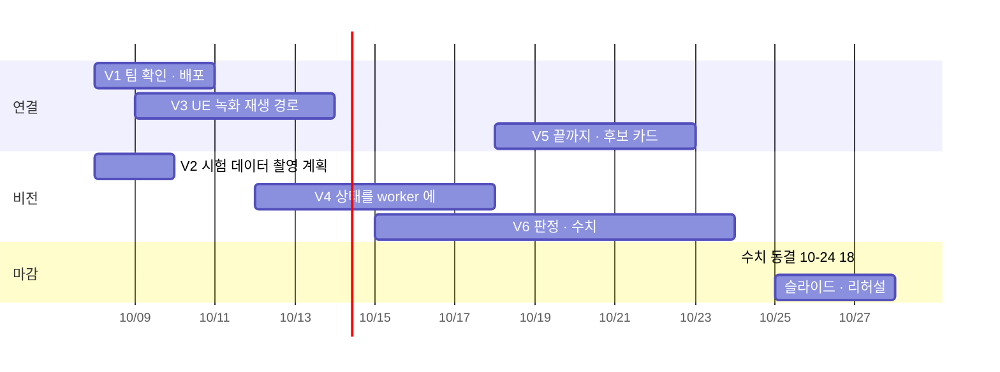

> [!summary] 10-07 → 10-28 중간발표 — **비전이 할 일은 "UE 비행 영상 → 후보가 관제 지도에 뜬다"를 한 번 끝까지 보여 주는 것**
> - 탐지 · 좌표 · 후보 · 색 · 크롭은 worker v1.0 에 있다. **빠진 것은 상태 (자세 · 무동작)**, 그리고 **실제 서버에 올리기**
> - 시연 영상은 SIM 이다 (09-30 회의) → 라이브 연결 (학교 서버 ↔ 로컬 UE) 이 늦어도 되게 **UE 비행 녹화 → 서버 재생**으로 간다
> - 10-07 회의 배정: 탐지 mAP 0.7~0.8 · 시연 환경 시험 데이터 촬영 계획 · 사람 · 자세 · 색 · 판정 모델 비교
> - 이전 판 → [[10 작업·학습 계획 - 중간발표까지 (10-04)]] (W 번호 그대로 씀)

## 팀 흐름 (드라이브 · 회의록 10-07 기준)

| 누구 | 지금 | 다음 회의까지 |
|---|---|---|
| 이시원 | UI · 의미 구역 분할 → 학교 서버에 올림 · 녹지 · 수면 · 도로 데이터 · CPP 구현 중 | 로그인 · **SITL ↔ 서버 연결** · CPP · IPP · UE 시간대 · **사람 에셋 추가** |
| 서성훈 | 서버 백엔드 · DB (SIM 업무 · REAL 데이터 서비스 따로) | 통신 단절 ↔ CPP · 파이프라인 · **KIT Engineering Fair 시연 준비** |
| 정서인 | 자세 판별 연구 끝 (박스 기하 한계 확인) · worker v1.0 | 아래 V1~V6 |
| HW | 카메라 송수신 배송 중 | |
| 10월 일정 | 2주 시뮬 적용 · 3주 개선 · 지도 교수 상담 · 4주 발표 준비 | **10-28 중간발표 = 시나리오로 파이프라인 검증 영상** (영상 송수신 · 서버 · 게이트웨이 로그) |

- 학교 서버의 비전 자리는 아직 **heartbeat 만** (`model_loaded=false`) · 후보 · 알림 API 와 화면은 이미 있다 (구성 데이터로 시험됨)
- 로컬 UE/SITL ↔ 학교 서버는 **아직 미연결** (규약이 다름 · 연결 에이전트 필요) → 비전이 이걸 기다리면 일정이 막힌다

## 비전 현황

| 영역 | 상태 | 근거 |
|---|---|---|
| 탐지 | ✅ soup_v7r2 동결 · 18.9 ms · TensorRT | test_kr 0.968 · test_obl 0.633 · test_v2 0.593 · UE level01 재현율 0.90 |
| 좌표 | ✅ 지면 광선 + 지형 교차 · 오차 타원 · 보류 사유 | 합성 중앙 2.0 m · **UE 검증 안 함** |
| 후보 · 색 · 크롭 | ✅ worker v1.0 · 가짜 백엔드 왕복 계약 위반 0 | [[비전 worker v1.0 연결 계획]] |
| **상태 (자세 · 무동작 · 등급)** | ✅ worker V4 (10-07) · Okutama B 점수 누움 AUROC 0.916 | 연구는 끝: 3자세 V3 · 규칙 점수 · Clef-Flash 0.964 → [[11 자세 판별 - 방식 · 기하 원리 · 오차 · 개선]] |
| 서버 배포 | ✅ REAL 이미지 · GPU · TensorRT 확인 (10-07) · worker 실행은 모델 설정 id 대기 · SIM 어댑터 준비 | 다음 배포 때 V4 코드 · posture.json 같이 |
| 막힌 것 | 모델 설정 id 미등록 · 프레임에 자세 (pose) 없음 · **SIM / REAL 어느 쪽에 붙일지 미정** | 서성훈 |

## 계획

### V1 팀 확인 · 서버 배포 (10-08 ~ 10-10) — 서성훈

- [ ] **시연에 붙일 곳 = SIM 업무 서비스** (관제 화면 · 후보 API 가 있는 쪽) 인지 확인 · 계약이 vision-ingest/1.0 과 같은지
- [ ] 프레임에 **pose** (위경도 · 고도 · 자세 · 짐벌) 추가 → 없으면 좌표 전부 PENDING
- [ ] 모델 설정 id 등록 (설정 관리자) → `active.json`
- [ ] 배포 — 패키지는 **미러에서 미리 받아** 오프라인 빌드 · 실행은 사용자 터미널 `sudo` 한 줄 · GPU 는 `compose.gpu.yml` 방식 (툴킷 · dockerd 재시작 없음)
- 완료 기준: 컨테이너 안 `cuda True` · TensorRT 로드 · 가짜 프레임 1장 왕복

### V2 시연 환경 시험 데이터 — 촬영 계획 (10-08 ~ 10-09) — 정서인

- [x] 계획서 → [[13 시연 환경 시험 데이터 촬영 계획 (10-07)]] · [ ] 팀 공유 · **안 되는 날짜는 서인에게** (회의 결정)
- 장소: 건물 A (학습 · 검증) · 건물 B (평가 전용) · 시연 구역과 같은 지형 (녹지 · 도로)
- 조건: 45° · 16~20 m 대응 높이 · 시간대 2개 (주간 · 저녁) · 사람 2~4명
- 자세: 서기 · 걷기 · 앉음 · **누움 (머리 방향 4방위 — 시선 방향 누움이 약점)** · 무릎 · 엎드림 · 무동작 10초 이상
- 기록: 옷 색 (상의) · 사람별 GNSS 표지 (좌표 정답) · 동의서 · 옥상 허가
- 쓰임: **test_own** = NFR-V03 판정셋 · 자세 · 색 정답 · 좌표 오차

### V3 UE 녹화 → 서버 재생 경로 (10-09 ~ 10-13) — 정서인 + 이시원 (UE)

- [ ] 이시원에게: UE 비행 시퀀스 (45° · 16/20 m 지그재그 · 1080p 초당 10장) + **장마다 기체 자세 · 위치** + 배우 위치 · 자세 · 옷 색 정답 (W4-2) · 새 사람 에셋 포함
- [ ] 재생 도구: 녹화 묶음 → 백엔드 프레임 등록 (서성훈 API) → worker 가 처리
- 왜: 라이브 SITL 연결이 늦어도 시연이 된다 · 같은 녹화로 반복 측정 가능
- 같이: **W3-1 UE 좌표 검증** (NFR-V04 10~15 m) — 녹화의 배우 위치 정답으로 바로 잰다

### V4 상태를 worker 에 넣기 (10-12 ~ 10-17) — 정서인

- [x] ✅ 10-07 → [[V4 상태 인지 worker 이식 - 진짜 추적]] — 추적 (진짜 · 문턱 0.15 · ID 바뀜 끊기) → 후보별 박스 이력
- [x] 자세 = 3자세 V3 (표시) · B0 (점수) · 무동작 시간 · 규칙 점수 → `observation.state` (state/0.1)
- [ ] 등급 다시 맞추기 (W2-3) — UE 무동작 누움 10초 안 재현율 ≥0.9
- [x] 가짜 백엔드 계약 위반 0 (REAL · SIM) · [ ] 녹화 재생
- 한계는 그대로 적는다: 시선 방향 누움 → 서기로 읽힘 → **등급은 우선순위 보조 · 최종 판단은 운영자** (UC-0705)

### V5 끝까지 · 후보 카드 (10-18 ~ 10-22) — 정서인 + 이시원

- [ ] UE 녹화 → 서버 → 후보 · 상태 · 색 · 크롭이 관제 지도에 뜸 (W1-7 · W2-4)
- [ ] NFR-V02 수신부터 ≥5 FPS · 지연 실측 (서버 3090 기준 · 운용 장비는 그 뒤)
- [ ] 시연 클립 · 로그 (중간발표 요구: 영상 송수신 · 서버 로그)

### V6 판정 · 수치 (10-15 ~ 10-24) — 정서인

| 항목 | 셋 | 목표 |
|---|---|---|
| 사람 탐지 AP50 | test_own (V2) · UE 녹화 · test_kr · test_obl | **0.7~0.8** (회의) — 셋마다 따로 적음 · 숲 가림 (test_v2) 은 목표 밖 한계로 표시 |
| 자세 | test_own · UE | 누움 AUROC · 앉음 F1 · 혼동표 |
| 색 | test_own · UE 정답 | 1·2순위 안 맞힘 ≥0.8 |
| 좌표 | UE 배우 위치 · GNSS 표지 | 수평 오차 중앙 · P95 (NFR-V04) |
| 판정 모델 비교 | 같은 크롭 · 상태 JSON | 규칙 vs Clef-Flash vs Qwen3-VL (로컬) · DINOv2 는 참고 (비스듬 약함 — 10-07 회의) |

- 판정 기준은 측정 전에 `_학습 큐` 에 적는다 · **10-24 18:00 동결**

## 하지 않는 것 (중간발표까지)

- 탐지 재학습 (R2 · R3 · R5) — **test_own AP50 이 목표 아래일 때만** 다시 논의 · 자체 촬영 미세조정 (R6) 은 촬영 뒤
- Kubeflow — GPU 1장 · 서버 1대에 운영 비용이 이득보다 큼 · 원하면 중간발표 뒤 MLflow 나 KFP 만 (조건 6개 → 10-07 대화)
- 라이브 SITL 연결의 비전 쪽 작업 — 연결 에이전트가 생기면 재생 도구 대신 그대로 붙음

## 팀에 물을 것

| 누구 | 무엇 | 언제까지 |
|---|---|---|
| 서성훈 | SIM / REAL 어느 쪽 · pose · 모델 설정 id · 프레임 등록 API (재생용) | 10-08 |
| 이시원 | UE 비행 녹화 + 장마다 자세 · 배우 정답 · 후보 카드에 상태 표시 자리 | 10-10 |
| 팀 | 촬영 가능 날짜 · 장소 허가 · 출연 | 10-09 |
| 지도 교수 (3주차) | 시연 판정셋을 test_own 으로 잡는 것 · 상태는 보조 신호라는 범위 | 10-14 ~ 10-18 |

## 연결
[[다음 할 일]] · [[타임라인]] · [[비전 worker v1.0 연결 계획]] · [[06 요구조자 상태 인지 계획]] · [[05 실기체 적용 - 자체 촬영]]
