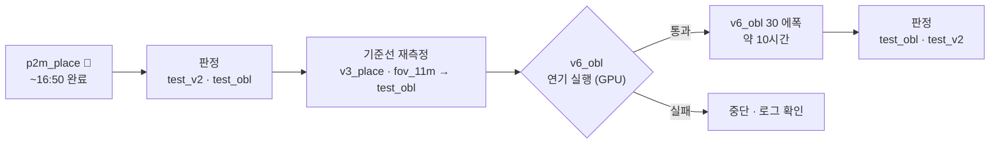

> [!summary] **예약된 학습과 설정값** — 앞으로 학습 계획은 여기에 적는다
> 실행: **`drone_yolo/chain_v6.sh`** (09-24~) · 진행 로그 `logs/QUEUE.md` · 결과 `metrics/AUTO_RESULT_v6.md`
> 각 단계는 **실패해도 다음으로 넘어간다** (GPU 를 쉬게 두지 않는다)

## 판정 기준 (09-25~) — 짝 부트스트랩

> [!important] **두 모델의 AP50 차이의 95 % 구간이 0 을 넘으면 개선** (`compare_ci.py --tag <평가셋> 기준:비교`)
> 같은 평가셋을 연속 20장 블록으로 재표집해 두 모델을 동시에 잰다 (test_obl 48 블록 · test_v2 72 블록 · 1,000~2,000회)
> 옛 기준 "+0.01 고정" 은 폐기 — test_v2 단일 모델 구간은 ±7 %p 라 너무 좁았다

| 짝 비교 | test_obl | test_v2 | 결론 |
|---|---|---|---|
| p2m_place − v3_place (옛 데이터에서 P2) | **+2.8** (+1.5 ~ +4.2) | **+4.6** (+2.8 ~ +6.5) | ✅ |
| v6_obl − v3_place (v6 데이터) | **+22.8** (+19.6 ~ +25.5) | **+30.5** (+23.5 ~ +38.2) | ✅✅ |
| v6_obl − fov_11m | **+16.5** (+13.9 ~ +18.9) | — | ✅ |
| **v6_p2m − v6_obl** (v6 에서 P2) | +0.2 (−0.5 ~ +1.3) | +0.9 (−1.5 ~ +2.9) | ➖ 구분 안 됨 — AP 이득 없음 · 오탐만 1/3 |

단위 %p · 괄호는 95 % 구간 · 원본 `metrics/compare_ci_*.csv` · `metrics/<평가셋>_<모델>_ci.csv`

## 2026-09-24 — 현재 대기열 (`chain_v6.sh`)



| 단계 | 설정 | 판정 기준 (돌리기 전) |
|---|---|---|
| p2m_place 판정 | test_v2 (기준 0.2233) · test_obl | test_v2 +0.01 초과 = 개선 |
| 기준선 재측정 | v3_place · fov_11m → **test_obl** | 60° 기준선 확보 |
| **v6_obl** | `--hyp configs/hyp/v6_oblique.yaml` · `configs/data_v6.yaml` · YOLO11m COCO · 30 에폭 | **test_obl AP50 이 v3_place 대비 +0.01 초과 = 개선** |

### 결과 (09-24 16:27)

| 모델 | test_v2 AP50 | test_obl AP50 | 판정 |
|---|---:|---:|---|
| v3_place (기준선) | 0.2233 | **0.1029** | — |
| fov_11m (평가 장소 학습 · Okutama 는 미학습) | (0.8559 누수) | 0.1661 | test_obl 에선 공정 |
| **p2m_place (P2 헤드)** | **0.2697** (+4.6 %p) | 0.1309 (+2.8 %p) | ✅ 개선 — 음성 오탐 0.195 → 0.317 |
| **v6_obl (60° 데이터)** | **0.5287** (+30.5 %p) | **0.3311** (+22.8 %p) | ✅✅ 큰 개선 — fov_11m(0.1661)도 2배 · 음성 오탐 0.366 |
| v6_p2m (v6 + P2) | 0.5381 (+0.9 %p) | 0.3333 (+0.2 %p) | ➖ 동등 — 오탐 0.366 → **0.122** · 재현율 약간 ↓ · 추론 비용 ↑ |
| ~~v6_obl_s43 (시드 반복)~~ | 중단 | | seed 를 바꿔도 **같은 학습**이 된다 (3에폭 수치 동일) |
| v6_obl_r2 (목록 순서 섞은 반복 · 새 val `val_v6b`) | 학습 중 (~02:15 완료) | | 학습 흔들림 폭 · 짝 비교 자동 |
| **v6_nwd** (NWD α 0.5 · C 32 px · 나머지 r2 와 같음) | 대기 → 02:20~09:40 | | **짝 구간이 0 을 넘으면 채택** · 24 px 미만 재현율 따로 |

- test_obl 크기별 재현율@0.15 (p2m): 24 px 미만 0.03 · 24~36 0.07 · 36~50 0.17 · 50~80 0.24 — **비스듬 시점은 크기와 무관하게 낮다**

- `rect_place` 는 **뺐다** — chain_v2 bash 를 PID 로 끄고 p2m_place 학습은 살렸다
- test_kr (AI-Hub 한국) 은 아직 없다 — 다음에 만든다
- 평가셋 [[02 학습 계획 v6 (60° 기준)|test_obl]]: Okutama 비스듬 16 시퀀스 × 60장 = **960장 · 사람 12,876 · px 중앙 38.7** (1280×720 단일 추론)

## 2026-09-23 재검토 — 현재 대기열 (`chain_v2.sh`)

> [!danger] 이전 ③ P2 는 **무효** — 중단했다
> yaml 파일명에 크기(`m`)가 없어 ultralytics 가 **nano(2.7 M)** 로 만들었고, 사전학습도 없었다.
> 기준선(11m · 20 M · COCO)과 세 가지가 동시에 달라 해석 불가. 25/30 에폭에서 중단.

**기준선이 바뀌었다**: `v3_place` — 장소 분리 학습 · **test_v2 AP50 0.2233** (NFR-V03 첫 정직한 숫자).
이제 모든 실험을 같은 장소 분리 데이터(`data_v3_place_neg.yaml`)로 돌리고 **test_v2 AP50** 으로 판정한다.
판정: 기준선 대비 **+1 %p 초과 = 개선 · ±1 %p = 동등 · −1 %p 미만 = 악화** (스크립트에 포함)

| # | 이름 | 바꾸는 것 | 설정 | 상태 |
|---|---|---|---|---|
| ① | `p2m_place` | **P2 헤드** | `--model-yaml configs/models/yolo11m-p2.yaml` · 20.55 M · batch 6 | 🔄 09-23 21:23 시작 · ~09-24 13:00 |
| ② | `rect_place` | **rect=True** (학습 모양 = 추론 [736,1280]) | `--rect` · batch 8 | ⏸ ~09-25 02:00 |
| — | B (VisDrone 1280) | 보류 | A 가 −2.3 %p · VisDrone 심한 가림 7 % | 기대값 낮음 |

공통: `--stage 1 --data configs/data_v3_place_neg.yaml --weights yolo11m.pt --imgsz 1280 --epochs 30 --patience 100 --close-mosaic 0 --optimizer SGD --lr0 0.01 --scale 0.3 --translate 0.15`

> [!warning] 남는 교란 (알고 쓴다)
> · **P2**: COCO 가중치가 **427/803 층만 이식**된다. 백본은 그대로지만 P2 를 끼운 넥·헤드는 층 번호가 밀려 **난수에서 시작**한다
> · **rect**: ultralytics 는 rect=True 면 **mosaic·셔플을 끈다.** 모양 하나만 바뀌는 게 아니다 — 지면 "rect 가 나쁘다" 가 아니라 "mosaic 을 끈 게 나쁘다" 일 수 있다

## (이전) 대기열 — 09-22 작성

| # | 이름 | 무엇을 가리나 | 소요 | 완료 예상 (KST) | 상태 |
|---|---|---|---:|---|---|
| 0 | `vd_11m` (**D**) | 항공 사전학습이 듣는가 | — | 09-23 01:30 | 🔄 진행 |
| ① | `chain_auto` 평가 | D 판정 · 마운트각 태그 검증 · 고도 층화 · Unicamp 분포 | 2 h | 09-23 03:30 | ⏸ |
| ② | `v3_place` (**P**) | **NFR-V03 을 처음으로 잰다** | 13 h | 09-23 17:00 | ⏸ |
| ③ | `p2_11m` (**P2**) | 격자 부족을 구조로 푼다 | 15 h | 09-24 08:00 | ⏸ |
| ④ | `pre_visdrone_11m` → `vd1280_11m` (**B**) | A 가 무효면 **해상도/크기 탓인가** | 3+13 h | 09-25 00:00 | ⏸ |

---

## 공통 설정 (기준선 `fov_11m_1280_all` 과 맞춘다)

```
--imgsz 1280 --batch 8 --epochs 30 --patience 100 --close-mosaic 0
--optimizer SGD --lr0 0.01 --scale 0.3 --translate 0.15
degrees 180 · flipud 0.5 · fliplr 0.5 · mosaic 1.0 · cache disk
```

**한 실험은 한 가지만 바꾼다.** translate 0.30 때 `close_mosaic` 도 같이 바꿔 원인을 못 가른 적이 있다.

---

## ② P — 장소 분리 (`v3_place`)

| | |
|---|---|
| 바꾸는 것 | **데이터 분할만** — 평가 장소 Carnation·Karen 을 train 에서 제외 |
| 데이터 | `configs/data_v3_place_neg.yaml` · train **30,520장** (평가 장소 4,236장 제외) · val 7,692 (누수 0) |
| 시작 가중치 | `yolo11m.pt` (COCO) |
| 평가 | **`data/test_v2`** — 1,366장 · 사람 3,927 · 1920×1080 전체 프레임 |

```bash
python train_person.py --stage 1 --data configs/data_v3_place_neg.yaml \
  --weights yolo11m.pt --imgsz 1280 --batch 8 --epochs 30 --patience 100 \
  --close-mosaic 0 --optimizer SGD --lr0 0.01 --scale 0.3 --translate 0.15 \
  --name v3_place
```

> [!important] 이게 큐에서 가장 중요하다
> 지금 **NFR-V03(사람 AP50 ≥0.80)을 측정조차 못 한다.** 평가셋 `test_v2` 는 만들었는데
> 기존 모델들이 그 장소를 학습에 포함해서 재면 부풀려진다. 이 학습이 끝나야 첫 정직한 숫자가 나온다.

---

## ③ P2 헤드 (`p2_11m`)

| | |
|---|---|
| 바꾸는 것 | **아키텍처** — `Detect([P3,P4,P5])` → `Detect([P2,P3,P4,P5])` |
| 설정 파일 | `configs/models/yolo11-p2.yaml` (직접 작성 · 생성 검증 완료) |
| batch | **6** (앵커 4배라 메모리) |
| 시작 가중치 | 없음 — **처음부터 학습** (구조가 달라 COCO 가중치를 못 얹는다) |

**근거**: 16~25 px 대상은 stride 8 격자에서 **2.3칸**뿐이고 실측 **양성 앵커 5.86개**(정상 10개의 59 %).
TAL 은 "앵커 중심이 박스 안" 인 것만 후보로 쓰므로 격자가 부족하면 구조적으로 못 배운다.
stride 4 를 더하면 **4.5칸** → 후보가 4배.

**대가**: 앵커 19,320 → 약 77,000 · 추론 시간 증가 → [[NFR-V01 추론 시간]](≤30 ms)과 맞바꾼다.

> [!warning] 사전학습 없이 30에폭이라 불리하다
> 다른 실험은 COCO 600에폭에서 출발하는데 이것만 난수에서 시작한다.
> **지면 "P2 가 나쁘다" 가 아니라 "사전학습 없이 30에폭으로는 부족하다" 일 수 있다.**
> 이기면 강한 증거이고, 지면 에폭을 늘려 재시도할 값어치가 있다.

---

## ④ B — 1280 VisDrone 사전학습 (`vd1280_11m`)

A(`vd_11m`)가 쓰는 공개 가중치는 **imgsz 640 · 300에폭**이고, 그때 사람 크기가 **중앙값 11 px** 다.
우리는 **약 50 px** — 4.5배 차이. A 가 무효면 이 **크기 불일치(Scale Match)** 가 원인인지 가린다.

```bash
# ④-1 사전학습 (약 3 h · train 6,471장)
yolo detect train data=configs/visdrone.yaml model=yolo11m.pt imgsz=1280 \
  epochs=30 batch=8 optimizer=SGD lr0=0.01 close_mosaic=0 cache=disk \
  project=runs_person name=pre_visdrone_11m

# ④-2 본 학습
python train_person.py --stage 1 --data configs/data_fov.yaml \
  --weights runs_person/pre_visdrone_11m/weights/best.pt \
  --imgsz 1280 --batch 8 --epochs 30 --patience 100 --close-mosaic 0 \
  --optimizer SGD --lr0 0.01 --scale 0.3 --translate 0.15 --name vd1280_11m
```

> [!note] 한계
> B 의 사전학습은 **30에폭**, A 는 **300에폭**이다. B 가 져도 "해상도가 원인이 아니다" 라고 단정할 수 없다.
> **원인 분해용**이지 A 와 우열을 가리는 실험이 아니다.

---

## 판정 기준 (돌리기 전에 적는다)

기준선 `fov_11m_1280_all`. [[타일 가장자리 효과]] 에서 이 규칙이 오독을 막아 줬다.

| 지표 | 기준선 | 성공 조건 |
|---|---:|---|
| 가림 지형 40칸 평균 재현율@0.15 | **0.4780** | 오른다 |
| 서 있는 38 px 재현율@0.15 (타일) | 0.3721 | 오른다 |
| 누운 128 px 재현율@0.15 (타일) | 0.6579 | 유지 |
| 음성 프레임 오탐 | 0.594 건/프레임 | 오르지 않는다 |
| val mAP50 | 0.4779 | **판정에 쓰지 않는다** (실전과 반대로 간 전례) |

②는 위 대신 **`test_v2` AP50** 이 1차 기준이다 (NFR-V03 목표 0.80).

---

> [!warning] 마운트각 태그로 학습 데이터를 자르는 계획은 **취소**했다 (09-23)
> 육안 검증 결과 NOMAD·WiSARD 에서 상관 r 이 각도가 아니라 배우 이동·지형 경사를 잡고 있었다.
> 학습 데이터의 대부분이 그 둘이므로 선별하면 잡음으로 자르는 꼴이 된다.
> 태그는 **Okutama 로 시점 효과를 재는 용도**로만 쓴다 → [[9.23 마운트각 태그 육안 검토]]

## 큐에 아직 없는 것

| 후보 | 근거 | 왜 아직 안 넣었나 |
|---|---|---|
| **NWD** (Normalized Wasserstein Distance) | 문헌 **+6.7 AP** · 우리 양성 앵커 5.86개 문제와 기전이 일치 | ultralytics `TaskAlignedAssigner`·`BboxLoss` 수정 필요 — 무인 실행 전 검증 |
| Wise-IoU v3 | 저품질(가림) 라벨의 기울기를 줄인다 · 우리 vis 0~30 이 22 % | 〃 |
| 크기 분포 재설계 | 현재 16~160 px 는 전제가 다 바뀐 값 (하향 90°·화각 75° → **36~164**) | 크롭 재생성 3~4 h · 운용 조건 확정이 선행 |
| `rect=true` | 학습은 1280×1280 레터박스, TensorRT 추론은 1280×736 — 모양 불일치 | 미측정 · 비용 낮음 |
| ~~cls 0.5 → 1.0~~ | 가중치만 만지는 것 — NWD·P2 보다 근거 약함 | 후순위로 내림 |

---

## 이 문서 쓰는 법

새 학습을 예약하면 **여기에 먼저 적는다** — 이름 · 바꾸는 것 하나 · 전체 명령 · 판정 기준.
끝나면 결과를 [[_실험 색인]] 과 그날 [[타임라인|일자별 기록]] 으로 옮긴다.

## 연결
[[0 서버 학습 계획 한눈에]] · [[1 새 방향 - 항공 사전학습과 손실 재배분]] · [[NFR-V03 탐지 정확도]] · [[9.22 하루 기록]]
