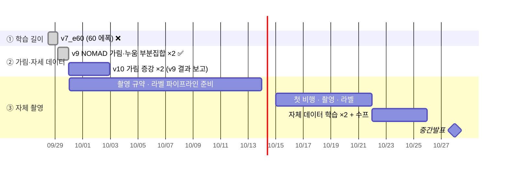
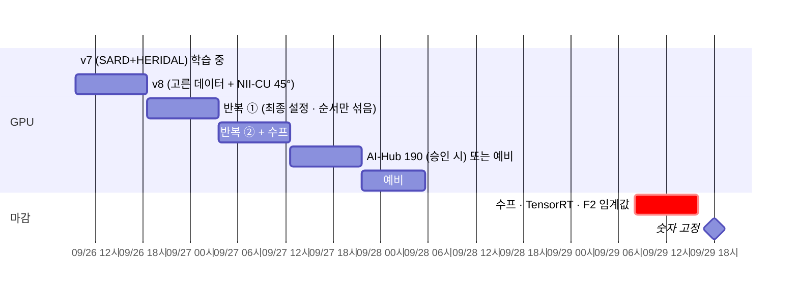
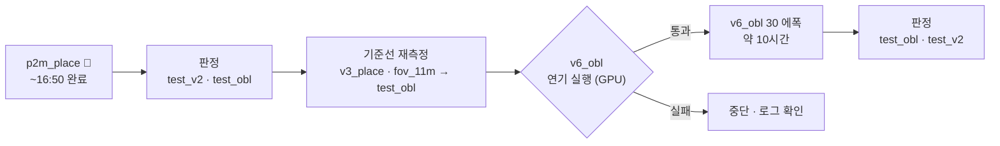

> [!summary] **예약된 학습과 설정값** — 앞으로 학습 계획은 여기에 적는다
> 지금: **비어 있음** (GPU 10-09 20:21 복구 — 드라이버 자동 업그레이드 → 모듈 다시 올림) (`chain_sd` 10-09 05:22 끝 · D 전부 FAIL → soup_v7r2 유지) · 다음 후보: R1 (진짜 추적 재점수) · O1 (자체 촬영 뒤) · **탐지 학습 멈춤** (10-06 22시 · 사용자 지시 — GPU 를 상태 판단 모델 비교에) · 지난: `chain_r6.sh` 중단 · `chain_r.sh` → `chain_r3.sh` (R2 · R3 · R5 모두 FAIL → **soup_v7r2 유지**) · 진행 로그 `logs/QUEUE.md` · 결과 `metrics/AUTO_RESULT_*.md`
> 각 단계는 **실패해도 다음으로 넘어간다** (GPU 를 쉬게 두지 않는다) · 작업 전체 계획 → [[10 작업·학습 계획 - 중간발표까지 (10-04)]]

## 10-09 C4 · K1 — 색 영역을 자세로 · 관절점 해상도 한계 (판정 기준은 돌리기 전에 적음 · 10-09 22:4x)

> [!warning] 검토에서 고친 전제 (돌리기 전)
> - **C1 은 정답 자세를 색 판정기에 넘겨서 쟀다** (`eval_color` · 누움 = 박스 전체) — worker 는 자세를 안 넘긴다 (`ingest.observe` → `profile(img, box, stats=…)`) → C1 수치 (AUROC 0.766) 는 worker 보다 유리한 조건
> - 「4차 키포인트 재현율 0.2」 는 관절점 검출이 아니라 **쓰러짐 판정** 재현율 · 정답이 NOMAD 활동 구간 라벨 (나중에 라벨 품질로 무효) → 관절점이 안 된다는 근거로 약함
> - FlyPose-104 (5~50 m · 193명 · CC BY 4.0) · FlyPose 가중치 (ViTPose-S/H · UAV-Human 2~8 m 미세조정) 는 **Google 폼 신청** — 볼트의 「GitHub 바로」 는 틀림
> - 운용 사람 크기 (f 1141 · 마운트 45° · 화면 가운데 · 서기 1.7 m): 고도 20 m **48 px** · 16 m 61 · 12 m (재관측 CLOSER) **81** · 8 m 121 (누움 가로 ×1.4)

| # | 무엇 | 데이터 | 판정 (미리 정함) |
|---|---|---|---|
| **C4** | 색 판정 영역을 자세로 고름 — ① 없음 (worker 지금 · 서기 띠 15~60 %) ② 정답 자세 (C1 조건 · **상한**) ③ V3 표시 자세 (NOMAD 밖에서 학습 · 공정한 예측) ④ B0 점수 자세 (NOMAD 로 학습 → 참고만) · 누움 = 박스 전체 ∩ 사람 마스크 | C1 과 같은 NOMAD 42명 캐시 (4,048 크롭 · 서기 210 · 누움 199 묶음) · similar=0 | 배우 블록 짝 부트스트랩 1,000회 · **③ 채택 (worker 가 상태의 자세를 색에 넘김) = AUROC (③ − ①) 구간 > 0 그리고 서기 묶음 AUROC 차 구간이 전부 0 아래가 아님** · ② − ① = 자세 · 몸통 위치를 더 알 때의 최대 이득 (관절점 트랙의 상한) — 0.02 미만이면 색 쪽 관절점은 접음 |
| **K1** | 관절점 해상도 필요조건 — 사람이 작으면 몸통 4점 (어깨 · 골반) 이 잡히는가 | ~~COCO val2017~~ → **NOMAD a10 원본 5472×3078** (항공 비스듬 · 사람 키 ~300 px · 서기 · 누움 · 배우 42명 중 무작위 300명) — COCO 서버 14 KB/s 로 못 받음 (10-09 23:0x 변경 · 돌리기 전) · 정답 = 원본 크기에서 yolo11m-pose 가 몸통 4점 모두 확신 ≥ 0.7 인 사람의 관절 (가짜 정답 · 남은 비율을 자세별로 같이 적음) → 키 30 · 45 · 60 · 80 · 120 px 로 줄였다가 크롭을 키워 추론 (worker 후보 크롭 방식) · yolo11s-pose (4차와 같은 모델) · yolo11m-pose (자기 일치 → 낙관) | 몸통 4점 PCK@0.1 (박스 키 기준) · **쓸 수 있는 키 = PCK ≥ 0.8 인 가장 작은 키** · > 81 px (재관측 12 m) 이면 **관절점 트랙 중단** · ≤ 61 px 이면 K1b (FlyPose-104 폼 · 항공 시점 · FlyPose ViTPose — onnxruntime 설치는 따로 승인) · 그 사이면 재관측 고도 8~12 m 조건부 |

> [!failure] **C4 결과 (10-09 22:48 · `eval_color_posture.py` · 8초)** — ❌ worker 그대로 · **색 쪽 관절점 트랙 접음**
> | 조건 | AUROC 전체 | 서기 | 누움 | 누움 판정 불가 |
> |---|---|---|---|---|
> | ① 자세 없음 (worker 지금) | 0.759 | 0.795 | 0.724 | 0.087 |
> | ② 정답 자세 (C1 조건 · 상한) | 0.768 | 0.795 | 0.739 | 0.020 |
> | ③ V3 예측 자세 | 0.758 | 0.794 | 0.724 | 0.077 |
> - ③ − ① 구간 −0.004 ~ +0.003 → 채택 안 함 · ② − ① = **+0.009** (−0.002 ~ +0.022) < 0.02 → 몸통 위치를 완벽히 알아도 색 비교는 거의 안 오른다 → 색 쪽 관절점 접음
> - C1 정정은 작다 — 정답 자세 유무 차 0.009 · C1 결론은 worker 에도 그대로
> - 곁가지: **박스 모양 자세 판정기가 NOMAD 누운 사람을 거의 못 잡는다** — V3 누움 재현율 0.24 (서기를 누움으로 0.07) · B0 0.30 (NOMAD 로 학습했는데도) → 자세 쪽은 관절점 (K1) 을 볼 이유가 있다

## 10-09 C — 인상착의 비교 (C-0705) · 재관측 제안 (SD-0706) 검증 (판정 기준은 돌리기 전에 적음 · CPU)

| # | 무엇 | 데이터 | 판정 (미리 정함) |
|---|---|---|---|
| **C1** | 인상착의 비교 `AppearanceComparator` — 닮은 색 가산 (similar=0.5) vs 없음 (0 · 기존 match 규칙) | NOMAD 배우 42명 상의 색 정답 · 캐시된 크롭 (eval_color) · worker 와 같은 색 판정기 · 배우×거리×자세 묶음 누적 (= 후보 하나) | 묶음 점수로 "자기 색 묶음 vs 다른 색 묶음" AUROC · 배우 블록 부트스트랩 1,000회 · **similar 채택 = AUROC 차 구간 > 0** (아니면 similar=0) · 같이 기록: 자기 색 MATCH 율 · 다른 색 오일치율 (닮은 색 제외 · 포함) · 거리별 |
| **C2** | 재관측 제안 규칙 단위 시험 | 가짜 후보 (좌표 보류 사유 · 1회 탐지 · 누움 0.5 · 색 판정 불가) | 이유 4개 각각 정확히 1번 · NO_POSE 만이면 GEO_PENDING 안 냄 · 후보당 ≤3 · 임무당 분당 ≤6 · 같은 이유 반복 안 함 |
| **C3** | worker 끝까지 (가짜 REAL 백엔드) | UE level01 20장 + 가짜 자세 · 외형 조건 파일 | 계약 위반 0 · 재관측 요청 전부 201 (후보 없는 요청 0) · 후보당 ≤3 · appearance.match 가 모든 관측에 · SIM 회귀 0 |

> [!done] **C1 · C2 결과 (10-09)**
> - **C1 ❌ similar** — AUROC 0 : 0.766 · 0.5 : 0.760 · 차 구간 −0.036 ~ +0.031 → **similar=0 (기본)** · `metrics/eval_appearance.json`
>   - 자기 색 MATCH 0.38 · MATCH+PARTIAL 0.56 · 판정 불가 0.02 · 다른 색 오일치 0.08 (닮은 색 빼면 0.07)
>   - 거리별 AUROC a10 0.80 → a70 0.72 → **순위 보조로만** (한 번의 판정으로 거르지 않음)
> - **C2 ✅** — 13/13 (`deploy/vision_worker/tests_reobserve.py`)
> - **C3 ✅** (CPU · 장수 줄임 — **GPU 드라이버 불일치**: 10-09 15:37 unattended-upgrades 가 580.173 → 580.178 · 커널 모듈은 그대로 → 모듈 다시 올리기 · 재부팅 전까지 CUDA 불가)
>   | 경우 | 결과 · 관측 | 계약 위반 | 재관측 (전부 201) | appearance.match |
>   |---|---|---|---|---|
>   | 가짜 자세 · UE 10장 · 1초 간격 | 10 · 196 (좌표 전부 VALID) | 0 | 4 (LOW_EVIDENCE) · 후보당 최대 1 | 196/196 (MISMATCH — 빨강 질의 · 장면에 빨강 없음) |
>   | 자세 없음 · 6장 | 6 · 110 (전부 PENDING/NO_POSE) | 0 | 6 (LOW_EVIDENCE) · **GEO_PENDING 0 (NO_POSE 만이라 맞음)** | 110/110 |
>   | SIM 4장 | 4 완료 · 관측 76 | 0 (임대 600 s) | — (SIM 은 안 보냄) | — |
>   - SIM 첫 실행 409 CLAIM_EXPIRED ×4 → CPU 한 장 처리 > 임대 30 s 탓 (임대 600 s 로 다시: 오류 0 · 전부 1회 시도) → 회귀 아님
>   - **GPU 복구 뒤 원래 기준 (20장) 으로 다시 ✅** — 자세 있음 20 · 관측 477 (전부 VALID · 10-07 결과와 같은 수) · 자세 없음 20 · 477 (PENDING) · SIM 20 (**임대 30 s 그대로** · 전부 1회 시도) · 계약 위반 0 · 재관측 6 + 6 전부 201 · 후보당 최대 1 · appearance.match 477/477 · 세 경우 합쳐 60초
>   - 끝까지 시험에서 나온 이유는 LOW_EVIDENCE 뿐 — UE 정지 사진이라 추적 · 멈춤 · 좌표 보류 (자세 있음) 가 안 생김 → 나머지 3개는 C2 단위 시험으로만 확인 · 실제는 UE 비행 영상 · 자체 촬영에서

## 10-08 계획 — 중간발표 (10-24 동결) 까지 돌릴 것 (판정 기준은 돌리기 전에 적음 · 10-08 10:13 시작)

> [!summary] GPU 비어 있음 (10-07 03시~) · 3갈래 — **S 상태 다시 재기 (버그 뒤)** → **D 진짜 반복 탐지** → **O 자체 촬영 미세조정 (10-15~)**
> - 근거: ① 10-07 발견 — 연구 `model.track` 이 추적을 안 했다 → 이력 쓰는 결론 (A5 ❌ · agg ❌) 을 진짜 추적으로 다시 ② "반복" 이 사실상 같은 학습이었다 → 진짜 반복 폭을 아직 모른다 ③ test_own (NFR-V03 공식 판정셋 후보) 은 10-14 촬영 뒤

| # | 실험 | 바꾸는 것 (하나) | GPU | 판정 (미리 정함) |
|---|---|---|---|---|
| **S1** | 자세 누적 다시 (agg vs single) | worker 진짜 추적 · 자세 항 = 최근 5초 중앙값 (agg) vs 지금 한 장 (single · 현행) | ~25분 | Okutama 비스듬 A (짝수 12) 에서 창 {3 · 5초} 고름 → **B (홀수 11)** 영상 블록 짝 부트스트랩 2,000회 · 채택 = 점수 누움 AUROC 구간 > 0 그리고 잡힌 비율 유의 손해 없음 |
| **S2** | A4 방위 변화 특징 다시 | 진짜 추적 박스 이력으로 A4' (지난 3초 h/w 비 최소 · 최대 · 흔들림) → 점수 누움 항 | ~25분 | A5 와 같은 규칙 (B · 짝 · 현행 대비 구간 > 0 · 유의 손해 없음) — A5 ❌ 는 섞인 이력 탓일 수 있음 |
| **S3** | 무동작 · 추적 단위 지표 다시 (관찰) | 판정 없음 — 진짜 추적의 무동작 분포 · 추적 단위 AUROC · ID 바뀜 수 | S1 에 포함 | 기록만 (10-01 · Q1 수치 교체) |
| **D0** | 진짜 반복 도구 | `chain_util.py mklist --frac=0.95 --seed=N` (목록 95 % 무작위 뽑기) · 연기 실행 | ~10분 | 두 목록 **집합이 다름** (ultralytics 가 정렬해도 데이터가 다름) · 연기 실행 통과 — 같으면 멈춤 |
| **D1** | v10 진짜 반복 ×2 | v10 목록 (v7 + NOMAD v9 + LADD) 95 % 뽑기 s61 · s62 · 30 에폭 · 설정은 v10_s31 과 같음 | ~21 h | ① 진짜 반복 폭 = s61 : s62 차 (기록) ② 각각 soup_v7r2 대비 `judge_pairs.py` (R5 와 같은 규칙: 한 평가셋 이상 구간 > 0 · 그 평가셋 차 > 반복 폭 · 유의 손해 없음) |
| **D2** | D1 수프 (조건부) | s61 + s62 평균 | ~1 h | **BN 거리 < 0.25 일 때만** 섞음 (붕괴 표 기준) · 수프 vs soup_v7r2 같은 규칙 · test_kr 가 단일 평균보다 3.4 %p 넘게 낮으면 붕괴 = FAIL · 단일을 골라 쓰지 않음 |
| **O1** | 자체 촬영 미세조정 (10-15~) | 출발 = 그때 최고 (soup_v7r2 또는 D 통과) · **건물 A 자체 1 : 기존 2** · SGD lr0 0.001 · freeze 10 · 30 에폭 · mosaic 0.5 | ~5 h | **test_own (건물 B)** AP50 구간 > 0 **그리고** test_obl · v2 · kr 손해 0.02 이내 (05 실기체 적용 §4) |
| **O2** | 자세 판정기 + 자체 촬영 (CPU) | V3 + 건물 A 자세 크롭 | — | 건물 B 앉음 F1 · 누움 AUROC (시선 방향 따로) · V3 대비 구간 > 0 |
| 끝 | 엔진 · 동결 | 채택 모델 TensorRT (3090) · worker 모델 묶음 · 10-24 18:00 | ~30분 | test_v2 AP50 .pt 대비 ±0.005 |

> [!done] **S 결과 (10-08 11:4x · 23편 · 처음 실행은 11편만 돌아 무효 → 고쳐서 다시)**
> | 규칙 | A 점수 AUROC | B 점수 AUROC | B 추적 AUROC |
> |---|---|---|---|
> | single (현행) | 0.981 | **0.916** | 0.904 |
> | agg3 (A 에서 고름) | 0.980 | 0.912 | 0.909 |
> | agg5 | 0.970 | 0.907 | 0.908 |
> | A4' | 0.955 | 0.865 | 0.836 |
> - **S1 ❌** — agg3 짝 B 점수 −0.008 ~ +0.001 (구분 안 됨) · 추적 단위만 +0.001 ~ +0.014 → **한 장 유지** (진짜 추적이어도 누적 이득 없음)
> - **S2 ❌** — A4' 짝 B 점수 −0.075 ~ −0.021 · 추적 −0.094 ~ −0.034 (유의하게 나쁨) → A5 의 ❌ 는 버그 탓이 아니었다 · Archangel 로 맞춘 방위 특징은 Okutama 로 안 옮겨감
> - **S3** — 누운 사람 무동작 ≥10초 2.4 % (서기 15.8 % · 앉음 11.3 %) · 속도 잰 비율 0.75~0.91 · 잡힌 비율 A 0.511 · B 0.557 → Okutama 로는 URGENT 를 못 맞춘다 (자체 촬영 S8 · S9 로)

> [!failure] **D 결과 (10-09 05:22) — 교체 없음 · soup_v7r2 유지**
> | 모델 | obl | v2 | kr | soup_v7r2 대비 |
> |---|---|---|---|---|
> | v10_f61 | 0.6227 | 0.5892 | 0.9835 | obl −1.0 (유의) · v2 구분 안 됨 · kr +1.6 (유의) → FAIL (맞바꿈) |
> | v10_f62 | 0.6113 | 0.6185 | 0.9712 | obl −2.2 (유의) · v2 +2.6 (유의) · kr 구분 안 됨 → FAIL (맞바꿈) |
> - **진짜 반복 폭 (f61 → f62 · 데이터 95 % 만 다름)**: obl −1.1 · **v2 +2.9** · kr −1.2 %p — 셋 다 평가셋 구간 밖 ("유의") → **평가셋 부트스트랩 구간은 학습 흔들림을 못 잡는다** · 단일 모델 비교로는 2~3 %p 차이를 개선이라 부를 수 없음 (기존 반복 폭 obl 3.1 · v2 1.8 · kr 0.9 와 같은 크기)
> - D2 수프 건너뜀 — BN 거리 mean_z **0.309** (기준 0.25 · 붕괴한 v7:v7_r3 0.292 보다 멀다) → 95 % 뽑기만으로도 재료가 멀어진다
> - 결론: 탐지기는 **soup_v7r2 그대로 동결** · 데이터 조건이 다른 자체 촬영 (O1) 만 남김
- 체인: `chain_sd.sh` (S → D0 → D1 → D2 자동) · 결과 `metrics/AUTO_RESULT_d.md`
- 순서: **S1 · S2 (오늘 · ~1 h)** → D0 → **D1 (~21 h · 10-09 밤)** → D2 → (10-10~14 GPU 비면 R1 추적 기반 재점수 · 진짜 추적으로) → **O1 (촬영 · 라벨 뒤 10-15~17)** → 끝
- 안 하는 것: 구조 · 손실 바꾸기 · 60 에폭 · BN 재계산 · 수프에 무너진 재료 · test_own 을 고르기에 쓰기 (판정 전용)
- 교체는 사람이 확인 · 통과 못 하면 **soup_v7r2 (공식) 그대로** — 중간발표 수치는 test_own 으로 보고

## 10-07 V4 — 상태를 worker 에 (`state_worker_check.py` · 판정 기준은 돌리기 전에 적음) → [[12 비전 다음 계획 - 중간발표까지 (10-07)]]

- 무엇: 연구 파이프라인 (state_pipeline · Q1 V2·single) 을 worker 모듈 (`app/vision_core/state.py`) 로 옮긴 것이 **같은 성능**을 내는가
- 바뀌는 것 (일부러): 탐지 = worker 타일 탐지 (1920×1080 · 4장 · NMS 0.6) · 영상은 Okutama 720p 를 1080p 로 키워 넣음 · 시각 = 프레임 ÷ 30
- 같은 것: 추적 문턱 0.15 · ID 바뀜 끊기 · 자세 한 장 (B0) · 1초 갱신 · 무동작 · 등급 · 점수 식 · 초당 10장
- 데이터: Okutama 비스듬 **B 11편** (Q1 판정에 쓴 홀수 영상 · 고르기에 안 씀)
- 탐지기: **soup_v9x2** (Q1 과 같음 · 1차 판정) · soup_v7r2 (배포 모델 · 참고)
- 판정 (1차 · soup_v9x2)
  - ✅ 같음 = 1초 표본 점수 **누움 AUROC ≥ 0.90** (Q1 0.953) **그리고** 누움 잡힌 비율 **≥ 0.50** (Q1 0.573)
  - 영상 블록 부트스트랩 1,000회 95 % 구간도 적는다 (Q1 과 짝 비교는 탐지가 달라 안 함)
  - ❌ 면 원인 분리 (타일 탐지 vs 전체 화면 · 추적기 박스 · 시각 처리) 뒤 다시 — 배포는 상태 칸을 비운 채로
- 계약: 가짜 REAL 백엔드 30장 왕복 계약 위반 0 · `state` 객체 채워짐 · 한 줄 ≤ 64 KiB · SIM 왕복 회귀 0
- **1차 결과 (10-07 23:3x)**: soup_v9x2 AUROC 0.917 · 잡힌 비율 **0.496 → ❌** · soup_v7r2 0.905 · 0.511 (참고 ✅)
  - 원인 분리: 전체 화면 탐지 0.933 · 0.496 / + 720p 추적 0.940 · 0.496 / + 추적기 박스 채점 0.939 · 0.481 → 탐지 · 영상 크기 · 채점 박스 아님
  - **진짜 원인: 연구 기준값이 버그로 부풀려짐** — `model.track(persist=k>0)` 가 ultralytics 8.4.102 에서 매 프레임 추적기를 새로 만듦 (첫 호출 persist=False 가 콜백에 고정) → 연구 추적 ID = 프레임마다 확신도 순번 · 모든 탐지가 "추적" 표본 → worker 는 진짜 추적이라 확정 전 새 추적 (첫 프레임) 이 표본에서 빠짐
  - 고침 (기준은 그대로): 확정 안 된 탐지에도 한 장 자세 상태 (`tracked: false` · 등급 CHECK) — 거르지 않는 원칙과 같음 → **같은 기준으로 재실행** (soup_v9x2 1차 · soup_v7r2 참고)

## 10-07 A5 — A4 (방위 변화) 를 실전 파이프라인에서 (`chain_a5.sh` · 판정 기준은 돌리기 전에)

> [!failure] **결과 (10-07 03:04) — A4' ❌ · A3-0 ❌ → 지금 판정기 유지** · B 점수 누움 AUROC B0 0.953 → A4' 0.870 (짝 −0.118 ~ −0.049) · 추적 AUROC 0.835 → 0.638 · A3-0 도 점수 −0.022 ~ −0.001 · Archangel 로 맞춘 판정기는 Okutama 로 안 옮겨감 (카메라 · 궤도 차이 · 박스 흔들림)

- 판정기는 **Archangel-Real 전체로 맞춤** · Okutama 는 평가만 · 텔레메트리가 없어 φ · 크기×거리는 빼고 **A4' = 박스 2특징 + 지난 3 초 (1초 간격 3표본) 비 최소·최대·흔들림** (Archangel 학습도 같은 간격) · 비교 B0 (지금) · A3-0 (박스 2특징 · Archangel)
- **판정** (Q1 과 같은 판정 영상 B = 이름순 홀수 11편 · 영상 블록 부트스트랩 2,000회): B0 → A4' **점수 누움 AUROC 차 구간 > 0** 그리고 자세 누움 AUROC · 추적 AUROC 가 유의하게 나쁘지 않음 → 파이프라인 자세 판정기 교체
- 서기 → 누움 비율은 기록 (Archangel 에서 4.6 % 로 늘었음)

## 10-07 A — 자세 판정기 개선 (`chain_a.sh` · Archangel-Real · 판정 기준은 돌리기 전에 적음) → [[11 자세 판별 - 방식 · 기하 원리 · 오차 · 개선]]

> [!done] **결과 (10-07 02:43)** — **A4 ✅** (A3-0 대비 누움 AUROC +0.008~+0.038 · 시선 방향 오판 −0.065~−0.014 · 대가 서기→누움 0.7 → 4.6 %) · A3 ❌ (구분 안 됨) · A6 ❌ (Okutama 0.947 vs 박스 0.969 · G5 유의하게 나쁨 · Archangel 습관 외움) → [[11 자세 판별 - 방식 · 기하 원리 · 오차 · 개선]]

- 데이터: A1 크롭 (누움 · 무릎 · 서기 35,701 · 기어감 제외) · **촬영 회차 단위 5겹 OOF** (같은 사람·장소가 학습/평가에 같이 안 들어감)
- 비교: B0 지금 판정기 (SARD + NOMAD 박스 2특징) · A3-0 같은 2특징을 Archangel 로 맞춤 (데이터 효과) · **A3** + φ (atan(고도/반경)) · 화면 세로 위치 · 크기×거리 · **A4** A3 + 지난 3 초 비 최소·최대·흔들림 · **A6** DINOv2 + 로지스틱 (Archangel 학습 → Okutama 비스듬 판정 · G5 애매 구간만 외형)
- **판정** (회차 블록 부트스트랩 짝 · 1,000회): A3 · A4 는 **A3-0 대비** 누움 AUROC 차 구간 > 0 **또는** 방위 0~30° 누움→서기 차 구간 < 0 · 그리고 다른 쪽이 유의하게 나빠지지 않음 → 채택 (런타임은 텔레메트리 · 추적이 있을 때만)
- A6 은 **Okutama 비스듬** (장소 완전 분리) 누움 AUROC 짝 B0 → A6 · B0 → G5 구간 > 0 이면 채택 후보 · Archangel 겹 밖 수치는 참고 (반사 매트 습관 위험)
- A5 (Okutama 에 G3) 는 보류 — Okutama 자세 크롭에 추적 ID 가 없다

## 10-06 R6 — v10 공통 출발 미세조정 수프 (`chain_r6.sh` · 판정 기준은 돌리기 전에 적음)

> [!failure] **중단 (10-06 22시 · 사용자 지시)** — ft10_s51 · s52 끝 · s53 학습 중 멈춤 · 수프 · 판정 안 함
> ⚠ **ft10_s51 과 s52 가 소수점 다섯째 자리까지 같았다** (obl 0.6031 · v2 0.5859 · kr 0.9821 · 에폭별 val 도 같음) — 목록 파일은 달랐는데 **ultralytics 가 학습 목록을 파일 이름순으로 정렬** (`data/base.py:177` `sorted`) 해서 순서 섞기가 아무 효과 없음
> → 지금까지의 "반복" 은 GPU 비결정성 차이뿐 (R2 ft_s41~43 은 1에폭까지 완전히 같다가 갈라짐 · 처음부터 학습한 v9 · v10 은 1에폭부터 다름) · 반복 폭 (obl 2.8~3.1 %p) 은 "같은 설정을 다시 돌린 차이" 로는 여전히 맞음
> → 진짜 반복이 필요하면 **목록에서 95 % 무작위 뽑기** 또는 `deterministic=False` (다음 학습 때)

- **왜**: R3 의 v10 단일은 v9 보다 좋았는데 (v10_s31 v2 +4.1 · obl +1.6 %p 유의) 수프가 BN 통계 어긋남으로 무너짐 (soup_v10x2 kr 0.9127) → R3 FAIL 이라 R5 가지 (v10 위 공통 출발) 가 안 돌았다 → 따로 돌림
- **설정** (R2 · R5 와 같음 · 한 가지만 다름 = 출발점·데이터 v10): 출발 soup_v10x2 · 10 에폭 · lr0 0.002 · warmup 1 · v10 목록 (v7 + NOMAD v9 + LADD) 순서 3개 s51 · s52 · s53 → `soup_ft10x3` (3개 평균 · 무너진 soup_v10x2 는 섞지 않음)
- **판정** (`judge_pairs.py` · R5 와 같은 규칙): soup_v7r2 : soup_ft10x3 짝 — 한 평가셋 이상 구간 > 0 **그리고** 어느 평가셋도 유의하게 나쁘지 않음 → 통과 = 중간발표 탐지기 교체 후보 (교체는 사람이 확인 · 10-24 동결)
- 참고 (판정에 안 씀): soup_v9x2 · soup_ft3 대비 · test_ladd_h · 층별 재현율 · 너비비 (test_obl 만 오르면 너비비부터) · BN 거리 (ft10 끼리가 가까우면 R2 가설 재확인)
- 미리 정함: 수프가 또 무너지면 (test_kr 가 단일 평균보다 3.4 %p 넘게 낮음) FAIL · 단일 ft10 은 후보로 안 씀 (골라 쓰기 방지)

## 10-04 R — `chain_r.sh` → `chain_r3.sh` (판정 기준 미리) → [[10 작업·학습 계획 - 중간발표까지 (10-04)]]

> [!done] **결과 (10-06 03:12 끝) — 모두 FAIL → soup_v7r2 유지**
> | 모델 | obl | v2 | kr | 판정 |
> |---|---|---|---|---|
> | R2 soup_ft3 (공통 출발 3개) | 0.6078 | 0.5644 | 0.9727 | soup_v9x2 대비 **obl −5.2 %p** (유의) · 붕괴는 안 함 (BN 거리 0.015~0.028 · 가설 맞음) |
> | R2 soup_ft3b (+ 원본) | 0.6287 | 0.5677 | 0.9841 | obl −3.1 %p (유의) |
> | R3 v10_s31 | 0.6337 | 0.6010 | 0.9770 | v9 대비 obl +1.6 · **v2 +4.1 %p** (유의) |
> | R3 v10_s32 | 0.6207 | 0.5965 | 0.9737 | 구분 안 됨 → 재현 안 됨 |
> | R3 soup_v10x2 | 0.7002 | 0.5384 | **0.9127** | **kr −6.2 %p** → BN 붕괴 · R3 FAIL |
> | R5 soup_ft3 · ft3b vs soup_v7r2 | | | | ft3: obl −2.5 · v2 −2.8 ❌ · ft3b: v2 −2.5 · kr +1.6 (맞바꿈) ❌ |
> 지난 계획 — 10-04 22:11 시작 · R2 미세조정 3회 (회당 10 에폭 ≈ 3 시간) → 수프 2개 → 자동으로 `chain_r3.sh`
> R3 v10_s31 · s32 (30 에폭 ≈ 10 시간씩) → 10-06 04시쯤 · PASS 면 R5 미세조정 3회 → 10-06 14시쯤 · 판정은 `judge_pairs.py` (아래 규칙 그대로 · Q2 로 기각 재현 확인)
> 결과 `metrics/AUTO_RESULT_r.md` · v10 데이터: LADD 1,365장 중 번호 앞 955장 → 크롭 955 (사람 2,902) · 경계 50 · 뒤 360장 = `test_ladd_h` (참고 · soup_v7r2 AP50 0.7837)

> [!note] R2 근거 — 수프 재료끼리 거리 (`bn_dist.py` · 10-04): **무너진 조합이 멀다**
> | 짝 | BN 평균 차 (σ 단위) | 가중치 1 − cos | 수프 |
> |---|---:|---:|---|
> | v7 : v7_r2 | 0.118 | 0.035 | ✅ |
> | v9_s31 : v9_s32 | 0.243 | 0.178 | ✅ |
> | y26_s31 : y26_s32 | 0.242 | 0.091 | ✅ |
> | v9_s31 : v9_s33 | 0.179 | 0.095 | — |
> | **v7 : v7_r3** | **0.292** | **0.254** | ❌ 붕괴 |
> | **v9_s33 : v9_s34** | **0.301** | **0.262** | ❌ 붕괴 |
> 같은 출발점에서 짧게 미세조정하면 재료가 가까이 남는다는 가설 → R2 가 확인

| # | 실험 | 바꾸는 것 (하나) | GPU | 판정 (미리 정함) |
|---|---|---|---|---|
| **R2** | 공통 출발 미세조정 수프 | 출발점 soup_v9x2 → 10 에폭 · lr0 0.002 · warmup 1 에폭 · v9 목록 순서 3개 (s41 · s42 · s43) → 3개 평균 (soup_ft3) · 3개 + 원본 (soup_ft3b) | ~10 h | soup_ft vs soup_v9x2 — 한 평가셋 이상 구간 > 0 **그리고** 평균 차 > v9 반복 폭 (obl 3.1 · v2 1.8 · kr 0.9 %p) **그리고** 유의 손해 없음 **그리고** 너비비 ≤0.92 **그리고** 붕괴 없음 (kr 이 재료보다 3.4 %p 넘게 낮지 않음) · 재료끼리 BN 통계 거리 기록 (무너진 v7_r3 · v9x2b · v9x4 와 비교) |
| **R3** | v10 = v9 + LADD (GPL-3.0) | LADD → 16:9 1080p → HERIDAL 과 같은 크롭 · 이미지 번호 뒤 30 % (경계 50장 버림) 는 참고 평가 · 목록 순서 s31 · s32 | ~21 h | 짝 (v9_s31 : v10_s31 · v9_s32 : v10_s32) 모두 한 평가셋 이상 구간 > 0 **그리고** 평균 차 > v9 반복 폭 **그리고** 어느 짝 · 평가셋도 유의 손해 없음 · soup_v10x2 vs soup_v9x2 같은 규칙 · 참고: LADD 뒤 30 % · AU-AIR 사람 없는 장 오탐 · 누움 · 가림 재현율 |
| **R5** | 중간발표 탐지기 후보 | R3 통과 → R2 방식을 soup_v10x2 위에 · 아니면 R2 결과 | ~10 h | soup_v7r2 대비 같은 규칙 → 통과하면 교체 · 아니면 soup_v7r2 (공식) + soup_v9x2 (상태 인지) 유지 · **10-24 18:00 동결** |
| **R1** | 추적 기반 재점수 (학습 없음) | 확신도 0.05~0.15 탐지를 확정 추적 (최근 1초 안 ≥0.15 한 번) 에 붙을 때만 살림 | ~1.5 h | Okutama 비스듬 23편 A (짝수 12) 에서 낮은 문턱 {0.05 · 0.08 · 0.10} × 창 {0.5 · 1 · 2초} 고름 → B (홀수 11) 에서 현행과 영상 블록 짝 부트스트랩 2,000회 · 채택 = 같은 장당 오탐에서 프레임 재현율 차 구간 > 0 **그리고** 분당 거짓 추적 · 3초 안 찾을 확률 유의 손해 없음 · 초당 10장 |
| **U1** | 자세 + UE (CPU) | 박스 모양 로지스틱에 UE level01 크롭 추가 (앉음 출처 SARD · UE 2개) | — | Okutama 비스듬 (잠정): 앉음 F1 구간 > 0 **그리고** 누움 AUROC 유의 손해 없음 · 최종 판정은 건물 B 촬영 |

- 순서: R2 → R3 → R5 (체인 자동 · 연기 실행 통과 확인) · R1 은 스크립트가 되면 학습과 같이 (GPU ~2 GB)
- 안 하는 것: 구조 · 손실 (11l · P2 · NWD · YOLO26m) · 60 에폭 · BN 재계산 · TTA (30 ms 넘음)

## 10-03 Q — 추적 고치기 + YOLO26m 탐지기 (`chain_q.sh` · 판정 기준은 돌리기 전에 적음)

> [!done] **끝 — 10-04 17:09** · Q1 ✅ 채택 · **Q2 YOLO26m ❌ 기각** — soup_y26x2 vs soup_v9x2: 숲 +2.8 · 비스듬 −1.8 · 한국 −1.9 %p (셋 다 유의 · 맞바꿈) · y26_s32 비스듬 −2.4 %p 유의 · 20.1 ms → [[YOLO26m 탐지기 Q2 - 기각]]

> [!done] **Q1 결과 (19:24) — ✅ 채택**: V2 (추적 문턱 0.15 + ID 바뀜 끊기) · 자세 항 한 장 → B 점수 누움 AUROC 0.781 → **0.953** (짝 +0.172 · +0.048~+0.256) · 잡힌 비율 0.511 → 0.573 · ReID 는 V2 와 똑같음 (켜졌는지 확인 필요) → [[추적 고치기 Q1 - 추적 문턱·ID 바뀜 끊기]]

**Q1 추적 고치기 — 분류기가 실제로 쓰이는 자리** (`state_trackfix.py` · 탐지 soup_v9x2 · 자세 box · GPU ~30분)
- 원인 가설: BoT-SORT 기본 `new_track_thresh` **0.25** > 탐지 운용 임계 **0.15** → 확신도 0.15~0.25 누운 사람은 새 추적을 못 만들고 주변 추적에 붙는다 (진단: 누움 70 중 66 이 ID 바뀜)
- 후보: V0 현행 · V1 추적 문턱 0.15 (= NFR-V05 운용 임계 · 새로 맞춘 값 아님) · V2 V1 + ID 바뀜 끊기 (`JUMP` 3 몸높이/초 · 10-01 값) + 최근 5초 창 · V3 V2 + ReID (탐지기 특징)
- 자세 규칙: agg (실행 값) · single · mean 5초 · max 3초
- **판정**: Okutama 비스듬 23편 이름순 짝수 A (12) · 홀수 B (11) — A 에서 (후보 × 규칙) 점수 누움 AUROC 최고 → **B 에서** 현행 (V0 · agg) 과 영상 블록 짝 부트스트랩 2,000회 → 채택 = 점수 AUROC 차 구간 > 0 **그리고** 누움 잡힌 비율이 유의하게 나쁘지 않음
- ⚠ 연기 실행에서 1.1.1 을 봤다 → A 쪽 (고르는 쪽) 이라 판정에는 안 들어간다

**Q2 YOLO26m — 탐지기 구조 한 가지만 바꿈** (y26_s31 · y26_s32 · 각 ~12.5 시간)
- 왜: YOLO26 = 작은 물체 라벨 할당(STAL) · ProgLoss · NMS 없는 출력 — 안 해 본 구조 축 (11l · P2 · NWD 와 다름) · ultralytics 8.4.102 에 들어 있음
- 설정: **v9_s31 · v9_s32 와 같은 학습 목록 · 같은 hyp (v6_oblique · SGD 0.01 · 30 에폭 · 1280)** — 모델만 `yolo26m.pt` → 회차별 짝 비교
- **판정**: 두 짝 (v9_s31:y26_s31 · v9_s32:y26_s32) 모두 한 평가셋 이상 구간 > 0 **그리고** 평균 차 > v9 반복 폭 (obl 3.1 · v2 1.8 · kr 0.9 %p) **그리고** 어느 짝 · 평가셋도 유의하게 나쁘지 않음 → 채택 후보 · 수프 (soup_y26x2 vs soup_v9x2) 는 같은 기준으로 확인
- 같이 기록: 누움 · 가림 재현율 · 너비비 (test_obl) · 파이프라인 누움 잡힌 비율 (Q1 설정) · TensorRT 한 장 ms (NFR-V01 ≤ 30)
- 수프가 무너지면 (test_kr 가 단일보다 3.4 %p 넘게 낮음) 파이프라인 · 속도는 y26_s31 로 (미리 정함)

**분류기 학습은 이번에 안 건다** — P1~P4 (10-03) 로 지금 데이터에서는 막힘 확인 · 앉음은 진짜 비스듬 앉음 데이터가 있어야 한다 → **10-03 결정: Okutama 는 평가 전용 유지 · 새 데이터** [[09 자세 데이터 확보 - UE · 높은 곳 촬영 · UAV-Human]]

## 10-03 결과 — 자세 판별 P0~P5 (`chain_p.sh` · 52분) → [[자세 판별 P0~P5 - C2A·상대 키·미세조정·파이프라인]]

- P0 ✅ · P1 · P2 · P3 · P4 ❌ — 누움은 이미 충분 · 앉음은 데이터 문제 · 파이프라인 5초 중앙값이 **추적 ID 바뀜**으로 누움 AUROC 0.98 → 0.80
- 다음: ID 바뀜 대책 (`JUMP` 넘으면 이력 비움 · Okutama 영상 반반으로 고르기/판정) — 미실행

## 10-01 결과 — v9 (NOMAD 가림·누움) 반복 4회 · 수프 · 상태 인지 연결

| 모델 | test_obl | test_v2 | test_kr | 누움 재현율 (obl) | 상태 판정 누움 잡힌 비율 |
|---|---:|---:|---:|---:|---:|
| soup_v7r2 (현 최종) | 0.6331 | 0.5927 | 0.968 | 0.33 | **0.28** (75/268) |
| v9 단일 4회 | 0.587~0.618 | 0.560~0.578 | 0.967~0.976 | — | — |
| **soup_v9x2** (s31+s32) | 0.6596 (+2.7 · 유의) | 0.5724 (−2.0 · 구분 안 됨) | 0.9749 | **0.50** | **0.47** (127/268) |
| soup_v9x2b (s33+s34) | 0.6974 | 0.463 | **0.840** | 0.51 | 0.45 |
| soup_v9x4 (4개) | 0.7082 | 0.5021 | **0.876** | 0.53 | — |

- 단일 학습은 v7 과 같은 수준 — **AP 이득 없음**
- 수프 3개 중 2개 (v9x2b · v9x4) 는 **BN 붕괴** (test_kr −9~−13 %p · 너비비 0.96~0.98 로 넓어짐) → 수프는 매번 세 평가셋 확인 필수 (재확인)
- soup_v9x2 는 정상 수프 — AP 는 비스듬 +2.7 · 숲 −2.0 (둘 다 반복 폭 근처) 이지만 **누운 사람을 훨씬 많이 잡는다** (0.33 → 0.50 · 상태 판정에서 28 % → 47 %)
- → 탐지 AP 판정으로는 "개선 아님" · **상태 인지 층의 탐지기로는 soup_v9x2 가 낫다** — 중간발표용 탐지기 교체는 팀 판단 (설계명세서 수치는 soup_v7r2 그대로)

## 2026-09-29~ 다음 계획 — 설계명세서 이후 (중간발표 10/28 · 최종 11/25)

> [!important] 방향 — 남은 격차는 **가림 · 누운/앉은 사람 · 한국 산림 45°** 이고, 먹히는 레버는 **데이터 + 반복 평균** 뿐이었다
> 공개 데이터는 거의 다 썼다 (NII-CU ±0 · AI-Hub 190 산림지 사진 36만 장에 사람 294명 · 23 px) → **자체 촬영이 본 게임**
> 그 전 2주는 ① 학습 길이 ② 가림·자세를 겨냥한 데이터 로 GPU 를 채운다 · 모든 실험은 **설정당 2회 → 수프** 로 비교


```mermaid
gantt
    dateFormat YYYY-MM-DD HH:mm
    axisFormat %m/%d
    section ① 학습 길이
    v7_e60 (60 에폭) ❌             :done, e1, 2026-09-28 11:40, 17h
    section ② 가림·자세 데이터
    v9 NOMAD 가림·누움 부분집합 ×2 ✅ :done, v9, 2026-09-29 04:10, 19h
    v10 가림 증강 ×2 (v9 결과 보고)  :v10, after v9, 3d
    section ③ 자체 촬영
    촬영 규약 · 라벨 파이프라인 준비 :own0, 2026-09-30 00:00, 14d
    첫 비행 · 촬영 · 라벨           :own1, 2026-10-15 00:00, 7d
    자체 데이터 학습 ×2 + 수프       :own2, after own1, 4d
    중간발표                        :milestone, 2026-10-28 00:00, 0d
```

> [!note] 09-29 기본 마운트각 45° — 재학습 불필요 (test_obl = Okutama 45°) · 25~30 m 로 날 거면 **작은 사람(20~36 px) 보강**이 다음 GPU 후보 → [[결정 - 기본 마운트각 45°]]

| # | 실험 | 바꾸는 것 (하나만) | 판정 (돌리기 전) |
|---|---|---|---|
| ① | **v7_e60 ❌** | 에폭 30 → 60 | **test_obl 0.5915 (v7 대비 −4.0 %p · 유의)** · test_v2 0.5933 (+1.6 · 구분 안 됨) · test_kr 0.9665 (±0) → 고르기 탈락 · 반복 안 함 · val 은 0.441 로 올랐는데 비스듬 평가는 떨어짐 (오래 배우면 학습 장소에 맞춰진다) |
| ② | **v9 ✅ 통과** — v7 + NOMAD **가림 · 누움 · 숨음** 부분집합 2,383 · 30 에폭 ×2 · **soup_v9x2**: obl **0.660 (+2.7 %p 유의)** · v2 0.572 (−2.0 구분 안 됨 ⚠️) · kr 0.975 · 층별 가림 0.26 · **누움 0.50 (+16)** · 앉음 0.56 · 너비비 0.90 → 차기 모델 후보 (SDD 는 soup_v7r2 유지) | 가림·자세 데이터 | 위 규칙 + **층별 목표**: test_obl 가림 재현율 0.24 → ↑ · 누움 0.36 → ↑ · 앉음 0.52 → ↑ (2회 수프 기준) |
| ③ | v10 — 가림 증강 (사람 박스 일부를 나뭇잎 조각으로 덮기) | 증강 | ② 와 같은 규칙 · ② 가 효과 없을 때만 |
| ④ | **자체 촬영 데이터** (10/15~) | 한국 산림 · **45°** · 16~30 m · 누움/앉음/섬 · 가림 | 촬영지를 장소 단위로 나눠 **test_own = NFR-V03 공식 판정셋 후보** · 기존 soup 에서 이어 학습 vs 처음부터 ×2 |

**멈춘 것 (유지)**: 손실·구조 (NWD · P2 · 11l) · 조건 안 맞는 공개 데이터 (NII-CU · AI-Hub 190) · BN 재계산 수프

**학습 밖에서 같이 할 비전 일** (GPU 안 씀)
- 자체 촬영 규약 (고도 · 마운트 · 자세 · 가림 · 옷 색 · **GNSS 표지 = NFR-V04 정답**) · CVAT 라벨 + 모델 선라벨
- 추적 기반 확인 (같은 사람 여러 번 → 후보 · 관측 시간 규칙) · `ColorProfiler` 구현 · UE 좌표 검증 · 4080 SUPER 엔진

## 2026-09-26 새 계획 — 데이터 + 반복 2회 + 수프

> [!important] 왜 바꾸나 → [[NWD·P2 효과 없음 - 원인 분석]]
> - 손실·머리 바꾸기(NWD · P2)는 효과가 **같은 설정 반복 흔들림(최대 3.4 %p) 안**에 있다 · 크게 오른 건 데이터뿐
> - 같은 설정 두 번 → **가중치 평균(수프)** 이 두 재료보다 낫다 (test_obl +1.6 · +2.2 %p) · 추론 비용 0
> - 그래서: **데이터를 바꾸고 · 같은 설정을 두 번 돌려 · 평균한다** — 한 번 학습 = 한 판정은 하지 않는다


```mermaid
gantt
    dateFormat YYYY-MM-DD HH:mm
    axisFormat %m/%d %H시
    section GPU
    v7 (SARD+HERIDAL) 학습 중     :active, a1, 2026-09-26 09:30, 9h30m
    v8 (고른 데이터 + NII-CU 45°)   :a2, after a1, 9h
    반복 ① (최종 설정 · 순서만 섞음) :a3, after a2, 9h
    반복 ② + 수프                   :a4, after a3, 9h
    AI-Hub 190 (승인 시) 또는 예비   :a5, after a4, 9h
    예비                           :a6, after a5, 8h
    section 마감
    수프 · TensorRT · F2 임계값     :crit, b1, 2026-09-29 08:00, 8h
    숫자 고정                       :milestone, 2026-09-29 18:00, 0h
```

| # | 이름 | 바꾸는 것 | 판정 (돌리기 전) |
|---|---|---|---|
| ⓪ | **soup_v6x2** ✅ | v6_obl + r2 가중치 평균 (`soup.py`) | 현재 최고 — test_obl **0.6347** · test_v2 **0.5378** · test_kr 0.9652 |
| ① | **v7 ✅** | + SARD · HERIDAL · 비스듬 음성 − NOMAD | **test_v2 0.5777 (+4.9 · +6.2 %p — 반복 폭 1.3 보다 큼)** · test_obl 0.6311 (+1.2 · +1.8) · test_kr 0.9663 (+2.5 · −0.9) → **개선 (test_v2) · 채택** · 수프 v6x2 보다도 test_v2 +4.0 %p |
| ② | **v8 ➖** | v7 + **NII-CU** → obl 0.6245 · v2 0.559 · kr 0.9711 (v7 대비 −0.7 · −1.9 · +0.5 · 모두 구분 안 됨) → **안 씀** · 최종 설정 = v7 |
| ②' | (원래 계획) | ① 에서 고른 데이터(v6 또는 v7) + **NII-CU** (45° · 20~50 m · 4K · 사람 16,700 · CC BY-NC-SA) | 아래 규칙 크롭 2,055 · 무학습 test_nii 0.771 · 박스는 Okutama 처럼 넓지 않음 (위치 어긋남 1.5 %) → [[NII-CU]] |
| ③ | **v7_r2 · soup_v7r2 ✅** | v7_r2 obl 0.6035 · v2 0.5848 · kr 0.9677 → **수프 obl 0.6331 · v2 0.5927 · kr 0.968 = 현재 최고** (v7 대비 v2 +1.5 %p 유의) |
| ④ | v7_r3 ⚠ | obl 0.6048 · v2 0.5906 · kr 0.9538 · **v7_r3 가 들어간 수프는 무너짐** (3개 수프 kr 0.665 · v7+r3 0.513) → BN 통계 어긋남 · BN 재계산하면 kr 0.94 로 살지만 **박스가 넓어져** (너비비 0.905 → 1.0) test_obl 만 0.70 → 라벨 습관 · ❌ 채택 안 함 |
| **최종 후보** | **soup_v7r2** (v7 + v7_r2 · BN 재계산 없음) | **obl 0.6331 · v2 0.5927 · kr 0.968** · 박스 모양 v7 과 같음 (너비비 0.905) |
| ⑤ | v7_r4 ➖ | obl 0.6059 · v2 0.5751 · kr 0.9704 · 수프 v7+r4 0.6394 · 0.5929 · 0.9694 (soup_v7r2 와 반복 폭 안) · 3개 0.626 · 0.5856 · 0.9684 → **최종 = soup_v7r2 확정** |
| ⑥ | v7_e60 🔄 (09-28 11:39 ~ 09-29 07:30 · `chain_v14.sh`) | **60 에폭** (30 에폭은 val 이 끝까지 오름) | soup_v7r2 대비 반복 폭보다 크게 좋을 때만 교체 |
| 확정값 (09-28) | soup_v7r2 | **NFR-V01 18.9 ms · P95 19.5** (`bench_trt.py`) · **NFR-V05 val F2 최대 @0.15** (0.779 · `f2_tune.py`) · NFR-V06 0.46건 |
| ③④ | 반복 2회 | ② 까지 고른 최종 설정을 순서만 섞어 (`v8_r2` 등) | 판정 없음 — **수프 재료** · 매번 전체 수프를 세 평가셋에서 잰다 |
| ⑤ | AI-Hub 190 (한국 45°·60° 산림) | 승인되면 · 아니면 v8 세 번째 반복 | |
| 최종 | **최종 데이터 설정의 모든 반복을 평균** | 재료를 평가셋 보고 고르지 않는다 (미리 정함) | 09-29 18:00 고정 |

**다음 설정 고르기** (`chain_util.py pick` · 자동): 세 평가셋 어디서도 기준 실행 모두보다 유의하게 나쁘지 않고 · test_obl·test_v2 평균 차 > 0 → 이 설정으로 잇는다 (개선 주장은 아래 기준으로 따로)

**판정 기준 (09-26 보완)** — 셋 다 만족해야 개선
1. 짝 구간이 0 을 넘는다 (test_obl 또는 test_v2)
2. 그 차이가 **같은 설정 반복 차이보다 크다** (지금 추정: test_obl **2.8** (v7↔v7_r2) · test_v2 1.3 · test_kr 3.4 %p)
3. **세 평가셋 어디서도 유의하게 나빠지지 않고** · test_obl 이득이 **박스 너비비 변화**와 같이 오면 라벨 습관으로 보고 의심한다 (3개 수프 사례)

**수프 규칙**: 같은 구조 · 같은 손실 · 같은 hyp · **같은 데이터**만 섞는다 — 데이터가 다른 v6+v7 수프는 test_obl +7.0 인데 test_v2 −10.6 · test_kr **−44.3 %p** ❌ (09-26) · NWD·P2 모델도 못 섞는다

**멈춘 것**: NWD · P2 · 작은 사람용 손실·구조 — 반복 없이 1~2 %p 효과는 판정할 수 없다
**추론 쪽 (09-29)**: 확신도 낮아 놓친 8~11 % → F2 임계값 다시 (val 로 · 평가셋 아님) · TensorRT 재측정

## 판정 기준 (09-25~) — 짝 부트스트랩 (09-26 보완 → 위)

> [!important] **두 모델의 AP50 차이의 95 % 구간이 0 을 넘으면 개선** (`compare_ci.py --tag <평가셋> 기준:비교`)
> 같은 평가셋을 연속 20장 블록으로 재표집해 두 모델을 동시에 잰다 (test_obl 48 블록 · test_v2 72 블록 · 1,000~2,000회)
> 옛 기준 "+0.01 고정" 은 폐기 — test_v2 단일 모델 구간은 ±7 %p 라 너무 좁았다

| 짝 비교 | test_obl | test_v2 | 결론 |
|---|---|---|---|
| p2m_place − v3_place (옛 데이터에서 P2) | **+5.3** (+2.8 ~ +7.8) | **+4.6** (+2.8 ~ +6.5) | ✅ |
| v6_obl − v3_place (v6 데이터) | **+42.6** (+36.7 ~ +47.7) | **+30.5** (+23.5 ~ +38.2) | ✅✅ |
| v6_obl − fov_11m | **+33.0** (+28.1 ~ +37.2) | — | ✅ |
| **v6_p2m − v6_obl** (v6 에서 P2) | −0.2 (−1.7 ~ +1.2) | +0.9 (−1.5 ~ +2.9) | ➖ 구분 안 됨 — AP 이득 없음 · 오탐만 1/3 |

⚠ 09-25 test_obl 정답 중복 제거 후 다시 잰 값 (이전 표기 약 절반) · 단위 %p · 괄호는 95 % 구간 · 원본 `metrics/compare_ci_*.csv` · `metrics/<평가셋>_<모델>_ci.csv`

## 2026-09-24 대기열 (`chain_v6.sh` · 지난 기록)


```mermaid
flowchart LR
    A["p2m_place 🔄<br/>~16:50 완료"] --> B["판정<br/>test_v2 · test_obl"]
    B --> C["기준선 재측정<br/>v3_place · fov_11m → test_obl"]
    C --> D{"v6_obl<br/>연기 실행 (GPU)"}
    D -->|통과| E["v6_obl 30 에폭<br/>약 10시간"]
    D -->|실패| X["중단 · 로그 확인"]
    E --> F["판정<br/>test_obl · test_v2"]
```

| 단계 | 설정 | 판정 기준 (돌리기 전) |
|---|---|---|
| p2m_place 판정 | test_v2 (기준 0.2233) · test_obl | test_v2 +0.01 초과 = 개선 |
| 기준선 재측정 | v3_place · fov_11m → **test_obl** | 60° 기준선 확보 |
| **v6_obl** | `--hyp configs/hyp/v6_oblique.yaml` · `configs/data_v6.yaml` · YOLO11m COCO · 30 에폭 | **test_obl AP50 이 v3_place 대비 +0.01 초과 = 개선** |

### 결과 (09-24 16:27)

| 모델 | test_v2 AP50 | test_obl AP50 | 판정 |
|---|---:|---:|---|
| v3_place (기준선) | 0.2233 | **0.1932** | — |
| fov_11m (평가 장소 학습 · Okutama 는 미학습) | (0.8559 누수) | 0.2890 | test_obl 에선 공정 |
| **p2m_place (P2 헤드)** | **0.2697** (+4.6 %p) | 0.2457 (+5.3 %p) | ✅ 개선 — 음성 오탐 0.195 → 0.317 |
| **v6_obl (60° 데이터)** | **0.5287** (+30.5 %p) | **0.6187** (+42.6 %p) | ✅✅ 큰 개선 — fov_11m(0.2890)도 2배 · 음성 오탐 0.366 |
| v6_p2m (v6 + P2) | 0.5381 (+0.9 %p) | 0.6172 (−0.2 %p) | ➖ 동등 — 오탐 0.366 → **0.122** · 재현율 약간 ↓ · 추론 비용 ↑ |
| ~~v6_obl_s43 (시드 반복)~~ | 중단 | | seed 를 바꿔도 **같은 학습**이 된다 (3에폭 수치 동일) |
| v6_obl_r2 (목록 순서 섞은 반복 · 새 val `val_v6b`) | 0.5156 (−1.3 · 구간 −3.4~+0.1) | 0.6128 (−0.6 · −1.7~+0.4) | ➖ **반복 흔들림 ±1~2 %p** · 새 val 로 고른 best 이득 없음 |
| v6_nwd (NWD α 0.5 · C 32 px · r2 와 손실만 다름) | 0.5151 (−0.1 · −2.2~+2.0) | 0.5893 (**−2.4 · −3.6~−0.8**) | ❌ **기각** — 확신도 부풀림 → [[NWD·P2 효과 없음 - 원인 분석]] |
| **v7** (v6_1 + HERIDAL − NOMAD · NWD 끔) | **0.5777** (+6.2 · +3.1~+10.3) | 0.6311 (+1.8 · +0.2~+3.4) | ✅ **개선** — 숲에서 찾음 58.5 → 66.0 % · 아예 못 봄 21.2 → 18.0 % · 24~36 px 0.56 → 0.68 |

- test_obl 크기별 재현율@0.15 (v6_obl · 중복 제거 후): 16~24 px 0.41 · 24~36 0.60 · 36~50 0.74 · 50+ 0.84 — ~~크기와 무관하게 낮다~~ (09-24 판단은 정답 중복 때문 · 무효)

- `rect_place` 는 **뺐다** — chain_v2 bash 를 PID 로 끄고 p2m_place 학습은 살렸다
- test_kr (AI-Hub 한국) 은 아직 없다 — 다음에 만든다
- 평가셋 [[02 학습 계획 v6 (60° 기준)|test_obl]]: Okutama 비스듬 16 시퀀스 × 60장 = **960장 · 사람 **6,438** (09-25 정답 중복 제거 — 이전 12,876 은 같은 라벨 두 벌) · px 중앙 38** (1280×720 단일 추론)

## 2026-09-23 재검토 대기열 (`chain_v2.sh` · 지난 기록)

> [!danger] 이전 ③ P2 는 **무효** — 중단했다
> yaml 파일명에 크기(`m`)가 없어 ultralytics 가 **nano(2.7 M)** 로 만들었고, 사전학습도 없었다.
> 기준선(11m · 20 M · COCO)과 세 가지가 동시에 달라 해석 불가. 25/30 에폭에서 중단.

**기준선이 바뀌었다**: `v3_place` — 장소 분리 학습 · **test_v2 AP50 0.2233** (NFR-V03 첫 정직한 숫자).
이제 모든 실험을 같은 장소 분리 데이터(`data_v3_place_neg.yaml`)로 돌리고 **test_v2 AP50** 으로 판정한다.
판정: 기준선 대비 **+1 %p 초과 = 개선 · ±1 %p = 동등 · −1 %p 미만 = 악화** (스크립트에 포함)

| # | 이름 | 바꾸는 것 | 설정 | 상태 |
|---|---|---|---|---|
| ① | `p2m_place` | **P2 헤드** | `--model-yaml configs/models/yolo11m-p2.yaml` · 20.55 M · batch 6 | 🔄 09-23 21:23 시작 · ~09-24 13:00 |
| ② | `rect_place` | **rect=True** (학습 모양 = 추론 [736,1280]) | `--rect` · batch 8 | ⏸ ~09-25 02:00 |
| — | B (VisDrone 1280) | 보류 | A 가 −2.3 %p · VisDrone 심한 가림 7 % | 기대값 낮음 |

공통: `--stage 1 --data configs/data_v3_place_neg.yaml --weights yolo11m.pt --imgsz 1280 --epochs 30 --patience 100 --close-mosaic 0 --optimizer SGD --lr0 0.01 --scale 0.3 --translate 0.15`

> [!warning] 남는 교란 (알고 쓴다)
> · **P2**: COCO 가중치가 **427/803 층만 이식**된다. 백본은 그대로지만 P2 를 끼운 넥·헤드는 층 번호가 밀려 **난수에서 시작**한다
> · **rect**: ultralytics 는 rect=True 면 **mosaic·셔플을 끈다.** 모양 하나만 바뀌는 게 아니다 — 지면 "rect 가 나쁘다" 가 아니라 "mosaic 을 끈 게 나쁘다" 일 수 있다

## (이전) 대기열 — 09-22 작성

| # | 이름 | 무엇을 가리나 | 소요 | 완료 예상 (KST) | 상태 |
|---|---|---|---:|---|---|
| 0 | `vd_11m` (**D**) | 항공 사전학습이 듣는가 | — | 09-23 01:30 | 🔄 진행 |
| ① | `chain_auto` 평가 | D 판정 · 마운트각 태그 검증 · 고도 층화 · Unicamp 분포 | 2 h | 09-23 03:30 | ⏸ |
| ② | `v3_place` (**P**) | **NFR-V03 을 처음으로 잰다** | 13 h | 09-23 17:00 | ⏸ |
| ③ | `p2_11m` (**P2**) | 격자 부족을 구조로 푼다 | 15 h | 09-24 08:00 | ⏸ |
| ④ | `pre_visdrone_11m` → `vd1280_11m` (**B**) | A 가 무효면 **해상도/크기 탓인가** | 3+13 h | 09-25 00:00 | ⏸ |

---

## 공통 설정 (기준선 `fov_11m_1280_all` 과 맞춘다)

```
--imgsz 1280 --batch 8 --epochs 30 --patience 100 --close-mosaic 0
--optimizer SGD --lr0 0.01 --scale 0.3 --translate 0.15
degrees 180 · flipud 0.5 · fliplr 0.5 · mosaic 1.0 · cache disk
```

**한 실험은 한 가지만 바꾼다.** translate 0.30 때 `close_mosaic` 도 같이 바꿔 원인을 못 가른 적이 있다.

---

## ② P — 장소 분리 (`v3_place`)

| | |
|---|---|
| 바꾸는 것 | **데이터 분할만** — 평가 장소 Carnation·Karen 을 train 에서 제외 |
| 데이터 | `configs/data_v3_place_neg.yaml` · train **30,520장** (평가 장소 4,236장 제외) · val 7,692 (누수 0) |
| 시작 가중치 | `yolo11m.pt` (COCO) |
| 평가 | **`data/test_v2`** — 1,366장 · 사람 3,927 · 1920×1080 전체 프레임 |

```bash
python train_person.py --stage 1 --data configs/data_v3_place_neg.yaml \
  --weights yolo11m.pt --imgsz 1280 --batch 8 --epochs 30 --patience 100 \
  --close-mosaic 0 --optimizer SGD --lr0 0.01 --scale 0.3 --translate 0.15 \
  --name v3_place
```

> [!important] 이게 큐에서 가장 중요하다
> 지금 **NFR-V03(사람 AP50 ≥0.80)을 측정조차 못 한다.** 평가셋 `test_v2` 는 만들었는데
> 기존 모델들이 그 장소를 학습에 포함해서 재면 부풀려진다. 이 학습이 끝나야 첫 정직한 숫자가 나온다.

---

## ③ P2 헤드 (`p2_11m`)

| | |
|---|---|
| 바꾸는 것 | **아키텍처** — `Detect([P3,P4,P5])` → `Detect([P2,P3,P4,P5])` |
| 설정 파일 | `configs/models/yolo11-p2.yaml` (직접 작성 · 생성 검증 완료) |
| batch | **6** (앵커 4배라 메모리) |
| 시작 가중치 | 없음 — **처음부터 학습** (구조가 달라 COCO 가중치를 못 얹는다) |

**근거**: 16~25 px 대상은 stride 8 격자에서 **2.3칸**뿐이고 실측 **양성 앵커 5.86개**(정상 10개의 59 %).
TAL 은 "앵커 중심이 박스 안" 인 것만 후보로 쓰므로 격자가 부족하면 구조적으로 못 배운다.
stride 4 를 더하면 **4.5칸** → 후보가 4배.

**대가**: 앵커 19,320 → 약 77,000 · 추론 시간 증가 → [[NFR-V01 추론 시간]](≤30 ms)과 맞바꾼다.

> [!warning] 사전학습 없이 30에폭이라 불리하다
> 다른 실험은 COCO 600에폭에서 출발하는데 이것만 난수에서 시작한다.
> **지면 "P2 가 나쁘다" 가 아니라 "사전학습 없이 30에폭으로는 부족하다" 일 수 있다.**
> 이기면 강한 증거이고, 지면 에폭을 늘려 재시도할 값어치가 있다.

---

## ④ B — 1280 VisDrone 사전학습 (`vd1280_11m`)

A(`vd_11m`)가 쓰는 공개 가중치는 **imgsz 640 · 300에폭**이고, 그때 사람 크기가 **중앙값 11 px** 다.
우리는 **약 50 px** — 4.5배 차이. A 가 무효면 이 **크기 불일치(Scale Match)** 가 원인인지 가린다.

```bash
# ④-1 사전학습 (약 3 h · train 6,471장)
yolo detect train data=configs/visdrone.yaml model=yolo11m.pt imgsz=1280 \
  epochs=30 batch=8 optimizer=SGD lr0=0.01 close_mosaic=0 cache=disk \
  project=runs_person name=pre_visdrone_11m

# ④-2 본 학습
python train_person.py --stage 1 --data configs/data_fov.yaml \
  --weights runs_person/pre_visdrone_11m/weights/best.pt \
  --imgsz 1280 --batch 8 --epochs 30 --patience 100 --close-mosaic 0 \
  --optimizer SGD --lr0 0.01 --scale 0.3 --translate 0.15 --name vd1280_11m
```

> [!note] 한계
> B 의 사전학습은 **30에폭**, A 는 **300에폭**이다. B 가 져도 "해상도가 원인이 아니다" 라고 단정할 수 없다.
> **원인 분해용**이지 A 와 우열을 가리는 실험이 아니다.

---

## 판정 기준 (돌리기 전에 적는다)

기준선 `fov_11m_1280_all`. [[타일 가장자리 효과]] 에서 이 규칙이 오독을 막아 줬다.

| 지표 | 기준선 | 성공 조건 |
|---|---:|---|
| 가림 지형 40칸 평균 재현율@0.15 | **0.4780** | 오른다 |
| 서 있는 38 px 재현율@0.15 (타일) | 0.3721 | 오른다 |
| 누운 128 px 재현율@0.15 (타일) | 0.6579 | 유지 |
| 음성 프레임 오탐 | 0.594 건/프레임 | 오르지 않는다 |
| val mAP50 | 0.4779 | **판정에 쓰지 않는다** (실전과 반대로 간 전례) |

②는 위 대신 **`test_v2` AP50** 이 1차 기준이다 (NFR-V03 목표 0.80).

---

> [!warning] 마운트각 태그로 학습 데이터를 자르는 계획은 **취소**했다 (09-23)
> 육안 검증 결과 NOMAD·WiSARD 에서 상관 r 이 각도가 아니라 배우 이동·지형 경사를 잡고 있었다.
> 학습 데이터의 대부분이 그 둘이므로 선별하면 잡음으로 자르는 꼴이 된다.
> 태그는 **Okutama 로 시점 효과를 재는 용도**로만 쓴다 → [[9.23 마운트각 태그 육안 검토]]

## 큐에 아직 없는 것

| 후보 | 근거 | 왜 아직 안 넣었나 |
|---|---|---|
| **NWD** (Normalized Wasserstein Distance) | 문헌 **+6.7 AP** · 우리 양성 앵커 5.86개 문제와 기전이 일치 | ultralytics `TaskAlignedAssigner`·`BboxLoss` 수정 필요 — 무인 실행 전 검증 |
| Wise-IoU v3 | 저품질(가림) 라벨의 기울기를 줄인다 · 우리 vis 0~30 이 22 % | 〃 |
| 크기 분포 재설계 | 현재 16~160 px 는 전제가 다 바뀐 값 (하향 90°·화각 75° → **36~164**) | 크롭 재생성 3~4 h · 운용 조건 확정이 선행 |
| `rect=true` | 학습은 1280×1280 레터박스, TensorRT 추론은 1280×736 — 모양 불일치 | 미측정 · 비용 낮음 |
| ~~cls 0.5 → 1.0~~ | 가중치만 만지는 것 — NWD·P2 보다 근거 약함 | 후순위로 내림 |

---

## 이 문서 쓰는 법

새 학습을 예약하면 **여기에 먼저 적는다** — 이름 · 바꾸는 것 하나 · 전체 명령 · 판정 기준.
끝나면 결과를 [[_실험 색인]] 과 그날 [[타임라인|일자별 기록]] 으로 옮긴다.

## 연결
[[0 서버 학습 계획 한눈에]] · [[1 새 방향 - 항공 사전학습과 손실 재배분]] · [[NFR-V03 탐지 정확도]] · [[9.22 하루 기록]]
