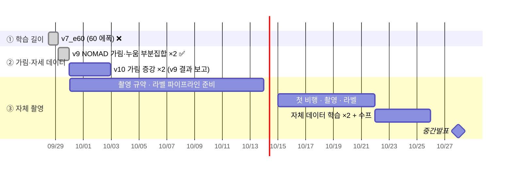
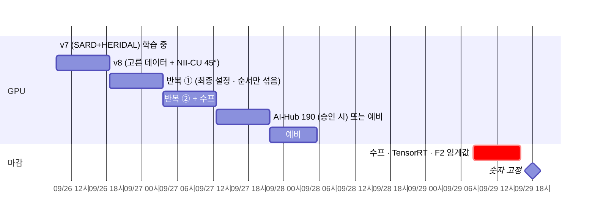
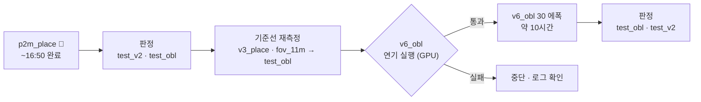

> [!summary] **예약된 학습과 설정값** — 앞으로 학습 계획은 여기에 적는다
> 실행: **`drone_yolo/chain_v11.sh`** (v7) → **`chain_v12.sh`** (① 고르기 · v8 · 반복 · 수프 — 자동) · 진행 로그 `logs/QUEUE.md` · 결과 `metrics/AUTO_RESULT_v12.md`
> 각 단계는 **실패해도 다음으로 넘어간다** (GPU 를 쉬게 두지 않는다)

## 10-03 결과 — 자세 판별 P0~P5 (`chain_p.sh` · 52분) → [[자세 판별 P0~P5 - C2A·상대 키·미세조정·파이프라인]]

- P0 ✅ · P1 · P2 · P3 · P4 ❌ — 누움은 이미 충분 · 앉음은 데이터 문제 · 파이프라인 5초 중앙값이 **추적 ID 바뀜**으로 누움 AUROC 0.98 → 0.80
- 다음: ID 바뀜 대책 (`JUMP` 넘으면 이력 비움 · Okutama 영상 반반으로 고르기/판정) — 미실행

## 10-01 결과 — v9 (NOMAD 가림·누움) 반복 4회 · 수프 · 상태 인지 연결

| 모델 | test_obl | test_v2 | test_kr | 누움 재현율 (obl) | 상태 판정 누움 잡힌 비율 |
|---|---:|---:|---:|---:|---:|
| soup_v7r2 (현 최종) | 0.6331 | 0.5927 | 0.968 | 0.33 | **0.28** (75/268) |
| v9 단일 4회 | 0.587~0.618 | 0.560~0.578 | 0.967~0.976 | — | — |
| **soup_v9x2** (s31+s32) | 0.6596 (+2.7 · 유의) | 0.5724 (−2.0 · 구분 안 됨) | 0.9749 | **0.50** | **0.47** (127/268) |
| soup_v9x2b (s33+s34) | 0.6974 | 0.463 | **0.840** | 0.51 | 0.45 |
| soup_v9x4 (4개) | 0.7082 | 0.5021 | **0.876** | 0.53 | — |

- 단일 학습은 v7 과 같은 수준 — **AP 이득 없음**
- 수프 3개 중 2개 (v9x2b · v9x4) 는 **BN 붕괴** (test_kr −9~−13 %p · 너비비 0.96~0.98 로 넓어짐) → 수프는 매번 세 평가셋 확인 필수 (재확인)
- soup_v9x2 는 정상 수프 — AP 는 비스듬 +2.7 · 숲 −2.0 (둘 다 반복 폭 근처) 이지만 **누운 사람을 훨씬 많이 잡는다** (0.33 → 0.50 · 상태 판정에서 28 % → 47 %)
- → 탐지 AP 판정으로는 "개선 아님" · **상태 인지 층의 탐지기로는 soup_v9x2 가 낫다** — 중간발표용 탐지기 교체는 팀 판단 (설계명세서 수치는 soup_v7r2 그대로)

## 2026-09-29~ 다음 계획 — 설계명세서 이후 (중간발표 10/28 · 최종 11/25)

> [!important] 방향 — 남은 격차는 **가림 · 누운/앉은 사람 · 한국 산림 45°** 이고, 먹히는 레버는 **데이터 + 반복 평균** 뿐이었다
> 공개 데이터는 거의 다 썼다 (NII-CU ±0 · AI-Hub 190 산림지 사진 36만 장에 사람 294명 · 23 px) → **자체 촬영이 본 게임**
> 그 전 2주는 ① 학습 길이 ② 가림·자세를 겨냥한 데이터 로 GPU 를 채운다 · 모든 실험은 **설정당 2회 → 수프** 로 비교


```mermaid
gantt
    dateFormat YYYY-MM-DD HH:mm
    axisFormat %m/%d
    section ① 학습 길이
    v7_e60 (60 에폭) ❌             :done, e1, 2026-09-28 11:40, 17h
    section ② 가림·자세 데이터
    v9 NOMAD 가림·누움 부분집합 ×2 ✅ :done, v9, 2026-09-29 04:10, 19h
    v10 가림 증강 ×2 (v9 결과 보고)  :v10, after v9, 3d
    section ③ 자체 촬영
    촬영 규약 · 라벨 파이프라인 준비 :own0, 2026-09-30 00:00, 14d
    첫 비행 · 촬영 · 라벨           :own1, 2026-10-15 00:00, 7d
    자체 데이터 학습 ×2 + 수프       :own2, after own1, 4d
    중간발표                        :milestone, 2026-10-28 00:00, 0d
```

> [!note] 09-29 기본 마운트각 45° — 재학습 불필요 (test_obl = Okutama 45°) · 25~30 m 로 날 거면 **작은 사람(20~36 px) 보강**이 다음 GPU 후보 → [[결정 - 기본 마운트각 45°]]

| # | 실험 | 바꾸는 것 (하나만) | 판정 (돌리기 전) |
|---|---|---|---|
| ① | **v7_e60 ❌** | 에폭 30 → 60 | **test_obl 0.5915 (v7 대비 −4.0 %p · 유의)** · test_v2 0.5933 (+1.6 · 구분 안 됨) · test_kr 0.9665 (±0) → 고르기 탈락 · 반복 안 함 · val 은 0.441 로 올랐는데 비스듬 평가는 떨어짐 (오래 배우면 학습 장소에 맞춰진다) |
| ② | **v9 ✅ 통과** — v7 + NOMAD **가림 · 누움 · 숨음** 부분집합 2,383 · 30 에폭 ×2 · **soup_v9x2**: obl **0.660 (+2.7 %p 유의)** · v2 0.572 (−2.0 구분 안 됨 ⚠️) · kr 0.975 · 층별 가림 0.26 · **누움 0.50 (+16)** · 앉음 0.56 · 너비비 0.90 → 차기 모델 후보 (SDD 는 soup_v7r2 유지) | 가림·자세 데이터 | 위 규칙 + **층별 목표**: test_obl 가림 재현율 0.24 → ↑ · 누움 0.36 → ↑ · 앉음 0.52 → ↑ (2회 수프 기준) |
| ③ | v10 — 가림 증강 (사람 박스 일부를 나뭇잎 조각으로 덮기) | 증강 | ② 와 같은 규칙 · ② 가 효과 없을 때만 |
| ④ | **자체 촬영 데이터** (10/15~) | 한국 산림 · **45°** · 16~30 m · 누움/앉음/섬 · 가림 | 촬영지를 장소 단위로 나눠 **test_own = NFR-V03 공식 판정셋 후보** · 기존 soup 에서 이어 학습 vs 처음부터 ×2 |

**멈춘 것 (유지)**: 손실·구조 (NWD · P2 · 11l) · 조건 안 맞는 공개 데이터 (NII-CU · AI-Hub 190) · BN 재계산 수프

**학습 밖에서 같이 할 비전 일** (GPU 안 씀)
- 자체 촬영 규약 (고도 · 마운트 · 자세 · 가림 · 옷 색 · **GNSS 표지 = NFR-V04 정답**) · CVAT 라벨 + 모델 선라벨
- 추적 기반 확인 (같은 사람 여러 번 → 후보 · 관측 시간 규칙) · `ColorProfiler` 구현 · UE 좌표 검증 · 4080 SUPER 엔진

## 2026-09-26 새 계획 — 데이터 + 반복 2회 + 수프

> [!important] 왜 바꾸나 → [[NWD·P2 효과 없음 - 원인 분석]]
> - 손실·머리 바꾸기(NWD · P2)는 효과가 **같은 설정 반복 흔들림(최대 3.4 %p) 안**에 있다 · 크게 오른 건 데이터뿐
> - 같은 설정 두 번 → **가중치 평균(수프)** 이 두 재료보다 낫다 (test_obl +1.6 · +2.2 %p) · 추론 비용 0
> - 그래서: **데이터를 바꾸고 · 같은 설정을 두 번 돌려 · 평균한다** — 한 번 학습 = 한 판정은 하지 않는다


```mermaid
gantt
    dateFormat YYYY-MM-DD HH:mm
    axisFormat %m/%d %H시
    section GPU
    v7 (SARD+HERIDAL) 학습 중     :active, a1, 2026-09-26 09:30, 9h30m
    v8 (고른 데이터 + NII-CU 45°)   :a2, after a1, 9h
    반복 ① (최종 설정 · 순서만 섞음) :a3, after a2, 9h
    반복 ② + 수프                   :a4, after a3, 9h
    AI-Hub 190 (승인 시) 또는 예비   :a5, after a4, 9h
    예비                           :a6, after a5, 8h
    section 마감
    수프 · TensorRT · F2 임계값     :crit, b1, 2026-09-29 08:00, 8h
    숫자 고정                       :milestone, 2026-09-29 18:00, 0h
```

| # | 이름 | 바꾸는 것 | 판정 (돌리기 전) |
|---|---|---|---|
| ⓪ | **soup_v6x2** ✅ | v6_obl + r2 가중치 평균 (`soup.py`) | 현재 최고 — test_obl **0.6347** · test_v2 **0.5378** · test_kr 0.9652 |
| ① | **v7 ✅** | + SARD · HERIDAL · 비스듬 음성 − NOMAD | **test_v2 0.5777 (+4.9 · +6.2 %p — 반복 폭 1.3 보다 큼)** · test_obl 0.6311 (+1.2 · +1.8) · test_kr 0.9663 (+2.5 · −0.9) → **개선 (test_v2) · 채택** · 수프 v6x2 보다도 test_v2 +4.0 %p |
| ② | **v8 ➖** | v7 + **NII-CU** → obl 0.6245 · v2 0.559 · kr 0.9711 (v7 대비 −0.7 · −1.9 · +0.5 · 모두 구분 안 됨) → **안 씀** · 최종 설정 = v7 |
| ②' | (원래 계획) | ① 에서 고른 데이터(v6 또는 v7) + **NII-CU** (45° · 20~50 m · 4K · 사람 16,700 · CC BY-NC-SA) | 아래 규칙 크롭 2,055 · 무학습 test_nii 0.771 · 박스는 Okutama 처럼 넓지 않음 (위치 어긋남 1.5 %) → [[NII-CU]] |
| ③ | **v7_r2 · soup_v7r2 ✅** | v7_r2 obl 0.6035 · v2 0.5848 · kr 0.9677 → **수프 obl 0.6331 · v2 0.5927 · kr 0.968 = 현재 최고** (v7 대비 v2 +1.5 %p 유의) |
| ④ | v7_r3 ⚠ | obl 0.6048 · v2 0.5906 · kr 0.9538 · **v7_r3 가 들어간 수프는 무너짐** (3개 수프 kr 0.665 · v7+r3 0.513) → BN 통계 어긋남 · BN 재계산하면 kr 0.94 로 살지만 **박스가 넓어져** (너비비 0.905 → 1.0) test_obl 만 0.70 → 라벨 습관 · ❌ 채택 안 함 |
| **최종 후보** | **soup_v7r2** (v7 + v7_r2 · BN 재계산 없음) | **obl 0.6331 · v2 0.5927 · kr 0.968** · 박스 모양 v7 과 같음 (너비비 0.905) |
| ⑤ | v7_r4 ➖ | obl 0.6059 · v2 0.5751 · kr 0.9704 · 수프 v7+r4 0.6394 · 0.5929 · 0.9694 (soup_v7r2 와 반복 폭 안) · 3개 0.626 · 0.5856 · 0.9684 → **최종 = soup_v7r2 확정** |
| ⑥ | v7_e60 🔄 (09-28 11:39 ~ 09-29 07:30 · `chain_v14.sh`) | **60 에폭** (30 에폭은 val 이 끝까지 오름) | soup_v7r2 대비 반복 폭보다 크게 좋을 때만 교체 |
| 확정값 (09-28) | soup_v7r2 | **NFR-V01 18.9 ms · P95 19.5** (`bench_trt.py`) · **NFR-V05 val F2 최대 @0.15** (0.779 · `f2_tune.py`) · NFR-V06 0.46건 |
| ③④ | 반복 2회 | ② 까지 고른 최종 설정을 순서만 섞어 (`v8_r2` 등) | 판정 없음 — **수프 재료** · 매번 전체 수프를 세 평가셋에서 잰다 |
| ⑤ | AI-Hub 190 (한국 45°·60° 산림) | 승인되면 · 아니면 v8 세 번째 반복 | |
| 최종 | **최종 데이터 설정의 모든 반복을 평균** | 재료를 평가셋 보고 고르지 않는다 (미리 정함) | 09-29 18:00 고정 |

**다음 설정 고르기** (`chain_util.py pick` · 자동): 세 평가셋 어디서도 기준 실행 모두보다 유의하게 나쁘지 않고 · test_obl·test_v2 평균 차 > 0 → 이 설정으로 잇는다 (개선 주장은 아래 기준으로 따로)

**판정 기준 (09-26 보완)** — 셋 다 만족해야 개선
1. 짝 구간이 0 을 넘는다 (test_obl 또는 test_v2)
2. 그 차이가 **같은 설정 반복 차이보다 크다** (지금 추정: test_obl **2.8** (v7↔v7_r2) · test_v2 1.3 · test_kr 3.4 %p)
3. **세 평가셋 어디서도 유의하게 나빠지지 않고** · test_obl 이득이 **박스 너비비 변화**와 같이 오면 라벨 습관으로 보고 의심한다 (3개 수프 사례)

**수프 규칙**: 같은 구조 · 같은 손실 · 같은 hyp · **같은 데이터**만 섞는다 — 데이터가 다른 v6+v7 수프는 test_obl +7.0 인데 test_v2 −10.6 · test_kr **−44.3 %p** ❌ (09-26) · NWD·P2 모델도 못 섞는다

**멈춘 것**: NWD · P2 · 작은 사람용 손실·구조 — 반복 없이 1~2 %p 효과는 판정할 수 없다
**추론 쪽 (09-29)**: 확신도 낮아 놓친 8~11 % → F2 임계값 다시 (val 로 · 평가셋 아님) · TensorRT 재측정

## 판정 기준 (09-25~) — 짝 부트스트랩 (09-26 보완 → 위)

> [!important] **두 모델의 AP50 차이의 95 % 구간이 0 을 넘으면 개선** (`compare_ci.py --tag <평가셋> 기준:비교`)
> 같은 평가셋을 연속 20장 블록으로 재표집해 두 모델을 동시에 잰다 (test_obl 48 블록 · test_v2 72 블록 · 1,000~2,000회)
> 옛 기준 "+0.01 고정" 은 폐기 — test_v2 단일 모델 구간은 ±7 %p 라 너무 좁았다

| 짝 비교 | test_obl | test_v2 | 결론 |
|---|---|---|---|
| p2m_place − v3_place (옛 데이터에서 P2) | **+5.3** (+2.8 ~ +7.8) | **+4.6** (+2.8 ~ +6.5) | ✅ |
| v6_obl − v3_place (v6 데이터) | **+42.6** (+36.7 ~ +47.7) | **+30.5** (+23.5 ~ +38.2) | ✅✅ |
| v6_obl − fov_11m | **+33.0** (+28.1 ~ +37.2) | — | ✅ |
| **v6_p2m − v6_obl** (v6 에서 P2) | −0.2 (−1.7 ~ +1.2) | +0.9 (−1.5 ~ +2.9) | ➖ 구분 안 됨 — AP 이득 없음 · 오탐만 1/3 |

⚠ 09-25 test_obl 정답 중복 제거 후 다시 잰 값 (이전 표기 약 절반) · 단위 %p · 괄호는 95 % 구간 · 원본 `metrics/compare_ci_*.csv` · `metrics/<평가셋>_<모델>_ci.csv`

## 2026-09-24 대기열 (`chain_v6.sh` · 지난 기록)


```mermaid
flowchart LR
    A["p2m_place 🔄<br/>~16:50 완료"] --> B["판정<br/>test_v2 · test_obl"]
    B --> C["기준선 재측정<br/>v3_place · fov_11m → test_obl"]
    C --> D{"v6_obl<br/>연기 실행 (GPU)"}
    D -->|통과| E["v6_obl 30 에폭<br/>약 10시간"]
    D -->|실패| X["중단 · 로그 확인"]
    E --> F["판정<br/>test_obl · test_v2"]
```

| 단계 | 설정 | 판정 기준 (돌리기 전) |
|---|---|---|
| p2m_place 판정 | test_v2 (기준 0.2233) · test_obl | test_v2 +0.01 초과 = 개선 |
| 기준선 재측정 | v3_place · fov_11m → **test_obl** | 60° 기준선 확보 |
| **v6_obl** | `--hyp configs/hyp/v6_oblique.yaml` · `configs/data_v6.yaml` · YOLO11m COCO · 30 에폭 | **test_obl AP50 이 v3_place 대비 +0.01 초과 = 개선** |

### 결과 (09-24 16:27)

| 모델 | test_v2 AP50 | test_obl AP50 | 판정 |
|---|---:|---:|---|
| v3_place (기준선) | 0.2233 | **0.1932** | — |
| fov_11m (평가 장소 학습 · Okutama 는 미학습) | (0.8559 누수) | 0.2890 | test_obl 에선 공정 |
| **p2m_place (P2 헤드)** | **0.2697** (+4.6 %p) | 0.2457 (+5.3 %p) | ✅ 개선 — 음성 오탐 0.195 → 0.317 |
| **v6_obl (60° 데이터)** | **0.5287** (+30.5 %p) | **0.6187** (+42.6 %p) | ✅✅ 큰 개선 — fov_11m(0.2890)도 2배 · 음성 오탐 0.366 |
| v6_p2m (v6 + P2) | 0.5381 (+0.9 %p) | 0.6172 (−0.2 %p) | ➖ 동등 — 오탐 0.366 → **0.122** · 재현율 약간 ↓ · 추론 비용 ↑ |
| ~~v6_obl_s43 (시드 반복)~~ | 중단 | | seed 를 바꿔도 **같은 학습**이 된다 (3에폭 수치 동일) |
| v6_obl_r2 (목록 순서 섞은 반복 · 새 val `val_v6b`) | 0.5156 (−1.3 · 구간 −3.4~+0.1) | 0.6128 (−0.6 · −1.7~+0.4) | ➖ **반복 흔들림 ±1~2 %p** · 새 val 로 고른 best 이득 없음 |
| v6_nwd (NWD α 0.5 · C 32 px · r2 와 손실만 다름) | 0.5151 (−0.1 · −2.2~+2.0) | 0.5893 (**−2.4 · −3.6~−0.8**) | ❌ **기각** — 확신도 부풀림 → [[NWD·P2 효과 없음 - 원인 분석]] |
| **v7** (v6_1 + HERIDAL − NOMAD · NWD 끔) | **0.5777** (+6.2 · +3.1~+10.3) | 0.6311 (+1.8 · +0.2~+3.4) | ✅ **개선** — 숲에서 찾음 58.5 → 66.0 % · 아예 못 봄 21.2 → 18.0 % · 24~36 px 0.56 → 0.68 |

- test_obl 크기별 재현율@0.15 (v6_obl · 중복 제거 후): 16~24 px 0.41 · 24~36 0.60 · 36~50 0.74 · 50+ 0.84 — ~~크기와 무관하게 낮다~~ (09-24 판단은 정답 중복 때문 · 무효)

- `rect_place` 는 **뺐다** — chain_v2 bash 를 PID 로 끄고 p2m_place 학습은 살렸다
- test_kr (AI-Hub 한국) 은 아직 없다 — 다음에 만든다
- 평가셋 [[02 학습 계획 v6 (60° 기준)|test_obl]]: Okutama 비스듬 16 시퀀스 × 60장 = **960장 · 사람 **6,438** (09-25 정답 중복 제거 — 이전 12,876 은 같은 라벨 두 벌) · px 중앙 38** (1280×720 단일 추론)

## 2026-09-23 재검토 대기열 (`chain_v2.sh` · 지난 기록)

> [!danger] 이전 ③ P2 는 **무효** — 중단했다
> yaml 파일명에 크기(`m`)가 없어 ultralytics 가 **nano(2.7 M)** 로 만들었고, 사전학습도 없었다.
> 기준선(11m · 20 M · COCO)과 세 가지가 동시에 달라 해석 불가. 25/30 에폭에서 중단.

**기준선이 바뀌었다**: `v3_place` — 장소 분리 학습 · **test_v2 AP50 0.2233** (NFR-V03 첫 정직한 숫자).
이제 모든 실험을 같은 장소 분리 데이터(`data_v3_place_neg.yaml`)로 돌리고 **test_v2 AP50** 으로 판정한다.
판정: 기준선 대비 **+1 %p 초과 = 개선 · ±1 %p = 동등 · −1 %p 미만 = 악화** (스크립트에 포함)

| # | 이름 | 바꾸는 것 | 설정 | 상태 |
|---|---|---|---|---|
| ① | `p2m_place` | **P2 헤드** | `--model-yaml configs/models/yolo11m-p2.yaml` · 20.55 M · batch 6 | 🔄 09-23 21:23 시작 · ~09-24 13:00 |
| ② | `rect_place` | **rect=True** (학습 모양 = 추론 [736,1280]) | `--rect` · batch 8 | ⏸ ~09-25 02:00 |
| — | B (VisDrone 1280) | 보류 | A 가 −2.3 %p · VisDrone 심한 가림 7 % | 기대값 낮음 |

공통: `--stage 1 --data configs/data_v3_place_neg.yaml --weights yolo11m.pt --imgsz 1280 --epochs 30 --patience 100 --close-mosaic 0 --optimizer SGD --lr0 0.01 --scale 0.3 --translate 0.15`

> [!warning] 남는 교란 (알고 쓴다)
> · **P2**: COCO 가중치가 **427/803 층만 이식**된다. 백본은 그대로지만 P2 를 끼운 넥·헤드는 층 번호가 밀려 **난수에서 시작**한다
> · **rect**: ultralytics 는 rect=True 면 **mosaic·셔플을 끈다.** 모양 하나만 바뀌는 게 아니다 — 지면 "rect 가 나쁘다" 가 아니라 "mosaic 을 끈 게 나쁘다" 일 수 있다

## (이전) 대기열 — 09-22 작성

| # | 이름 | 무엇을 가리나 | 소요 | 완료 예상 (KST) | 상태 |
|---|---|---|---:|---|---|
| 0 | `vd_11m` (**D**) | 항공 사전학습이 듣는가 | — | 09-23 01:30 | 🔄 진행 |
| ① | `chain_auto` 평가 | D 판정 · 마운트각 태그 검증 · 고도 층화 · Unicamp 분포 | 2 h | 09-23 03:30 | ⏸ |
| ② | `v3_place` (**P**) | **NFR-V03 을 처음으로 잰다** | 13 h | 09-23 17:00 | ⏸ |
| ③ | `p2_11m` (**P2**) | 격자 부족을 구조로 푼다 | 15 h | 09-24 08:00 | ⏸ |
| ④ | `pre_visdrone_11m` → `vd1280_11m` (**B**) | A 가 무효면 **해상도/크기 탓인가** | 3+13 h | 09-25 00:00 | ⏸ |

---

## 공통 설정 (기준선 `fov_11m_1280_all` 과 맞춘다)

```
--imgsz 1280 --batch 8 --epochs 30 --patience 100 --close-mosaic 0
--optimizer SGD --lr0 0.01 --scale 0.3 --translate 0.15
degrees 180 · flipud 0.5 · fliplr 0.5 · mosaic 1.0 · cache disk
```

**한 실험은 한 가지만 바꾼다.** translate 0.30 때 `close_mosaic` 도 같이 바꿔 원인을 못 가른 적이 있다.

---

## ② P — 장소 분리 (`v3_place`)

| | |
|---|---|
| 바꾸는 것 | **데이터 분할만** — 평가 장소 Carnation·Karen 을 train 에서 제외 |
| 데이터 | `configs/data_v3_place_neg.yaml` · train **30,520장** (평가 장소 4,236장 제외) · val 7,692 (누수 0) |
| 시작 가중치 | `yolo11m.pt` (COCO) |
| 평가 | **`data/test_v2`** — 1,366장 · 사람 3,927 · 1920×1080 전체 프레임 |

```bash
python train_person.py --stage 1 --data configs/data_v3_place_neg.yaml \
  --weights yolo11m.pt --imgsz 1280 --batch 8 --epochs 30 --patience 100 \
  --close-mosaic 0 --optimizer SGD --lr0 0.01 --scale 0.3 --translate 0.15 \
  --name v3_place
```

> [!important] 이게 큐에서 가장 중요하다
> 지금 **NFR-V03(사람 AP50 ≥0.80)을 측정조차 못 한다.** 평가셋 `test_v2` 는 만들었는데
> 기존 모델들이 그 장소를 학습에 포함해서 재면 부풀려진다. 이 학습이 끝나야 첫 정직한 숫자가 나온다.

---

## ③ P2 헤드 (`p2_11m`)

| | |
|---|---|
| 바꾸는 것 | **아키텍처** — `Detect([P3,P4,P5])` → `Detect([P2,P3,P4,P5])` |
| 설정 파일 | `configs/models/yolo11-p2.yaml` (직접 작성 · 생성 검증 완료) |
| batch | **6** (앵커 4배라 메모리) |
| 시작 가중치 | 없음 — **처음부터 학습** (구조가 달라 COCO 가중치를 못 얹는다) |

**근거**: 16~25 px 대상은 stride 8 격자에서 **2.3칸**뿐이고 실측 **양성 앵커 5.86개**(정상 10개의 59 %).
TAL 은 "앵커 중심이 박스 안" 인 것만 후보로 쓰므로 격자가 부족하면 구조적으로 못 배운다.
stride 4 를 더하면 **4.5칸** → 후보가 4배.

**대가**: 앵커 19,320 → 약 77,000 · 추론 시간 증가 → [[NFR-V01 추론 시간]](≤30 ms)과 맞바꾼다.

> [!warning] 사전학습 없이 30에폭이라 불리하다
> 다른 실험은 COCO 600에폭에서 출발하는데 이것만 난수에서 시작한다.
> **지면 "P2 가 나쁘다" 가 아니라 "사전학습 없이 30에폭으로는 부족하다" 일 수 있다.**
> 이기면 강한 증거이고, 지면 에폭을 늘려 재시도할 값어치가 있다.

---

## ④ B — 1280 VisDrone 사전학습 (`vd1280_11m`)

A(`vd_11m`)가 쓰는 공개 가중치는 **imgsz 640 · 300에폭**이고, 그때 사람 크기가 **중앙값 11 px** 다.
우리는 **약 50 px** — 4.5배 차이. A 가 무효면 이 **크기 불일치(Scale Match)** 가 원인인지 가린다.

```bash
# ④-1 사전학습 (약 3 h · train 6,471장)
yolo detect train data=configs/visdrone.yaml model=yolo11m.pt imgsz=1280 \
  epochs=30 batch=8 optimizer=SGD lr0=0.01 close_mosaic=0 cache=disk \
  project=runs_person name=pre_visdrone_11m

# ④-2 본 학습
python train_person.py --stage 1 --data configs/data_fov.yaml \
  --weights runs_person/pre_visdrone_11m/weights/best.pt \
  --imgsz 1280 --batch 8 --epochs 30 --patience 100 --close-mosaic 0 \
  --optimizer SGD --lr0 0.01 --scale 0.3 --translate 0.15 --name vd1280_11m
```

> [!note] 한계
> B 의 사전학습은 **30에폭**, A 는 **300에폭**이다. B 가 져도 "해상도가 원인이 아니다" 라고 단정할 수 없다.
> **원인 분해용**이지 A 와 우열을 가리는 실험이 아니다.

---

## 판정 기준 (돌리기 전에 적는다)

기준선 `fov_11m_1280_all`. [[타일 가장자리 효과]] 에서 이 규칙이 오독을 막아 줬다.

| 지표 | 기준선 | 성공 조건 |
|---|---:|---|
| 가림 지형 40칸 평균 재현율@0.15 | **0.4780** | 오른다 |
| 서 있는 38 px 재현율@0.15 (타일) | 0.3721 | 오른다 |
| 누운 128 px 재현율@0.15 (타일) | 0.6579 | 유지 |
| 음성 프레임 오탐 | 0.594 건/프레임 | 오르지 않는다 |
| val mAP50 | 0.4779 | **판정에 쓰지 않는다** (실전과 반대로 간 전례) |

②는 위 대신 **`test_v2` AP50** 이 1차 기준이다 (NFR-V03 목표 0.80).

---

> [!warning] 마운트각 태그로 학습 데이터를 자르는 계획은 **취소**했다 (09-23)
> 육안 검증 결과 NOMAD·WiSARD 에서 상관 r 이 각도가 아니라 배우 이동·지형 경사를 잡고 있었다.
> 학습 데이터의 대부분이 그 둘이므로 선별하면 잡음으로 자르는 꼴이 된다.
> 태그는 **Okutama 로 시점 효과를 재는 용도**로만 쓴다 → [[9.23 마운트각 태그 육안 검토]]

## 큐에 아직 없는 것

| 후보 | 근거 | 왜 아직 안 넣었나 |
|---|---|---|
| **NWD** (Normalized Wasserstein Distance) | 문헌 **+6.7 AP** · 우리 양성 앵커 5.86개 문제와 기전이 일치 | ultralytics `TaskAlignedAssigner`·`BboxLoss` 수정 필요 — 무인 실행 전 검증 |
| Wise-IoU v3 | 저품질(가림) 라벨의 기울기를 줄인다 · 우리 vis 0~30 이 22 % | 〃 |
| 크기 분포 재설계 | 현재 16~160 px 는 전제가 다 바뀐 값 (하향 90°·화각 75° → **36~164**) | 크롭 재생성 3~4 h · 운용 조건 확정이 선행 |
| `rect=true` | 학습은 1280×1280 레터박스, TensorRT 추론은 1280×736 — 모양 불일치 | 미측정 · 비용 낮음 |
| ~~cls 0.5 → 1.0~~ | 가중치만 만지는 것 — NWD·P2 보다 근거 약함 | 후순위로 내림 |

---

## 이 문서 쓰는 법

새 학습을 예약하면 **여기에 먼저 적는다** — 이름 · 바꾸는 것 하나 · 전체 명령 · 판정 기준.
끝나면 결과를 [[_실험 색인]] 과 그날 [[타임라인|일자별 기록]] 으로 옮긴다.

## 연결
[[0 서버 학습 계획 한눈에]] · [[1 새 방향 - 항공 사전학습과 손실 재배분]] · [[NFR-V03 탐지 정확도]] · [[9.22 하루 기록]]
