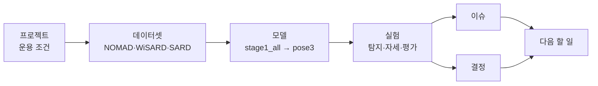

> [!summary] 자율 정찰 드론 관제 시스템 · 비전 파트
> 고령 인구가 많은 농촌을 드론이 자율 정찰하며 **쓰러진 사람을 찾아** 관제 지도에 신고한다.
> 비전 담당 **정서인** — 탐지 모델 · 자세 판별 · 좌표 변환.

## 지금 상태

| 영역 | 상태 | 핵심 수치 |
|---|---|---|
| 사람 탐지 | ✅ 확보 | [[stage1_all]] 겨울 mAP50 0.922 · 여름 0.641 |
| 쓰러짐 판별 | ⚠️ SARD 에서만 됨 | [[pose3_sn_freeze]] SARD 0.974 → Okutama **0.091** |
| 좌표 변환 | ⚠️ 시뮬레이터 기준 | 평균 0.50 m · 실기체용 교체 필요 |
| 서버 학습 | 🔄 진행 중 | [[서버 E1~E8]] |
| 요구명세서 | 📝 v1.1 검토 완료 | [[요구명세서]] |

## 지도

그림으로 보려면 → [[프로젝트 지도.canvas|프로젝트 지도]] · [[가중치 계보.canvas|가중치 계보]]

## 폴더

| | 폴더 | 들어 있는 것 |
|---|---|---|
| 🎯 | **01 프로젝트** | [[프로젝트 개요]] · [[팀과 역할]] · [[하드웨어와 예산]] · [[운용 조건]] · [[요구명세서]] · [[관제 뷰어 프로토타입]] · [[발표 피드백]] |
| 🗂️ | **02 데이터셋** | [[NOMAD]] · [[WiSARD]] · [[SARD]] · [[Okutama-Action]] · [[검토 후 제외한 데이터셋]] |
| 🧠 | **03 모델** | [[VisDrone 기성 모델]] · [[stage1_all]] · [[pose3_sn_freeze]] · [[가중치 계보]] |
| 🧪 | **04 실험** | 아래 표 참고 |
| ✅ | **05 결정** | [[결정 - 3클래스 체계]] · [[결정 - 전환 구간 15프레임]] · [[결정 - WiSARD 자세 학습 제외]] · [[결정 - 백본 동결]] · [[결정 - 신뢰도 0.15]] · [[결정 - Okutama 평가 전용]] · [[결정 - Copy-Paste 보류]] · [[결정 - 서버에서 데이터 새로 받기]] |
| ⚠️ | **06 이슈** | [[쓰러짐 판별 도메인 이전 실패]] · [[ambiguous 물체 오탐]] · [[겨울 0.922의 한계]] · [[학습 데이터 촬영 각도 불일치]] · [[NOMAD 검증 배우 불일치]] · [[막다른 길]] · [[함정 모음]] |
| 📘 | **07 개념** | [[전이학습과 백본 동결]] · [[파국적 망각]] · [[fitness와 조기 종료]] · [[GSD와 화각]] · [[Copy-Paste 증강]] · [[도메인별 평가]] |
| 🖥️ | **08 서버** | [[학과 서버]] · [[데이터 다운로드]] · [[서버 인계]] |
| 🗓️ | **09 기록** | [[타임라인]] · [[문서와 코드 위치]] · [[다음 할 일]] |

## 실험 한눈에

![[실험 비교.base]]

> [!tip] 보는 법
> - 왼쪽 아래 **그래프 뷰**: 폴더별로 색이 다르다. 결정·이슈 노트가 어떤 실험과 이어지는지 보인다.
> - 노트 위에 마우스를 올리고 `Ctrl` 을 누르면 미리보기가 뜬다.
> - 수치의 원본은 `drone_dev` 저장소 문서다 → [[문서와 코드 위치]]
