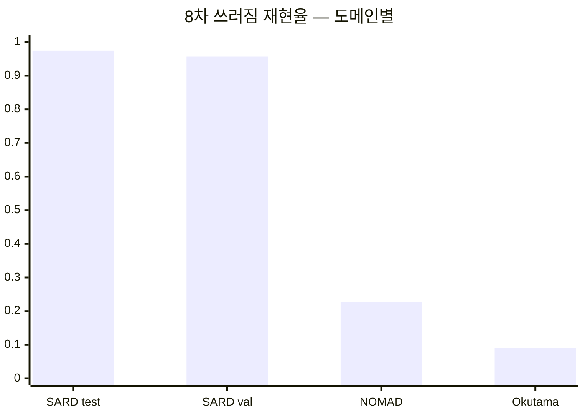

> [!danger] 가장 큰 미해결 문제
> 쓰러짐 판별이 **SARD 에서만** 되고, 다른 데이터로 가면 무너진다.

| 쓰러짐 재현율 | 7차 | 8차 ⭐ | 9차 |
|---|---:|---:|---:|
| SARD test | 0.960 | 0.974 | 0.987 |
| SARD val | — | 0.957 | 0.966 |
| NOMAD | 0.157 | 0.227 | 0.254 |
| **Okutama (미학습)** | 0.088 | **0.091** | 0.070 |

## 가능한 원인

| 원인 | 근거 |
|---|---|
| **라벨 품질의 천장** | NOMAD·Okutama 에 특화 학습해도 0.177 / 0.147. 사람이 자세를 붙인 SARD 만 0.96 을 넘는다 |
| **시점 차이** | 학습 데이터 대부분 비스듬함 → [[학습 데이터 촬영 각도 불일치]] |
| **인물 다양성** | SARD ~8명 · Okutama ~6명 |
| 동결의 부작용 | 얼린 백본이 새 자세 특징을 못 배운다 → [[결정 - 백본 동결]] |

## 시도했지만 안 된 것

- 해상도 키우기 (200 px) → [[자세 1~6차 실패 기록]]
- 마스크 모양으로 판별 → [[막다른 길]]

## 남은 후보

- **2단계 구조** — 탐지 후 원본 해상도 크롭을 따로 분류
- imgsz 1280 · 동결 범위 탐색
- 시연 장소 **하향 90° 소량 촬영** 후 파인튜닝
- [[Copy-Paste 증강]] (보류)

> [!tip] 발표에서 말하는 법
> "SARD 조건에서 0.974 확인 · 도메인 일반화는 검증 중" — 성과를 숨기지 않되 한계를 같이 적는다.

## 연결

[[pose3_sn_freeze]] · [[도메인별 평가]] · [[다음 할 일]]
