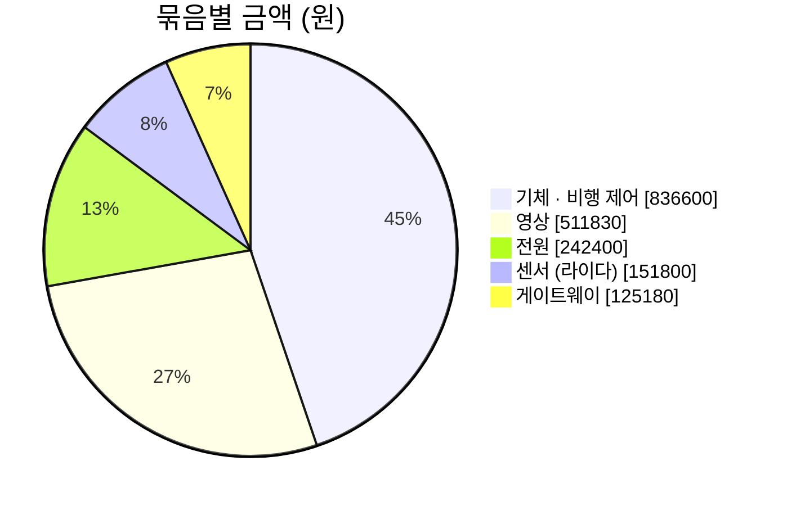

# 최종 예산안 — 자율 정찰 드론 관제 시스템

> **합계 1,867,810원 · 15품목** (배송비 무료 · 게이트웨이 2품목은 세금 포함)
> 원본: 「[별지 제1호서식] 캡스톤 디자인 계획서_앵커」 §3.2 예산 계획서 (09-23 제출판 · 10-04 재확인 — 팀드라이브 사본과 같은 파일)
> 이전 예산안 (1안 · 2안 · `드론_사양_및_예산_기준서.md`) 은 구버전이다

## 한눈에

| 묶음 | 품목 | 금액 | 비율 |
|---|---:|---:|---:|
| 기체 · 비행 제어 | 4 | 836,600원 | 44.8 % |
| 영상 (카메라 · 송수신 · 렌즈 · 짐벌) | 6 | 511,830원 | 27.4 % |
| 전원 | 2 | 242,400원 | 13.0 % |
| 센서 (라이다) | 1 | 151,800원 | 8.1 % |
| 게이트웨이 | 2 | 125,180원 | 6.7 % |
| **합계** | **15** | **1,867,810원** | 100 % |

## 품목

| # | 묶음 | 품명 | 세부 내역 | 수량 | 금액 |
|---:|---|---|---|---:|---:|
| 1 | 기체 · 비행 | F450 연구·교육용 드론 패키지 | KoA H743 FC · M10 GPS · KoaFC 텔레메트리 · 잭 바이 잭 · F450 프레임 · 2212-920KV 모터 · 35A ESC · 9443 프로펠러 · 기본 배선 · GPS 장착부품 | 1 | 629,000 |
| 2 | 기체 · 비행 | RadioMaster R81 V2 | MAVLink 수신기 (조종기 대상) | 1 | 27,000 |
| 3 | 기체 · 비행 | RadioMaster TX12 MKII CC2500 | 조종기 | 1 | 169,000 |
| 4 | 기체 · 비행 | 조종기용 18650 배터리 | 개당 5,800 | 2 | 11,600 |
| 5 | 영상 | RunCam WiFiLink 2-G 풀세트 | 카메라 & 영상 송수신 | 1 | 298,000 |
| 6 | 영상 | Arducam LN012 교체 렌즈 | 대각 88° — **주 렌즈** | 1 | 17,050 |
| 7 | 영상 | Arducam LN011 교체 렌즈 | 대각 78° | 1 | 21,890 |
| 8 | 영상 | Arducam LN003 교체 렌즈 | 대각 62° | 1 | 21,890 |
| 9 | 영상 | CaddxFPV GM3 V2 | 3축 카메라 짐벌 | 1 | 145,000 |
| 10 | 영상 | RunCam OpenIPC V2 연결잭 케이블 | IPC-KA · KoA GH 7핀 → RunCam SH 6핀 | 1 | 8,000 |
| 11 | 센서 | Benewake TF02-Pro | 전방 라이다 | 1 | 151,800 |
| 12 | 전원 | Dinogy 3S 7200mAh Graphene 80C | XT60 · 개당 93,700 | 2 | 187,400 |
| 13 | 전원 | SKYRC S65 | 배터리 충전기 | 1 | 55,000 |
| 14 | 게이트웨이 | Raspberry Pi 4B 2GB 타워쿨링키트 | 현장 게이트웨이 (세금 포함) | 1 | 101,200 |
| 15 | 게이트웨이 | Raspberry Pi 공식 A2 microSD 64GB | Blank · 게이트웨이용 (세금 포함) | 1 | 23,980 |
| | | **합계** | | **15품목** | **1,867,810** |

- 서버 (RTX 3090 학습 · 추론) · 관제 단말 (스마트폰 · 노트북) 은 기존 장비 — 예산에 없다

## 비전 파트에 걸리는 것

| 품목 | 비전 영향 |
|---|---|
| **LN012 88°** (주 렌즈) | 1920×1080 기준 **수평 80.2° · f 1,141 px** — 학습 · 좌표 계산의 기준 렌즈 |
| LN011 78° · LN003 62° | 수평 70.4° · 55.3° — 고도를 올릴 때 사람 px 를 키우는 대안 · 기체 호환 확인 후 |
| **GM3 V2 3축 짐벌** | 마운트각을 비행 중 지정 · 흔들림 보정 → **기본 45°** (09-29 · 60° 비교) · 좌표 계산은 짐벌 절대각 사용 |
| WiFiLink 2-G | 영상 1920×1080 · **초당 10장 · 키프레임 1초** 제안 (관측 시간 기준) |
| Raspberry Pi 4B 2GB | 중계만 — **추론은 서버** (게이트웨이에서 무거운 영상 처리 안 함) |
| TF02-Pro 라이다 | 전방 장애물용 (비행 파트) — 비전 좌표 계산에는 안 씀 |

- 렌즈 화각은 표기 **대각** 기준 환산값 — 렌즈 도착 즉시 체커보드 보정으로 실측한다

## 이전 예산안과 다른 점

| 항목 | 구버전 (1안) | 최종 |
|---|---|---|
| 교체 렌즈 | LN012 1개 · 비고 "90°" | LN003 62° · LN011 78° · LN012 88° **3개** (대각) |
| 라이다 | 154,670 | 151,800 |
| 충전기 | 38,000 | 55,000 |
| 합계 | 1,816,740 | **1,867,810** |
| 2안 (A8 짐벌 카메라) | 비교안 | 폐기 |

- ⚠ 09-30 발표 공지 — **예산안이 허가되지 않을 수도 있다** → 10-06 캡스톤 설명회에서 질문
